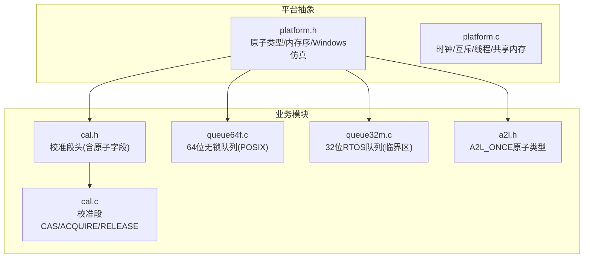
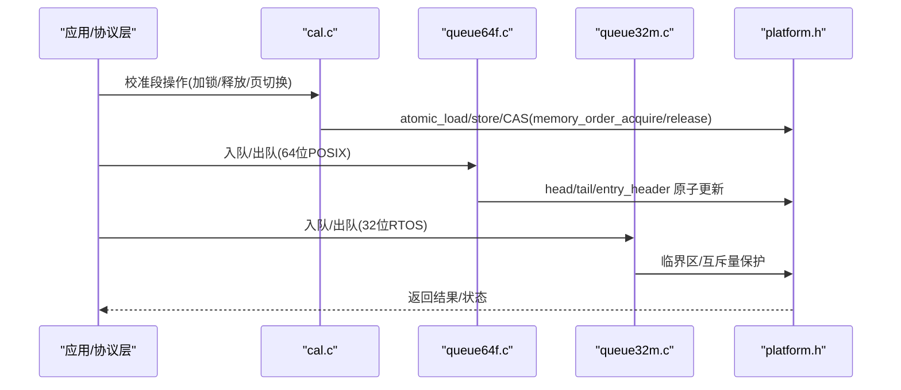
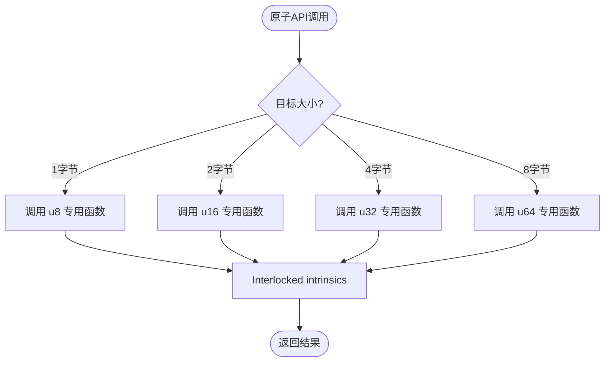
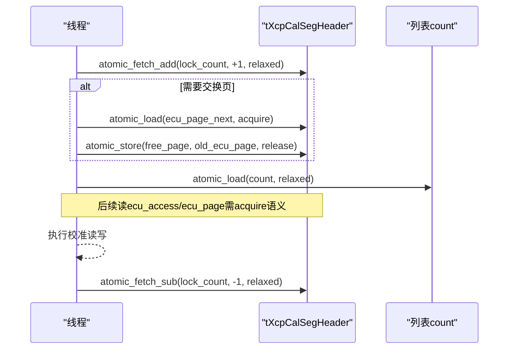
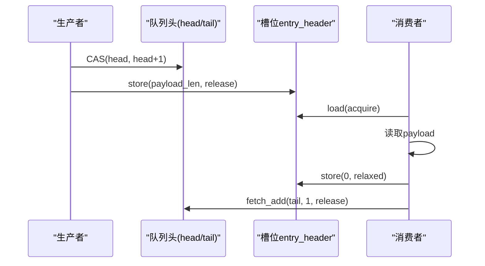
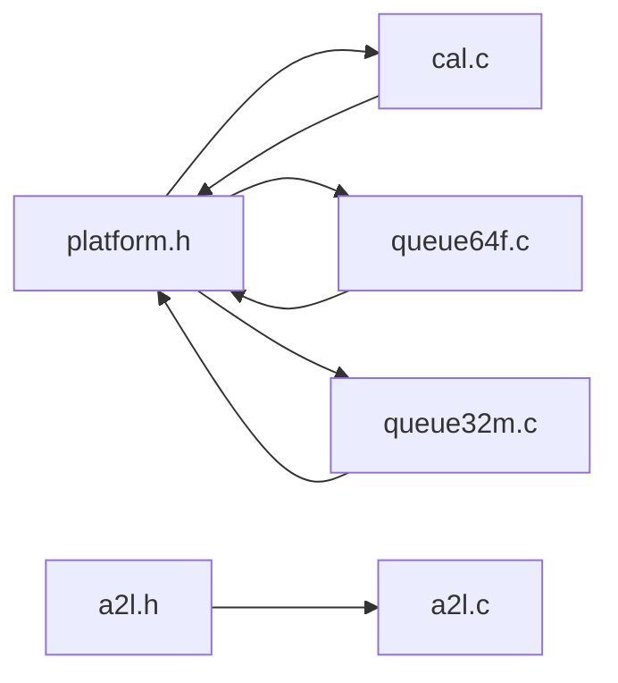

# 原子操作实现

<cite>
**本文引用的文件**
- [platform.h](file://src/platform.h)
- [platform.c](file://src/platform.c)
- [cal.h](file://src/cal.h)
- [cal.c](file://src/cal.c)
- [queue64f.c](file://src/queue64f.c)
- [queue32m.c](file://src/queue32m.c)
- [a2l.h](file://inc/a2l.h)
</cite>

## 目录
1. [简介](#简介)
2. [项目结构](#项目结构)
3. [核心组件](#核心组件)
4. [架构总览](#架构总览)
5. [详细组件分析](#详细组件分析)
6. [依赖关系分析](#依赖关系分析)
7. [性能考量](#性能考量)
8. [故障排查指南](#故障排查指南)
9. [结论](#结论)
10. [附录](#附录)

## 简介
本文件系统性梳理 XCPlite 在不同平台下的原子操作实现，重点覆盖：
- C11 标准原子在各编译器/平台的支持与选择策略
- Windows 下通过 Interlocked intrinsics 的原子仿真层
- 内存序（memory_order）在 acquire/release/acquire-release 语义中的使用
- 不同数据宽度（8/16/32/64 位）原子操作的差异与优化取舍
- FreeRTOS 环境下对 64 位原子的限制及替代方案
- 队列、校准段等关键模块中原子使用的实践与调优建议

## 项目结构
XCPlite 将原子能力抽象到平台层，并在上层模块中按需使用。关键路径如下：
- 平台抽象层：定义平台宏、C11 原子引入或仿真、内存序常量、以及 Windows 下的 Interlocked 封装
- 校准子系统：广泛使用原子字段管理页切换、锁计数、空闲页链表等
- 传输层队列：提供无锁多生产者单消费者队列（64 位平台）与基于临界区的 32 位 RTOS 队列
- A2L 一次性初始化：使用 64 位原子保证单次初始化

**图表来源**
- [platform.h:101-199](file://src/platform.h#L101-L199)
- [platform.h:520-672](file://src/platform.h#L520-L672)
- [cal.h:86-121](file://src/cal.h#L86-L121)
- [queue64f.c:45-119](file://src/queue64f.c#L45-L119)
- [queue32m.c:16-31](file://src/queue32m.c#L16-L31)
- [a2l.h:586-591](file://inc/a2l.h#L586-L591)

**章节来源**
- [platform.h:23-72](file://src/platform.h#L23-L72)
- [platform.h:101-199](file://src/platform.h#L101-L199)
- [platform.h:520-672](file://src/platform.h#L520-L672)

## 核心组件
- 平台原子抽象层（platform.h/.c）
  - 在非 Windows 且未启用仿真时，直接引入 C11 <stdatomic.h>，并暴露 ATOMIC_BOOL 等别名
  - 在 Windows 且启用 OPTION_ATOMIC_EMULATION 时，用 Interlocked intrinsics 实现 load/store/exchange/fetch_add/sub/CAS，并通过 sizeof 分发到 8/16/32/64 位专用函数
  - 统一定义 memory_order_* 常量（仿真模式下为占位值），确保上层代码可编译
- 校准段原子状态（cal.h/.c）
  - 使用 atomic_uint_least*_t 表示锁计数、空闲页指针、访问页号等
  - 使用 CAS 进行 bump allocator 分配，使用 acquire/release 保证可见性
- 无锁队列（queue64f.c）
  - 固定条目大小的多生产者单消费者队列，entry_header 为 32 位原子，head/tail 为 64 位原子
  - 严格使用 acquire/release 控制发布/消费顺序
- 32 位 RTOS 队列（queue32m.c）
  - 使用任务级临界区或互斥量保护，避免在无原子能力的平台上出现竞态
- A2L 一次性初始化（a2l.h）
  - 使用 64 位原子配合 CAS 实现“仅一次”初始化

**章节来源**
- [platform.h:177-199](file://src/platform.h#L177-L199)
- [platform.h:520-672](file://src/platform.h#L520-L672)
- [cal.h:86-121](file://src/cal.h#L86-L121)
- [queue64f.c:107-131](file://src/queue64f.c#L107-L131)
- [queue32m.c:152-177](file://src/queue32m.c#L152-L177)
- [a2l.h:586-591](file://inc/a2l.h#L586-L591)

## 架构总览
下图展示原子能力从平台层到上层模块的调用关系与数据流。

**图表来源**
- [cal.c:109-115](file://src/cal.c#L109-L115)
- [cal.c:212-212](file://src/cal.c#L212-L212)
- [queue64f.c:433-454](file://src/queue64f.c#L433-L454)
- [queue32m.c:306-361](file://src/queue32m.c#L306-L361)
- [platform.h:520-672](file://src/platform.h#L520-L672)

## 详细组件分析

### 平台原子抽象与 Windows Interlocked 仿真
- 非 Windows 路径：
  - 直接包含 C11 原子头，暴露 ATOMIC_BOOL 等别名，供上层以 portable 方式调用
- Windows 仿真路径（OPTION_ATOMIC_EMULATION）：
  - 通过 sizeof 分发到 8/16/32/64 位专用函数，分别调用 _InterlockedCompareExchange*/_InterlockedExchange*/_InterlockedExchangeAdd*
  - 所有 RMW 操作由 Interlocked intrinsics 提供完整内存屏障，满足 acquire-release 语义需求
  - 提供 atomic_compare_exchange_strong_explicit 与 weak 版本映射
- 内存序常量：
  - 在仿真模式下定义 memory_order_* 常量，使上层代码无需条件编译即可编译通过

**图表来源**
- [platform.h:535-662](file://src/platform.h#L535-L662)

**章节来源**
- [platform.h:177-199](file://src/platform.h#L177-L199)
- [platform.h:520-672](file://src/platform.h#L520-L672)

### 校准段原子状态与内存序
- 数据结构要点：
  - tXcpCalSegHeader 中包含多个原子字段：ecu_page_next、free_page、ecu_access、lock_count 等
  - 使用 static_assert 校验原子类型尺寸与对齐，确保跨进程共享内存安全
- 典型流程（获取/释放段）：
  - 获取：递增 lock_count；若需要交换工作页，则通过 free_page 与 ecu_page_next 的 acquire/release 配对完成可见性
  - 释放：递减 lock_count；必要时触发页回写或清理
- 内存分配：
  - 使用 cal_mem_used 的 CAS 循环作为 bump allocator，保证多线程安全分配

**图表来源**
- [cal.h:86-121](file://src/cal.h#L86-L121)
- [cal.c:641-653](file://src/cal.c#L641-L653)
- [cal.c:685-685](file://src/cal.c#L685-L685)
- [cal.c:109-115](file://src/cal.c#L109-L115)

**章节来源**
- [cal.h:86-121](file://src/cal.h#L86-L121)
- [cal.c:109-115](file://src/cal.c#L109-L115)
- [cal.c:212-212](file://src/cal.c#L212-L212)
- [cal.c:418-418](file://src/cal.c#L418-L418)
- [cal.c:641-653](file://src/cal.c#L641-L653)
- [cal.c:685-685](file://src/cal.c#L685-L685)

### 无锁队列（64 位 POSIX）
- 设计要点：
  - 每个槽位包含一个 32 位 entry_header（提交状态+长度），producer 通过 release-store 发布，consumer 通过 acquire-load 读取
  - head/tail 为 64 位原子，用于环形缓冲索引
  - 可选 tail 同步策略（默认不将 tail 作为内容发布的 fence，减少竞争线污染）
- 关键流程：
  - 生产者：CAS 推进 head -> 写入 payload -> release-store entry_header
  - 消费者：acquire-load entry_header -> 读取 payload -> 释放槽位（clear header）-> 推进 tail

**图表来源**
- [queue64f.c:252-286](file://src/queue64f.c#L252-L286)
- [queue64f.c:433-454](file://src/queue64f.c#L433-L454)
- [queue64f.c:557-660](file://src/queue64f.c#L557-L660)

**章节来源**
- [queue64f.c:45-119](file://src/queue64f.c#L45-L119)
- [queue64f.c:252-286](file://src/queue64f.c#L252-L286)
- [queue64f.c:433-454](file://src/queue64f.c#L433-L454)
- [queue64f.c:557-660](file://src/queue64f.c#L557-L660)

### 32 位 RTOS 队列（临界区/互斥）
- 由于目标平台可能缺乏硬件原子或 C11 原子支持，采用任务级临界区或互斥量保护队列状态
- 适用于 STM32 等 Cortex-M 系列，结合 DTCM/非缓存 SRAM 放置策略提升 DMA 友好性
- 入队/出队均受 LOCK/UNLOCK 保护，保证一致性

**章节来源**
- [queue32m.c:16-31](file://src/queue32m.c#L16-L31)
- [queue32m.c:152-177](file://src/queue32m.c#L152-L177)
- [queue32m.c:306-361](file://src/queue32m.c#L306-L361)
- [queue32m.c:389-463](file://src/queue32m.c#L389-L463)

### A2L 一次性初始化
- 使用 64 位原子配合 CAS 实现“仅一次”初始化，避免重复初始化带来的资源竞争
- 在 a2l.c 中通过 compare_exchange 判断是否已初始化

**章节来源**
- [a2l.h:586-591](file://inc/a2l.h#L586-L591)
- [src/a2l.c:1442-1442](file://src/a2l.c#L1442-L1442)

## 依赖关系分析
- platform.h 是原子能力的根提供者：
  - 在非 Windows 路径下依赖 C11 原子
  - 在 Windows 仿真路径下依赖 MSVC intrinsics
- cal.c 依赖 platform.h 提供的原子 API，并使用 acquire/release 保证页切换与锁计数的可见性
- queue64f.c 仅在 64 位 POSIX 平台启用，强依赖 C11 原子
- queue32m.c 在 32 位 RTOS 平台启用，依赖平台互斥/临界区
- a2l.c 依赖 a2l.h 定义的 64 位原子类型

**图表来源**
- [platform.h:177-199](file://src/platform.h#L177-L199)
- [platform.h:520-672](file://src/platform.h#L520-L672)
- [cal.c:109-115](file://src/cal.c#L109-L115)
- [queue64f.c:45-119](file://src/queue64f.c#L45-L119)
- [queue32m.c:16-31](file://src/queue32m.c#L16-L31)
- [a2l.h:586-591](file://inc/a2l.h#L586-L591)

**章节来源**
- [platform.h:177-199](file://src/platform.h#L177-L199)
- [platform.h:520-672](file://src/platform.h#L520-L672)
- [cal.c:109-115](file://src/cal.c#L109-L115)
- [queue64f.c:45-119](file://src/queue64f.c#L45-L119)
- [queue32m.c:16-31](file://src/queue32m.c#L16-L31)
- [a2l.h:586-591](file://inc/a2l.h#L586-L591)

## 性能考量
- 内存序选择
  - 队列 entry_header 使用 release-store 发布、acquire-load 消费，避免不必要的栅栏开销
  - tail/head 更新多为 relaxed，减少竞争线上的内存屏障压力
- 数据宽度优化
  - 8/16/32/64 位原子在 Windows 仿真下分别调用对应 intrinsics，避免跨字长开销
  - 32 位 ARM 上 fetch_add 可能退化为 CAS 循环，高争用时需关注重试成本
- 缓存友好
  - 队列头与槽位按缓存行对齐，减少伪共享
  - 32 位 RTOS 队列将热点结构放入 DTCM，数据缓冲区放入非缓存 SRAM，降低 DMA 一致性维护成本
- 统计与调试
  - 可通过测试开关统计自旋次数与获取延迟直方图，辅助定位瓶颈

[本节为通用指导，不直接分析具体文件]

## 故障排查指南
- 构建期错误
  - 未定义 _GNU_SOURCE 导致 Linux 平台编译失败
  - 平台不支持或未定义所需原子类型/特性时报错
- 运行时问题
  - 队列溢出：检查 producer 速率与队列容量，关注 packets_lost 计数
  - 校准段竞态：确认 acquire/release 配对正确，避免 torn read/write
  - Windows 仿真：确认启用 OPTION_ATOMIC_EMULATION 且目标为 64 位
- 调试技巧
  - 开启队列时间统计与自旋计数，观察极端情况
  - 打印 clockGet/clockGetLast 统计，评估系统时钟路径开销

**章节来源**
- [platform.h:166-172](file://src/platform.h#L166-L172)
- [platform.h:666-668](file://src/platform.h#L666-L668)
- [queue64f.c:141-247](file://src/queue64f.c#L141-L247)
- [platform.c:445-453](file://src/platform.c#L445-L453)

## 结论
XCPlite 通过平台抽象层统一了原子能力，既充分利用 C11 原子在现代平台的原生支持，又在 Windows 下通过 Interlocked intrinsics 提供等效实现。校准段与队列模块以严格的内存序保障并发正确性，同时兼顾性能与可移植性。在 FreeRTOS 等受限环境中，通过 32 位队列与临界区策略规避 64 位原子的不足，确保嵌入式场景的稳定运行。

[本节为总结性内容，不直接分析具体文件]

## 附录
- 内存序速查
  - relaxed：仅保证原子性，无顺序约束
  - acquire/release：建立 happens-before 关系，用于发布/消费
  - acq_rel：读-改-写操作同时具备 acquire 与 release 语义
- 平台差异摘要
  - POSIX：直接使用 C11 原子
  - Windows：启用仿真时使用 Interlocked intrinsics
  - FreeRTOS：优先使用 32 位原子与临界区，避免 64 位 RMW 的高代价

[本节为概念性说明，不直接分析具体文件]