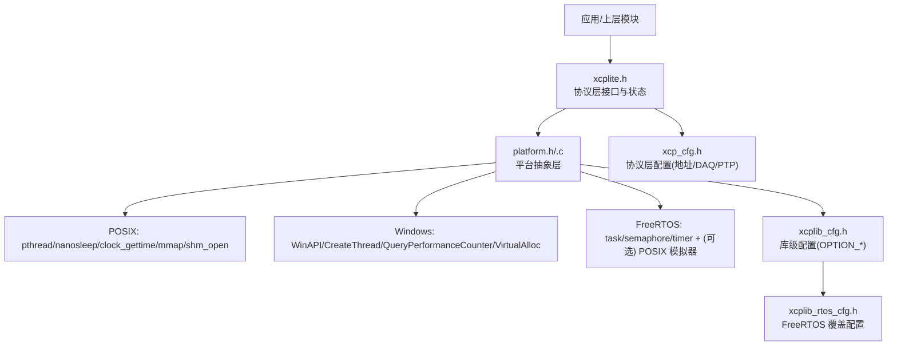
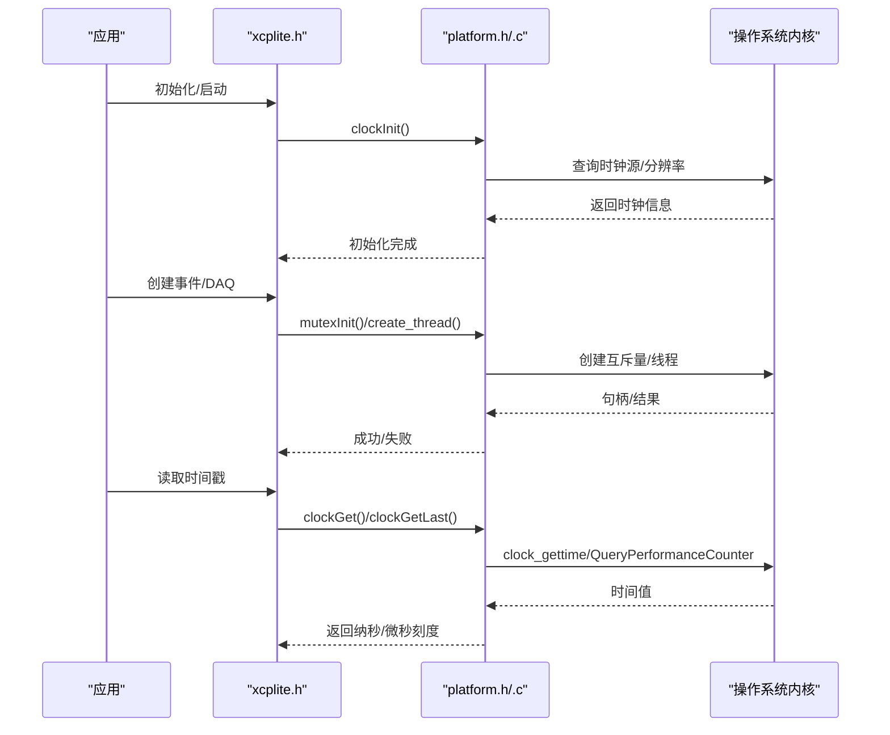
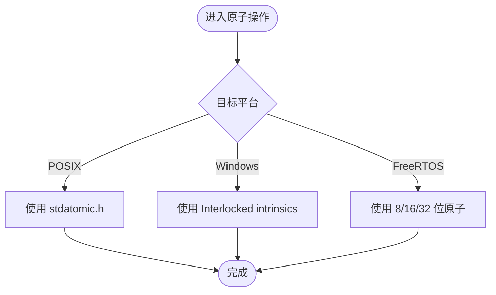
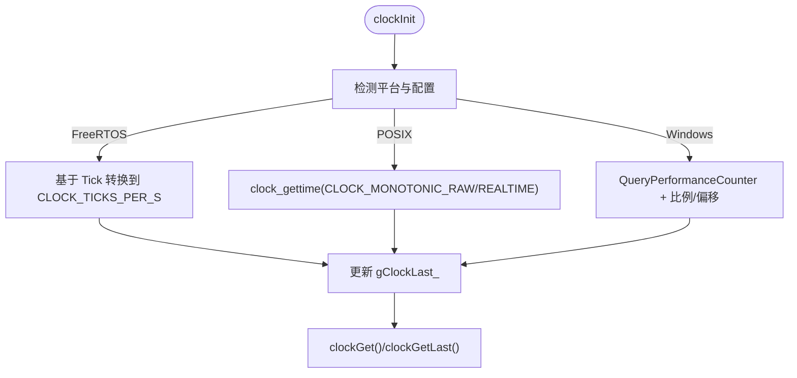
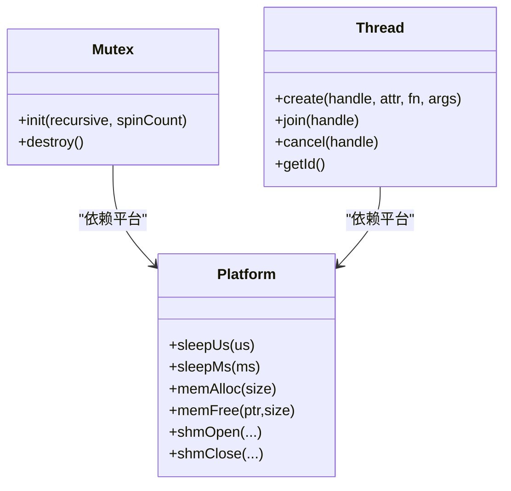
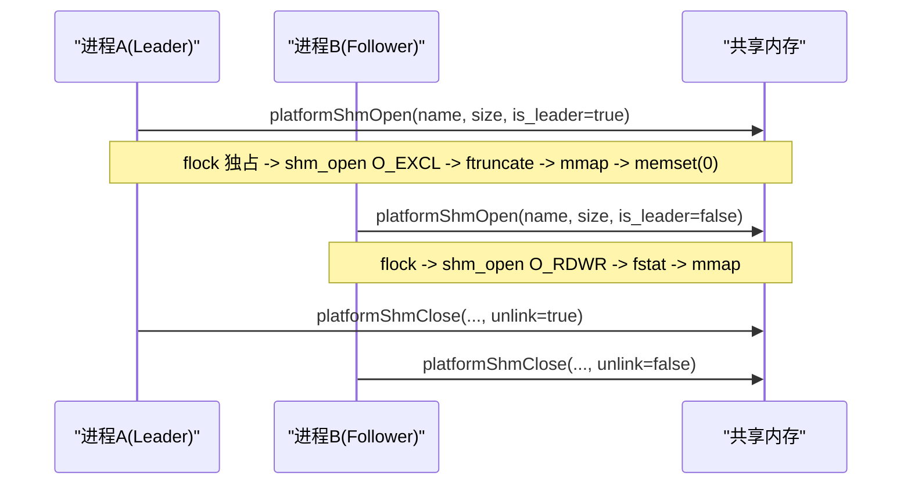
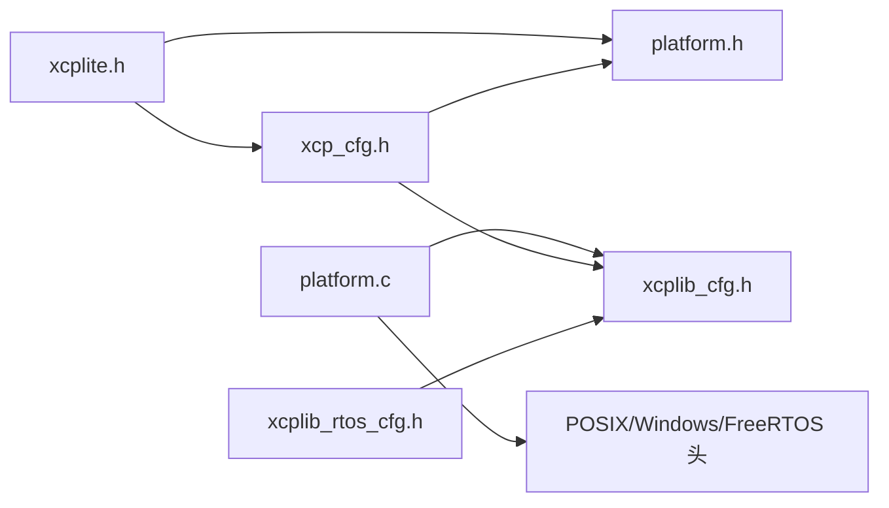

# 平台抽象层

<cite>
**本文引用的文件**
- [src/platform.h](file://src/platform.h)
- [src/platform.c](file://src/platform.c)
- [src/xcplib_cfg.h](file://src/xcplib_cfg.h)
- [src/xcp_cfg.h](file://src/xcp_cfg.h)
- [src/xcplite.h](file://src/xcplite.h)
- [src/xcplib_rtos_cfg.h](file://src/xcplib_rtos_cfg.h)
- [examples/freertos_demo/xcp_demo.h](file://examples/freertos_demo/xcp_demo.h)
- [docs/xcplib_cfg.md](file://docs/xcplib_cfg.md)
</cite>

## 目录
1. [简介](#简介)
2. [项目结构](#项目结构)
3. [核心组件](#核心组件)
4. [架构总览](#架构总览)
5. [详细组件分析](#详细组件分析)
6. [依赖关系分析](#依赖关系分析)
7. [性能考虑](#性能考虑)
8. [故障排查指南](#故障排查指南)
9. [结论](#结论)
10. [附录：移植新平台指南](#附录：移植新平台指南)

## 简介
本文件系统性阐述 XCPlite 的平台抽象层（Platform Abstraction Layer, PAL）设计与跨平台兼容性实现，覆盖 FreeRTOS、POSIX（Linux/macOS/QNX）与 Windows 三大目标平台的原子操作、时钟、线程/互斥量、内存映射与共享内存等关键能力。文档同时解释配置宏的作用机制、平台检测逻辑与条件编译最佳实践，并提供移植新平台的指导原则与常见问题解决方案，帮助开发者将 XCPlite 扩展到新环境。

## 项目结构
XCPlite 的平台抽象层主要由以下文件构成：
- platform.h：平台检测、公共接口声明、条件编译开关、原子类型与宏、线程/互斥/时钟/内存等 API 声明。
- platform.c：各平台的具体实现（睡眠、内存映射、共享内存、互斥量、时钟）。
- xcplib_cfg.h：库级默认配置与功能开关（如时钟分辨率、原子模拟、队列策略、网络选项等）。
- xcp_cfg.h：XCP 协议层配置（地址扩展、DAQ、校准段、PTP 等），依赖平台时钟分辨率。
- xcplite.h：协议层内部数据结构与回调接口，使用平台抽象的原子类型与互斥量。
- xcplib_rtos_cfg.h：FreeRTOS 目标的覆盖配置（栈大小、优先级、MTU、队列策略、时钟精度等）。
- examples/freertos_demo/xcp_demo.h：FreeRTOS 示例中的任务/堆栈/优先级定义，体现与平台配置的协同。
- docs/xcplib_cfg.md：配置项说明文档，辅助理解 OPTION_* 宏的影响范围。

图表来源
- [src/platform.h:23-72](file://src/platform.h#L23-L72)
- [src/platform.c:18-21](file://src/platform.c#L18-L21)
- [src/xcplib_cfg.h:55-71](file://src/xcplib_cfg.h#L55-L71)
- [src/xcp_cfg.h:408-440](file://src/xcp_cfg.h#L408-L440)

章节来源
- [src/platform.h:23-72](file://src/platform.h#L23-L72)
- [src/platform.c:18-21](file://src/platform.c#L18-L21)
- [src/xcplib_cfg.h:55-71](file://src/xcplib_cfg.h#L55-L71)
- [src/xcp_cfg.h:408-440](file://src/xcp_cfg.h#L408-L440)

## 核心组件
- 平台检测与条件编译：通过 _WIN/_LINUX/_MACOS/_QNX/_FREE_RTOS 宏区分目标平台；在 FreeRTOS 下支持 POSIX 模拟器（_FREE_RTOS_POSIX_SIM）以复用主机系统头文件。
- 原子操作：POSIX 使用 C11 <stdatomic.h>；Windows 提供基于 Interlocked intrinsics 的原子模拟（OPTION_ATOMIC_EMULATION）；FreeRTOS 针对 32 位嵌入式目标避免 64 位原子，采用 8/16/32 位原子类型。
- 时钟：FreeRTOS 基于 tick 计数并转换为配置的 CLOCK_TICKS_PER_S；POSIX 使用 clock_gettime(CLOCK_MONOTONIC_RAW/CLOCK_REALTIME)，支持 PTP 或任意纪元；Windows 使用 QueryPerformanceCounter 并计算偏移/比例因子。
- 线程与同步：POSIX 使用 pthread_create/pthread_join；Windows 使用 CreateThread/WaitForSingleObject/TerminateThread；FreeRTOS 使用 xTaskCreate/xTaskCreateStatic/vTaskDelete，并提供统一的 create_thread/join_thread/cancel_thread/get_thread_id 宏。
- 内存与共享内存：POSIX 使用 mmap/munmap 与 shm_open/shm_unlink/flock 实现进程间共享内存与领导者选举；Windows 使用 VirtualAlloc/VirtualFree。

章节来源
- [src/platform.h:23-72](file://src/platform.h#L23-L72)
- [src/platform.h:101-199](file://src/platform.h#L101-L199)
- [src/platform.h:268-298](file://src/platform.h#L268-L298)
- [src/platform.h:301-433](file://src/platform.h#L301-L433)
- [src/platform.c:78-155](file://src/platform.c#L78-L155)
- [src/platform.c:161-187](file://src/platform.c#L161-L187)
- [src/platform.c:201-362](file://src/platform.c#L201-L362)
- [src/platform.c:370-432](file://src/platform.c#L370-L432)
- [src/platform.c:455-800](file://src/platform.c#L455-L800)

## 架构总览
平台抽象层位于协议层与应用之间，屏蔽不同操作系统差异，向上暴露统一接口：
- sleepUs/sleepMs：高精度/低开销延时，适配 FreeRTOS tick、POSIX nanosleep、Windows Sleep+忙等待。
- platformMemAlloc/Free：跨平台虚拟内存分配。
- platformShmOpen/Attach/Close/Unlink：POSIX 共享内存与领导者选举。
- mutexInit/Destroy、create_thread/join_thread/cancel_thread/get_thread_id：跨平台同步与线程管理。
- clockInit/Get/Last/Monotonic/Realtime：多源高精度时钟，支持 PTP/任意纪元与缓存 last 值减少系统调用。

图表来源
- [src/platform.c:455-800](file://src/platform.c#L455-L800)
- [src/platform.c:370-432](file://src/platform.c#L370-L432)
- [src/platform.c:78-155](file://src/platform.c#L78-L155)

## 详细组件分析

### 平台检测与条件编译
- 平台识别：优先识别 FreeRTOS，其次 Windows，最后 POSIX（Linux/macOS/QNX）。未识别则报错。
- 编译器/构建要求：POSIX 需要 _GNU_SOURCE；FreeRTOS POSIX 模拟器需 _GNU_SOURCE；Windows 使用 WIN32_LEAN_AND_MEAN。
- 键盘输入：非 Windows 平台可通过 termios 实现 _getch/_kbhit（可选）。

章节来源
- [src/platform.h:23-72](file://src/platform.h#L23-L72)
- [src/platform.h:101-199](file://src/platform.h#L101-L199)
- [src/platform.c:33-72](file://src/platform.c#L33-L72)

### 原子操作
- POSIX：使用 C11 stdatomic.h，C++ 模式通过 using 引入命名空间类型，保证 C/C++ 混编兼容。
- Windows：启用 OPTION_ATOMIC_EMULATION 时，基于 MSVC Interlocked intrinsics 实现 load/store/exchange/fetch_add/sub/CAS，仅支持 8/16/32/64 位，且要求 64 位 Windows。
- FreeRTOS：避免 64 位原子，使用 uint_fast8_t 作为 ATOMIC_BOOL；对 32 位 RMW 原子可能产生 CAS 循环重试。

图表来源
- [src/platform.h:177-199](file://src/platform.h#L177-L199)
- [src/platform.h:520-672](file://src/platform.h#L520-L672)
- [src/platform.h:114-138](file://src/platform.h#L114-L138)

章节来源
- [src/platform.h:177-199](file://src/platform.h#L177-L199)
- [src/platform.h:520-672](file://src/platform.h#L520-L672)
- [src/platform.h:114-138](file://src/platform.h#L114-L138)

### 时钟子系统
- FreeRTOS：基于 xTaskGetTickCount() 与 configTICK_RATE_HZ 转换到 CLOCK_TICKS_PER_S；提供 clockGetLast() 缓存以减少调用开销。
- POSIX：根据 OPTION_CLOCK_EPOCH_ARB 选择 CLOCK_MONOTONIC_RAW（或 QNX 下的 CLOCK_MONOTONIC），否则使用 CLOCK_REALTIME；支持 1ns/1us 分辨率；提供 Monotonic/Realtime 的 Last 缓存函数。
- Windows：使用 QueryPerformanceCounter，初始化时计算频率比例因子与偏移，支持 PTP 纪元或任意纪元；提供字符串格式化输出。

图表来源
- [src/platform.c:455-500](file://src/platform.c#L455-L500)
- [src/platform.c:505-654](file://src/platform.c#L505-L654)
- [src/platform.c:657-800](file://src/platform.c#L657-L800)

章节来源
- [src/platform.c:455-500](file://src/platform.c#L455-L500)
- [src/platform.c:505-654](file://src/platform.c#L505-L654)
- [src/platform.c:657-800](file://src/platform.c#L657-L800)

### 线程与同步
- 线程创建：POSIX 用 pthread_create；Windows 用 CreateThread；FreeRTOS 用 xTaskCreate/xTaskCreateStatic，支持静态分配与动态分配两种路径。
- 线程生命周期：join_thread/cancel_thread 在各平台有不同语义（FreeRTOS 无阻塞 join，使用事件/信号量同步）。
- 互斥量：POSIX 使用 pthread_mutex（可递归）；Windows 使用 CRITICAL_SECTION（始终递归）；FreeRTOS 支持普通/递归互斥，支持静态分配。

图表来源
- [src/platform.h:301-433](file://src/platform.h#L301-L433)
- [src/platform.c:370-432](file://src/platform.c#L370-L432)

章节来源
- [src/platform.h:301-433](file://src/platform.h#L301-L433)
- [src/platform.c:370-432](file://src/platform.c#L370-L432)

### 内存与共享内存
- 虚拟内存：POSIX 使用 mmap/munmap；Windows 使用 VirtualAlloc/VirtualFree。
- 共享内存（POSIX）：platformShmOpen 实现领导者选举（flock 序列化）、创建/附加、尺寸校验、零初始化；platformShmOpenAttach 快速附加；platformShmClose/Unlink 释放与清理。
- 错误处理：详细日志记录 errno 与 strerror，提示用户清理残留对象。

图表来源
- [src/platform.c:201-362](file://src/platform.c#L201-L362)

章节来源
- [src/platform.c:161-187](file://src/platform.c#L161-L187)
- [src/platform.c:201-362](file://src/platform.c#L201-L362)

### 配置宏与作用机制
- xcplib_cfg.h：定义默认 OPTION_* 宏（时钟分辨率、原子模拟、网络、DAQ、队列策略、A2L/ELF 上传等）。
- xcplib_rtos_cfg.h：对 FreeRTOS 目标进行覆盖（关闭 TCP、降低 MTU、禁用文件系统/A2L 生成、使用 32 位队列、1us 时钟等）。
- xcp_cfg.h：依赖平台时钟分辨率（CLOCK_TICKS_PER_S）与 OPTION_* 宏，导出 XCP 协议层配置（地址扩展、DAQ、PTP、持久化等）。
- 应用覆盖：通过 XCPLIB_CFG_OVERRIDE 包含自定义配置头，确保库与应用一致编译。

章节来源
- [src/xcplib_cfg.h:55-71](file://src/xcplib_cfg.h#L55-L71)
- [src/xcplib_cfg.h:74-162](file://src/xcplib_cfg.h#L74-L162)
- [src/xcplib_cfg.h:167-204](file://src/xcplib_cfg.h#L167-L204)
- [src/xcplib_rtos_cfg.h:44-142](file://src/xcplib_rtos_cfg.h#L44-L142)
- [src/xcp_cfg.h:408-440](file://src/xcp_cfg.h#L408-L440)
- [docs/xcplib_cfg.md:26-64](file://docs/xcplib_cfg.md#L26-L64)

### 平台特定优化与性能考虑
- 时钟：POSIX 使用 Last 缓存减少 syscall；Windows 使用比例/偏移避免重复换算；FreeRTOS 基于 tick 转换，建议注册更高精度时钟回调。
- 队列：64 位平台默认使用无锁可变长度队列；32 位或启用原子模拟时使用 32 位队列（mutex/critical section）；FreeRTOS 固定队列缓冲大小。
- 线程：FreeRTOS 支持静态任务控制块与栈，避免运行时分配；POSIX/Windows 使用系统线程模型。
- 共享内存：POSIX 领导者选举与尺寸校验避免竞态与版本不兼容；Zero-initialize 保证 follower 安全访问。

章节来源
- [src/platform.c:455-800](file://src/platform.c#L455-L800)
- [src/xcplib_cfg.h:143-162](file://src/xcplib_cfg.h#L143-L162)
- [src/xcplib_rtos_cfg.h:116-135](file://src/xcplib_rtos_cfg.h#L116-L135)
- [src/platform.c:201-362](file://src/platform.c#L201-L362)

## 依赖关系分析
- xcplite.h 依赖 platform.h（原子/互斥/线程/时钟）与 xcp_cfg.h（协议层配置）。
- platform.c 依赖 xcplib_cfg.h（OPTION_*）与平台头文件（pthread/WinAPI/FreeRTOS）。
- xcp_cfg.h 依赖 platform.h（CLOCK_TICKS_PER_S）与 xcplib_cfg.h（OPTION_*）。
- FreeRTOS 覆盖配置 xcplib_rtos_cfg.h 在构建时被包含，调整默认行为。

图表来源
- [src/xcplite.h:21-28](file://src/xcplite.h#L21-L28)
- [src/platform.c:18-21](file://src/platform.c#L18-L21)
- [src/xcp_cfg.h:14-16](file://src/xcp_cfg.h#L14-L16)
- [src/xcplib_rtos_cfg.h:1-42](file://src/xcplib_rtos_cfg.h#L1-L42)

章节来源
- [src/xcplite.h:21-28](file://src/xcplite.h#L21-L28)
- [src/platform.c:18-21](file://src/platform.c#L18-L21)
- [src/xcp_cfg.h:14-16](file://src/xcp_cfg.h#L14-L16)
- [src/xcplib_rtos_cfg.h:1-42](file://src/xcplib_rtos_cfg.h#L1-L42)

## 性能考虑
- 时钟精度与开销：POSIX 的 Last 缓存显著降低高频调用时的系统调用成本；Windows 的比例/偏移计算在初始化阶段完成，运行时仅乘加；FreeRTOS 基于 tick，适合 1ms 粒度场景，建议在高精度需求时注册回调。
- 队列策略：64 位无锁队列在高性能场景更优；32 位或受限平台使用有锁队列，权衡内存与吞吐。
- 线程模型：FreeRTOS 静态任务/栈避免运行时分配抖动；POSIX/Windows 使用系统线程，注意栈大小与优先级设置（参考示例）。
- 共享内存：领导者选举与尺寸校验避免竞态与版本不兼容，提升稳定性。

[本节为通用性能讨论，不直接分析具体文件]

## 故障排查指南
- 平台未识别：检查是否定义了 _WIN/_LINUX/_MACOS/_QNX/_FREE_RTOS；确保构建系统正确传递平台宏。
- POSIX 缺少 _GNU_SOURCE：在非 CMake 构建中需手动添加 -D_GNU_SOURCE；CMake 目标会传播该定义。
- FreeRTOS 原子限制：32 位目标避免 64 位原子，必要时调整代码或改用 32 位队列。
- 共享内存残留：若发现旧版本 SHM 导致失败，运行清理脚本或手动删除对象。
- 时钟精度不足：确认 OPTION_CLOCK_TICKS_1NS/1US 与平台能力匹配；FreeRTOS 可注册高精度回调。

章节来源
- [src/platform.h:166-172](file://src/platform.h#L166-L172)
- [src/platform.c:201-362](file://src/platform.c#L201-L362)
- [src/platform.h:114-138](file://src/platform.h#L114-L138)
- [src/platform.c:455-500](file://src/platform.c#L455-L500)

## 结论
XCPlite 的平台抽象层通过严谨的条件编译与统一的接口设计，实现了 FreeRTOS、POSIX 与 Windows 的高效跨平台兼容。其原子操作、时钟、线程与内存管理的适配层针对不同平台进行了针对性优化，并通过配置宏体系灵活裁剪功能与资源占用。遵循本文档的移植指南与最佳实践，开发者可以可靠地将 XCPlite 扩展到新的目标环境。

[本节为总结性内容，不直接分析具体文件]

## 附录：移植新平台指南
- 步骤概览
  1. 在 platform.h 中添加平台检测分支，定义 _NEW_PLATFORM 宏。
  2. 实现 sleepUs/sleepMs、platformMemAlloc/Free、mutexInit/Destroy、create_thread/join_thread/cancel_thread/get_thread_id。
  3. 实现 clockInit/Get/Last/Monotonic/Realtime，确保满足 CLOCK_TICKS_PER_S 要求。
  4. 如需共享内存，实现 platformShmOpen/Attach/Close/Unlink（POSIX 风格）。
  5. 在 xcplib_cfg.h 或应用覆盖头中配置 OPTION_* 宏，适配新平台特性。
  6. 验证原子操作：若平台不支持 C11 原子，启用 OPTION_ATOMIC_EMULATION 并实现对应 intrinsics。
  7. 编写最小示例与测试用例，覆盖时钟、线程、互斥、共享内存路径。

- 常见问题
  - 时钟分辨率不匹配：确保 CLOCK_TICKS_PER_S 与平台能力一致，必要时调整 OPTION_CLOCK_TICKS_1NS/1US。
  - 线程创建失败：检查栈大小与优先级（FreeRTOS 示例参考 xcp_demo.h），确保资源充足。
  - 共享内存权限：确认进程间权限与路径合法性，必要时调整 lock_path 与 name。
  - 原子操作性能：32 位平台避免 64 位原子，使用 32 位队列与合适的数据类型。

- 最佳实践
  - 使用覆盖头（XCPLIB_CFG_OVERRIDE）集中管理平台差异，避免修改默认配置。
  - 在高频路径中使用 clockGetLast/MonotonicLast/RealtimeLast 减少系统调用。
  - 对共享内存进行尺寸校验与零初始化，确保 follower 安全访问。
  - 在 FreeRTOS 上优先使用静态任务/栈，避免运行时分配。

章节来源
- [src/platform.h:23-72](file://src/platform.h#L23-L72)
- [src/platform.c:78-155](file://src/platform.c#L78-L155)
- [src/platform.c:161-187](file://src/platform.c#L161-L187)
- [src/platform.c:201-362](file://src/platform.c#L201-L362)
- [src/platform.c:455-800](file://src/platform.c#L455-L800)
- [src/xcplib_cfg.h:194-204](file://src/xcplib_cfg.h#L194-L204)
- [examples/freertos_demo/xcp_demo.h:14-19](file://examples/freertos_demo/xcp_demo.h#L14-L19)