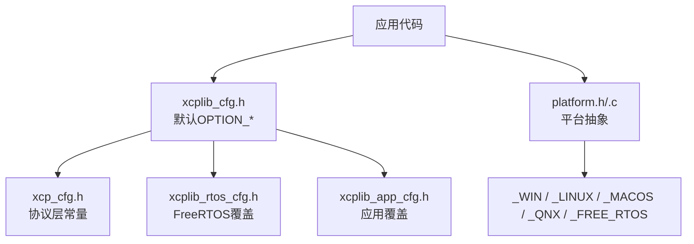
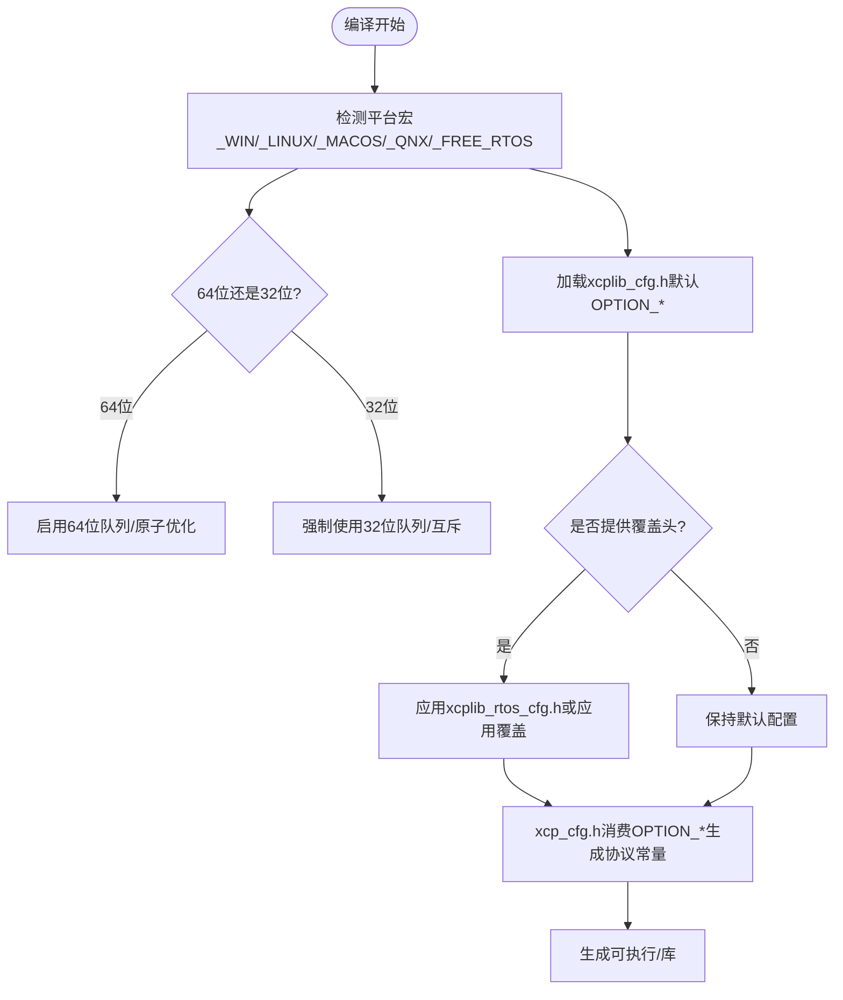
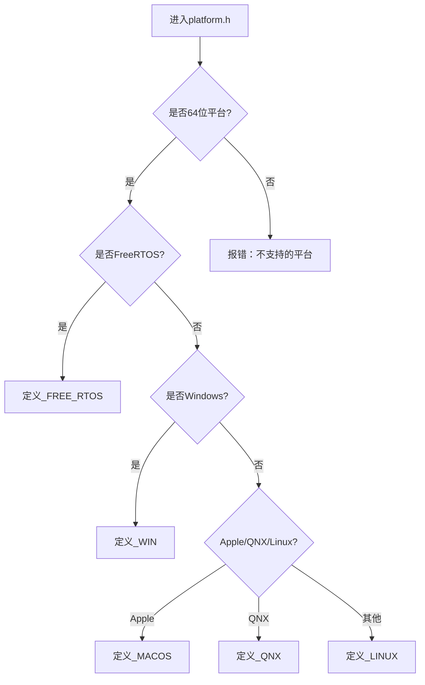
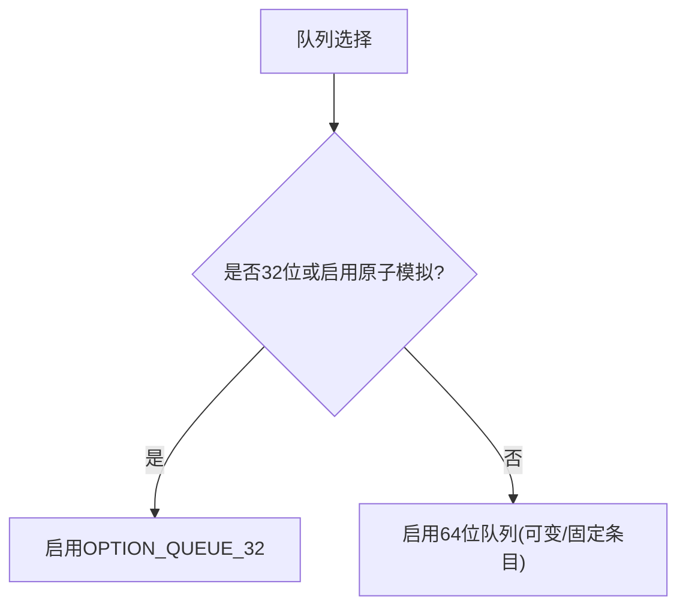
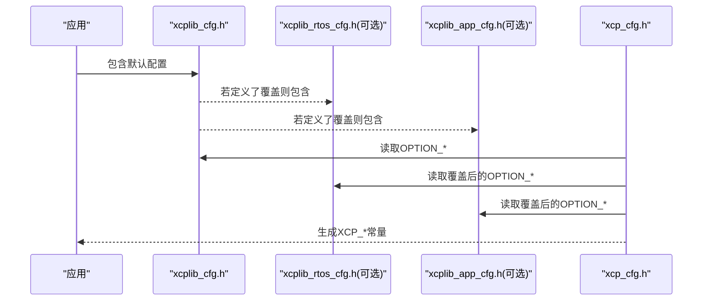
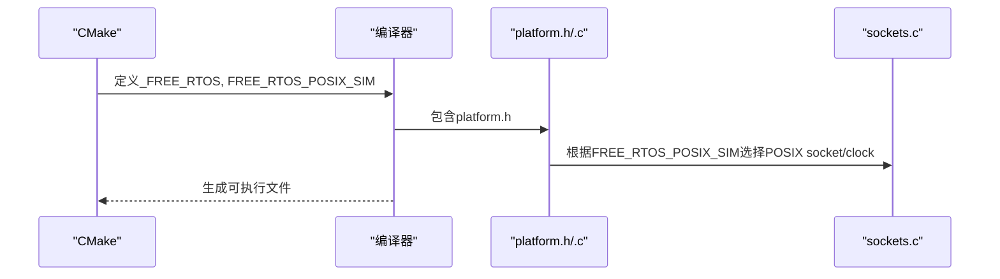
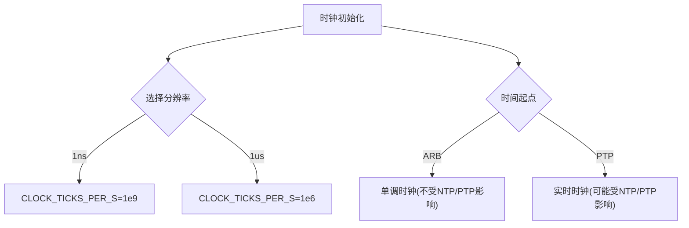
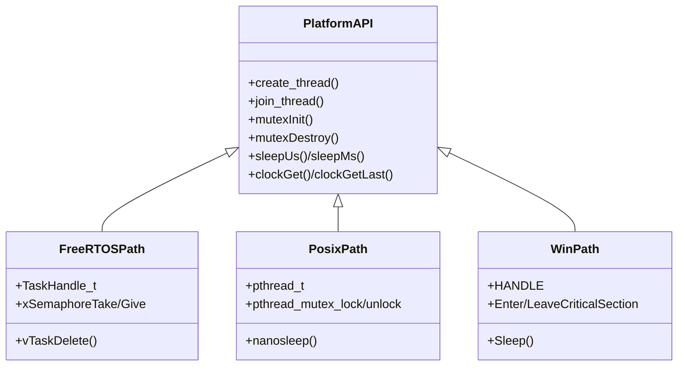
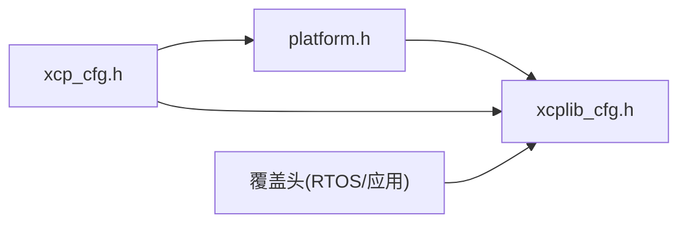

# 平台检测与配置

<cite>
**本文引用的文件**
- [src/platform.h](file://src/platform.h)
- [src/platform.c](file://src/platform.c)
- [src/xcplib_cfg.h](file://src/xcplib_cfg.h)
- [src/xcp_cfg.h](file://src/xcp_cfg.h)
- [src/xcplib_rtos_cfg.h](file://src/xcplib_rtos_cfg.h)
- [examples/freertos_demo/freertos_emu_demo/CMakeLists.txt](file://examples/freertos_demo/freertos_emu_demo/CMakeLists.txt)
- [examples/fetchcontent_example/config/xcplib_app_cfg.h](file://examples/fetchcontent_example/config/xcplib_app_cfg.h)
</cite>

## 目录
1. [简介](#简介)
2. [项目结构](#项目结构)
3. [核心组件](#核心组件)
4. [架构总览](#架构总览)
5. [详细组件分析](#详细组件分析)
6. [依赖关系分析](#依赖关系分析)
7. [性能考量](#性能考量)
8. [故障排查指南](#故障排查指南)
9. [结论](#结论)
10. [附录：新平台移植指南](#附录新平台移植指南)

## 简介
本文件系统性阐述 XCPlite 的平台检测机制与编译时配置系统，重点覆盖：
- 平台宏（_WIN、_LINUX、_MACOS、_QNX、_FREE_RTOS）的自动检测与条件编译逻辑
- 64位与32位平台的识别机制及不同架构下的特殊处理
- 配置选项 OPTION_* 宏的定义与作用机制
- FreeRTOS POSIX 模拟器的特殊处理逻辑
- 新平台移植的配置步骤与常见问题解决方案

## 项目结构
XCPlite 将“平台抽象”和“配置开关”解耦：
- 平台抽象层：platform.h/.c 提供线程、互斥量、时钟、内存映射、共享内存等跨平台接口，并通过 _WIN/_LINUX/_MACOS/_QNX/_FREE_RTOS 选择实现分支。
- 配置层：xcplib_cfg.h 定义默认 OPTION_* 开关；xcp_cfg.h 基于 OPTION_* 推导协议层常量；各目标可通过 xcplib_rtos_cfg.h 或应用级 xcplib_app_cfg.h 进行覆盖。

图表来源
- [src/platform.h:23-72](file://src/platform.h#L23-L72)
- [src/xcplib_cfg.h:18-204](file://src/xcplib_cfg.h#L18-L204)
- [src/xcp_cfg.h:14-30](file://src/xcp_cfg.h#L14-L30)

章节来源
- [src/platform.h:23-72](file://src/platform.h#L23-L72)
- [src/xcplib_cfg.h:18-204](file://src/xcplib_cfg.h#L18-L204)
- [src/xcp_cfg.h:14-30](file://src/xcp_cfg.h#L14-L30)

## 核心组件
- 平台检测与位数判定：在 platform.h 中通过编译器内置宏自动设置 PLATFORM_64BIT/PLATFORM_32BIT，并进一步推导 _WIN/_LINUX/_MACOS/_QNX/_FREE_RTOS。
- 配置开关体系：xcplib_cfg.h 集中定义 OPTION_* 默认值；xcp_cfg.h 消费这些 OPTION_* 生成协议层常量；支持通过 xcplib_rtos_cfg.h 或应用覆盖头文件进行二次覆盖。
- FreeRTOS 专用配置：xcplib_rtos_cfg.h 针对嵌入式目标调整栈大小、优先级、队列、时钟分辨率、A2L/持久化等。
- FreeRTOS POSIX 模拟器：通过 FREE_RTOS_POSIX_SIM 启用主机侧 socket/clock 实现，使 FreeRTOS 路径可在 Linux/macOS 上运行测试。

章节来源
- [src/platform.h:23-72](file://src/platform.h#L23-L72)
- [src/xcplib_cfg.h:55-162](file://src/xcplib_cfg.h#L55-L162)
- [src/xcp_cfg.h:14-30](file://src/xcp_cfg.h#L14-L30)
- [src/xcplib_rtos_cfg.h:44-142](file://src/xcplib_rtos_cfg.h#L44-L142)
- [examples/freertos_demo/freertos_emu_demo/CMakeLists.txt:77-87](file://examples/freertos_demo/freertos_emu_demo/CMakeLists.txt#L77-L87)

## 架构总览
下图展示平台检测与配置在编译期的作用路径：

图表来源
- [src/platform.h:23-72](file://src/platform.h#L23-L72)
- [src/xcplib_cfg.h:55-162](file://src/xcplib_cfg.h#L55-L162)
- [src/xcp_cfg.h:14-30](file://src/xcp_cfg.h#L14-L30)

## 详细组件分析

### 平台宏自动检测与条件编译
- 位数检测：根据常见编译器/目标宏判断 PLATFORM_64BIT/PLATFORM_32BIT。
- 平台检测：优先识别 FreeRTOS；其次 Windows；最后按 _GNU_SOURCE 与 OS 宏区分 Linux/macOS/QNX。
- 强制校验：若未检测到任一平台宏，编译期报错提示需显式定义。

图表来源
- [src/platform.h:23-72](file://src/platform.h#L23-L72)

章节来源
- [src/platform.h:23-72](file://src/platform.h#L23-L72)

### 64位与32位平台的识别与特殊处理
- 64位：默认启用高性能无锁队列（如 queue64v），减少锁竞争。
- 32位：当存在 OPTION_ATOMIC_EMULATION 或处于 32 位平台时，强制回退到 32 位队列（queue32/queue32m），避免对 64 位原语的不支持或不稳定。
- 原子操作：在非 FreeRTOS 且未启用原子模拟时，使用 stdatomic；在 Windows 下可选择使用 Interlocked intrinsics 模拟原子操作。

图表来源
- [src/xcplib_cfg.h:143-162](file://src/xcplib_cfg.h#L143-L162)
- [src/platform.h:520-672](file://src/platform.h#L520-L672)

章节来源
- [src/xcplib_cfg.h:143-162](file://src/xcplib_cfg.h#L143-L162)
- [src/platform.h:520-672](file://src/platform.h#L520-L672)

### 配置选项 OPTION_* 的作用机制
- 默认配置：xcplib_cfg.h 提供日志、时钟、XCP服务器、校准段、DAQ、A2L/ELF上传等默认开关。
- 协议层推导：xcp_cfg.h 读取 OPTION_* 并生成 XCP_* 常量（如事件数量上限、地址模式、功能开关）。
- 覆盖机制：通过 XCPLIB_CFG_OVERRIDE 包含应用自定义头（如 xcplib_rtos_cfg.h 或示例中的 xcplib_app_cfg.h），实现对默认值的覆盖。

图表来源
- [src/xcplib_cfg.h:18-204](file://src/xcplib_cfg.h#L18-L204)
- [src/xcp_cfg.h:14-30](file://src/xcp_cfg.h#L14-L30)
- [src/xcplib_rtos_cfg.h:44-142](file://src/xcplib_rtos_cfg.h#L44-L142)
- [examples/fetchcontent_example/config/xcplib_app_cfg.h:32-112](file://examples/fetchcontent_example/config/xcplib_app_cfg.h#L32-L112)

章节来源
- [src/xcplib_cfg.h:18-204](file://src/xcplib_cfg.h#L18-L204)
- [src/xcp_cfg.h:14-30](file://src/xcp_cfg.h#L14-L30)
- [src/xcplib_rtos_cfg.h:44-142](file://src/xcplib_rtos_cfg.h#L44-L142)
- [examples/fetchcontent_example/config/xcplib_app_cfg.h:32-112](file://examples/fetchcontent_example/config/xcplib_app_cfg.h#L32-L112)

### FreeRTOS POSIX 模拟器的特殊处理
- 构建期注入：CMake 为 freertos_emu_demo 注入 _FREE_RTOS 与 FREE_RTOS_POSIX_SIM，并指定覆盖头 xcplib_rtos_cfg.h。
- 运行时行为：在 FreeRTOS 路径下，若启用 FREE_RTOS_POSIX_SIM，则 platform.h/.c 与 sockets.c 会复用宿主系统的 socket 与 clock 实现，从而在 Linux/macOS 上仿真 FreeRTOS 任务与同步原语。
- 必要宏：Linux 下必须定义 _GNU_SOURCE，以便 FreeRTOS POSIX 端口暴露所需符号。

图表来源
- [examples/freertos_demo/freertos_emu_demo/CMakeLists.txt:77-87](file://examples/freertos_demo/freertos_emu_demo/CMakeLists.txt#L77-L87)
- [src/platform.h:140-162](file://src/platform.h#L140-L162)

章节来源
- [examples/freertos_demo/freertos_emu_demo/CMakeLists.txt:77-87](file://examples/freertos_demo/freertos_emu_demo/CMakeLists.txt#L77-L87)
- [src/platform.h:140-162](file://src/platform.h#L140-L162)

### 时钟与时间源配置
- 分辨率：通过 OPTION_CLOCK_TICKS_1NS 或 OPTION_CLOCK_TICKS_1US 选择 DAQ 时钟分辨率；FreeRTOS 默认 1us。
- 时间起点：OPTION_CLOCK_EPOCH_ARB（任意起点，单调）或 OPTION_CLOCK_EPOCH_PTP（自1970年起，可能受NTP/PTP校正）。
- 平台差异：Linux/macOS/QNX 使用 clock_gettime 的不同 clockid；Windows 使用 QueryPerformanceCounter 并计算偏移以对齐到 UNIX 或 ARB 起点。

图表来源
- [src/xcplib_cfg.h:55-64](file://src/xcplib_cfg.h#L55-L64)
- [src/platform.c:438-654](file://src/platform.c#L438-L654)
- [src/platform.c:659-800](file://src/platform.c#L659-L800)

章节来源
- [src/xcplib_cfg.h:55-64](file://src/xcplib_cfg.h#L55-L64)
- [src/platform.c:438-654](file://src/platform.c#L438-L654)
- [src/platform.c:659-800](file://src/platform.c#L659-L800)

### 线程、互斥与原子
- 线程：统一 create_thread/join_thread/cancel_thread 宏，适配 POSIX、Windows、FreeRTOS。
- 互斥：FreeRTOS 支持递归/非递归互斥；Windows 使用临界区；POSIX 使用 pthread_mutex。
- 原子：非 Windows 默认使用 stdatomic；Windows 可通过 OPTION_ATOMIC_EMULATION 使用 Interlocked intrinsics 模拟。

图表来源
- [src/platform.h:300-467](file://src/platform.h#L300-L467)
- [src/platform.c:366-432](file://src/platform.c#L366-L432)
- [src/platform.c:78-155](file://src/platform.c#L78-L155)

章节来源
- [src/platform.h:300-467](file://src/platform.h#L300-L467)
- [src/platform.c:366-432](file://src/platform.c#L366-L432)
- [src/platform.c:78-155](file://src/platform.c#L78-L155)

## 依赖关系分析
- platform.h 依赖 xcplib_cfg.h 获取 OPTION_*，并在不同平台下引入系统头文件。
- xcp_cfg.h 依赖 platform.h（CLOCK_TICKS_PER_S）与 xcplib_cfg.h（OPTION_*）生成协议常量。
- 覆盖头（xcplib_rtos_cfg.h、xcplib_app_cfg.h）在 xcplib_cfg.h 之后被包含，用于覆盖默认配置。

图表来源
- [src/platform.h:86-87](file://src/platform.h#L86-L87)
- [src/xcp_cfg.h:14-15](file://src/xcp_cfg.h#L14-L15)
- [src/xcplib_cfg.h:194-204](file://src/xcplib_cfg.h#L194-L204)

章节来源
- [src/platform.h:86-87](file://src/platform.h#L86-L87)
- [src/xcp_cfg.h:14-15](file://src/xcp_cfg.h#L14-L15)
- [src/xcplib_cfg.h:194-204](file://src/xcplib_cfg.h#L194-L204)

## 性能考量
- 队列选择：64位平台默认无锁队列可减少锁开销；32位平台回退到带锁队列以保证稳定性。
- 时钟调用：提供 clockGetLast 快速路径以减少系统调用频率。
- 原子模拟：Windows 下原子模拟带来额外开销，仅在需要时启用。
- 传输层：MTU 与队列深度需结合网络路径与目标资源调优。

[本节为通用指导，不直接分析具体文件]

## 故障排查指南
- 平台未识别：确保未同时定义冲突的平台宏；Linux 下需定义 _GNU_SOURCE。
- 时钟错误：确认已定义 CLOCK_TICKS_PER_S 或选择了 1ns/1us 分辨率；FreeRTOS 默认 1us。
- 共享内存失败：检查 SHM 名称与权限；使用工具清理残留对象。
- FreeRTOS 模拟器：确保构建时定义了 FREE_RTOS_POSIX_SIM 与 _GNU_SOURCE。

章节来源
- [src/platform.h:166-172](file://src/platform.h#L166-L172)
- [src/platform.c:201-319](file://src/platform.c#L201-L319)
- [examples/freertos_demo/freertos_emu_demo/CMakeLists.txt:77-87](file://examples/freertos_demo/freertos_emu_demo/CMakeLists.txt#L77-L87)

## 结论
XCPlite 通过严格的平台宏检测与分层配置体系，实现了跨平台的一致 API 与灵活的编译期定制。借助覆盖头机制，用户可以在不修改库源码的前提下，针对不同目标（桌面、嵌入式、FreeRTOS 模拟器）精确裁剪功能与资源占用。

[本节为总结性内容，不直接分析具体文件]

## 附录：新平台移植指南
- 步骤
  - 在 platform.h 中添加对新平台宏的检测，并设置 _WIN/_LINUX/_MACOS/_QNX/_FREE_RTOS 之一。
  - 若为新 32 位平台，确认队列与原子策略（必要时启用 OPTION_QUEUE_32 与 OPTION_ATOMIC_EMULATION）。
  - 在 xcplib_cfg.h 或覆盖头中配置 OPTION_*（日志级别、时钟分辨率、MTU、队列大小等）。
  - 若为 FreeRTOS 目标，参考 xcplib_rtos_cfg.h 调整栈大小、优先级、队列与功能开关。
  - 若使用 FreeRTOS POSIX 模拟器，确保 CMake 注入 _FREE_RTOS、FREE_RTOS_POSIX_SIM 与 _GNU_SOURCE。
- 常见问题
  - 编译期报“平台未支持”：检查平台宏检测分支与 _GNU_SOURCE。
  - 时钟精度不符预期：确认 CLOCK_TICKS_PER_S 与分辨率宏匹配。
  - 共享内存异常：清理残留对象并核对进程间命名与权限。
  - 队列性能问题：评估 64 位无锁队列可行性，或在 32 位平台使用 32 位队列。

章节来源
- [src/platform.h:23-72](file://src/platform.h#L23-L72)
- [src/xcplib_cfg.h:55-162](file://src/xcplib_cfg.h#L55-L162)
- [src/xcplib_rtos_cfg.h:44-142](file://src/xcplib_rtos_cfg.h#L44-L142)
- [examples/freertos_demo/freertos_emu_demo/CMakeLists.txt:77-87](file://examples/freertos_demo/freertos_emu_demo/CMakeLists.txt#L77-L87)