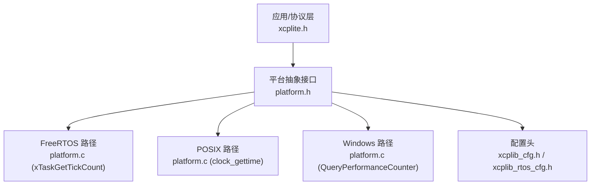
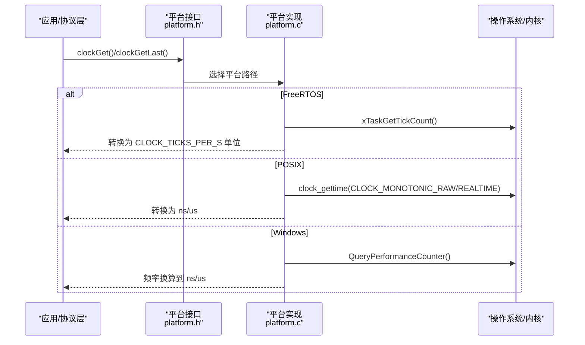
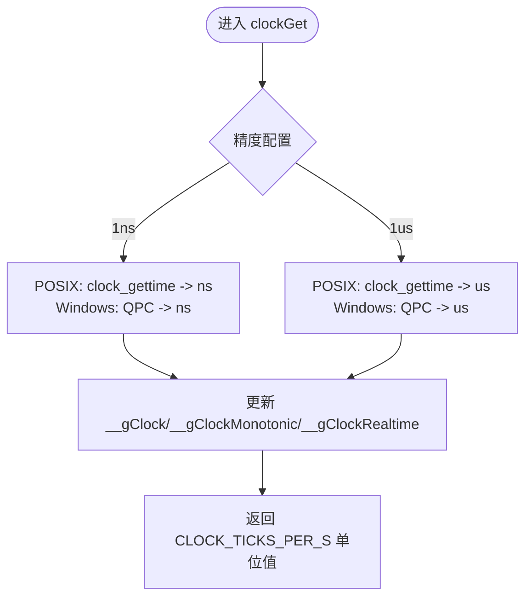
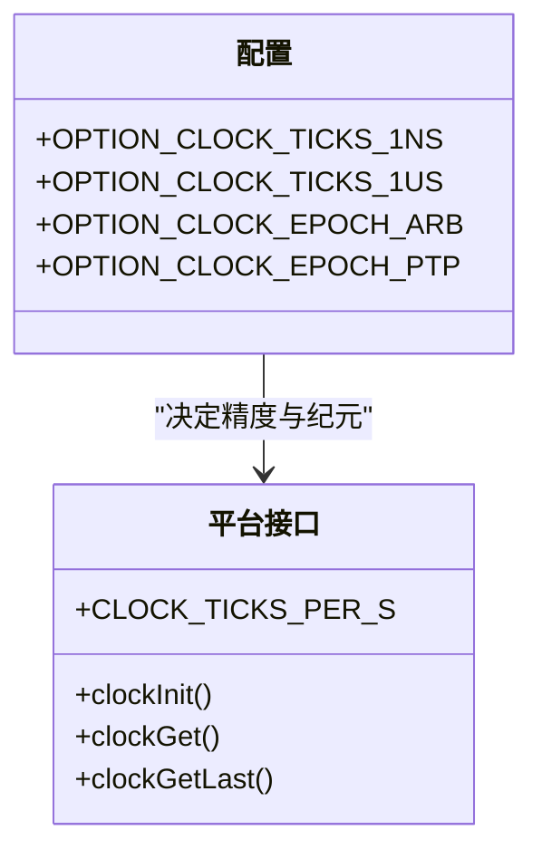
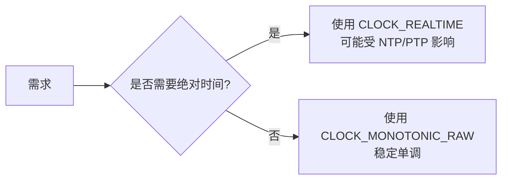
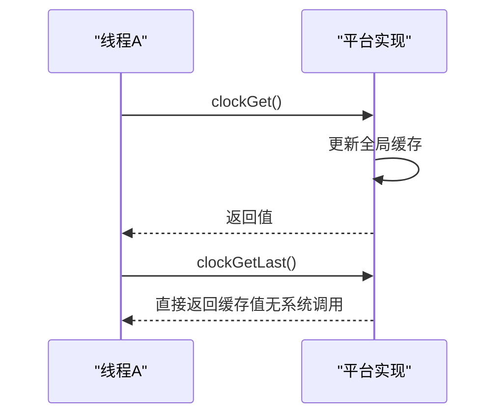
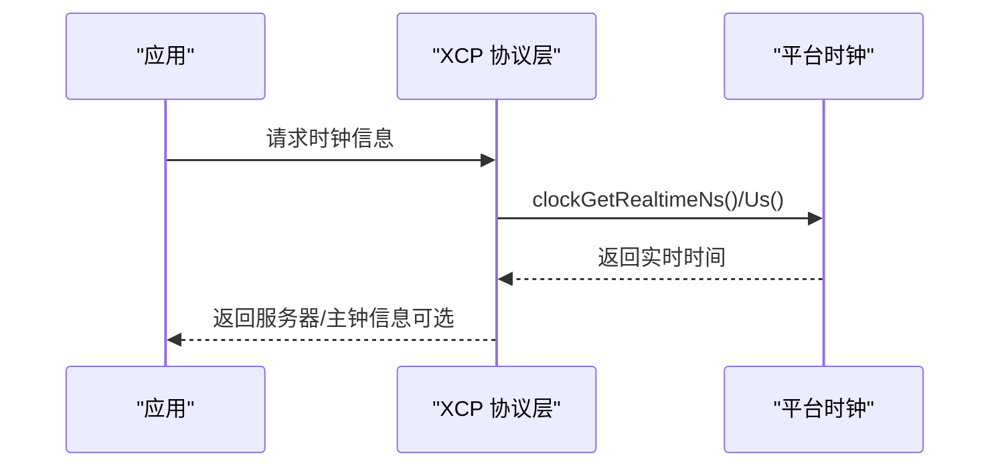
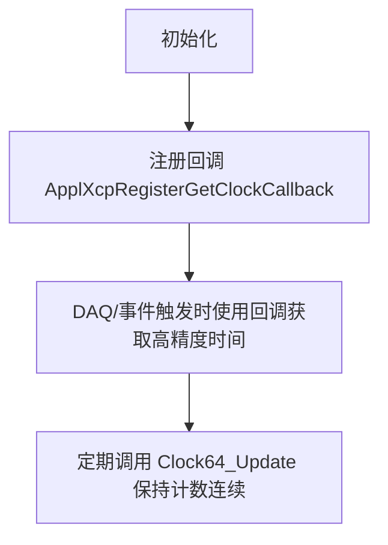
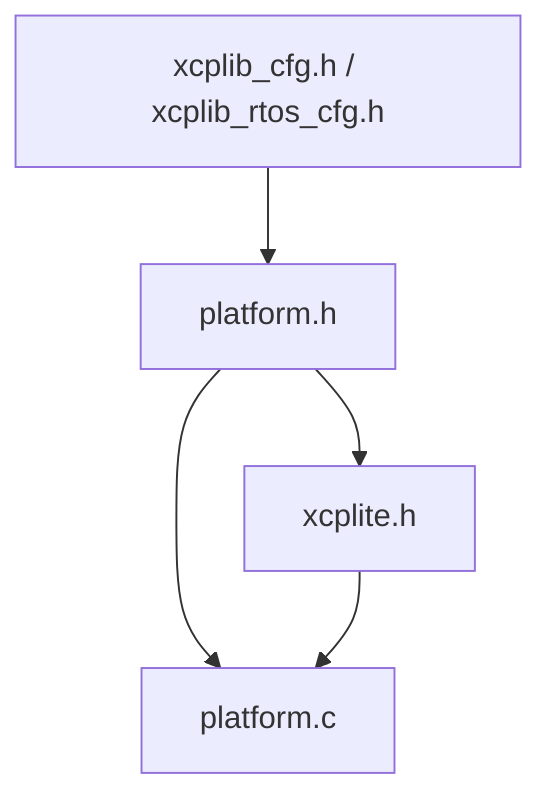

# 时钟与时序

<cite>
**本文引用的文件**
- [platform.h](file://src/platform.h)
- [platform.c](file://src/platform.c)
- [xcplib_cfg.h](file://src/xcplib_cfg.h)
- [xcplib_rtos_cfg.h](file://src/xcplib_rtos_cfg.h)
- [xcplite.h](file://src/xcplite.h)
- [clock64.h](file://examples/freertos_demo/freertos_esp32_demo/include/clock64.h)
</cite>

## 目录
1. [简介](#简介)
2. [项目结构](#项目结构)
3. [核心组件](#核心组件)
4. [架构总览](#架构总览)
5. [详细组件分析](#详细组件分析)
6. [依赖关系分析](#依赖关系分析)
7. [性能考量](#性能考量)
8. [故障排查指南](#故障排查指南)
9. [结论](#结论)
10. [附录](#附录)

## 简介
本文件系统性阐述 XCPlite 的高精度时钟实现与时序管理，覆盖以下主题：
- 不同平台下的高分辨率时钟获取机制（POSIX clock_gettime、Windows QueryPerformanceCounter、FreeRTOS xTaskGetTickCount）
- 纳秒级与微秒级时钟精度配置选项（OPTION_CLOCK_TICKS_1NS、OPTION_CLOCK_TICKS_1US）
- 单调时钟与实时时钟的区别及使用场景
- 时钟缓存机制（clockGetLast）的性能优化策略
- PTP 时间同步的支持与配置
- 时钟精度测试与校准方法

## 项目结构
XCPlite 的时钟与时序能力由平台抽象层提供，并通过统一的接口暴露给上层 XCP 协议栈与应用。关键文件与职责如下：
- platform.h：定义平台宏、时钟精度常量、统一时钟 API（clockInit/clockGet/clockGetLast、单调/实时时钟等）
- platform.c：按平台实现高精度时钟、睡眠、互斥量、共享内存等；包含 FreeRTOS/POSIX/Windows 三种路径
- xcplib_cfg.h：默认库配置，包括时钟精度与纪元选择（OPTION_CLOCK_TICKS_1NS/1US、OPTION_CLOCK_EPOCH_ARB/PTP）
- xcplib_rtos_cfg.h：FreeRTOS 目标覆盖配置，默认将时钟精度设为 1us，并启用任意纪元
- xcplite.h：XCP 协议层对外回调注册点（如 ApplXcpRegisterGetClockCallback），以及 PTP 相关时钟信息结构
- clock64.h：FreeRTOS 示例中提供的 64 位高精度时钟接口（用于替换或增强默认 tick 时钟）

图表来源
- [platform.h:470-506](file://src/platform.h#L470-L506)
- [platform.c:455-818](file://src/platform.c#L455-L818)
- [xcplib_cfg.h:55-65](file://src/xcplib_cfg.h#L55-L65)
- [xcplib_rtos_cfg.h:63-78](file://src/xcplib_rtos_cfg.h#L63-L78)

章节来源
- [platform.h:470-506](file://src/platform.h#L470-L506)
- [platform.c:455-818](file://src/platform.c#L455-L818)
- [xcplib_cfg.h:55-65](file://src/xcplib_cfg.h#L55-L65)
- [xcplib_rtos_cfg.h:63-78](file://src/xcplib_rtos_cfg.h#L63-L78)

## 核心组件
- 高精度时钟 API
  - clockInit：初始化时钟源与全局缓存
  - clockGet：返回当前时钟值（单位由 CLOCK_TICKS_PER_S 决定）
  - clockGetLast：返回最近一次读取的时钟值，避免系统调用开销
  - clockGetString：将时钟值格式化为可读字符串
- 单调/实时时钟
  - clockGetMonotonicNs/Us 与 Last 变体：用于超时、套接字时间戳等对稳定性要求高的场景
  - clockGetRealtimeNs/Us 与 Last 变体：用于需要 UTC/TAI 时间的场景
- 平台差异封装
  - FreeRTOS：基于 xTaskGetTickCount()，粒度为 1/configTICK_RATE_HZ
  - POSIX：基于 clock_gettime(CLOCK_MONOTONIC_RAW/CLOCK_REALTIME)，支持 ns/us
  - Windows：基于 QueryPerformanceCounter，通过频率换算到目标精度
- 配置项
  - OPTION_CLOCK_TICKS_1NS：以纳秒为单位（CLOCK_TICKS_PER_S = 1e9）
  - OPTION_CLOCK_TICKS_1US：以微秒为单位（CLOCK_TICKS_PER_S = 1e6）
  - OPTION_CLOCK_EPOCH_ARB：任意起点（单调）
  - OPTION_CLOCK_EPOCH_PTP：自 1970-01-01 起（可被 NTP/PTP 校正）

章节来源
- [platform.h:470-506](file://src/platform.h#L470-L506)
- [platform.c:455-818](file://src/platform.c#L455-L818)
- [xcplib_cfg.h:55-65](file://src/xcplib_cfg.h#L55-L65)
- [xcplib_rtos_cfg.h:63-78](file://src/xcplib_rtos_cfg.h#L63-L78)

## 架构总览
下图展示时钟在 XCPlite 中的分层与数据流：应用/协议层通过统一接口访问时钟，底层根据平台选择具体实现；配置头决定精度与纪元；FreeRTOS 可通过外部 64 位时钟接口提升精度。

图表来源
- [platform.h:470-506](file://src/platform.h#L470-L506)
- [platform.c:455-818](file://src/platform.c#L455-L818)

## 详细组件分析

### 平台时钟实现对比
- FreeRTOS
  - 使用 xTaskGetTickCount()，粒度受 configTICK_RATE_HZ 限制
  - 推荐通过 ApplXcpRegisterGetClockCallback() 注册更高精度的时钟源（例如 ESP32 的 Clock64_Get）
  - 默认精度在 RTOS 配置中设为 1us
- POSIX
  - 使用 clock_gettime，支持 CLOCK_MONOTONIC_RAW（稳定、无跳变）与 CLOCK_REALTIME（UTC/TAI，可能被 NTP/PTP 调整）
  - 支持 ns 与 us 两种精度，取决于编译配置
- Windows
  - 使用 QueryPerformanceCounter 获取高分辨率计数，并在初始化时计算转换因子与偏移，以映射到目标精度和纪元

图表来源
- [platform.c:600-654](file://src/platform.c#L600-L654)
- [platform.c:785-818](file://src/platform.c#L785-L818)

章节来源
- [platform.c:455-818](file://src/platform.c#L455-L818)
- [xcplib_rtos_cfg.h:63-78](file://src/xcplib_rtos_cfg.h#L63-L78)

### 纳秒/微秒精度配置（OPTION_CLOCK_TICKS_1NS / OPTION_CLOCK_TICKS_1US）
- 在 xcplib_cfg.h 中默认启用 OPTION_CLOCK_TICKS_1NS；也可切换至 1us
- 在 FreeRTOS 目标（xcplib_rtos_cfg.h）中默认覆盖为 OPTION_CLOCK_TICKS_1US，并设置任意纪元
- 若未定义上述两项，则必须显式定义 CLOCK_TICKS_PER_S 并通过回调注册自定义时钟源

图表来源
- [xcplib_cfg.h:55-65](file://src/xcplib_cfg.h#L55-L65)
- [xcplib_rtos_cfg.h:63-78](file://src/xcplib_rtos_cfg.h#L63-L78)
- [platform.h:470-486](file://src/platform.h#L470-L486)

章节来源
- [xcplib_cfg.h:55-65](file://src/xcplib_cfg.h#L55-L65)
- [xcplib_rtos_cfg.h:63-78](file://src/xcplib_rtos_cfg.h#L63-L78)
- [platform.h:470-486](file://src/platform.h#L470-L486)

### 单调时钟与实时时钟
- 单调时钟（CLOCK_MONOTONIC_RAW/MONOTONIC）
  - 不受 NTP/PTP 调整影响，适合超时、测量、事件排序
  - 在 Linux/macOS/QNX 上分别选择最合适的类型以保证稳定性与分辨率
- 实时时钟（CLOCK_REALTIME）
  - 表示 UTC/TAI 时间，可能被系统时间服务调整
  - 适用于需要绝对时间的场景（日志、PTP 对齐显示）

图表来源
- [platform.c:511-549](file://src/platform.c#L511-L549)

章节来源
- [platform.c:511-549](file://src/platform.c#L511-L549)

### 时钟缓存机制（clockGetLast）
- 目的：减少高频调用时的系统调用开销
- 机制：每次 clockGet 更新全局缓存（__gClock 或 __gClockMonotonic/Realtime），clockGetLast 直接返回缓存值
- 适用：对精度要求不高但调用频繁的场景（如周期性超时检查）

图表来源
- [platform.c:600-654](file://src/platform.c#L600-L654)
- [platform.c:785-818](file://src/platform.c#L785-L818)

章节来源
- [platform.c:600-654](file://src/platform.c#L600-L654)
- [platform.c:785-818](file://src/platform.c#L785-L818)

### PTP 时间同步支持与配置
- 配置项
  - OPTION_CLOCK_EPOCH_PTP：使能后使用 CLOCK_REALTIME，以便与 PTP/NTP 对齐
  - 在 xcplib_cfg.h 中可选择 ARB 或 PTP 纪元
- 运行时信息
  - xcplite.h 定义了时钟信息结构（server/grandmaster/relation），并提供回调注册点以获取主钟信息
- 注意
  - FreeRTOS 配置默认禁用 PTP（尚未实现），需自行扩展或使用外部 PTP 工具链

图表来源
- [xcplite.h:474-493](file://src/xcplite.h#L474-L493)
- [xcplite.h:568-577](file://src/xcplite.h#L568-L577)
- [platform.c:637-654](file://src/platform.c#L637-L654)

章节来源
- [xcplite.h:474-493](file://src/xcplite.h#L474-L493)
- [xcplite.h:568-577](file://src/xcplite.h#L568-L577)
- [platform.c:637-654](file://src/platform.c#L637-L654)

### FreeRTOS 高精度时钟增强
- 默认使用 xTaskGetTickCount()，粒度受限
- 可通过 ApplXcpRegisterGetClockCallback() 注册更高精度时钟（如 ESP32 的 Clock64_Get）
- 示例头文件 clock64.h 提供了 Clock64_Init/Update/Get 接口，可在目标平台上实现更细粒度的 DAQ 时钟

图表来源
- [xcplite.h:558-567](file://src/xcplite.h#L558-L567)
- [clock64.h:1-11](file://examples/freertos_demo/freertos_esp32_demo/include/clock64.h#L1-L11)
- [platform.c:455-497](file://src/platform.c#L455-L497)

章节来源
- [xcplite.h:558-567](file://src/xcplite.h#L558-L567)
- [clock64.h:1-11](file://examples/freertos_demo/freertos_esp32_demo/include/clock64.h#L1-L11)
- [platform.c:455-497](file://src/platform.c#L455-L497)

## 依赖关系分析
- 配置依赖
  - xcplib_cfg.h 提供默认时钟精度与纪元；xcplib_rtos_cfg.h 针对 FreeRTOS 进行覆盖
- 平台依赖
  - platform.h 声明统一接口；platform.c 按平台实现
- 协议层依赖
  - xcplite.h 提供回调注册与 PTP 时钟信息结构，供上层集成

图表来源
- [xcplib_cfg.h:55-65](file://src/xcplib_cfg.h#L55-L65)
- [xcplib_rtos_cfg.h:63-78](file://src/xcplib_rtos_cfg.h#L63-L78)
- [platform.h:470-506](file://src/platform.h#L470-L506)
- [xcplite.h:474-493](file://src/xcplite.h#L474-L493)

章节来源
- [xcplib_cfg.h:55-65](file://src/xcplib_cfg.h#L55-L65)
- [xcplib_rtos_cfg.h:63-78](file://src/xcplib_rtos_cfg.h#L63-L78)
- [platform.h:470-506](file://src/platform.h#L470-L506)
- [xcplite.h:474-493](file://src/xcplite.h#L474-L493)

## 性能考量
- 优先使用 clockGetLast 降低系统调用开销
- 在高调用频率路径中，尽量使用单调时钟以避免时间回拨带来的逻辑错误
- Windows 路径下，QPC 频率换算已在初始化阶段完成，运行时仅做乘除与加法
- FreeRTOS 建议通过回调注册更高精度时钟，避免 tick 粒度限制
- 合理选择精度：1ns 带来更高开销，1us 在多数嵌入式场景足够且更高效

[本节为通用指导，不直接分析具体文件]

## 故障排查指南
- 编译错误：未定义 CLOCK_TICKS_PER_S 或未选择 1ns/1us
  - 现象：编译时报错提示需定义精度或注册回调
  - 处理：在 xcplib_cfg.h 或 xcplib_rtos_cfg.h 中启用 OPTION_CLOCK_TICKS_1NS/1US，或显式定义 CLOCK_TICKS_PER_S
- 时间异常：POSIX 平台时间被 NTP/PTP 调整导致跳变
  - 现象：实时时钟出现回拨或跳跃
  - 处理：改用单调时钟（CLOCK_MONOTONIC_RAW）进行内部时序控制
- Windows 精度不符预期：QPC 频率不支持或换算误差
  - 现象：时间单位换算结果异常
  - 处理：检查初始化是否成功，确认 sFactor/sDivide/sOffset 计算正确
- FreeRTOS 精度不足：tick 粒度较大
  - 现象：DAQ 时间戳抖动明显
  - 处理：通过 ApplXcpRegisterGetClockCallback() 注册更高精度时钟（如 Clock64_Get）

章节来源
- [platform.c:507-509](file://src/platform.c#L507-L509)
- [platform.c:600-654](file://src/platform.c#L600-L654)
- [platform.c:785-818](file://src/platform.c#L785-L818)
- [xcplite.h:558-567](file://src/xcplite.h#L558-L567)

## 结论
XCPlite 通过平台抽象层统一了高精度时钟接口，支持 POSIX、Windows 与 FreeRTOS 三大平台，并提供纳秒/微秒精度与任意/PTP 纪元配置。通过时钟缓存与单调/实时时钟的选择，兼顾性能与准确性。对于 FreeRTOS 等资源受限环境，建议通过回调注册更高精度时钟以满足严苛的 DAQ 需求。PTP 支持在 POSIX 平台可用，FreeRTOS 目标需按需扩展。

[本节为总结性内容，不直接分析具体文件]

## 附录
- 时钟精度测试建议
  - 在 POSIX 平台：比较 clock_gettime(CLOCK_MONOTONIC_RAW) 与 clock_gettime(CLOCK_REALTIME) 的波动与跳变
  - 在 Windows 平台：验证 QPC 频率与换算后的 ns/us 一致性
  - 在 FreeRTOS：对比 xTaskGetTickCount() 与外部高精度时钟的差异
- 校准方法
  - 使用 PTP 主钟对系统时间进行对齐（POSIX 平台）
  - 在 FreeRTOS 中通过外部高精度计数器校准 DAQ 时钟，确保长期稳定性

[本节为通用指导，不直接分析具体文件]