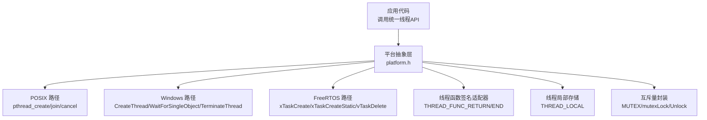
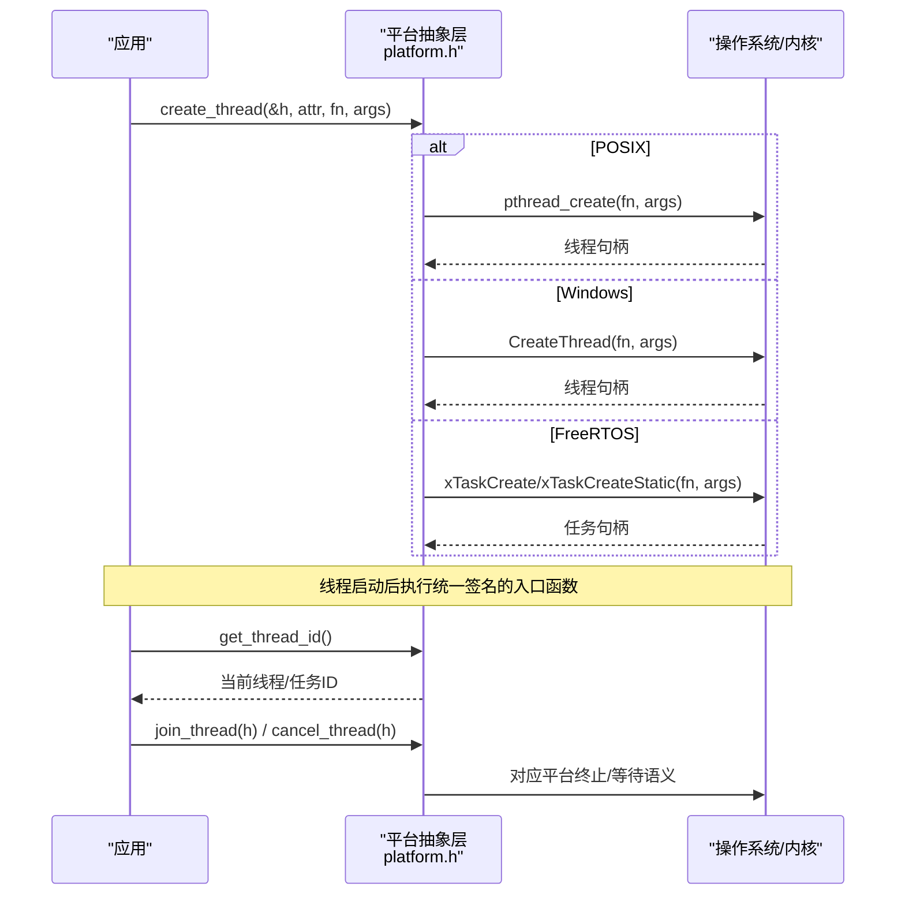
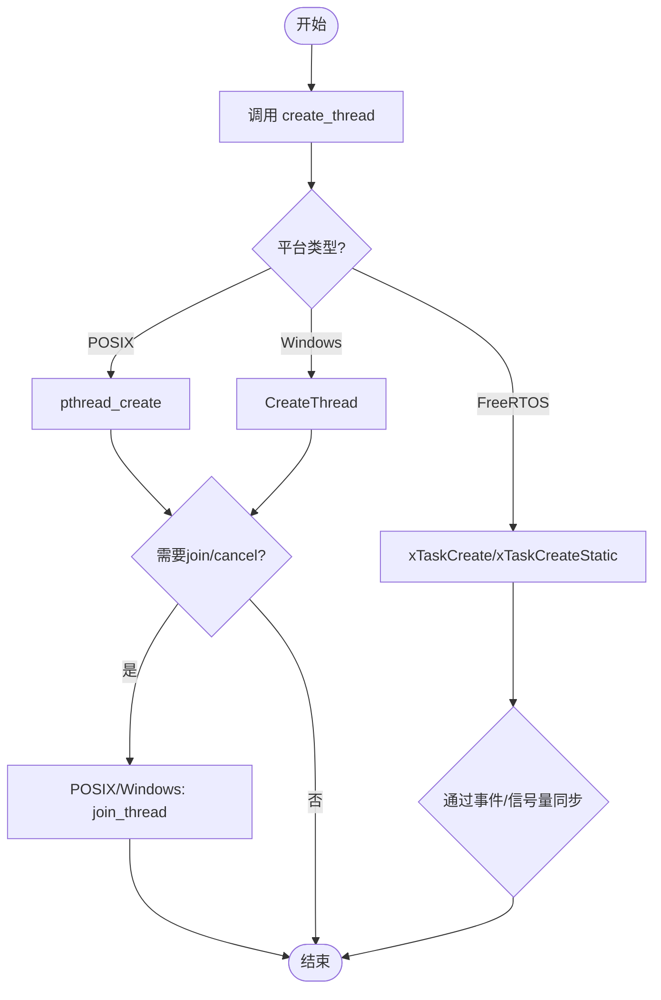
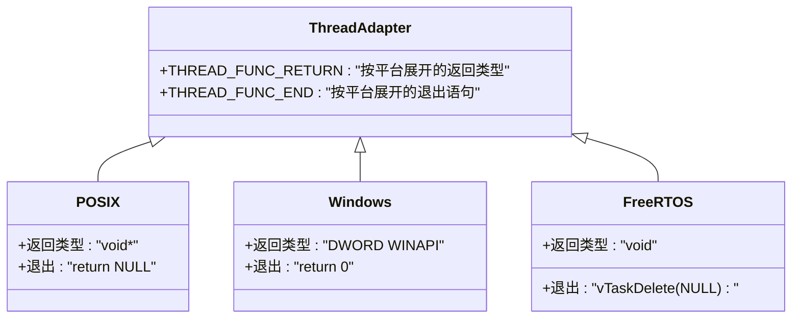
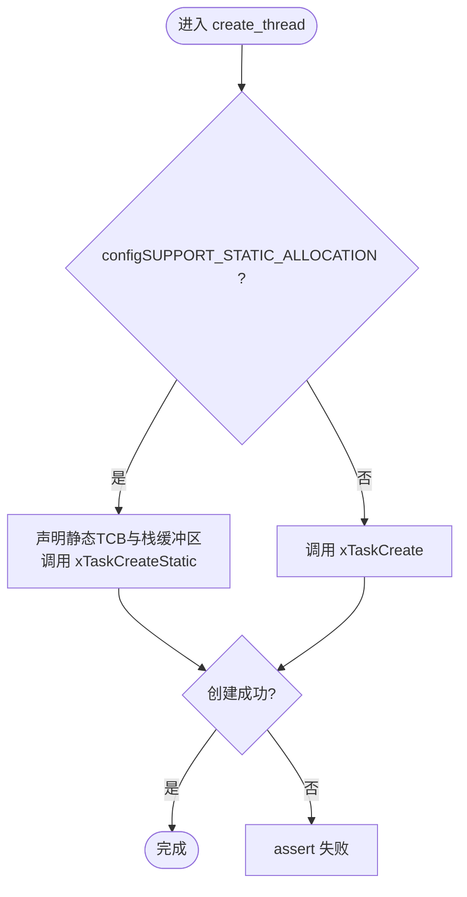
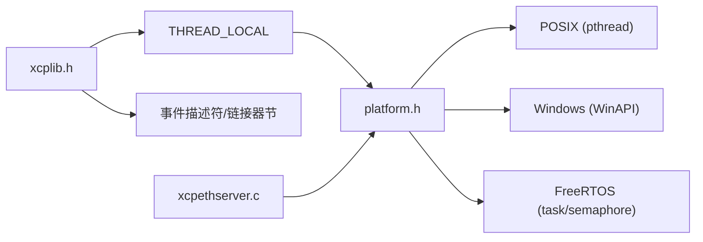

# 线程管理

<cite>
**本文引用的文件**
- [platform.h](file://src/platform.h)
- [platform.c](file://src/platform.c)
- [xcplib.h](file://inc/xcplib.h)
- [FreeRTOSConfig.h（POSIX模拟器）](file://examples/freertos_demo/freertos_emu_demo/FreeRTOSConfig.h)
- [xcpethserver.c](file://src/xcpethserver.c)
</cite>

## 目录
1. [简介](#简介)
2. [项目结构](#项目结构)
3. [核心组件](#核心组件)
4. [架构总览](#架构总览)
5. [详细组件分析](#详细组件分析)
6. [依赖关系分析](#依赖关系分析)
7. [性能考量](#性能考量)
8. [故障排查指南](#故障排查指南)
9. [结论](#结论)
10. [附录](#附录)

## 简介
本文件系统性阐述 XCPlite 的跨平台线程管理机制，覆盖 POSIX pthreads、Windows CreateThread 与 FreeRTOS 任务三种后端。重点说明：
- 线程创建、同步、销毁的生命周期管理
- 线程局部存储（THREAD_LOCAL）的跨平台实现策略
- 线程函数签名适配器的设计原理，确保同一代码可在不同平台编译运行
- FreeRTOS 静态分配模式的实现与优化
- 线程调试与性能分析工具的使用建议

## 项目结构
XCPlite 将线程抽象集中在平台层，通过统一的宏接口屏蔽底层差异：
- 平台定义与选择：在 platform.h 中识别 _WIN、_LINUX/_MACOS/_QNX、_FREE_RTOS
- 线程 API 统一：create_thread、join_thread、cancel_thread、get_thread_id、yield_thread
- 线程函数签名适配器：THREAD_FUNC_RETURN、THREAD_FUNC_END
- 线程局部存储：THREAD_LOCAL 宏在不同编译器/标准下的映射
- 互斥量：MUTEX/mutexLock/mutexUnlock 的统一封装
- 时钟与延时：sleepUs/sleepMs 等跨平台实现

图表来源
- [platform.h:350-433](file://src/platform.h#L350-L433)
- [platform.h:437-467](file://src/platform.h#L437-L467)

章节来源
- [platform.h:23-72](file://src/platform.h#L23-L72)
- [platform.h:350-433](file://src/platform.h#L350-L433)
- [platform.h:437-467](file://src/platform.h#L437-L467)

## 核心组件
- 线程生命周期管理
  - 创建：create_thread 在三条路径分别调用 pthread_create、CreateThread、xTaskCreate/xTaskCreateStatic
  - 加入：join_thread 在 POSIX/Windows 阻塞等待；FreeRTOS 无阻塞 join，需通过事件/信号量同步
  - 取消：cancel_thread 在 POSIX 使用 detach+cancel；Windows 使用 TerminateThread+CloseHandle；FreeRTOS 使用 vTaskDelete
  - 获取ID：get_thread_id 返回当前线程/任务标识
- 线程函数签名适配器
  - THREAD_FUNC_RETURN/THREAD_FUNC_END 使同一函数体兼容 POSIX(void*)、Windows(DWORD WINAPI)、FreeRTOS(void)
- 线程局部存储
  - THREAD_LOCAL 根据 C/C++ 版本与编译器特性映射到 thread_local/_Thread_local/__thread/__declspec(thread)，回退为 static（非线程安全）并报错提示
- 互斥量
  - MUTEX 在 Windows 使用 CRITICAL_SECTION，POSIX 使用 pthread_mutex_t，FreeRTOS 使用 SemaphoreHandle_t（可选递归互斥）
- 延时与高精度时钟
  - sleepUs/sleepMs 针对不同平台采用 nanosleep、Sleep、vTaskDelay 等

章节来源
- [platform.h:303-348](file://src/platform.h#L303-L348)
- [platform.h:350-433](file://src/platform.h#L350-L433)
- [platform.h:437-467](file://src/platform.h#L437-L467)
- [platform.c:78-155](file://src/platform.c#L78-L155)

## 架构总览
下图展示线程从应用调用到各平台后端的完整流程，以及线程函数入口在不同平台的差异处理。

图表来源
- [platform.h:350-433](file://src/platform.h#L350-L433)

章节来源
- [platform.h:350-433](file://src/platform.h#L350-L433)

## 详细组件分析

### 线程生命周期管理（创建/同步/销毁）
- 创建
  - POSIX：pthread_create 返回 0 表示成功
  - Windows：CreateThread 返回 HANDLE；此处包装为表达式形式，成功返回 0，失败返回 -1，以对齐 POSIX 语义
  - FreeRTOS：支持动态分配（xTaskCreate）与静态分配（xTaskCreateStatic），均通过宏 create_thread 统一调用；失败断言
- 同步
  - POSIX/Windows：join_thread 阻塞等待线程结束
  - FreeRTOS：join_thread 为空操作，强调通过事件标志或信号量进行同步
- 销毁
  - POSIX：detach + cancel
  - Windows：TerminateThread + WaitForSingleObject + CloseHandle
  - FreeRTOS：vTaskDelete
- 线程ID
  - POSIX：pthread_self
  - Windows：GetCurrentThreadId
  - FreeRTOS：xTaskGetCurrentTaskHandle

图表来源
- [platform.h:350-433](file://src/platform.h#L350-L433)

章节来源
- [platform.h:350-433](file://src/platform.h#L350-L433)

### 线程函数签名适配器（THREAD_FUNC_RETURN/THREAD_FUNC_END）
- 目的：让同一函数体在 POSIX（返回 void*）、Windows（DWORD WINAPI）、FreeRTOS（void）下编译通过
- 机制：
  - 返回类型宏：THREAD_FUNC_RETURN 按平台展开为对应 ABI 的返回类型
  - 退出语句宏：THREAD_FUNC_END 在 POSIX 返回 NULL，Windows 返回 0，FreeRTOS 调用 vTaskDelete(NULL) 删除自身任务
- 优势：避免为每个平台维护多份线程函数副本，降低维护成本与出错概率

图表来源
- [platform.h:437-451](file://src/platform.h#L437-L451)

章节来源
- [platform.h:437-451](file://src/platform.h#L437-L451)

### 线程局部存储（THREAD_LOCAL）跨平台策略
- 策略：
  - C++：thread_local
  - C11及以上：_Thread_local
  - GCC：__thread
  - MSVC：__declspec(thread)
  - 其他：回退为 static（非线程安全）并触发错误提示
- 使用场景：
  - 在 xcplib.h 中用于动态事件创建时的“每线程一次”模式（once pattern），结合线程安全的列表访问与原子计数保证可见性
- 注意：
  - 若目标平台不支持 TLS，构建时会报错，强制开发者明确风险

章节来源
- [platform.h:454-467](file://src/platform.h#L454-L467)
- [xcplib.h:287-301](file://inc/xcplib.h#L287-L301)
- [xcplib.h:422-453](file://inc/xcplib.h#L422-L453)

### FreeRTOS 静态分配模式实现与优化
- 条件编译：当 configSUPPORT_STATIC_ALLOCATION == 1 时，create_thread 使用 xTaskCreateStatic，并在宏内声明静态 StaticTask_t 与 StackType_t 数组，避免运行时堆分配
- 默认栈大小与优先级：
  - OPTION_FREERTOS_STACK_BYTES：默认基于 configMINIMAL_STACK_SIZE * sizeof(StackType_t)
  - OPTION_FREERTOS_PRIORITY：默认 tskIDLE_PRIORITY + 2
- 平台差异：FREERTOS_TASK_STACK_DEPTH 在 ESP_PLATFORM 上直接传字节数，在其他平台转换为 StackType_t 数量
- 优点：
  - 确定性内存占用，适合资源受限嵌入式环境
  - 避免堆碎片与分配失败
- 限制：
  - 每个调用点拥有持久化的 TCB 与栈，需评估全局内存占用
  - 无法动态调整任务数量

图表来源
- [platform.h:381-418](file://src/platform.h#L381-L418)

章节来源
- [platform.h:381-418](file://src/platform.h#L381-L418)
- [FreeRTOSConfig.h（POSIX模拟器）:39-44](file://examples/freertos_demo/freertos_emu_demo/FreeRTOSConfig.h#L39-L44)

### 互斥量与同步原语
- Windows：CRITICAL_SECTION，提供快速临界区
- POSIX：pthread_mutex_t，可配置自旋次数（mutexInit）
- FreeRTOS：SemaphoreHandle_t，支持递归互斥（configUSE_RECURSIVE_MUTEXES）
- 统一接口：mutexInit/mutexDestroy/mutexLock/mutexUnlock

章节来源
- [platform.h:303-348](file://src/platform.h#L303-L348)

### 延时与高精度时钟
- sleepUs/sleepMs：
  - FreeRTOS：vTaskDelay，粒度为系统 tick（通常 1ms）
  - Windows：Sleep + 忙等待（短延时）
  - POSIX：nanosleep
- 时钟：
  - clockGet/clockGetMonotonicNs/Realtime 等提供高分辨率时间源，用于 DAQ 与网络时间戳

章节来源
- [platform.c:78-155](file://src/platform.c#L78-L155)

## 依赖关系分析
- 平台抽象层（platform.h/.c）依赖：
  - 平台头：windows.h、pthread.h、FreeRTOS.h/semphr.h/task.h
  - 配置：xcplib_cfg.h（OPTION_xxx）
  - 示例与上层模块：xcpethserver.c 等通过 OPTION_FREERTOS_STACK_BYTES 控制栈大小
- 公共接口（xcplib.h）依赖：
  - THREAD_LOCAL 宏（来自 platform.h 或本地兜底）
  - 事件描述符与链接器节（ELF/Mach-O）用于预注册事件

图表来源
- [xcplib.h:287-301](file://inc/xcplib.h#L287-L301)
- [platform.h:350-433](file://src/platform.h#L350-L433)
- [xcpethserver.c:595-598](file://src/xcpethserver.c#L595-L598)

章节来源
- [xcplib.h:287-301](file://inc/xcplib.h#L287-L301)
- [platform.h:350-433](file://src/platform.h#L350-L433)
- [xcpethserver.c:595-598](file://src/xcpethserver.c#L595-L598)

## 性能考量
- 线程创建开销
  - POSIX/Windows：系统级线程创建成本较高，适合中长期运行的后台任务
  - FreeRTOS：静态分配减少堆分配与碎片，提高确定性；动态分配更灵活但存在失败风险
- 同步与调度
  - FreeRTOS 无阻塞 join，推荐用事件/信号量协调，避免不必要的阻塞
  - 短延时在 Windows 上使用忙等待可能增加 CPU 负载，应谨慎使用
- 栈大小与优先级
  - 合理设置 OPTION_FREERTOS_STACK_BYTES 与 OPTION_FREERTOS_PRIORITY，避免栈溢出与抢占抖动
  - 可通过 INCLUDE_uxTaskGetStackHighWaterMark 统计高水位，参考 xcpethserver.c 中的栈剩余计算逻辑

[本节为通用指导，不直接分析具体文件]

## 故障排查指南
- 构建期错误
  - 未定义平台宏：platform.h 会报错，请确保定义了 _WIN、_LINUX/_MACOS/_QNX 或 _FREE_RTOS
  - 缺少 _GNU_SOURCE：Linux 平台需在编译前定义，CMake 目标已自动传播
  - 不支持的 TLS：若平台不支持线程局部存储，将触发错误提示
- 运行期问题
  - FreeRTOS 任务创建失败：静态/动态分配失败会断言，检查栈大小与内存布局
  - 线程未正确退出：Windows 使用 TerminateThread 需谨慎，确保资源释放；POSIX 建议使用 pthread_join
  - 同步不当：FreeRTOS 中避免误用 join_thread，改用事件/信号量
- 调试与性能分析
  - 使用 FreeRTOS 跟踪与统计：configUSE_TRACE_FACILITY、INCLUDE_uxTaskGetStackHighWaterMark
  - 观察线程/任务状态：eTaskGetState、xTaskGetSchedulerState
  - 日志输出：通过 dbg_print.h 的 DBG_* 宏控制日志级别与内容

章节来源
- [platform.h:23-72](file://src/platform.h#L23-L72)
- [platform.h:166-172](file://src/platform.h#L166-L172)
- [platform.h:454-467](file://src/platform.h#L454-L467)
- [platform.h:381-418](file://src/platform.h#L381-L418)
- [FreeRTOSConfig.h（POSIX模拟器）:53-84](file://examples/freertos_demo/freertos_emu_demo/FreeRTOSConfig.h#L53-L84)

## 结论
XCPlite 通过平台抽象层将线程管理统一化，屏蔽了 POSIX、Windows 与 FreeRTOS 的差异，提供了：
- 一致的线程生命周期接口
- 跨平台线程函数签名适配器
- 可移植的线程局部存储策略
- 针对 FreeRTOS 的静态分配优化
配合合理的同步策略与性能调优，可在多平台上稳定运行多线程 XCP 服务与应用。

[本节为总结，不直接分析具体文件]

## 附录
- 关键宏速查
  - 线程：create_thread、join_thread、cancel_thread、get_thread_id、yield_thread
  - 函数签名：THREAD_FUNC_RETURN、THREAD_FUNC_END
  - 线程局部存储：THREAD_LOCAL
  - 互斥量：MUTEX、mutexInit、mutexDestroy、mutexLock、mutexUnlock
- 配置项
  - OPTION_FREERTOS_STACK_BYTES、OPTION_FREERTOS_PRIORITY
  - configSUPPORT_STATIC_ALLOCATION（FreeRTOS）
  - configUSE_RECURSIVE_MUTEXES（FreeRTOS）

[本节为参考信息，不直接分析具体文件]