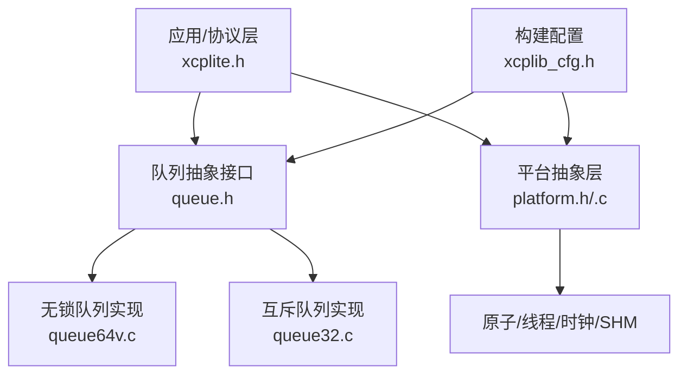
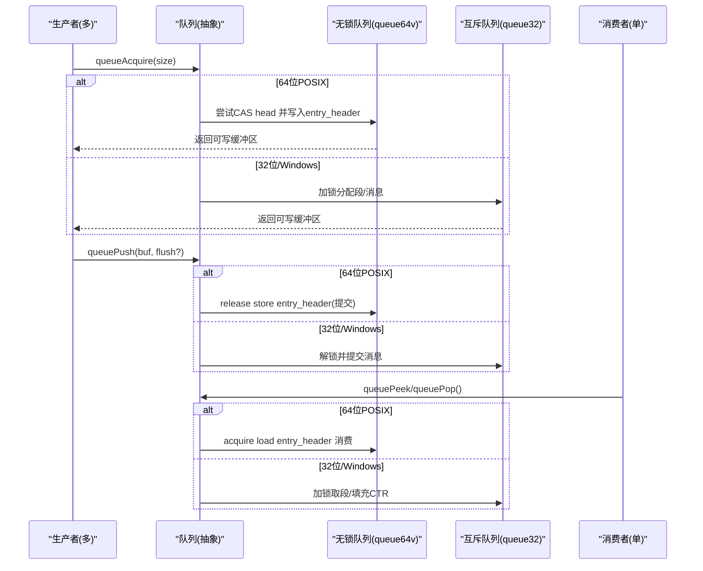
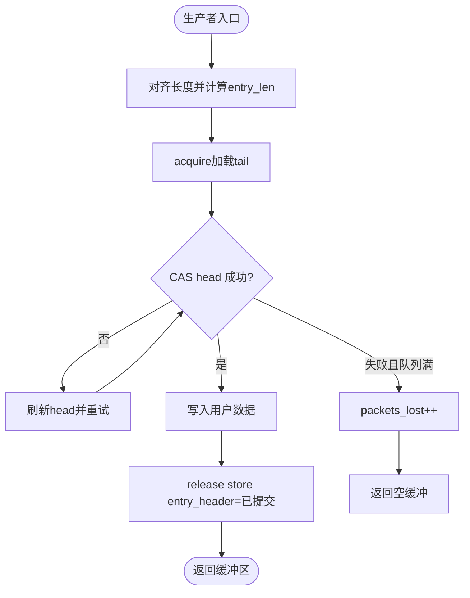
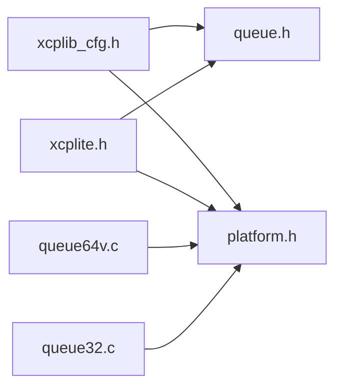

# 无锁设计原理

<cite>
**本文引用的文件**
- [src/xcplite.h](file://src/xcplite.h)
- [src/platform.h](file://src/platform.h)
- [src/platform.c](file://src/platform.c)
- [src/queue.h](file://src/queue.h)
- [src/queue64v.c](file://src/queue64v.c)
- [src/queue32.c](file://src/queue32.c)
- [src/xcplib_cfg.h](file://src/xcplib_cfg.h)
</cite>

## 目录
1. [简介](#简介)
2. [项目结构](#项目结构)
3. [核心组件](#核心组件)
4. [架构总览](#架构总览)
5. [详细组件分析](#详细组件分析)
6. [依赖关系分析](#依赖关系分析)
7. [性能考量](#性能考量)
8. [故障排查指南](#故障排查指南)
9. [结论](#结论)
10. [附录](#附录)

## 简介
本文件聚焦于XCPlite的无锁设计与实现机制，重点解释：
- 原子操作与内存序（memory_order_relaxed、acquire、release）的选择与应用场景
- 内存屏障与缓存一致性保证
- 无锁队列算法设计（CAS、ABA问题处理、性能优化）
- FreeRTOS与POSIX环境下的原子操作适配层
- 无锁编程最佳实践、常见陷阱与调试技巧
- 在高并发环境下使用XCPlite的技术指导

## 项目结构
XCPlite将“平台抽象”和“队列实现”解耦，通过配置宏选择不同队列实现：
- 64位POSIX平台默认启用无锁可变长队列（queue64v.c）
- 32位或Windows/模拟原子环境回退到互斥量队列（queue32.c / queue32m.c）
- 平台层提供原子类型、线程、时钟、共享内存等能力

图表来源
- [src/xcplite.h:1-120](file://src/xcplite.h#L1-L120)
- [src/queue.h:1-187](file://src/queue.h#L1-L187)
- [src/queue64v.c:1-120](file://src/queue64v.c#L1-L120)
- [src/queue32.c:1-120](file://src/queue32.c#L1-L120)
- [src/platform.h:1-200](file://src/platform.h#L1-L200)
- [src/platform.c:1-200](file://src/platform.c#L1-L200)
- [src/xcplib_cfg.h:120-163](file://src/xcplib_cfg.h#L120-L163)

章节来源
- [src/xcplib_cfg.h:120-163](file://src/xcplib_cfg.h#L120-L163)
- [src/queue.h:1-187](file://src/queue.h#L1-L187)

## 核心组件
- 平台抽象层（platform.h/.c）
  - 原子类型与内存序（C11 stdatomic 或 Windows Interlocked 仿真）
  - 线程、互斥、时钟、共享内存
- 队列抽象（queue.h）
  - 统一API：queueAcquire/queuePush/queuePeek/queuePop/queueRelease
- 无锁队列（queue64v.c）
  - 多生产者单消费者（MPSC），基于CAS与内存序
  - 可变长条目，头尾指针+条目状态机
- 互斥队列（queue32.c）
  - 多生产者单消费者，基于互斥量的分段累积发送

章节来源
- [src/platform.h:100-200](file://src/platform.h#L100-L200)
- [src/platform.c:366-432](file://src/platform.c#L366-L432)
- [src/queue.h:88-187](file://src/queue.h#L88-L187)
- [src/queue64v.c:216-262](file://src/queue64v.c#L216-L262)
- [src/queue32.c:57-101](file://src/queue32.c#L57-L101)

## 架构总览
XCPlite在传输层采用“队列抽象 + 平台原子”的分层设计。高吞吐路径走无锁队列（64位POSIX），低资源或受限平台走互斥队列。所有跨进程/跨线程可见性由原子与内存序保障。

图表来源
- [src/queue64v.c:366-485](file://src/queue64v.c#L366-L485)
- [src/queue32.c:207-304](file://src/queue32.c#L207-L304)
- [src/queue.h:122-187](file://src/queue.h#L122-L187)

## 详细组件分析

### 原子操作与内存序
- 原子类型
  - platform.h 在POSIX下引入C11 <stdatomic.h>，定义ATOMIC_BOOL及atomic_uint_fast*_t；在FreeRTOS下同样使用C11原子；在Windows下可通过OPTION_ATOMIC_EMULATION使用Interlocked intrinsics进行仿真。
- 内存序选择
  - memory_order_relaxed：用于不需要同步的计数/统计字段（如packets_lost、flush_offset）。
  - memory_order_acquire：消费者读取head/entry_header时，确保看到生产者已提交的完整数据。
  - memory_order_release：生产者提交entry_header或更新tail时，确保之前写入的数据对后续acquire可见。
  - 典型模式：生产者release store提交数据，消费者acquire load读取数据，形成happens-before关系。

章节来源
- [src/platform.h:177-197](file://src/platform.h#L177-L197)
- [src/platform.h:520-672](file://src/platform.h#L520-L672)
- [src/queue64v.c:400-485](file://src/queue64v.c#L400-L485)
- [src/queue64v.c:512-658](file://src/queue64v.c#L512-L658)

### 无锁队列（queue64v.c）设计
- 数据结构
  - tQueueHeader：包含head/tail/packets_lost/flush_offset等原子字段，按缓存行对齐以减少伪共享。
  - tQueueEntry：以atomic_uint_least32_t作为entry_header，编码“长度+提交状态”。
- 生产者流程
  - 通过CAS自旋递增head，若成功则定位entry并写入数据，最后release store设置entry_header为“已提交”。
  - 若head无法推进（队列满），增加packets_lost并返回空缓冲。
- 消费者流程
  - 循环peek：acquire load entry_header，检查是否为“已提交”，若是则返回数据；否则等待或返回空。
  - queueRelease：先memset释放区域，再release store推进tail，使该区域对生产者可见。
- ABA问题处理
  - 通过“保留态→提交态”的状态机避免ABA：entry_header的高位表示状态，低位表示长度；消费者仅接受特定状态组合。
  - 释放时将整个entry header清零，避免旧值被误认为有效。
- 性能优化
  - 消费者侧缓存peek_index与cached_peek_tail，减少重复计算。
  - 队列头按缓存行对齐，降低多线程争用导致的缓存抖动。
  - 可变长条目适合混合负载；固定长队列（queue64f.c）在极端吞吐场景可能更优。

图表来源
- [src/queue64v.c:366-485](file://src/queue64v.c#L366-L485)

章节来源
- [src/queue64v.c:216-262](file://src/queue64v.c#L216-L262)
- [src/queue64v.c:366-485](file://src/queue64v.c#L366-L485)
- [src/queue64v.c:512-658](file://src/queue64v.c#L512-L658)

### 互斥队列（queue32.c）设计
- 适用场景：32位平台、Windows或启用原子仿真的环境。
- 数据结构
  - tXcpSegmentBuffer：累积多个消息为一个段（UDP payload），含未提交计数、大小、可选段头预留空间。
  - tQueue：环形段队列，rp/len维护读写位置，msg_ptr指向当前段。
- 生产者流程
  - 加锁后判断当前段是否可容纳新消息，不足则申请新段；写入消息头（ctr占位为保留值），记录uncommitted。
- 消费者流程
  - 加锁后检查是否有完整且全部提交的段；若有，遍历段内消息，填充CTR，返回段缓冲。
- 与无锁队列的差异
  - 使用互斥保护临界区，牺牲部分吞吐换取跨平台兼容性与稳定性。
  - 支持消息累积（segment），减少系统调用与网络包数量。

章节来源
- [src/queue32.c:57-101](file://src/queue32.c#L57-L101)
- [src/queue32.c:207-304](file://src/queue32.c#L207-L304)
- [src/queue32.c:333-403](file://src/queue32.c#L333-L403)

### 平台适配层（FreeRTOS与POSIX）
- 原子操作
  - POSIX：直接使用C11 stdatomic，支持memory_order语义。
  - FreeRTOS：同样使用C11原子，注意32位目标上64位RMW可能退化为CAS循环。
  - Windows：可通过OPTION_ATOMIC_EMULATION使用Interlocked intrinsics，提供load/store/exchange/fetch_add/CAS等。
- 线程与互斥
  - POSIX：pthread_create/mutex。
  - FreeRTOS：xTaskCreate/xSemaphoreTake/Give。
  - Windows：CreateThread/EnterCriticalSection。
- 时钟
  - FreeRTOS：基于tick转换到配置的CLOCK_TICKS_PER_S。
  - POSIX：CLOCK_MONOTONIC_RAW或REALTIME，支持ns/us分辨率。
  - Windows：QueryPerformanceCounter换算。
- 共享内存
  - POSIX：shm_open/mmap/flock选举leader，安全初始化与清理。

章节来源
- [src/platform.h:100-200](file://src/platform.h#L100-L200)
- [src/platform.h:300-450](file://src/platform.h#L300-L450)
- [src/platform.c:366-432](file://src/platform.c#L366-L432)
- [src/platform.c:455-800](file://src/platform.c#L455-L800)
- [src/platform.c:161-363](file://src/platform.c#L161-L363)

### 内存屏障与可见性保证
- 生产者-消费者同步
  - 生产者release store提交entry_header，消费者acquire load读取entry_header，确保数据可见性。
  - 消费者release store推进tail，使释放的内存对生产者可见。
- 非同步字段
  - packets_lost、flush_offset等使用relaxed，因为不需要建立happens-before关系。
- 缓存一致性
  - 队列头按缓存行对齐，减少伪共享；消费者缓存peek索引减少访问频率。

章节来源
- [src/queue64v.c:400-485](file://src/queue64v.c#L400-L485)
- [src/queue64v.c:512-658](file://src/queue64v.c#L512-L658)

### 无锁编程最佳实践与陷阱
- 最佳实践
  - 明确区分同步与非同步字段，仅对关键路径使用acquire/release。
  - 使用状态机（保留态/提交态）避免ABA。
  - 合理对齐与缓存行隔离，减少伪共享。
  - 在高竞争场景考虑固定长队列或批量提交以降低开销。
- 常见陷阱
  - 错误使用relaxed导致数据竞争。
  - 消费者在未提交状态下读取entry_header。
  - 忽略packets_lost导致静默丢包。
- 调试技巧
  - 启用TEST_ACQUIRE_SPIN_COUNT/TEST_ACQUIRE_LOCK_TIMING统计自旋次数与时延分布。
  - 打印packets_lost与队列级别，定位拥塞点。
  - 使用断言校验entry状态与长度范围。

章节来源
- [src/queue64v.c:108-212](file://src/queue64v.c#L108-L212)
- [src/queue64v.c:446-456](file://src/queue64v.c#L446-L456)
- [src/queue64v.c:561-607](file://src/queue64v.c#L561-L607)

## 依赖关系分析
- 配置驱动
  - xcplib_cfg.h决定使用哪种队列实现（64位无锁 vs 32位互斥）。
- 模块耦合
  - xcplite.h依赖platform.h（原子/线程/时钟）与queue.h（队列API）。
  - queue64v.c/queue32.c实现queue.h定义的接口，屏蔽底层差异。
- 外部依赖
  - POSIX：stdatomic、pthread、clock_gettime、shm_open/mmap。
  - FreeRTOS：FreeRTOS.h、semphr.h、task.h。
  - Windows：intrin.h（Interlocked）、Win32 API。

图表来源
- [src/xcplib_cfg.h:120-163](file://src/xcplib_cfg.h#L120-L163)
- [src/xcplite.h:17-36](file://src/xcplite.h#L17-L36)
- [src/queue.h:1-37](file://src/queue.h#L1-L37)
- [src/platform.h:100-200](file://src/platform.h#L100-L200)

章节来源
- [src/xcplib_cfg.h:120-163](file://src/xcplib_cfg.h#L120-L163)
- [src/xcplite.h:17-36](file://src/xcplite.h#L17-L36)

## 性能考量
- 无锁队列优势
  - 避免互斥上下文切换，降低延迟抖动。
  - 通过缓存行对齐与消费者缓存优化热点路径。
- 互斥队列优势
  - 在32位/Windows平台稳定可靠，支持消息累积减少网络开销。
- 调优建议
  - 根据负载调整XCPTL_MAX_DTO_SIZE与队列容量。
  - 在高吞吐场景评估固定长队列（queue64f.c）的收益。
  - 监控packets_lost与队列级别，及时扩容或限流。

[本节为通用指导，无需具体文件引用]

## 故障排查指南
- 常见问题
  - 队列溢出：检查packets_lost增长与队列容量。
  - 消费者停滞：确认entry_header状态与长度合法性。
  - 数据不一致：验证acquire/release配对是否正确。
- 诊断手段
  - 启用调试宏输出队列状态与耗时直方图。
  - 使用断言捕获非法状态（如未提交即消费）。
  - 在FreeRTOS/POSIX下分别测试，排除平台差异。

章节来源
- [src/queue64v.c:446-456](file://src/queue64v.c#L446-L456)
- [src/queue64v.c:561-607](file://src/queue64v.c#L561-L607)
- [src/queue32.c:283-304](file://src/queue32.c#L283-L304)

## 结论
XCPlite通过“平台抽象 + 队列抽象”实现了高性能、可移植的无锁通信路径。在64位POSIX平台上，基于CAS与内存序的无锁队列提供极低延迟与高吞吐；在受限平台回退到互斥队列，保证稳定性。通过合理的内存序选择、状态机设计与缓存优化，XCPlite在多核高并发场景中表现稳健。开发者应依据目标平台与负载特征选择合适的队列实现，并借助内置调试工具持续优化。

[本节为总结性内容，无需具体文件引用]

## 附录
- 关键API路径参考
  - 队列API：[queue.h:122-187](file://src/queue.h#L122-L187)
  - 无锁队列实现：[queue64v.c:366-485](file://src/queue64v.c#L366-L485), [queue64v.c:512-658](file://src/queue64v.c#L512-L658)
  - 互斥队列实现：[queue32.c:207-304](file://src/queue32.c#L207-L304), [queue32.c:333-403](file://src/queue32.c#L333-L403)
  - 平台原子与线程：[platform.h:177-197](file://src/platform.h#L177-L197), [platform.h:300-450](file://src/platform.h#L300-L450)
  - 构建配置：[xcplib_cfg.h:120-163](file://src/xcplib_cfg.h#L120-L163)

[本节为参考链接汇总，无需具体文件引用]