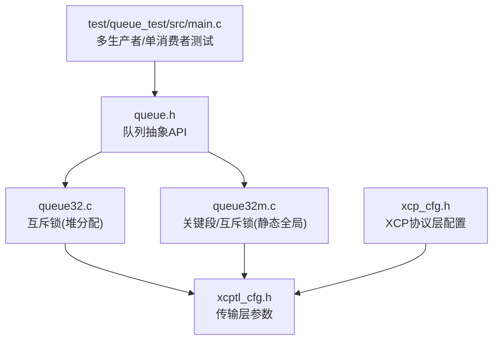
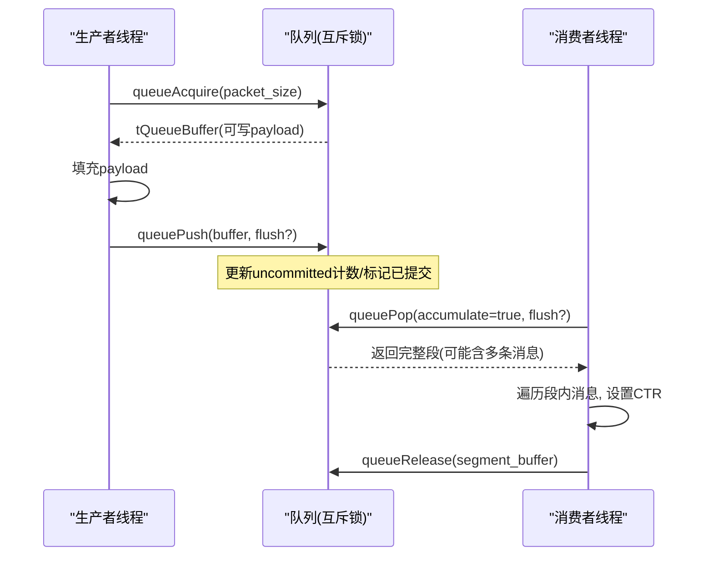
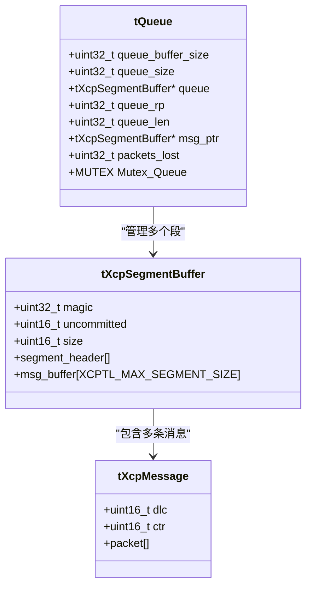
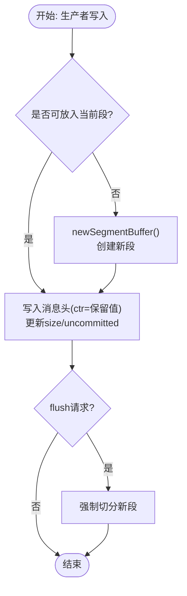
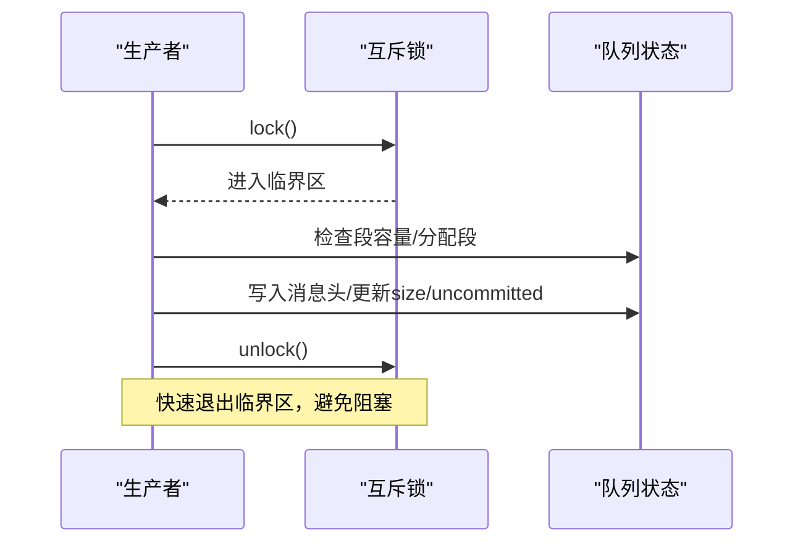
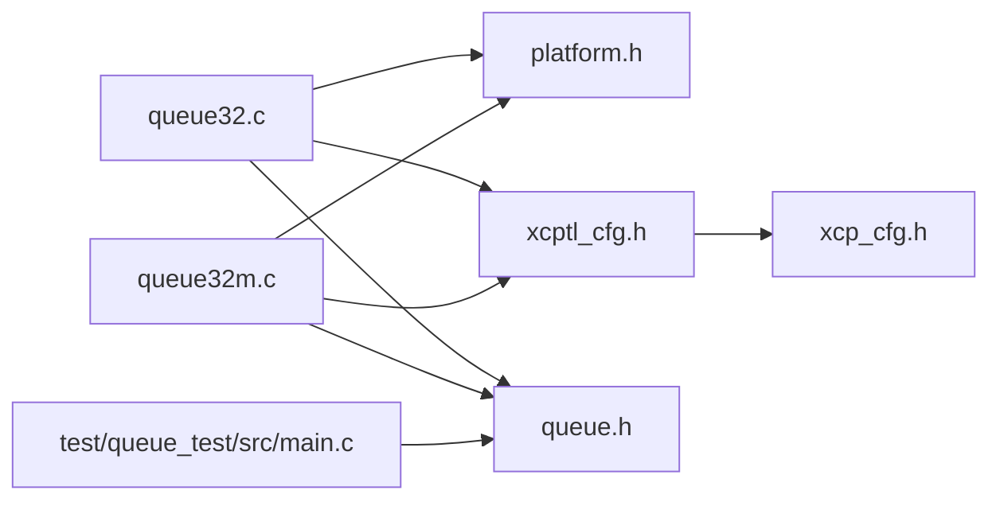

# 互斥锁队列实现

<cite>
**本文引用的文件**
- [queue32.c](file://src/queue32.c)
- [queue32m.c](file://src/queue32m.c)
- [queue.h](file://src/queue.h)
- [xcptl_cfg.h](file://src/xcptl_cfg.h)
- [xcp_cfg.h](file://src/xcp_cfg.h)
- [main.c（队列测试）](file://test/queue_test/src/main.c)
</cite>

## 目录
1. [简介](#简介)
2. [项目结构](#项目结构)
3. [核心组件](#核心组件)
4. [架构总览](#架构总览)
5. [详细组件分析](#详细组件分析)
6. [依赖关系分析](#依赖关系分析)
7. [性能考量](#性能考量)
8. [故障排查指南](#故障排查指南)
9. [结论](#结论)
10. [附录：配置与使用指南](#附录：配置与使用指南)

## 简介
本文件系统性介绍 XCPlite 中基于互斥锁的队列实现方案，重点覆盖 queue32.c 与 queue32m.c 两种实现。二者面向 32 位平台与 Windows 环境提供兼容性支持，并针对 XCP 传输层特性进行优化：将多个小消息累积为大的传输段（segment），以提升网络吞吐、降低协议头开销。文档深入解析互斥锁保护下的临界区设计、线程同步策略与死锁避免机制；详述消息累积算法的实现细节（段边界检测、头部预留空间管理、批量传输优化）；对比无锁队列与互斥锁队列的性能差异与适用场景；并提供队列配置选项与使用指南，帮助在不同平台上选择合适的队列实现。

## 项目结构
- 队列抽象接口定义在 queue.h，统一了不同实现的对外 API（初始化、获取缓冲区、提交、弹出、释放、查询水位等）。
- 具体实现：
  - queue32.c：通用 32 位/Windows 互斥锁实现，堆分配队列缓冲。
  - queue32m.c：FreeRTOS/嵌入式目标的关键段/互斥锁实现，静态全局队列缓冲，支持 DTCM/非缓存 SRAM 放置以优化 DMA。
- 传输层配置集中在 xcptl_cfg.h，定义最大 DTO、段大小、对齐、头部预留等关键参数。
- 应用与测试用例位于 test/queue_test/src/main.c，演示多生产者/单消费者模型、拥塞处理与统计。

图表来源
- [queue.h:1-187](file://src/queue.h#L1-L187)
- [queue32.c:1-420](file://src/queue32.c#L1-L420)
- [queue32m.c:1-466](file://src/queue32m.c#L1-L466)
- [xcptl_cfg.h:1-143](file://src/xcptl_cfg.h#L1-L143)
- [xcp_cfg.h:1-457](file://src/xcp_cfg.h#L1-L457)
- [main.c（队列测试）:1-849](file://test/queue_test/src/main.c#L1-L849)

章节来源
- [queue.h:1-187](file://src/queue.h#L1-L187)
- [xcptl_cfg.h:1-143](file://src/xcptl_cfg.h#L1-L143)
- [xcp_cfg.h:1-457](file://src/xcp_cfg.h#L1-L457)

## 核心组件
- tQueue/tXcpSegmentBuffer/tXcpMessage：队列内部数据结构，封装环形缓冲、段缓冲与消息头（CTR+LEN）。
- 生产者侧：queueAcquire 获取可写缓冲区，queuePush 提交消息（设置状态、可选 flush）。
- 消费者侧：queuePop 弹出已完全提交的段（可能包含多条消息），queueRelease 推进读指针。
- 辅助：queueLevel 查询队列水位，queueClear/queueInit/queueDeinit 生命周期管理。

章节来源
- [queue32.c:57-100](file://src/queue32.c#L57-L100)
- [queue32m.c:53-98](file://src/queue32m.c#L53-L98)
- [queue.h:88-187](file://src/queue.h#L88-L187)

## 架构总览
互斥锁队列采用“多生产者-单消费者”模型，生产者通过互斥锁进入临界区写入消息，消费者在单线程内顺序消费。消息被累积到段中，直到达到段上限或显式 flush，从而减少网络帧数量、提高带宽利用率。

图表来源
- [queue32.c:207-304](file://src/queue32.c#L207-L304)
- [queue32.c:333-417](file://src/queue32.c#L333-L417)
- [queue32m.c:275-361](file://src/queue32m.c#L275-L361)
- [queue32m.c:389-463](file://src/queue32m.c#L389-L463)

## 详细组件分析

### 数据结构与内存布局
- tXcpMessage：包含长度(dlc)、计数器(ctr)和可变长 packet 数据。用于每个消息的传输层头部。
- tXcpSegmentBuffer：段缓冲，包含 magic、未提交计数(uncommitted)、段大小(size)、可选 segment_header（供原始以太网链路头预留）、以及 msg_buffer（拼接的消息序列）。
- tQueue：环形队列元信息，包括队列缓冲、读写指针、当前未完成段指针、丢包计数、互斥锁。

图表来源
- [queue32.c:57-100](file://src/queue32.c#L57-L100)
- [queue32m.c:53-98](file://src/queue32m.c#L53-L98)

章节来源
- [queue32.c:57-100](file://src/queue32.c#L57-L100)
- [queue32m.c:53-98](file://src/queue32m.c#L53-L98)

### 消息累积（Segment Accumulation）机制
- 目标：将多个小消息组合为一个段（UDP payload），减少协议头开销与系统调用次数，提升网络效率。
- 段边界检测：当新消息加入后超过 XCPTL_MAX_SEGMENT_SIZE 时，触发 newSegmentBuffer 创建新段；或在 producer/consumer 端根据 flush 标志提前切分。
- 头部预留空间管理：QUEUE_SEGMENT_HEADER_SIZE 为整个段预留空间（如原始以太网链路头），避免复制与错位；每消息头部由 QUEUE_ENTRY_USER_HEADER_SIZE 提供（传输层 CTR+LEN）。
- 批量传输优化：消费者在 queuePop 中一次性返回完整段，并在遍历段内消息时统一设置传输层计数器，减少锁竞争与重复操作。

图表来源
- [queue32.c:207-304](file://src/queue32.c#L207-L304)
- [queue32m.c:275-361](file://src/queue32m.c#L275-L361)

章节来源
- [xcptl_cfg.h:42-114](file://src/xcptl_cfg.h#L42-L114)
- [queue.h:39-55](file://src/queue.h#L39-L55)
- [queue32.c:104-126](file://src/queue32.c#L104-L126)
- [queue32m.c:181-202](file://src/queue32m.c#L181-L202)

### 临界区设计与线程同步
- 互斥锁保护：所有对队列状态（queue_rp、queue_len、msg_ptr、uncommitted、packets_lost）的访问均在互斥锁保护下进行，确保多生产者安全。
- 生产者路径：
  - queueAcquire：加锁→检查段容量→分配/切换段→写入消息头（保留ctr）→更新size/uncommitted→解锁。
  - queuePush：加锁→递减uncommitted→校验并标记消息为已提交（ctr=已提交值）→可选 flush→解锁。
- 消费者路径（单线程）：
  - queuePop：加锁→检查是否有完整且已提交的段→必要时 flush 尾部段→遍历段内消息设置CTR→解锁。
  - queueRelease：加锁→推进读指针并减少长度→解锁。
- 死锁避免：
  - 临界区内不执行阻塞型 I/O 或长时间计算。
  - 消费者仅在持有锁时做最小必要工作（设置CTR），其余逻辑在锁外完成。
  - 使用条件变量或轮询策略由上层控制，避免在锁内等待。

图表来源
- [queue32.c:242-266](file://src/queue32.c#L242-L266)
- [queue32.c:289-303](file://src/queue32.c#L289-L303)
- [queue32.c:349-367](file://src/queue32.c#L349-L367)
- [queue32.c:412-416](file://src/queue32.c#L412-L416)

章节来源
- [queue32.c:207-417](file://src/queue32.c#L207-L417)
- [queue32m.c:275-463](file://src/queue32m.c#L275-L463)

### 平台特定优化（FreeRTOS/STM32）
- 关键段/互斥锁选择：
  - 若启用 OPTION_QUEUE32_MUTEX，则使用互斥锁；否则在 ESP 平台使用 portMUX_TYPE，其他 FreeRTOS 平台使用 taskENTER_CRITICAL()/taskEXIT_CRITICAL()。
- 内存放置：
  - 队列头（热点字段）放置在 DTCM（零等待、无需缓存一致性）。
  - 段缓冲数组放置在非缓存 AXI SRAM，避免 DMA 读取脏缓存导致的正确性问题。
- 这些优化显著降低中断屏蔽时间与缓存一致性开销，适合高实时性嵌入式场景。

章节来源
- [queue32m.c:117-150](file://src/queue32m.c#L117-L150)
- [queue32m.c:155-177](file://src/queue32m.c#L155-L177)
- [queue32m.c:219-257](file://src/queue32m.c#L219-L257)

### 无锁队列 vs 互斥锁队列
- 无锁队列（queue64v.c/queue64f.c）：
  - 优势：极低延迟、无上下文切换、适合高性能内核路径。
  - 限制：需要 64 位原子操作、固定/可变条目大小策略复杂、不支持段累积（由向量发送路径替代）。
- 互斥锁队列（queue32.c/queue32m.c）：
  - 优势：兼容 32 位/Windows、支持段累积、易于移植、在嵌入式上可通过关键段优化。
  - 限制：存在锁竞争与调度开销，在高并发下需合理设计批量化与 flush 策略。
- 适用场景：
  - 无锁队列：高性能桌面/服务器、64 位平台、对延迟极度敏感的场景。
  - 互斥锁队列：32 位 MCU、Windows、需要段累积以降低网络开销的场景。

章节来源
- [queue.h:10-15](file://src/queue.h#L10-L15)
- [xcptl_cfg.h:44-49](file://src/xcptl_cfg.h#L44-L49)

## 依赖关系分析
- queue32.c/queue32m.c 依赖：
  - platform.h：平台抽象（线程、互斥锁、时钟）。
  - xcptl_cfg.h：传输层参数（最大 DTO、段大小、对齐、头部预留）。
  - queue.h：队列抽象 API。
  - xcp_cfg.h：XCP 协议层配置（影响整体行为）。
- 测试用例依赖 queue.h 与平台线程 API，验证多生产者/单消费者模型与拥塞处理。

图表来源
- [queue32.c:16-35](file://src/queue32.c#L16-L35)
- [queue32m.c:16-31](file://src/queue32m.c#L16-L31)
- [queue.h:25-37](file://src/queue.h#L25-L37)
- [xcptl_cfg.h:14-114](file://src/xcptl_cfg.h#L14-L114)
- [xcp_cfg.h:14-16](file://src/xcp_cfg.h#L14-L16)

章节来源
- [queue32.c:16-35](file://src/queue32.c#L16-L35)
- [queue32m.c:16-31](file://src/queue32m.c#L16-L31)
- [queue.h:25-37](file://src/queue.h#L25-L37)
- [xcptl_cfg.h:14-114](file://src/xcptl_cfg.h#L14-L114)
- [xcp_cfg.h:14-16](file://src/xcp_cfg.h#L14-L16)

## 性能考量
- 段累积减少网络帧数，提高吞吐；但会增加端到端延迟（需等待段满或 flush）。
- 锁粒度与临界区大小直接影响吞吐与延迟；应尽量减少锁内操作。
- 在嵌入式平台，DTCM/非缓存 SRAM 放置可显著降低 DMA 一致性与中断屏蔽成本。
- 测试工具提供锁时间直方图与丢包统计，便于定位瓶颈。

章节来源
- [main.c（队列测试）:105-210](file://test/queue_test/src/main.c#L105-L210)
- [queue32m.c:101-150](file://src/queue32m.c#L101-L150)

## 故障排查指南
- 常见错误：
  - 队列溢出：queueAcquire 返回空缓冲，packets_lost 增加；检查队列大小与消费速率。
  - 消息未提交：queuePop 断言失败（ctr 不为已提交值）；确认 queuePush 被正确调用。
  - 对齐错误：XCPTL_PACKET_ALIGNMENT 必须为 2 的幂；检查编译期断言。
- 调试建议：
  - 启用日志级别，观察 acquire/push/pop/release 流程。
  - 使用测试工具统计锁时间与丢包率，调整 THREAD_BURST_SIZE 与 CONSUMER_SLEEP。
  - 在嵌入式平台检查内存放置与缓存一致性设置。

章节来源
- [queue32.c:260-266](file://src/queue32.c#L260-L266)
- [queue32.c:293-303](file://src/queue32.c#L293-L303)
- [queue32.c:387-394](file://src/queue32.c#L387-L394)
- [queue.h:66-82](file://src/queue.h#L66-L82)

## 结论
XCPlite 的互斥锁队列通过消息累积与精细的临界区设计，在 32 位平台与 Windows 环境下提供了稳定高效的传输层支持。queue32.c 适用于通用场景，queue32m.c 针对 FreeRTOS/嵌入式进行了深度优化。开发者应根据平台能力、性能需求与网络拓扑选择合适的实现，并结合配置选项调优段大小、对齐与 flush 策略。

## 附录：配置与使用指南
- 关键配置项（xcptl_cfg.h）：
  - XCPTL_MAX_DTO_SIZE：最大数据报文大小。
  - XCPTL_MAX_SEGMENT_SIZE：最大段大小（受 MTU 限制）。
  - XCPTL_PACKET_ALIGNMENT：消息对齐要求（必须为 2 的幂）。
  - XCPTL_TX_HEADROOM：段前预留空间（原始以太网链路头）。
- 队列选择：
  - 32 位/Windows：OPTION_QUEUE_32 → queue32.c。
  - FreeRTOS/嵌入式：OPTION_QUEUE_32 + _FREE_RTOS → queue32m.c。
- 使用流程：
  - 初始化：queueInit(queue_buffer_size)。
  - 生产：queueAcquire → 填充 → queuePush(buffer, flush?)。
  - 消费：queuePop(accumulate=true, flush?) → 遍历消息 → queueRelease。
  - 监控：queueLevel 查询水位，packets_lost 统计丢包。

章节来源
- [xcptl_cfg.h:42-114](file://src/xcptl_cfg.h#L42-L114)
- [queue.h:101-187](file://src/queue.h#L101-L187)
- [queue32.c:148-183](file://src/queue32.c#L148-L183)
- [queue32m.c:219-257](file://src/queue32m.c#L219-L257)