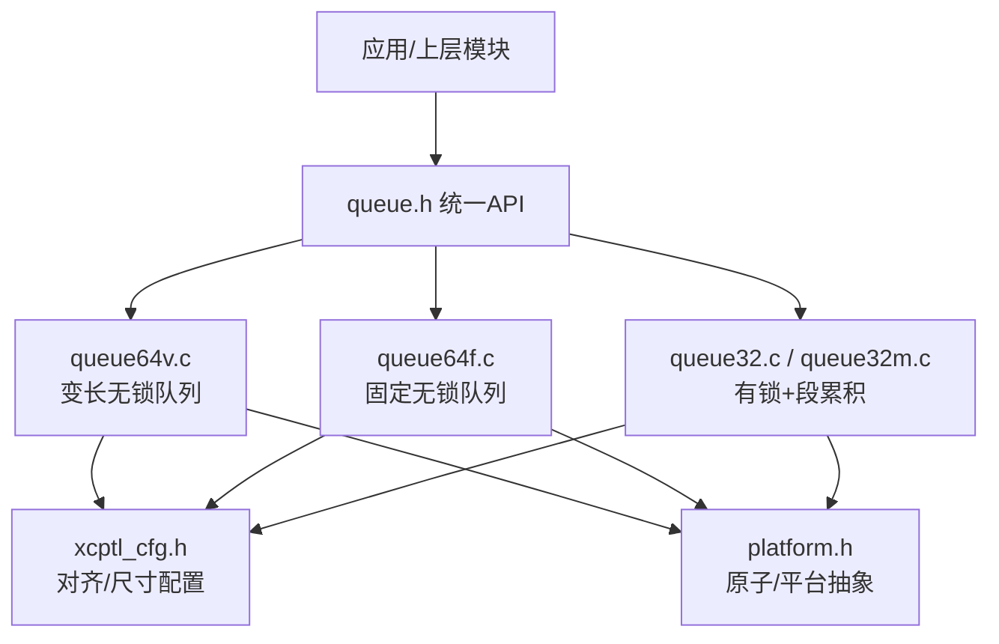
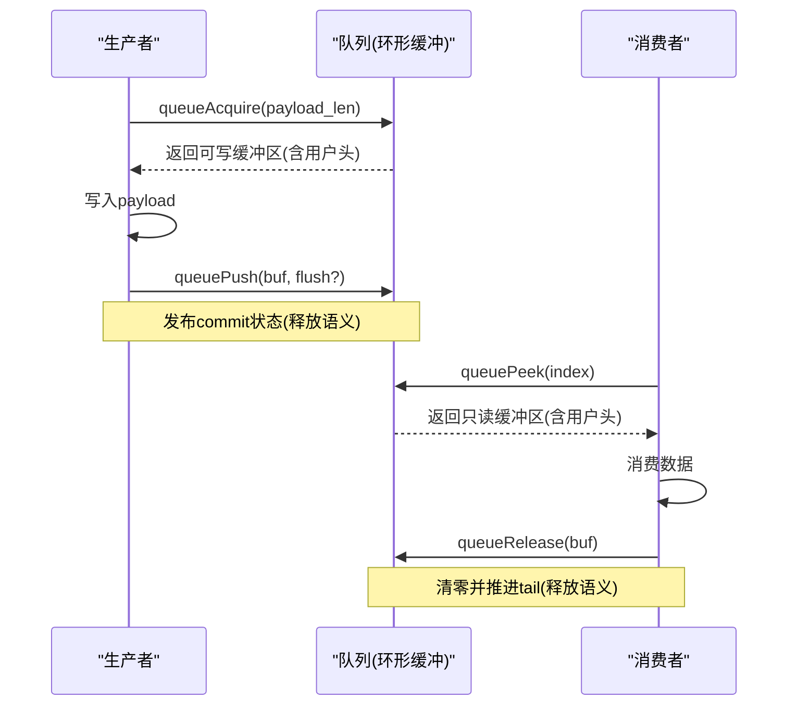
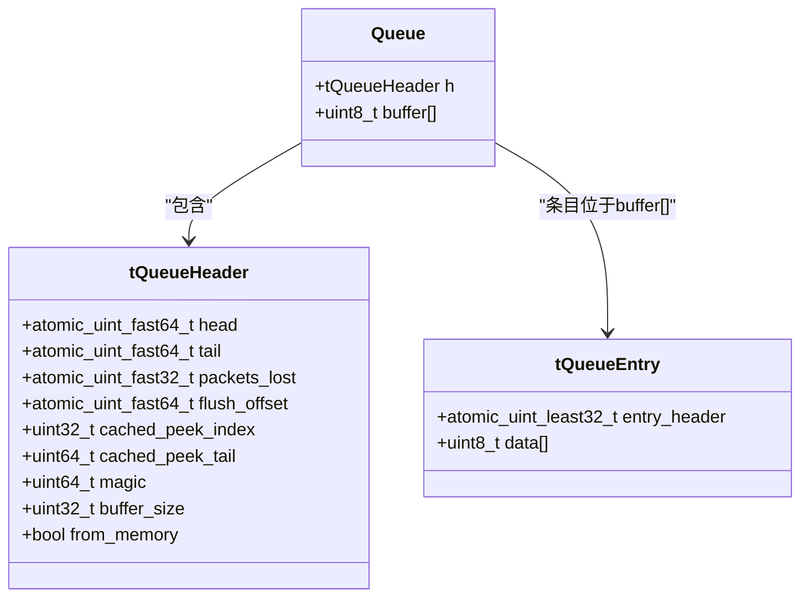
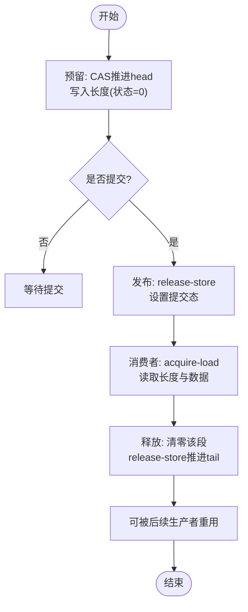
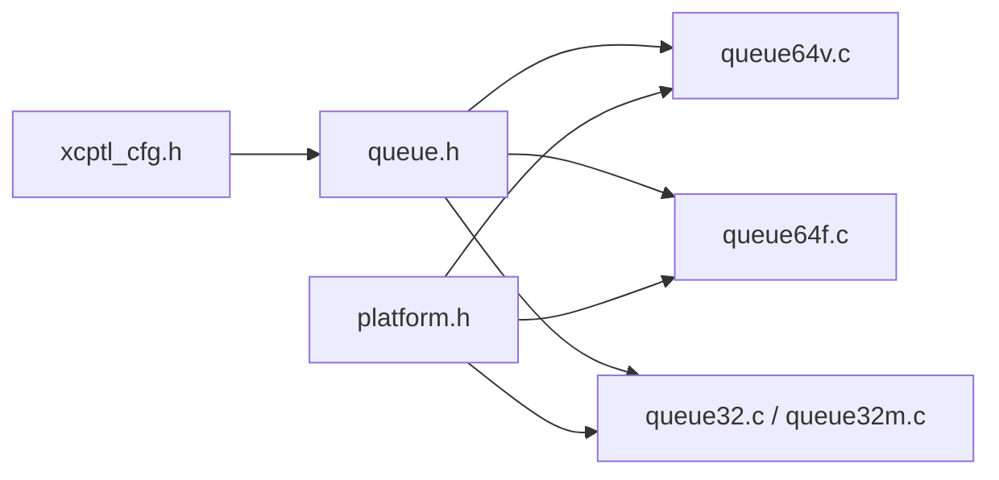

# 变长数据队列实现

<cite>
**本文引用的文件**
- [queue64v.c](file://src/queue64v.c)
- [queue.h](file://src/queue.h)
- [xcptl_cfg.h](file://src/xcptl_cfg.h)
- [platform.h](file://src/platform.h)
- [queue32.c](file://src/queue32.c)
- [queue32m.c](file://src/queue32m.c)
- [queue64f.c](file://src/queue64f.c)
</cite>

## 目录
1. [简介](#简介)
2. [项目结构](#项目结构)
3. [核心组件](#核心组件)
4. [架构总览](#架构总览)
5. [详细组件分析](#详细组件分析)
6. [依赖关系分析](#依赖关系分析)
7. [性能考量](#性能考量)
8. [故障排查指南](#故障排查指南)
9. [结论](#结论)
10. [附录](#附录)

## 简介
本文件系统性介绍 XCPlite 中支持变长数据的无锁队列实现（queue64v.c），围绕以下主题展开：
- 动态内存管理策略与存储布局：变长消息的元数据、对齐与头部设计。
- 设计权衡：变长队列相比固定大小队列在灵活性、复杂度、缓存行为上的取舍。
- 并发安全：生产者-消费者模式下的原子操作序列与内存可见性保证。
- 扩容机制、碎片整理与内存回收：基于环形缓冲与头尾指针的复用策略。
- 性能特征与适用场景指导：帮助根据实际负载选择合适队列实现。

## 项目结构
XCPlite 提供多套队列实现，通过统一 API 暴露：
- queue64v.c：64位平台无锁、变长条目队列（多生产者单消费者）。
- queue64f.c：64位平台无锁、固定条目队列（多生产者单消费者）。
- queue32.c / queue32m.c：32位或RTOS环境，基于互斥量/临界区，支持消息累积为段（segment）。
- queue.h：统一队列API与参数定义。
- xcptl_cfg.h：传输层相关配置（最大DTO、对齐、段大小等）。
- platform.h：平台抽象（原子、线程、时钟、共享内存等）。

图表来源
- [queue.h:1-187](file://src/queue.h#L1-L187)
- [queue64v.c:1-662](file://src/queue64v.c#L1-L662)
- [queue64f.c:1-664](file://src/queue64f.c#L1-L664)
- [queue32.c:1-420](file://src/queue32.c#L1-L420)
- [queue32m.c:1-466](file://src/queue32m.c#L1-L466)
- [xcptl_cfg.h:1-143](file://src/xcptl_cfg.h#L1-L143)
- [platform.h:1-677](file://src/platform.h#L1-L677)

章节来源
- [queue.h:1-187](file://src/queue.h#L1-L187)
- [xcptl_cfg.h:1-143](file://src/xcptl_cfg.h#L1-L143)
- [platform.h:1-677](file://src/platform.h#L1-L677)

## 核心组件
- 队列头 tQueueHeader：包含 head/tail 原子指针、丢包计数、flush 请求偏移、缓存优化字段、魔数与缓冲区大小等，按缓存行对齐以减少伪共享。
- 队列条目 tQueueEntry：以原子32位 entry_header 开头，后接可变长度数据区域；entry_header 编码状态与长度。
- 环形缓冲区：buffer[] 作为连续内存块，head/tail 表示已提交与可复用的边界，支持回绕。
- 用户头空间：每个条目预留用户头空间（如XCP传输层头），便于零拷贝附加信息。

章节来源
- [queue64v.c:216-261](file://src/queue64v.c#L216-L261)
- [queue.h:29-55](file://src/queue.h#L29-L55)

## 架构总览
变长无锁队列采用“环形缓冲 + 原子头尾 + 条目内状态”的设计：
- 生产者通过 CAS 竞争 head 推进来“预留”一段对齐后的空间，写入数据后发布 commit 状态。
- 消费者顺序读取条目，处理完后清零并推进 tail，使该段可被后续生产者重用。
- 通过 acquire/release 语义保证数据可见性与顺序一致性。

图表来源
- [queue64v.c:366-485](file://src/queue64v.c#L366-L485)
- [queue64v.c:512-658](file://src/queue64v.c#L512-L658)

## 详细组件分析

### 存储布局与元数据
- 条目布局：tQueueEntry.entry_header（atomic_uint_least32_t）+ data[]（变长）。entry_header 低16位编码条目长度（含用户头），高16位编码状态（初始0或提交态常量）。
- 对齐要求：QUEUE_PAYLOAD_SIZE_ALIGNMENT 必须为4的倍数，以保证 entry_header 自然对齐；所有条目按该对齐放置，避免跨缓存行访问与未对齐原子访问。
- 用户头空间：由 QUEUE_ENTRY_USER_HEADER_SIZE 决定，通常用于XCP传输层头（ctr+len），便于零拷贝。
- 队列头缓存优化：cached_peek_index/cached_peek_tail 加速顺序 peek 路径。

图表来源
- [queue64v.c:233-261](file://src/queue64v.c#L233-L261)
- [queue64v.c:216-228](file://src/queue64v.c#L216-L228)

章节来源
- [queue64v.c:216-261](file://src/queue64v.c#L216-L261)
- [queue.h:29-55](file://src/queue.h#L29-L55)

### 动态内存管理与对齐优化
- 分配策略：若传入 NULL，则使用 aligned_alloc 分配整块内存（含队列头与数据区），并按缓存行对齐；若传入已有内存，则复用该内存（from_memory=true）。
- 有效容量计算：扣除队列头与尾部保留空间（为最大条目预留回绕空间），并对齐到 QUEUE_PAYLOAD_SIZE_ALIGNMENT。
- 清理策略：queueClear 将 head/tail/packets_lost/flush_offset 复位，并 memset 清零整个 buffer，确保新生产者看到的条目处于一致初始状态。

章节来源
- [queue64v.c:265-340](file://src/queue64v.c#L265-L340)

### 消息头部结构与状态机
- 头部字段：entry_header 同时承载长度与状态。初始状态为0，提交后高位置为 ENTRY_COMMITTED，低16位为完整长度（含用户头）。
- 状态转换：
  - 预留：生产者CAS推进head，写入长度（状态仍为0）。
  - 提交：生产者release-store设置状态为提交态，数据对消费者可见。
  - 释放：消费者清零该段（包括条目头），release-store推进tail，使该段可被重用。

图表来源
- [queue64v.c:366-485](file://src/queue64v.c#L366-L485)
- [queue64v.c:512-658](file://src/queue64v.c#L512-L658)

章节来源
- [queue64v.c:216-228](file://src/queue64v.c#L216-L228)
- [queue64v.c:366-485](file://src/queue64v.c#L366-L485)
- [queue64v.c:512-658](file://src/queue64v.c#L512-L658)

### 并发安全与内存可见性
- 生产者侧：
  - 通过 atomic_compare_exchange_weak_explicit 推进 head，保证多生产者互斥获取不同区间。
  - 先写入长度（状态0），再写入数据，最后 release-store 提交状态，确保消费者看到的数据完整性。
- 消费者侧：
  - acquire-load 读取 entry_header，确认提交态后再读取 payload。
  - 处理完成后清零该段（包括条目头），release-store 推进 tail，使该段对生产者可见为“可重用”。
- 内存模型假设：
  - 代码注释指出，变长队列将队列缓冲视为原始对齐存储，消费者在推进 tail 前会清零释放的条目区域；随后生产者可能在该区域重新预留条目。在目标平台（x86强序/ARM弱序但具备原语对齐原子）上，字节清零被视为原子零值是可观察的。这是一种底层实现假设，并非完全可移植的C11原子对象模式。

章节来源
- [queue64v.c:15-34](file://src/queue64v.c#L15-L34)
- [queue64v.c:366-485](file://src/queue64v.c#L366-L485)
- [queue64v.c:512-658](file://src/queue64v.c#L512-L658)

### 扩容机制、碎片整理与内存回收
- 环形缓冲与回绕：head/tail 为单调递增偏移，实际地址通过 (offset % buffer_size) 映射到 buffer[]；尾部预留最大条目大小的空间以避免回绕冲突。
- 扩容：不动态扩容，初始化时确定 buffer_size；若 head-tail > buffer_size，则判定溢出并丢弃（packets_lost++）。
- 碎片整理：无需显式整理；通过 head/tail 推进与清零释放，天然复用已消费空间，避免外部碎片。
- 内存回收：queueDeinit 调用 queueClear 并释放由队列分配的内存（非用户提供的内存）。

章节来源
- [queue64v.c:265-340](file://src/queue64v.c#L265-L340)
- [queue64v.c:366-485](file://src/queue64v.c#L366-L485)
- [queue64v.c:494-510](file://src/queue64v.c#L494-L510)
- [queue64v.c:640-658](file://src/queue64v.c#L640-L658)

### 变长 vs 固定大小队列的设计权衡
- 变长队列（queue64v.c）：
  - 优势：灵活适应不同消息长度，减少填充浪费；适合消息长度变化较大的场景。
  - 代价：消费者需清零整段（包括条目头），在高吞吐下带来额外缓存写流量；peek/释放路径更复杂。
- 固定大小队列（queue64f.c）：
  - 优势：条目位置固定，clear/初始化更高效；减少跨条目的缓存污染；适合固定长度或接近固定长度的消息。
  - 代价：存在内部填充，可能浪费空间；灵活性较低。

章节来源
- [queue64v.c:15-34](file://src/queue64v.c#L15-L34)
- [queue64f.c:15-43](file://src/queue64f.c#L15-L43)
- [queue64f.c:360-373](file://src/queue64f.c#L360-L373)

### 与32位/RTOS队列的差异
- queue32.c / queue32m.c：
  - 使用互斥量/临界区保护，支持将多条消息累积为一个段（segment），减少系统调用开销。
  - 适用于32位平台或FreeRTOS环境，且在某些传输模式下（如raw以太网）需要段累积能力。
  - 与64位无锁队列相比，吞吐量与延迟特性不同，需根据平台与传输栈选择。

章节来源
- [queue32.c:1-420](file://src/queue32.c#L1-L420)
- [queue32m.c:1-466](file://src/queue32m.c#L1-L466)

## 依赖关系分析
- 配置依赖：
  - QUEUE_PAYLOAD_SIZE_ALIGNMENT、QUEUE_ENTRY_USER_HEADER_SIZE、QUEUE_MAX_ENTRY_SIZE 等来自 xcptl_cfg.h 与 queue.h。
  - 平台原子与线程抽象来自 platform.h。
- 编译期检查：
  - 对齐要求、最大条目长度限制、段头大小约束等在头文件中通过 static_assert/#error 强制。

图表来源
- [xcptl_cfg.h:1-143](file://src/xcptl_cfg.h#L1-L143)
- [queue.h:1-187](file://src/queue.h#L1-L187)
- [platform.h:1-677](file://src/platform.h#L1-L677)

章节来源
- [queue.h:29-82](file://src/queue.h#L29-L82)
- [xcptl_cfg.h:42-114](file://src/xcptl_cfg.h#L42-L114)

## 性能考量
- 生产者路径：
  - 变长队列在 acquire 阶段进行对齐计算与CAS竞争；push 阶段仅一次 release-store 提交。
  - 在高争用下，CAS失败会自旋，但通常自旋次数很低。
- 消费者路径：
  - 变长队列在 release 阶段清零整段（含条目头），会带来缓存写流量；对于中等/大数据负载的高吞吐场景，建议对比固定大小队列。
  - 使用 cached_peek_index/cached_peek_tail 优化顺序 peek 路径，减少重复计算。
- 缓存友好性：
  - 队列头按缓存行对齐，减少伪共享；条目按对齐放置，避免未对齐访问。
- 测量与统计：
  - 可选启用获取锁时间直方图与自旋计数统计，用于评估性能瓶颈（生产环境不建议开启）。

章节来源
- [queue64v.c:108-212](file://src/queue64v.c#L108-L212)
- [queue64v.c:366-485](file://src/queue64v.c#L366-L485)
- [queue64v.c:512-658](file://src/queue64v.c#L512-L658)

## 故障排查指南
- 常见错误与断言：
  - 无效 packet_len：超出允许范围会返回空缓冲区并记录错误日志。
  - 不一致状态：消费者读到既非初始也非提交态的条目，触发断言与错误日志。
  - 提交态长度非法：断言失败，表明数据损坏或逻辑错误。
- 丢包检测：
  - packets_lost 计数器在 producer 溢出时递增，consumer 可通过 queuePeek 的参数获取并重置。
- 调试输出：
  - 通过 OPTION_ENABLE_DBG_PRINTS 控制调试打印级别；注意在生产环境关闭以降低开销。

章节来源
- [queue64v.c:366-485](file://src/queue64v.c#L366-L485)
- [queue64v.c:512-658](file://src/queue64v.c#L512-L658)

## 结论
- queue64v.c 提供了高性能、灵活的变长无锁队列，适用于多生产者单消费者场景，尤其在消息长度变化较大时具有优势。
- 其核心在于环形缓冲、原子头尾与条目内状态机的协同，配合严格的对齐与内存可见性保证，实现高效的数据传递。
- 在高吞吐、大数据负载下，需权衡清零带来的缓存写流量；若消息长度稳定，固定大小队列（queue64f.c）可能更具优势。
- 选择建议：
  - 变长队列：消息长度波动大、追求灵活性的场景。
  - 固定队列：消息长度稳定、追求极致吞吐与低抖动的场景。
  - 32位/RTOS：受限于平台能力或需要段累积的场景，选择 queue32.c / queue32m.c。

## 附录
- 关键API参考：
  - queueInit / queueInitFromMemory：初始化队列（堆分配或用户内存）。
  - queueAcquire / queuePush：生产者预留与提交数据。
  - queuePeek / queueRelease：消费者读取与释放数据。
  - queueLevel / queueClear：查询队列状态与清空。
- 配置项：
  - QUEUE_PAYLOAD_SIZE_ALIGNMENT：对齐粒度（必须为4的倍数）。
  - QUEUE_ENTRY_USER_HEADER_SIZE：用户头空间大小（如XCP传输层头）。
  - XCPTL_MAX_DTO_SIZE / XCPTL_MAX_SEGMENT_SIZE：最大DTO与段大小。

章节来源
- [queue.h:101-187](file://src/queue.h#L101-L187)
- [xcptl_cfg.h:37-114](file://src/xcptl_cfg.h#L37-L114)