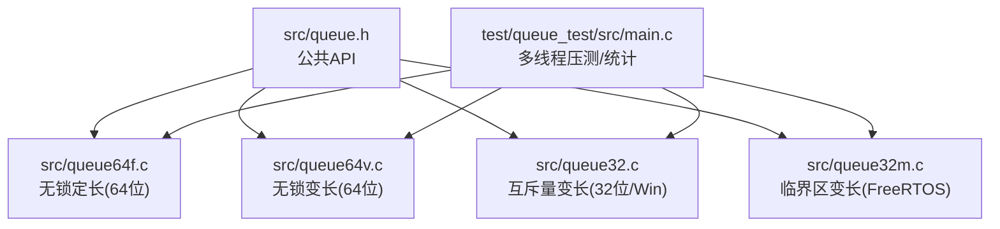
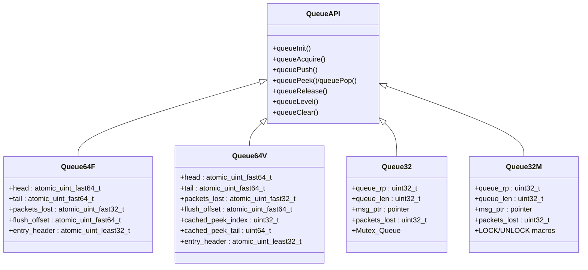
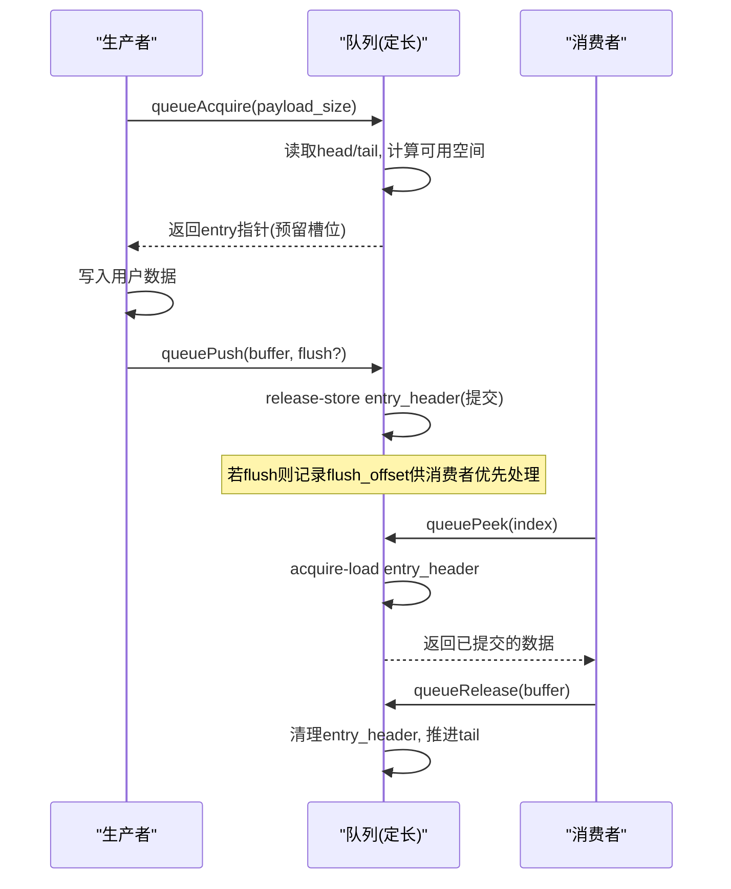
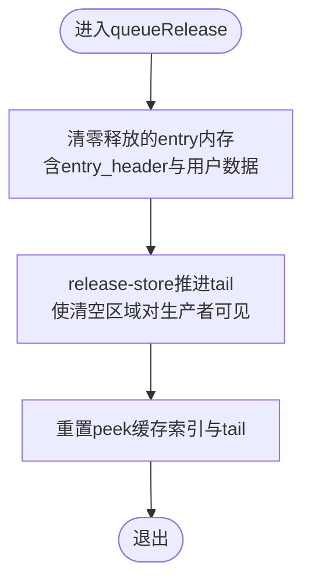
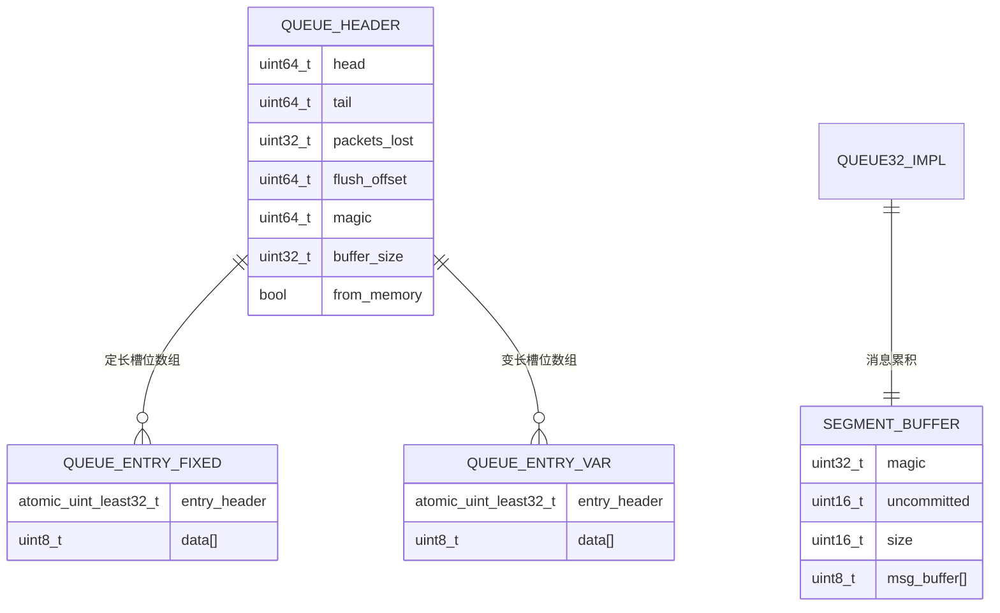
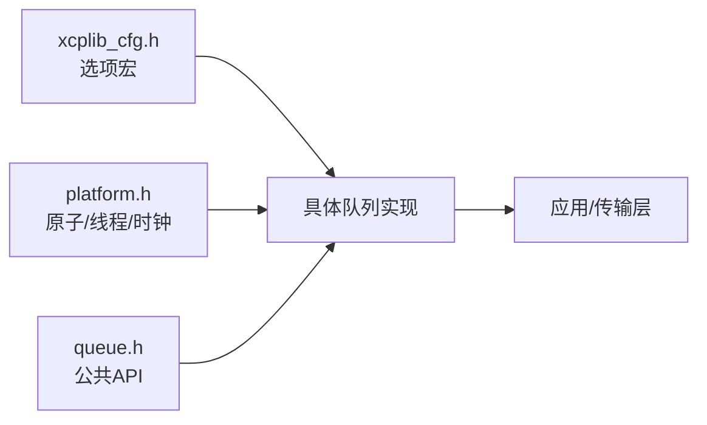

# 无锁队列算法

<cite>
**本文引用的文件**
- [src/queue.h](file://src/queue.h)
- [src/queue64f.c](file://src/queue64f.c)
- [src/queue64v.c](file://src/queue64v.c)
- [src/queue32.c](file://src/queue32.c)
- [src/queue32m.c](file://src/queue32m.c)
- [test/queue_test/src/main.c](file://test/queue_test/src/main.c)
</cite>

## 目录
1. [简介](#简介)
2. [项目结构](#项目结构)
3. [核心组件](#核心组件)
4. [架构总览](#架构总览)
5. [详细组件分析](#详细组件分析)
6. [依赖关系分析](#依赖关系分析)
7. [性能考量](#性能考量)
8. [故障排查指南](#故障排查指南)
9. [结论](#结论)
10. [附录](#附录)

## 简介
本文件系统性梳理 XCPlite 中的多种无锁队列实现，覆盖环形缓冲区、单生产者单消费者（实际为多生产者单消费者）队列与不同数据布局的变体。重点解释：
- CAS（Compare-And-Swap）在无锁队列中的应用与 ABA 问题处理策略
- 队列扩容策略、内存对齐优化与缓存友好性设计
- 不同实现的吞吐、延迟与资源占用特征
- 使用场景选择与性能调优实践

XCPlite 提供四类队列实现，按平台与配置选择：
- queue64v.c：通用、无锁、变长条目（64位平台）
- queue64f.c：通用、无锁、定长条目（64位平台）
- queue32.c：XCP 专用、基于互斥量的变长条目（32位/Windows/原子模拟）
- queue32m.c：FreeRTOS 目标上的 XCP 专用、临界区/互斥量变长条目

这些实现统一通过 src/queue.h 暴露 API，并在上层被 XCP 传输层等模块复用。

## 项目结构
- 公共接口定义在 src/queue.h，包含 tQueueBuffer、tQueueHandle 以及初始化、获取缓冲、提交、消费、释放、查询等函数原型。
- 具体实现位于 src/queue64f.c、src/queue64v.c、src/queue32.c、src/queue32m.c，分别对应不同平台与特性开关。
- 测试用例位于 test/queue_test/src/main.c，用于验证正确性与性能统计（如 acquire 耗时直方图、丢包计数、队列水位监控）。



图表来源
- [src/queue.h:1-187](file://src/queue.h#L1-L187)
- [src/queue64f.c:1-664](file://src/queue64f.c#L1-L664)
- [src/queue64v.c:1-662](file://src/queue64v.c#L1-L662)
- [src/queue32.c:1-420](file://src/queue32.c#L1-L420)
- [src/queue32m.c:1-466](file://src/queue32m.c#L1-L466)
- [test/queue_test/src/main.c:1-849](file://test/queue_test/src/main.c#L1-L849)

章节来源
- [src/queue.h:1-187](file://src/queue.h#L1-L187)
- [test/queue_test/src/main.c:1-849](file://test/queue_test/src/main.c#L1-L849)

## 核心组件
- 环形缓冲区与索引管理
  - 无锁实现使用 head/tail 两个原子计数器作为环形缓冲区的读写指针，通过 CAS 推进 head 以预留槽位，消费者通过 release 推进 tail 回收槽位。
  - 变长实现中，head 推进步长为“条目头+用户数据长度”，因此需要保证对齐与边界安全；定长实现步长固定，简化了计算与对齐约束。
- 条目状态与发布协议
  - 每个条目带有一个原子 entry_header，编码“提交状态”和“长度”。生产者先写入数据，再以 release-store 发布；消费者以 acquire-load 读取，确保可见性。
- 丢失与溢出检测
  - 当 head > tail 且剩余空间不足时，生产者无法分配槽位，计入 packets_lost；消费者可周期性读取该计数器进行告警或降级。
- 段聚合与消息累积
  - 32位实现将多个消息累积到一个 segment 中（UDP MTU 限制），减少系统调用与拷贝；64位无锁实现不直接支持段聚合，由上层 vectored IO 完成发送。

章节来源
- [src/queue64f.c:250-295](file://src/queue64f.c#L250-L295)
- [src/queue64v.c:216-261](file://src/queue64v.c#L216-L261)
- [src/queue32.c:37-84](file://src/queue32.c#L37-L84)
- [src/queue32m.c:33-80](file://src/queue32m.c#L33-L80)

## 架构总览
下图展示四种队列实现的职责分工与关键交互：



图表来源
- [src/queue.h:88-187](file://src/queue.h#L88-L187)
- [src/queue64f.c:250-295](file://src/queue64f.c#L250-L295)
- [src/queue64v.c:216-261](file://src/queue64v.c#L216-L261)
- [src/queue32.c:85-100](file://src/queue32.c#L85-L100)
- [src/queue32m.c:81-98](file://src/queue32m.c#L81-L98)

## 详细组件分析

### 无锁定长队列（queue64f.c）
- 设计要点
  - 每个槽位固定大小，entry_header 天然对齐，便于原子操作。
  - 生产者通过 CAS 推进 head 并写入数据，再以 release-store 设置 ENTRY_COMMITTED 与长度；消费者 acquire-load 检查提交状态后读取数据。
  - tail 默认仅作为容量元数据，采用 relaxed 顺序，避免额外同步开销；可选模式通过 OPTION_QUEUE_64_FIX_SIZE_SYNC_TAIL 切换为更严格的 tail 同步。
- ABA 问题
  - 由于 head/tail 是单调递增的计数器，不存在重用同一地址导致的 ABA 问题。
- 性能特征
  - 高并发下生产者侧无锁，CAS 失败会自旋重试；对 x86 强内存模型与 ARM 弱内存模型均有良好适配。
  - 适合小/中等负载、低延迟要求高的场景。



图表来源
- [src/queue64f.c:399-519](file://src/queue64f.c#L399-L519)
- [src/queue64f.c:557-660](file://src/queue64f.c#L557-L660)

章节来源
- [src/queue64f.c:15-43](file://src/queue64f.c#L15-L43)
- [src/queue64f.c:250-295](file://src/queue64f.c#L250-L295)
- [src/queue64f.c:399-519](file://src/queue64f.c#L399-L519)
- [src/queue64f.c:557-660](file://src/queue64f.c#L557-L660)

### 无锁变长队列（queue64v.c）
- 设计要点
  - 将队列缓冲区视为原始对齐存储，支持变长条目；消费者释放时将整块内存清零，再 release-store 推进 tail，使后续生产者能在已清空区域安全地保留新条目。
  - 引入 cached_peek_index/cached_peek_tail 加速连续 peek 路径。
- ABA 问题
  - 同样依靠单调递增的 head/tail 规避 ABA；但需注意释放时的 memset 与 tail 发布的顺序，确保生产者看到已清空的 header。
- 性能特征
  - 在高吞吐、中等载荷场景下表现良好；频繁 memset 会带来一定缓存一致性开销，需结合负载权衡。



图表来源
- [src/queue64v.c:640-658](file://src/queue64v.c#L640-L658)

章节来源
- [src/queue64v.c:15-34](file://src/queue64v.c#L15-L34)
- [src/queue64v.c:216-261](file://src/queue64v.c#L216-L261)
- [src/queue64v.c:366-485](file://src/queue64v.c#L366-L485)
- [src/queue64v.c:512-658](file://src/queue64v.c#L512-L658)

### 互斥量/临界区队列（queue32.c / queue32m.c）
- 设计要点
  - 多生产者单消费者，使用互斥量（POSIX）或临界区（FreeRTOS）保护共享状态。
  - 将多个消息累积到 segment（受 UDP MTU 限制），减少发送次数；消费者 pop 时遍历 segment 填充传输层计数器。
- 性能特征
  - 在 32 位平台或 Windows 上提供稳定可靠的实现；临界区路径开销极低，适合 RTOS 环境。
  - 段聚合带来更好的网络栈利用效率，但会增加首条消息的延迟。

```mermaid
sequenceDiagram
participant P as "生产者"
participant Q as "队列(32位)"
participant C as "消费者"
P->>Q : queueAcquire(payload_size)
Q->>Q : 加锁, 检查当前segment是否可容纳
Q-->>P : 返回payload指针(未提交)
P->>P : 写入数据
P->>Q : queuePush(buffer, flush?)
Q->>Q : 减uncommitted, 标记已提交; 必要时创建新segment
Note over Q : 高优先级flush可立即切分segment
C->>Q : queuePop(accumulate=true)
Q->>Q : 加锁, 取完整segment
Q->>Q : 遍历消息, 填充CTR
Q-->>C : 返回segment指针与长度
C->>Q : queueRelease(segment)
Q->>Q : 推进rp, 减少queue_len
```

图表来源
- [src/queue32.c:207-304](file://src/queue32.c#L207-L304)
- [src/queue32.c:333-417](file://src/queue32.c#L333-L417)
- [src/queue32m.c:275-361](file://src/queue32m.c#L275-L361)
- [src/queue32m.c:389-463](file://src/queue32m.c#L389-L463)

章节来源
- [src/queue32.c:1-420](file://src/queue32.c#L1-L420)
- [src/queue32m.c:1-466](file://src/queue32m.c#L1-L466)

### 环形缓冲区与内存布局
- 定长实现：每个槽位固定大小，entry_header 与数据紧挨，天然对齐，便于原子操作与缓存行对齐。
- 变长实现：头部预留 entry_header，数据紧随其后；释放时清零整个区域，确保后续生产者能安全 reuse。
- 32位实现：segment 内维护 uncommitted 计数与 size，消息头包含 dlc/ctr；消费者 pop 时填充 ctr。



图表来源
- [src/queue64f.c:250-295](file://src/queue64f.c#L250-L295)
- [src/queue64v.c:216-261](file://src/queue64v.c#L216-L261)
- [src/queue32.c:70-84](file://src/queue32.c#L70-L84)

章节来源
- [src/queue64f.c:250-295](file://src/queue64f.c#L250-L295)
- [src/queue64v.c:216-261](file://src/queue64v.c#L216-L261)
- [src/queue32.c:70-84](file://src/queue32.c#L70-L84)

## 依赖关系分析
- 平台抽象与原子支持
  - 64位无锁实现依赖 C11 atomics 与 64位平台；32位实现使用互斥量/临界区，兼容 Windows 与 FreeRTOS。
- 配置宏
  - OPTION_QUEUE_64_FIX_SIZE/OPTION_QUEUE_64_VAR_SIZE/OPTION_QUEUE_32 控制编译期选择；OPTION_ENABLE_DBG_PRINTS 控制调试输出。
- 上层集成
  - 通过 queue.h 暴露统一 API；XCP 传输层在 32位实现中直接消费 segment 并填充传输层计数器。



图表来源
- [src/queue.h:1-37](file://src/queue.h#L1-L37)
- [src/queue64f.c:45-50](file://src/queue64f.c#L45-L50)
- [src/queue64v.c:36-41](file://src/queue64v.c#L36-L41)
- [src/queue32.c:16-22](file://src/queue32.c#L16-L22)
- [src/queue32m.c:16-21](file://src/queue32m.c#L16-L21)

章节来源
- [src/queue.h:1-37](file://src/queue.h#L1-L37)
- [src/queue64f.c:45-50](file://src/queue64f.c#L45-L50)
- [src/queue64v.c:36-41](file://src/queue64v.c#L36-L41)
- [src/queue32.c:16-22](file://src/queue32.c#L16-L22)
- [src/queue32m.c:16-21](file://src/queue32m.c#L16-L21)

## 性能考量
- 吞吐与延迟
  - 无锁定长（queue64f）：生产者无锁，CAS 自旋，低延迟、高吞吐；适合大量小/中等数据包。
  - 无锁变长（queue64v）：灵活但释放时需 memset，存在缓存一致性开销；适合变长数据、中等吞吐。
  - 32位实现（queue32/32m）：段聚合降低发送次数，提升整体吞吐；但首条消息延迟略增。
- 资源占用
  - 定长实现因固定槽位，内存利用率较高；变长实现需预留最大条目空间与对齐余量。
  - 32位实现维护 segment 数组与未提交计数，内存占用随 segment 数量增长。
- 内存对齐与缓存友好性
  - 所有实现均按 CACHE_LINE_SIZE 对齐队列头与条目，避免伪共享；变长实现确保 entry_header 对齐以满足原子访问。
- 扩容策略
  - 无锁实现通过 head/tail 环形缓冲自然“扩容”至 buffer_size；超出即丢包（packets_lost 增加）。
  - 32位实现通过 segment 数组循环复用；满时丢弃新消息并计数。
- 实测参考
  - 测试程序提供 acquire 耗时直方图、丢包统计、队列水位监控，可用于评估不同实现在不同负载下的表现。

章节来源
- [test/queue_test/src/main.c:40-96](file://test/queue_test/src/main.c#L40-L96)
- [test/queue_test/src/main.c:105-210](file://test/queue_test/src/main.c#L105-L210)
- [test/queue_test/src/main.c:519-849](file://test/queue_test/src/main.c#L519-L849)

## 故障排查指南
- 常见问题
  - 队列满导致丢包：检查 packets_lost 计数与队列水位；适当增大队列容量或降低生产速率。
  - 数据损坏或对齐错误：确认 payload 对齐与用户头空间；检查断言与日志。
  - 消费者停滞：检查是否有生产者预留条目但未提交；可考虑超时机制或健康检查。
- 定位方法
  - 启用调试打印（OPTION_ENABLE_DBG_PRINTS），观察 acquire/push/pop/release 流程。
  - 使用测试程序的直方图与统计信息，识别瓶颈与异常峰值。
- 恢复策略
  - 发生严重不一致时，调用 queueClear 重置队列；或在检测到消费者崩溃时重建队列。

章节来源
- [src/queue64f.c:478-487](file://src/queue64f.c#L478-L487)
- [src/queue64v.c:446-456](file://src/queue64v.c#L446-L456)
- [src/queue32.c:260-264](file://src/queue32.c#L260-L264)
- [src/queue32m.c:319-321](file://src/queue32m.c#L319-L321)
- [test/queue_test/src/main.c:783-792](file://test/queue_test/src/main.c#L783-L792)

## 结论
XCPlite 提供了面向不同平台与负载特征的多种队列实现：
- 64位无锁定长/变长实现适用于高性能、低延迟场景，具备优秀的可扩展性与跨内存模型兼容性。
- 32位实现通过段聚合与互斥/临界区保障稳定性，适合嵌入式与 RTOS 环境。
- 通过合理的内存对齐、缓存行隔离与原子序语义，实现了高效的数据通路；同时提供丢包计数与调试工具辅助排障。
建议根据业务需求选择合适实现，并结合测试程序进行性能调优与容量规划。

## 附录
- 使用建议
  - 高吞吐、小/中等载荷：优先选择 queue64f；若载荷变化大，选择 queue64v。
  - 嵌入式/RTOS：选择 queue32m；通用 32 位平台选择 queue32。
  - 关注 packets_lost 与队列水位，合理设置队列容量与生产速率。
- 性能调优
  - 调整 payload 对齐与最大条目大小，平衡内存与吞吐。
  - 在高竞争环境下，评估 OPTION_QUEUE_64_FIX_SIZE_SYNC_TAIL 的影响。
  - 使用测试程序采集直方图与丢包率，定位热点路径。