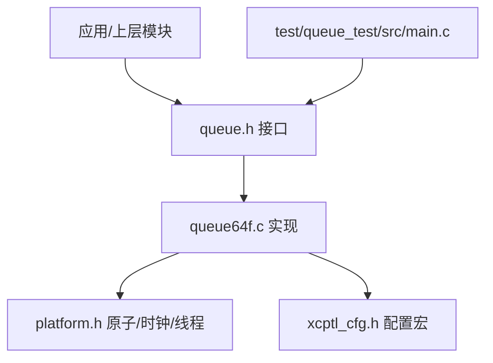
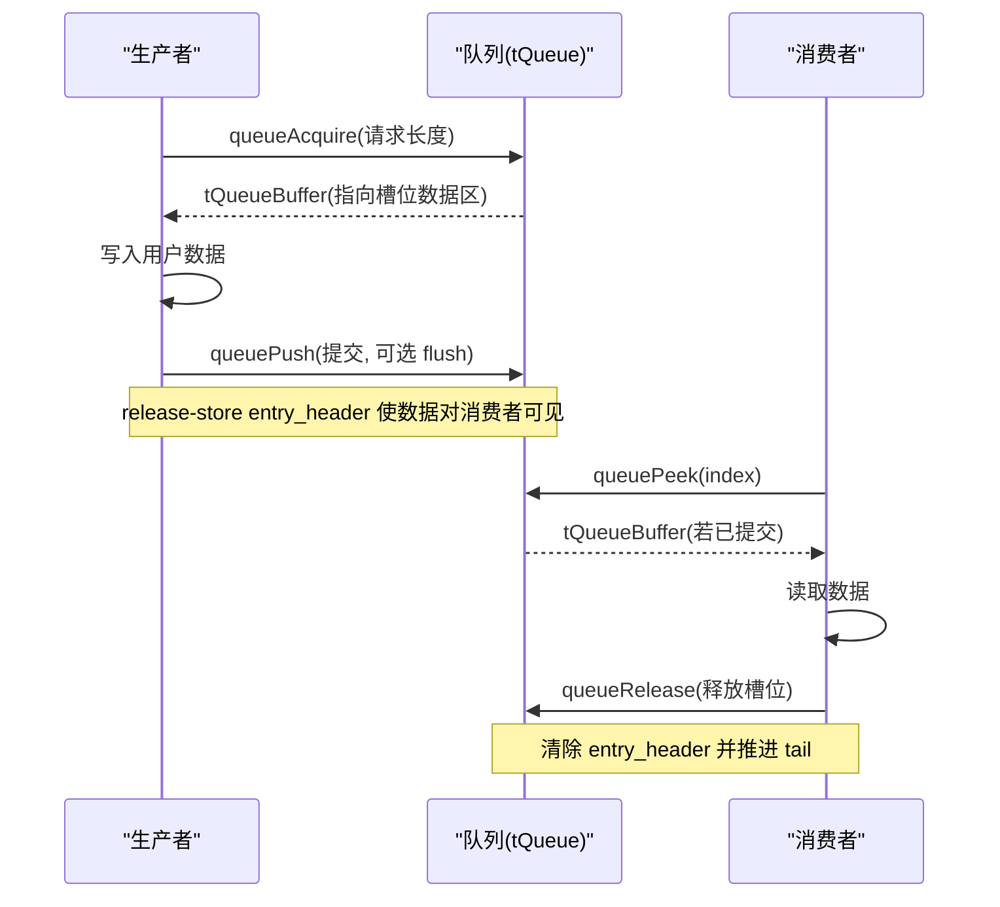
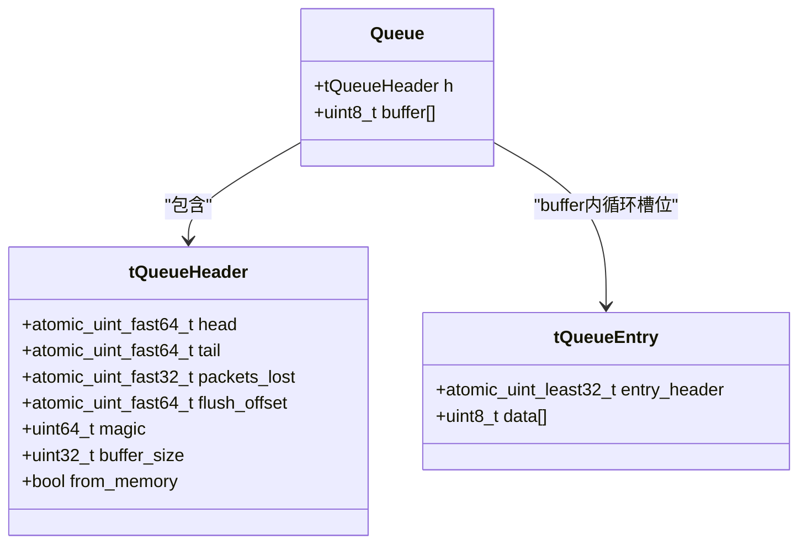
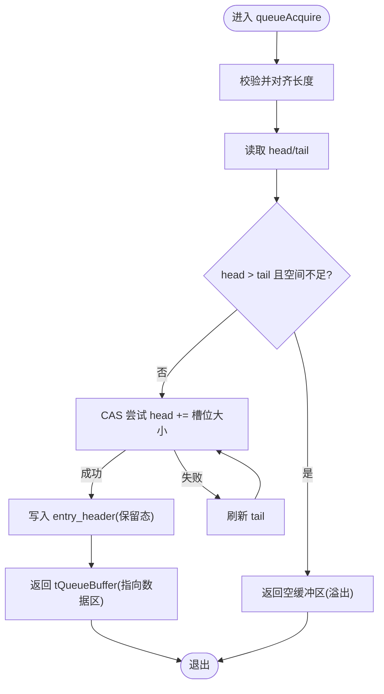
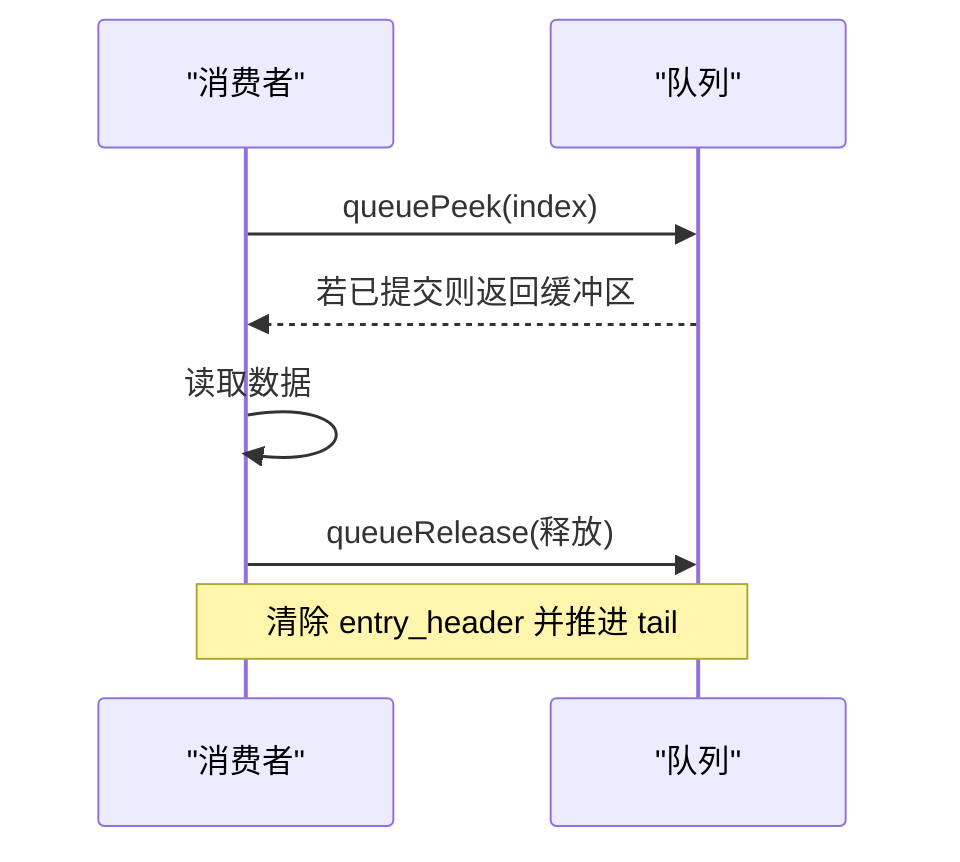
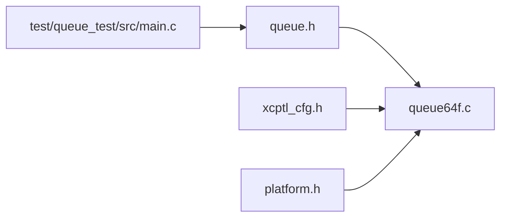

# 环形缓冲区队列实现

<cite>
**本文引用的文件**
- [src/queue64f.c](file://src/queue64f.c)
- [src/queue.h](file://src/queue.h)
- [src/xcptl_cfg.h](file://src/xcptl_cfg.h)
- [src/platform.h](file://src/platform.h)
- [test/queue_test/src/main.c](file://test/queue_test/src/main.c)
</cite>

## 目录
1. [简介](#简介)
2. [项目结构](#项目结构)
3. [核心组件](#核心组件)
4. [架构总览](#架构总览)
5. [详细组件分析](#详细组件分析)
6. [依赖关系分析](#依赖关系分析)
7. [性能考量](#性能考量)
8. [故障排查指南](#故障排查指南)
9. [结论](#结论)
10. [附录](#附录)

## 简介
本文件深入解析 XCPlite 中基于环形缓冲区的固定大小队列实现（queue64f.c），重点说明其无锁多生产者单消费者（MPSC）设计、头尾指针的原子操作与内存屏障策略、缓存友好性布局，以及溢出处理机制。同时解释固定大小队列的优势：确定性内存分配、零拷贝数据传输、高效内存布局；并给出使用场景分析与性能调优建议，帮助开发者在合适时机选择该队列并进行最佳配置。

## 项目结构
- queue64f.c：固定大小、无锁环形队列的核心实现，提供初始化、清理、生产者/消费者 API。
- queue.h：通用队列接口定义与参数宏（如最大消息大小、对齐方式等）。
- xcptl_cfg.h：传输层相关配置，影响队列条目大小与对齐。
- platform.h：平台抽象（原子、时钟、线程等），为队列提供跨平台能力。
- test/queue_test/src/main.c：队列测试程序，演示多线程生产/消费与 peek/release 流程。

图表来源
- [src/queue64f.c:250-295](file://src/queue64f.c#L250-L295)
- [src/queue.h:88-187](file://src/queue.h#L88-L187)
- [src/xcptl_cfg.h:44-59](file://src/xcptl_cfg.h#L44-L59)
- [src/platform.h:177-197](file://src/platform.h#L177-L197)

章节来源
- [src/queue64f.c:1-140](file://src/queue64f.c#L1-L140)
- [src/queue.h:1-87](file://src/queue.h#L1-L87)
- [src/xcptl_cfg.h:1-143](file://src/xcptl_cfg.h#L1-L143)
- [src/platform.h:1-200](file://src/platform.h#L1-L200)

## 核心组件
- tQueueEntry：每个槽位包含一个原子 entry_header（状态+长度）和紧随其后的用户数据区。固定大小使得每个槽位天然对齐且可预测。
- tQueueHeader：队列元数据（head/tail/packets_lost/flush_offset 等），按缓存行对齐以减少伪共享。
- Queue：由 tQueueHeader 与连续 buffer[] 组成，buffer 内以固定大小的 tQueueEntry 顺序排列形成环形。
- 生产者 API：queueAcquire（预留槽位）、queuePush（提交数据）。
- 消费者 API：queuePeek（查看指定索引的数据）、queueRelease（释放槽位）、queueLevel（估算队列深度）。

章节来源
- [src/queue64f.c:250-295](file://src/queue64f.c#L250-L295)
- [src/queue.h:122-187](file://src/queue.h#L122-L187)

## 架构总览
固定大小环形队列采用“每槽位原子头 + 用户数据”的布局，生产者通过 CAS 竞争 head 来预留槽位，写入后以 release-store 发布；消费者通过 acquire-load 读取 entry_header 确认数据可见后再读取 payload，最后释放槽位并推进 tail。

图表来源
- [src/queue64f.c:399-519](file://src/queue64f.c#L399-L519)
- [src/queue64f.c:557-660](file://src/queue64f.c#L557-L660)

## 详细组件分析

### 数据结构与内存布局
- 每个槽位以 atomic_uint_least32_t 作为 entry_header，高字表示提交状态（初始为0或 ENTRY_COMMITTED），低字表示用户载荷长度。
- 槽位大小固定为 QUEUE_ENTRY_SIZE = 用户头 + 用户载荷 + 4字节 entry_header，且要求按缓存行对齐以提升性能。
- tQueueHeader 包含 head/tail/packets_lost/flush_offset 等共享状态，整体按 CACHE_LINE_SIZE 对齐，避免与槽位数据争用同一缓存行。

图表来源
- [src/queue64f.c:250-295](file://src/queue64f.c#L250-L295)

章节来源
- [src/queue64f.c:250-295](file://src/queue64f.c#L250-L295)
- [src/xcptl_cfg.h:44-59](file://src/xcptl_cfg.h#L44-L59)

### 初始化与缓冲区管理
- queueInitFromMemory：支持从用户提供的内存创建队列或内部分配。内部会计算对齐后的缓冲区大小，确保是 QUEUE_ENTRY_SIZE 的整数倍，并设置 magic、buffer_size、from_memory 等。
- queueClear：重置 head/tail/packets_lost/flush_offset 为初始值，并将每个槽位的 entry_header 置零、数据区清零。
- queueDeinit：统计输出（可选）、清理队列、释放内部分配的内存（若非用户内存）。

章节来源
- [src/queue64f.c:299-391](file://src/queue64f.c#L299-L391)

### 生产者路径：CAS 与发布语义
- queueAcquire：
  - 校验请求长度并向上对齐到 QUEUE_PAYLOAD_SIZE_ALIGNMENT。
  - 读取当前 head/tail，检查是否溢出（head > tail 且剩余空间不足）。
  - 使用 compare_exchange_weak_explicit 尝试将 head 增加一个槽位大小，成功则定位到对应槽位。
  - 将 entry_len 写入 entry_header（release-store），但此时状态仍为保留态（未提交）。
- queuePush：
  - 根据返回的 tQueueBuffer 反向定位到槽位，设置 flush_offset（可选）。
  - 将 entry_header 设置为“已提交 + 完整长度”，使用 memory_order_release，保证数据写入对消费者可见。

图表来源
- [src/queue64f.c:399-494](file://src/queue64f.c#L399-L494)

章节来源
- [src/queue64f.c:399-494](file://src/queue64f.c#L399-L494)

### 消费者路径：获取与释放
- queuePeek：
  - 可选地交换并返回 packets_lost。
  - 根据 index 计算目标槽位地址，读取 entry_header（acquire-load）。
  - 若状态为“已提交”且长度合法，则返回指向用户头的缓冲区；否则返回空。
  - 可选检测 flush_requested（比较 flush_offset）。
- queueRelease：
  - 将 entry_header 置零（默认 relaxed 或可选 release 模式），然后以 release 语义推进 tail。
  - 注意：默认方案中 tail 仅用于容量信息，不承载数据可见性排序；数据可见性由 entry_header 的 acquire/release 保障。

图表来源
- [src/queue64f.c:557-660](file://src/queue64f.c#L557-L660)

章节来源
- [src/queue64f.c:557-660](file://src/queue64f.c#L557-L660)

### 原子操作与内存屏障
- 头尾指针：
  - head：生产者通过 CAS 推进，消费者只读。
  - tail：消费者推进，生产者仅读取（默认 relaxed 加载，除非启用 OPTION_QUEUE_64_FIX_SIZE_SYNC_TAIL）。
- 槽位状态：
  - 生产者写入 entry_header 时使用 release-store，消费者使用 acquire-load 读取，确保数据写入的可见性与顺序。
- 溢出计数：packets_lost 使用 fetch_add 原子递增，消费者通过 exchange 清零并上报。
- 内存模型：
  - 默认方案：entry_header 承担数据可见性排序，tail 仅用于容量信息，减少共享缓存行争用。
  - 可选方案（OPTION_QUEUE_64_FIX_SIZE_SYNC_TAIL）：将 tail 更新设为 release，消费者 acquire 加载 tail，从而把容量发布与数据发布解耦。

章节来源
- [src/queue64f.c:85-93](file://src/queue64f.c#L85-L93)
- [src/queue64f.c:433-459](file://src/queue64f.c#L433-L459)
- [src/queue64f.c:590-660](file://src/queue64f.c#L590-L660)

### 缓存友好性设计
- 槽位大小按缓存行对齐（QUEUE_ENTRY_SIZE % CACHE_LINE_SIZE == 0），减少伪共享。
- tQueueHeader 整体按缓存行对齐，避免与槽位数据共享同一缓存行。
- 消费者侧尽量使用 relaxed 访问非关键路径变量，降低内存屏障开销。

章节来源
- [src/queue64f.c:77-84](file://src/queue64f.c#L77-L84)
- [src/queue64f.c:271-288](file://src/queue64f.c#L271-L288)

### 溢出处理机制
- 生产者检测到 head > tail 且剩余空间不足以容纳新槽位时，视为溢出，返回空缓冲区，并递增 packets_lost。
- 消费者可通过 queuePeek 的 packets_lost 参数获取自上次调用以来的丢失计数。

章节来源
- [src/queue64f.c:439-487](file://src/queue64f.c#L439-L487)
- [src/queue64f.c:557-568](file://src/queue64f.c#L557-L568)

### CAS 应用与 ABA 问题
- 使用 compare_exchange_weak_explicit 进行 head 的 CAS 推进，弱版本允许虚假失败，通过循环重试保证正确性。
- ABA 问题：由于 head 是单调递增的计数器，不会出现旧值被重用导致的 ABA 问题；即使发生回绕，只要增量一致且比较的是期望值，逻辑仍然安全。
- 性能优化技巧：
  - 使用 weak CAS 减少不必要的强 CAS 开销。
  - 仅在必要时刷新 tail，避免频繁内存屏障。
  - 合理设置队列大小与对齐，减少缓存冲突。

章节来源
- [src/queue64f.c:436-459](file://src/queue64f.c#L436-L459)

### 固定大小队列的优势
- 确定性内存分配：所有槽位大小固定，无需动态分配/释放，避免碎片化。
- 零拷贝数据传输：生产者直接写入槽位数据区，消费者直接读取，无需额外拷贝。
- 高效内存布局：连续 buffer + 固定槽位，提升缓存局部性；配合缓存行对齐进一步优化。

章节来源
- [src/queue64f.c:15-43](file://src/queue64f.c#L15-L43)
- [src/xcptl_cfg.h:44-59](file://src/xcptl_cfg.h#L44-L59)

## 依赖关系分析
- queue64f.c 依赖 queue.h 中的公共接口与配置宏。
- 依赖 xcptl_cfg.h 中的最大 DTO 大小、对齐方式等，决定槽位大小与性能特性。
- 依赖 platform.h 提供原子操作、时钟、线程等跨平台能力。
- 测试程序通过 queue.h 接口使用队列，验证多线程并发行为。

图表来源
- [src/queue64f.c:45-52](file://src/queue64f.c#L45-L52)
- [src/queue.h:29-55](file://src/queue.h#L29-L55)
- [src/platform.h:177-197](file://src/platform.h#L177-L197)
- [test/queue_test/src/main.c:37-38](file://test/queue_test/src/main.c#L37-L38)

章节来源
- [src/queue64f.c:45-52](file://src/queue64f.c#L45-L52)
- [src/queue.h:29-55](file://src/queue.h#L29-L55)
- [src/platform.h:177-197](file://src/platform.h#L177-L197)
- [test/queue_test/src/main.c:37-38](file://test/queue_test/src/main.c#L37-L38)

## 性能考量
- 对齐与缓存行：确保 QUEUE_ENTRY_SIZE 为缓存行倍数，减少伪共享；tQueueHeader 单独占一行。
- 原子操作强度：默认方案中 tail 使用 relaxed 访问，降低内存屏障成本；数据可见性由 entry_header 的 acquire/release 保证。
- 溢出与背压：在高负载下，生产者可能频繁遇到溢出，应结合业务调整消费速率或增大队列容量。
- 测量与统计：测试代码提供了获取锁时间直方图与自旋次数统计的能力，可用于性能调优。

章节来源
- [src/queue64f.c:77-93](file://src/queue64f.c#L77-L93)
- [src/queue64f.c:141-247](file://src/queue64f.c#L141-L247)
- [test/queue_test/src/main.c:105-210](file://test/queue_test/src/main.c#L105-L210)

## 故障排查指南
- 入参校验：queueAcquire 会校验 packet_len 范围，非法值直接返回空缓冲区。
- 一致性检查：queuePeek 对 entry_header 的状态与长度进行断言，不一致将触发错误日志与断言。
- 溢出监控：通过 packets_lost 统计丢失包数，定位生产/消费不平衡。
- 调试开关：启用 OPTION_ENABLE_DBG_PRINTS 可获得更详细的日志；测试模式下可开启锁时间统计。

章节来源
- [src/queue64f.c:404-411](file://src/queue64f.c#L404-L411)
- [src/queue64f.c:590-622](file://src/queue64f.c#L590-L622)
- [src/queue64f.c:557-568](file://src/queue64f.c#L557-L568)
- [src/queue64f.c:62-73](file://src/queue64f.c#L62-L73)

## 结论
XCPlite 的固定大小环形队列（queue64f.c）通过每槽位原子头、严格的内存序控制与缓存友好的布局，实现了高性能的 MPSC 无锁队列。其优势在于确定性内存分配、零拷贝数据传输与高效的内存布局。在生产环境中，建议根据业务负载合理设置队列大小与对齐，利用 packets_lost 监控溢出，并结合测试工具进行性能调优。对于需要严格同步的场景，可考虑启用 OPTION_QUEUE_64_FIX_SIZE_SYNC_TAIL 以调整 tail 的同步策略。

## 附录
- 使用示例：参考 test/queue_test/src/main.c，演示多线程生产/消费、peek/release 流程与统计。
- 配置项：通过 xcptl_cfg.h 调整最大 DTO 大小与对齐，影响槽位大小与性能。
- 平台支持：platform.h 提供跨平台原子、时钟、线程抽象，确保在不同平台上的一致行为。

章节来源
- [test/queue_test/src/main.c:355-435](file://test/queue_test/src/main.c#L355-L435)
- [src/xcptl_cfg.h:44-59](file://src/xcptl_cfg.h#L44-L59)
- [src/platform.h:177-197](file://src/platform.h#L177-L197)