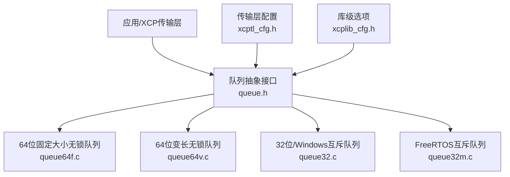
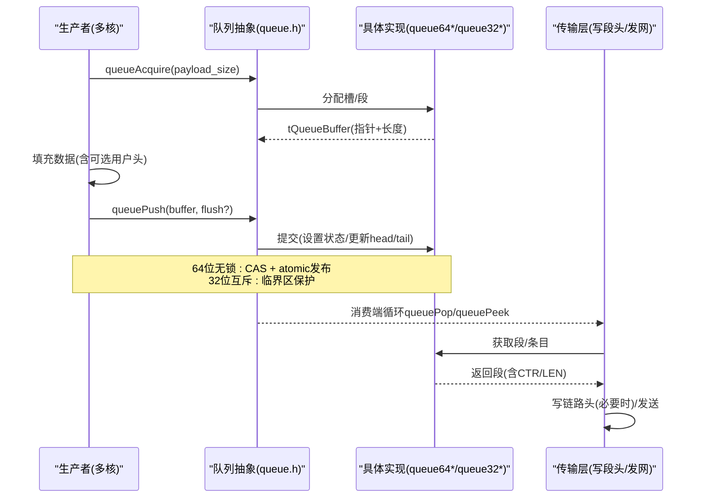
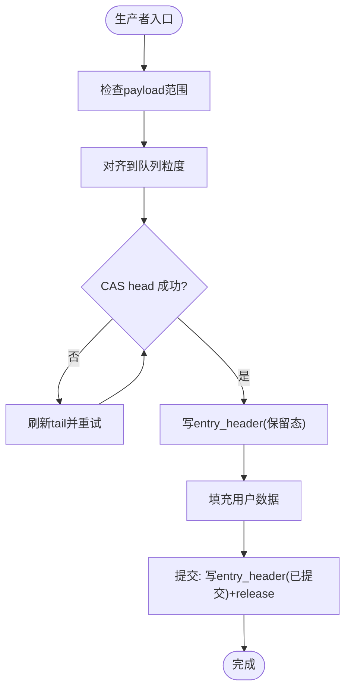
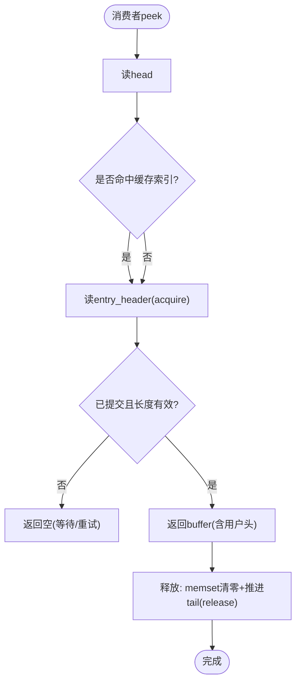
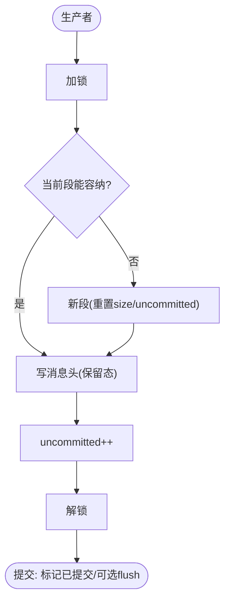
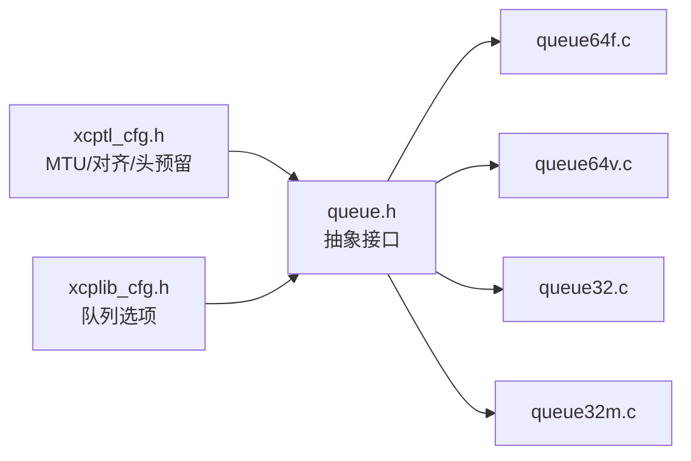

# 队列性能分析与优化

<cite>
**本文引用的文件**
- [queue.h](file://src/queue.h)
- [queue64f.c](file://src/queue64f.c)
- [queue64v.c](file://src/queue64v.c)
- [queue32.c](file://src/queue32.c)
- [queue32m.c](file://src/queue32m.c)
- [xcptl_cfg.h](file://src/xcptl_cfg.h)
- [xcplib_cfg.h](file://src/xcplib_cfg.h)
- [TECHNICAL.md](file://docs/TECHNICAL.md)
- [main.c（队列测试）](file://test/queue_test/src/main.c)
</cite>

## 目录
1. [简介](#简介)
2. [项目结构](#项目结构)
3. [核心组件](#核心组件)
4. [架构总览](#架构总览)
5. [详细组件分析](#详细组件分析)
6. [依赖关系分析](#依赖关系分析)
7. [性能考量与调优](#性能考量与调优)
8. [故障排查指南](#故障排查指南)
9. [结论](#结论)
10. [附录](#附录)

## 简介
本文面向XCPlite中传输层队列的四种实现，系统比较环形缓冲区队列、变长无锁队列、固定大小无锁队列以及互斥锁队列在不同负载下的吞吐、延迟和资源占用特征。重点解析配置参数（缓冲区大小、对齐方式、消息累积策略）对性能的影响，阐述缓存友好性设计（内存局部性、伪共享避免、NUMA感知），并给出跨平台调优建议、基准测试方法与监控工具使用指南，最后总结在XCP协议栈中的角色与优化建议。

## 项目结构
XCPlite通过统一的队列抽象接口暴露给上层传输层，底层根据平台与编译选项选择具体实现：
- 通用API定义：src/queue.h
- 64位固定大小无锁队列：src/queue64f.c
- 64位变长无锁队列：src/queue64v.c
- 32位/Windows互斥队列（段累积）：src/queue32.c
- FreeRTOS目标互斥队列（段累积）：src/queue32m.c
- 传输层配置（MTU、对齐、头预留等）：src/xcptl_cfg.h
- 库级编译选项（默认启用64位变长队列，或切换为固定大小/32位互斥）：src/xcplib_cfg.h
- 技术文档与资源消耗说明：docs/TECHNICAL.md
- 队列基准测试程序：test/queue_test/src/main.c

**图表来源**
- [queue.h:1-187](file://src/queue.h#L1-L187)
- [xcptl_cfg.h:1-143](file://src/xcptl_cfg.h#L1-L143)
- [xcplib_cfg.h:140-162](file://src/xcplib_cfg.h#L140-L162)

**章节来源**
- [queue.h:1-187](file://src/queue.h#L1-L187)
- [xcptl_cfg.h:1-143](file://src/xcptl_cfg.h#L1-L143)
- [xcplib_cfg.h:140-162](file://src/xcplib_cfg.h#L140-L162)

## 核心组件
- 统一队列接口：提供初始化、获取缓冲、提交、弹出/窥视、释放、清空、水位查询等API，屏蔽底层差异。
- 64位固定大小无锁队列：每槽包含原子头部，生产者CAS申请槽位，消费者按索引读取；适合高并发、低延迟场景。
- 64位变长无锁队列：支持变长条目，消费者释放时清零已用区域以保障后续生产者可见性；兼顾灵活性与性能。
- 32位/Windows互斥队列：基于互斥量保护，支持将多条消息累积为一个段（UDP payload/帧），减少发送开销。
- FreeRTOS互斥队列：针对嵌入式平台优化，使用临界区/任务临界段，支持非缓存SRAM放置以避免DMA一致性开销。

关键配置项：
- 最大DTO大小、段大小、包对齐、用户头预留空间、段头预留空间等由xcptl_cfg.h定义。
- 默认启用64位变长队列，可切换为固定大小或32位互斥队列。

**章节来源**
- [queue.h:29-82](file://src/queue.h#L29-L82)
- [xcptl_cfg.h:37-114](file://src/xcptl_cfg.h#L37-L114)
- [xcplib_cfg.h:143-162](file://src/xcplib_cfg.h#L143-L162)

## 架构总览
队列在XCP传输层中的作用：
- 解耦生产端（DAQ/事件触发）与消费端（网络发送）。
- 在高吞吐下聚合消息成段，降低系统调用与协议头写入次数。
- 提供溢出统计与优先级刷新机制，辅助拥塞控制与实时性保障。

**图表来源**
- [queue.h:122-176](file://src/queue.h#L122-L176)
- [queue64f.c:399-519](file://src/queue64f.c#L399-L519)
- [queue64v.c:366-485](file://src/queue64v.c#L366-L485)
- [queue32.c:207-304](file://src/queue32.c#L207-L304)
- [queue32m.c:275-361](file://src/queue32m.c#L275-L361)

## 详细组件分析

### 64位固定大小无锁队列（queue64f.c）
- 设计要点
  - 每个槽固定大小，包含atomic entry_header（状态+长度），便于快速发布/消费。
  - 头信息位于独立缓存行，避免伪共享；尾部仅用于容量元数据，不承载强排序。
  - 支持flush_offset提示消费者优先处理特定条目。
- 性能特征
  - 生产者侧无锁CAS，极低延迟；适合高并发多生产者。
  - 固定大小带来更好的内存局部性和更少的内存碎片。
  - 若payload远小于槽大小，存在一定浪费；可通过调整XCPTL_MAX_DTO_SIZE平衡。
- 关键路径
  - 申请：读tail/head，CAS head，写entry_header（release）。
  - 提交：写entry_header（release），可选设置flush_offset。
  - 消费：按index peek，acquire加载entry_header，校验后释放并推进tail。

**图表来源**
- [queue64f.c:399-519](file://src/queue64f.c#L399-L519)

**章节来源**
- [queue64f.c:77-136](file://src/queue64f.c#L77-L136)
- [queue64f.c:252-294](file://src/queue64f.c#L252-L294)
- [queue64f.c:399-519](file://src/queue64f.c#L399-L519)

### 64位变长无锁队列（queue64v.c）
- 设计要点
  - 变长条目，消费者释放时将整块内存清零，保证后续生产者看到一致的“零”状态。
  - 使用cached_peek_index/cached_peek_tail加速顺序peek。
  - 同样支持flush_offset提示。
- 性能特征
  - 灵活性高，适配不同大小的XCP DTO。
  - 释放时的memset会带来额外写放大；在大payload高频场景下可能不如固定大小队列。
  - 适合中等吞吐、payload变化较大的场景。
- 关键路径
  - 申请：读tail(acquire)与head，CAS head，写entry_header（保留态）。
  - 提交：写entry_header（已提交）+release。
  - 消费：顺序peek，命中后返回；释放时清零并推进tail。

**图表来源**
- [queue64v.c:512-658](file://src/queue64v.c#L512-L658)

**章节来源**
- [queue64v.c:16-34](file://src/queue64v.c#L16-L34)
- [queue64v.c:216-261](file://src/queue64v.c#L216-L261)
- [queue64v.c:366-485](file://src/queue64v.c#L366-L485)
- [queue64v.c:512-658](file://src/queue64v.c#L512-L658)

### 32位/Windows互斥队列（queue32.c）
- 设计要点
  - 基于互斥量保护，支持消息累积为段（segment），减少发送次数。
  - 段内每条消息携带传输层头（ctr+len），pop时批量填充ctr。
  - 支持段头预留空间（如原始以太网链路头），避免拷贝。
- 性能特征
  - 互斥锁引入上下文切换与同步开销，但段累积显著降低系统调用与协议头写入成本。
  - 适合需要聚合发送的场景（如UDP MTU限制下的打包）。
- 关键路径
  - 申请：加锁，判断当前段剩余空间，不足则新段；写消息头（保留态）。
  - 提交：减未提交计数，标记已提交；必要时触发flush新建段。
  - 消费：加锁，取完整段，遍历填充ctr，返回段；释放推进读指针。

**图表来源**
- [queue32.c:104-126](file://src/queue32.c#L104-L126)
- [queue32.c:207-304](file://src/queue32.c#L207-L304)
- [queue32.c:333-417](file://src/queue32.c#L333-L417)

**章节来源**
- [queue32.c:37-84](file://src/queue32.c#L37-L84)
- [queue32.c:146-183](file://src/queue32.c#L146-L183)
- [queue32.c:207-304](file://src/queue32.c#L207-L304)
- [queue32.c:333-417](file://src/queue32.c#L333-L417)

### FreeRTOS互斥队列（queue32m.c）
- 设计要点
  - 使用任务临界段（taskENTER_CRITICAL）或ESP平台专用mux，避免中断重入与调度开销。
  - 支持将队列头部放DTCM、段缓冲放非缓存AXI SRAM，消除DMA一致性维护。
- 性能特征
  - 临界段极短，适合实时性要求高的嵌入式环境。
  - 非缓存SRAM避免cache清洗/失效，降低TX/RX路径抖动。
- 关键路径
  - 与queue32.c类似，但锁原语替换为平台临界段；段累积逻辑一致。

**章节来源**
- [queue32m.c:100-150](file://src/queue32m.c#L100-L150)
- [queue32m.c:155-177](file://src/queue32m.c#L155-L177)
- [queue32m.c:217-257](file://src/queue32m.c#L217-L257)
- [queue32m.c:275-361](file://src/queue32m.c#L275-L361)
- [queue32m.c:389-463](file://src/queue32m.c#L389-L463)

## 依赖关系分析
- 配置依赖
  - xcptl_cfg.h定义MTU、对齐、头预留、最大DTO/段大小等，直接影响队列布局与累积策略。
  - xcplib_cfg.h决定启用哪种队列实现（默认64位变长，可切换固定大小或32位互斥）。
- 运行时依赖
  - 64位无锁队列依赖C11原子与64位平台；32位/Windows使用互斥/临界段。
  - 原始以太网传输需32位互斥队列以支持段头预留。

**图表来源**
- [xcptl_cfg.h:37-114](file://src/xcptl_cfg.h#L37-L114)
- [xcplib_cfg.h:143-162](file://src/xcplib_cfg.h#L143-L162)
- [queue.h:1-187](file://src/queue.h#L1-L187)

**章节来源**
- [xcptl_cfg.h:37-114](file://src/xcptl_cfg.h#L37-L114)
- [xcplib_cfg.h:143-162](file://src/xcplib_cfg.h#L143-L162)

## 性能考量与调优

### 吞吐量、延迟与资源占用对比
- 64位固定大小无锁队列
  - 吞吐：极高（无锁CAS，固定槽布局）
  - 延迟：极低（无互斥，缓存友好）
  - 资源：内存利用率取决于payload与槽大小匹配度；可通过调整XCPTL_MAX_DTO_SIZE优化
- 64位变长无锁队列
  - 吞吐：高（无锁，但释放时需memset）
  - 延迟：低（无互斥，顺序peek有缓存优化）
  - 资源：灵活，但大payload高频时写放大明显
- 32位/Windows互斥队列
  - 吞吐：中高（段累积减少发送）
  - 延迟：受互斥影响，但累积可降低整体延迟
  - 资源：段缓冲集中，利于链路头预留给零拷贝
- FreeRTOS互斥队列
  - 吞吐：中高（临界段短）
  - 延迟：稳定（非缓存SRAM避免抖动）
  - 资源：DTCM/非缓存SRAM布局降低DMA一致性开销

### 配置参数对性能的影响
- 缓冲区大小
  - 应至少覆盖预期峰值流量的10ms以上，避免频繁溢出；测试中QUEUE_SIZE可调。
- 对齐方式
  - QUEUE_PAYLOAD_SIZE_ALIGNMENT必须为2的幂；64位队列要求4字节对齐以满足原子头部对齐。
- 消息累积策略
  - 32位队列支持段累积，减少系统调用与协议头写入；64位队列依赖向量发送路径，不进行段累积。
- 段头预留
  - 原始以太网传输需预留链路头空间，避免拷贝；仅在32位队列生效。

### 缓存友好性设计
- 内存局部性
  - 固定大小队列槽连续布局，提升预取效率；变长队列通过aligned_alloc与边界预留保证对齐。
- 伪共享避免
  - 队列头与热点字段按缓存行对齐；64位队列头占满一个缓存行，减少跨核争用。
- NUMA感知
  - 通过aligned_alloc与显式对齐，尽量使队列数据落在本地节点；嵌入式平台通过非缓存SRAM/DTCM规避一致性问题。

### 平台调优技巧
- 编译器优化
  - 使用-O2/-O3，开启内联与循环展开；关闭调试打印以减少分支与IO开销。
- 硬件特性利用
  - 64位平台启用C11原子；ARM/x86利用缓存行对齐与prefetch。
- 系统调用最小化
  - 使用段累积减少send/sendto调用；Linux上优先使用CLOCK_MONOTONIC_RAW进行计时，避免syscall开销。

### 基准测试与监控
- 队列测试程序
  - test/queue_test/src/main.c提供多线程生产者/消费者模型，支持peek/pop模式、SHM模式、时间直方图统计。
- 指标采集
  - 吞吐：消息数/秒、字节/秒
  - 延迟：acquire/push耗时直方图（可选）
  - 资源：队列水位、溢出计数
- 工具建议
  - Linux perf/ftrace用于内核态瓶颈定位；valgrind/cachegrind分析缓存缺失；自定义日志输出队列水位与丢失计数。

**章节来源**
- [main.c（队列测试）:46-96](file://test/queue_test/src/main.c#L46-L96)
- [main.c（队列测试）:105-211](file://test/queue_test/src/main.c#L105-L211)
- [main.c（队列测试）:519-800](file://test/queue_test/src/main.c#L519-L800)
- [TECHNICAL.md:5-25](file://docs/TECHNICAL.md#L5-L25)

## 故障排查指南
- 常见症状
  - 高溢出率：增大队列缓冲或降低生产者速率；检查段大小与MTU匹配。
  - 数据损坏：确认对齐与用户头预留正确；验证消费者顺序释放。
  - 延迟尖刺：观察acquire直方图；考虑切换队列实现或调整payload大小。
- 诊断步骤
  - 启用调试日志（注意性能影响），查看packets_lost与队列水位。
  - 使用队列测试程序复现问题，切换peek/pop模式对比。
  - 在嵌入式平台检查DTCM/非缓存SRAM布局是否正确。

**章节来源**
- [queue64f.c:478-487](file://src/queue64f.c#L478-L487)
- [queue64v.c:446-456](file://src/queue64v.c#L446-L456)
- [queue32.c:260-264](file://src/queue32.c#L260-L264)
- [queue32m.c:319-321](file://src/queue32m.c#L319-L321)

## 结论
- 64位无锁队列在高性能场景下表现优异，固定大小版本更适合极致延迟与吞吐需求；变长版本在灵活性上更优。
- 32位互斥队列通过段累积有效降低系统调用与协议头写入成本，适合需要零拷贝链路头的场景。
- 合理配置缓冲区大小、对齐方式与消息累积策略，结合平台特性（缓存行对齐、非缓存SRAM）可获得最佳性能。
- 使用队列测试程序与监控工具持续评估吞吐、延迟与资源占用，指导实际部署调优。

## 附录
- 关键配置参考
  - XCPTL_MAX_DTO_SIZE、XCPTL_MAX_SEGMENT_SIZE、XCPTL_PACKET_ALIGNMENT、XCPTL_TX_HEADROOM
  - OPTION_QUEUE_64_VAR_SIZE/OPTION_QUEUE_64_FIX_SIZE/OPTION_QUEUE_32
- 典型场景建议
  - 高吞吐DAQ：64位固定大小无锁队列，适当增大XCPTL_MAX_DTO_SIZE
  - 变长payload：64位变长无锁队列，关注释放写放大
  - 原始以太网零拷贝：32位互斥队列，启用段头预留
  - 嵌入式实时：FreeRTOS互斥队列，DTCM/非缓存SRAM布局