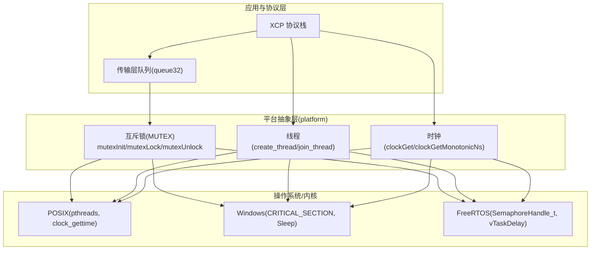
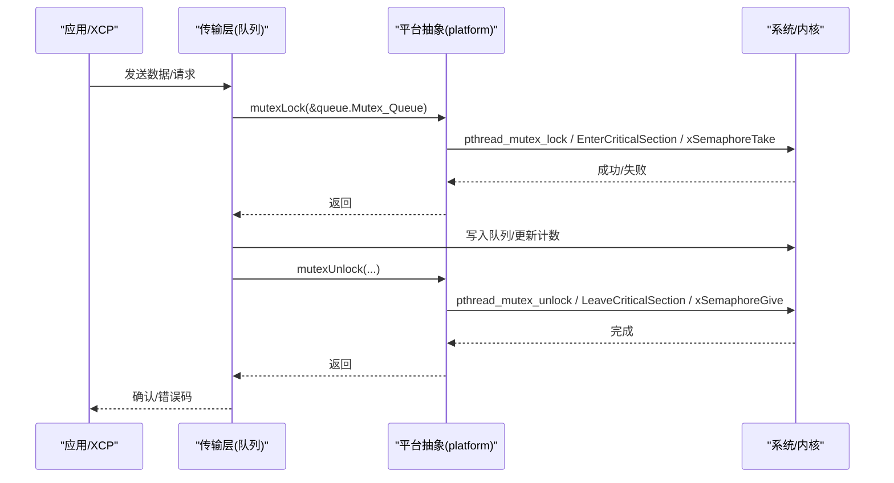
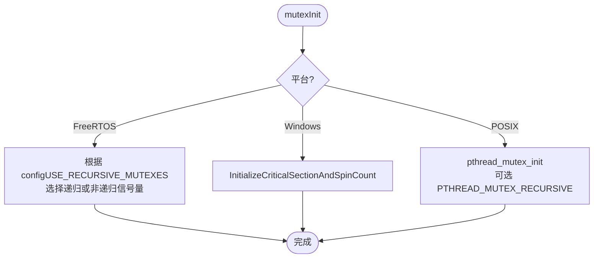
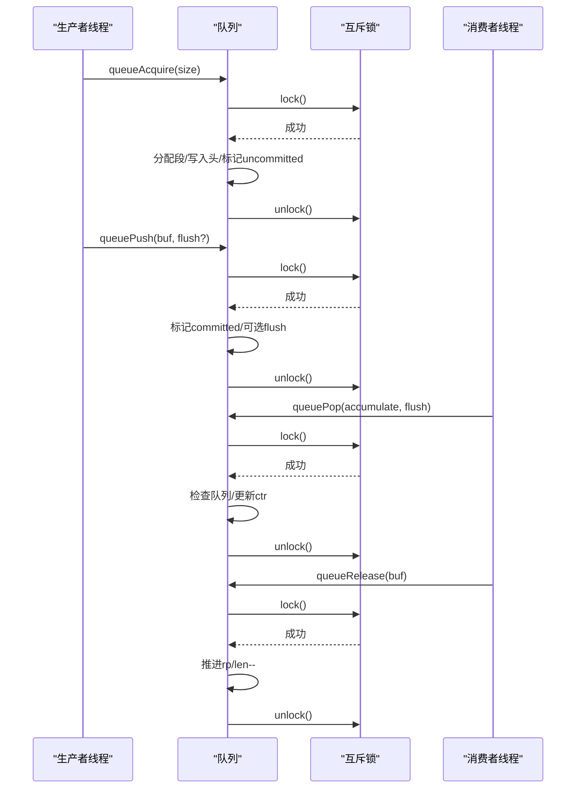
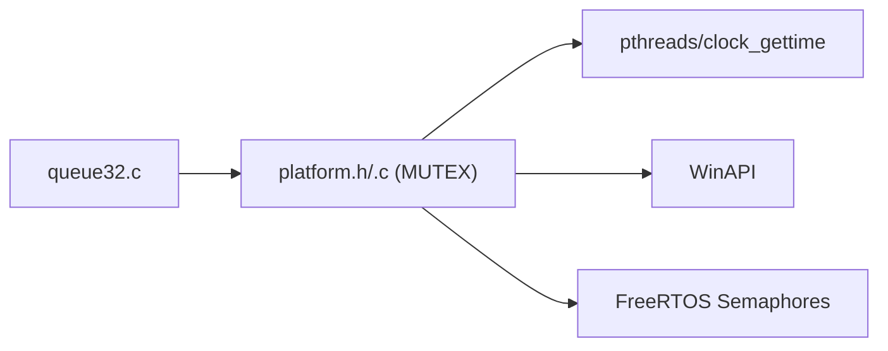

# 线程同步机制

<cite>
**本文引用的文件**
- [platform.h](file://src/platform.h)
- [platform.c](file://src/platform.c)
- [xcp_cfg.h](file://src/xcp_cfg.h)
- [queue32.c](file://src/queue32.c)
- [xcplib_rtos_cfg.h](file://src/xcplib_rtos_cfg.h)
</cite>

## 目录
1. [简介](#简介)
2. [项目结构](#项目结构)
3. [核心组件](#核心组件)
4. [架构总览](#架构总览)
5. [详细组件分析](#详细组件分析)
6. [依赖关系分析](#依赖关系分析)
7. [性能考虑](#性能考虑)
8. [故障排查指南](#故障排查指南)
9. [结论](#结论)
10. [附录](#附录)

## 简介
本文件系统性阐述 XCPlite 的线程同步机制实现，重点覆盖互斥锁（含递归与非递归）、自旋锁、条件变量与超时处理、FreeRTOS 环境下的信号量/事件组适配、POSIX 线程库封装以及跨平台兼容性。同时提供性能调优建议与死锁预防策略，帮助开发者在多线程环境中正确、高效地使用同步原语。

## 项目结构
XCPlite 将平台相关的线程与同步原语抽象到 platform 层，上层模块通过统一接口使用互斥锁、线程创建/销毁、时钟等能力。队列模块基于互斥锁实现多生产者单消费者缓冲，用于传输层消息排队。

图表来源
- [platform.h:300-348](file://src/platform.h#L300-L348)
- [platform.c:370-432](file://src/platform.c#L370-L432)
- [platform.c:455-654](file://src/platform.c#L455-L654)
- [queue32.c:85-100](file://src/queue32.c#L85-L100)

章节来源
- [platform.h:300-348](file://src/platform.h#L300-L348)
- [platform.c:370-432](file://src/platform.c#L370-L432)
- [queue32.c:85-100](file://src/queue32.c#L85-L100)

## 核心组件
- 互斥锁（MUTEX）：跨平台封装，支持非递归与递归两种模式；FreeRTOS 下映射为二值信号量或递归信号量；POSIX 下使用 pthread_mutex；Windows 下使用 CRITICAL_SECTION。
- 线程管理：统一的 create_thread/join_thread/cancel_thread/get_thread_id 宏，屏蔽平台差异。
- 时钟：提供单调/实时高精度时钟接口，用于超时与时间戳。
- 队列：多生产者单消费者环形缓冲，内部以互斥锁保护共享状态。

章节来源
- [platform.h:300-348](file://src/platform.h#L300-L348)
- [platform.h:350-433](file://src/platform.h#L350-L433)
- [platform.c:370-432](file://src/platform.c#L370-L432)
- [platform.c:455-654](file://src/platform.c#L455-L654)
- [queue32.c:85-100](file://src/queue32.c#L85-L100)

## 架构总览
下图展示线程同步在 XCPlite 中的分层与调用关系：应用/协议层通过平台抽象层访问底层 OS/RTOS 同步原语。

图表来源
- [queue32.c:242-267](file://src/queue32.c#L242-L267)
- [platform.h:300-348](file://src/platform.h#L300-L348)
- [platform.c:370-432](file://src/platform.c#L370-L432)

## 详细组件分析

### 互斥锁（Mutex）设计与实现
- 设计要点
  - 统一类型与初始化：MUTEX/MUTEX_INTIALIZER，跨平台一致。
  - 递归锁支持：FreeRTOS 下根据配置选择递归/非递归信号量；POSIX 下通过属性设置 PTHREAD_MUTEX_RECURSIVE；Windows CRITICAL_SECTION 天然递归。
  - 加解锁宏：mutexLock/mutexUnlock 在不同平台映射到对应 API。
  - 初始化参数：recursive 标志控制行为；spinCount 在 Windows 下传递给 InitializeCriticalSectionAndSpinCount，其他平台忽略。
- 关键流程
  - 初始化：根据平台与 recursive 标志创建相应内核对象。
  - 销毁：释放内核对象并清理状态。
- 复杂度与开销
  - 加/解锁通常为 O(1)，但涉及上下文切换时存在系统调用成本。
  - 递归锁会带来额外计数维护与分支判断开销。

图表来源
- [platform.c:370-432](file://src/platform.c#L370-L432)
- [platform.h:300-348](file://src/platform.h#L300-L348)

章节来源
- [platform.h:300-348](file://src/platform.h#L300-L348)
- [platform.c:370-432](file://src/platform.c#L370-L432)

### 递归锁与非递归锁的区别与应用场景
- 非递归锁
  - 同一线程重复获取会死锁，适合保护短临界区、避免嵌套持有。
  - 适用：队列入队/出队、计数器更新等原子性操作。
- 递归锁
  - 允许同一线程多次获取，内部维护计数，适合函数间嵌套调用共享资源。
  - 适用：复杂数据结构遍历中多处需要加锁且可能相互调用。
- 选择建议
  - 优先非递归锁以减少复杂度与潜在死锁风险；仅在确需嵌套时使用递归锁。

章节来源
- [platform.h:300-348](file://src/platform.h#L300-L348)
- [platform.c:370-432](file://src/platform.c#L370-L432)

### 自旋锁（SpinLock）的实现原理与适用场景
- 现状说明
  - 当前代码未提供显式的自旋锁类型；Windows 路径下 Critical Section 支持 spin count 参数，用于短临界区的自旋优化。
  - FreeRTOS 路径下未启用自旋等待逻辑，主要依赖信号量阻塞。
- 适用场景
  - 极短临界区、高频率竞争、低延迟要求；在实时系统中需谨慎使用，避免长时间占用 CPU。
- 注意事项
  - 自旋锁不适合长临界区；在多核环境下可能导致忙等浪费功耗。
  - 若需自旋，应结合中断禁用或优先级提升策略，确保可预测性。

章节来源
- [platform.h:300-348](file://src/platform.h#L300-L348)
- [platform.c:406-414](file://src/platform.c#L406-L414)

### 条件变量的工作机制、等待-通知与超时
- 机制概述
  - 典型模式：线程在满足条件前进入等待（阻塞），另一线程修改状态后发出通知唤醒等待者。
  - 超时：等待时可指定超时，防止永久阻塞。
- 在 XCPlite 中的体现
  - 传输层队列采用“生产者-消费者”模型，但当前实现为无阻塞/轮询式：生产者加锁写入，消费者加锁读取，不直接暴露条件变量 API。
  - 如需引入条件变量，可在队列中增加“非空/非满”条件，配合超时等待以提升效率。
- 建议实现
  - 使用 POSIX condvar 或 FreeRTOS Event Group/Semaphore 实现等待-通知。
  - 超时处理：基于单调时钟计算剩余时间，循环检查条件与超时。

[本节为概念性说明，不直接分析具体文件]

### FreeRTOS 环境下的线程同步原语适配
- 信号量与互斥量
  - 非递归：xSemaphoreCreateMutex / xSemaphoreTake / xSemaphoreGive。
  - 递归：xSemaphoreCreateRecursiveMutex / xSemaphoreTakeRecursive / xSemaphoreGiveRecursive。
  - 静态分配：当 configSUPPORT_STATIC_ALLOCATION == 1 时使用 StaticSemaphore_t 缓冲区。
- 事件组
  - 可用于多事件同步与广播通知；当前代码未直接使用，但可作为条件变量替代方案。
- 任务与延时
  - create_thread 在 FreeRTOS 下映射为 xTaskCreate/xTaskCreateStatic；sleepMs/sleepUs 映射为 vTaskDelay。

章节来源
- [platform.h:310-348](file://src/platform.h#L310-L348)
- [platform.c:370-432](file://src/platform.c#L370-L432)
- [platform.h:381-418](file://src/platform.h#L381-L418)
- [platform.c:78-90](file://src/platform.c#L78-L90)

### POSIX 线程库的封装接口与跨平台兼容
- 线程
  - create_thread/join_thread/cancel_thread/get_thread_id 宏统一接口。
- 互斥锁
  - pthread_mutex_init/lock/unlock/destroy，支持递归属性。
- 时钟
  - clock_gettime 提供单调/实时高精度时间；提供 Last 系列接口减少系统调用。
- 兼容性
  - 通过编译期宏区分平台，保证同一套源码在 Linux/macOS/QNX/Windows/FreeRTOS 上运行。

章节来源
- [platform.h:350-433](file://src/platform.h#L350-L433)
- [platform.c:505-654](file://src/platform.c#L505-L654)

### 队列中的同步实践（多生产者单消费者）
- 设计
  - 环形缓冲 + 互斥锁保护头部/尾部指针与长度。
  - 生产者：queueAcquire 申请缓冲，queuePush 提交并可选 flush。
  - 消费者：queuePop 取出一段完整消息，queueRelease 推进读指针。
- 同步点
  - 所有对 queue_rp、queue_len、msg_ptr 的访问均在互斥锁保护下进行。
- 性能
  - 临界区尽量短；flush 路径触发新段分配，注意在高吞吐场景下的影响。

图表来源
- [queue32.c:207-304](file://src/queue32.c#L207-L304)
- [queue32.c:333-417](file://src/queue32.c#L333-L417)
- [platform.h:300-348](file://src/platform.h#L300-L348)

章节来源
- [queue32.c:207-304](file://src/queue32.c#L207-L304)
- [queue32.c:333-417](file://src/queue32.c#L333-L417)

## 依赖关系分析
- 模块耦合
  - 队列模块强依赖平台互斥锁；平台层依赖 OS/RTOS 同步原语。
- 外部依赖
  - POSIX：pthread、clock_gettime。
  - Windows：CRITICAL_SECTION、Sleep、QueryPerformanceCounter。
  - FreeRTOS：SemaphoreHandle_t、vTaskDelay、xTaskCreate。
- 潜在循环依赖
  - 当前结构清晰，无循环依赖。

图表来源
- [queue32.c:85-100](file://src/queue32.c#L85-L100)
- [platform.h:300-348](file://src/platform.h#L300-L348)
- [platform.c:370-432](file://src/platform.c#L370-L432)

章节来源
- [queue32.c:85-100](file://src/queue32.c#L85-L100)
- [platform.h:300-348](file://src/platform.h#L300-L348)
- [platform.c:370-432](file://src/platform.c#L370-L432)

## 性能考虑
- 互斥锁
  - 缩短临界区，避免在锁内执行 I/O 或耗时计算。
  - 合理选择递归/非递归：优先非递归以降低开销。
  - Windows 下利用 spinCount 优化短临界区。
- 队列
  - 调整队列大小与段大小，平衡内存与丢包率。
  - flush 路径可能触发新段分配，在高吞吐场景谨慎使用。
- 时钟
  - 使用 Last 系列接口减少系统调用；合理设置 CLOCK_TICKS_PER_S。
- FreeRTOS
  - 使用静态分配降低动态分配开销；合理设置任务优先级与栈大小。

[本节提供通用指导，不直接分析具体文件]

## 故障排查指南
- 死锁定位
  - 检查是否在同一线程重复获取非递归锁。
  - 检查锁顺序是否一致，避免交叉加锁。
- 常见问题
  - 队列溢出：观察 packets_lost 计数，增大队列或降低生产者速率。
  - 超时失效：确认单调时钟可用，检查超时计算逻辑。
- 调试手段
  - 开启 DBG_LEVEL 输出，跟踪锁与队列状态变化。
  - 在 FreeRTOS 下使用任务监控工具查看阻塞原因。

章节来源
- [queue32.c:242-267](file://src/queue32.c#L242-L267)
- [platform.c:455-654](file://src/platform.c#L455-L654)

## 结论
XCPlite 通过 platform 层实现了跨平台的线程同步抽象，核心以互斥锁为主，辅以线程与时钟接口。队列模块展示了典型的多生产者单消费者同步模式。对于更高阶的等待-通知与超时需求，可在现有基础上引入条件变量或事件组。遵循本文的性能与死锁预防建议，可在实时与高性能场景中稳定使用这些同步原语。

## 附录
- 配置项参考
  - FreeRTOS 相关：configUSE_RECURSIVE_MUTEXES、configSUPPORT_STATIC_ALLOCATION、OPTION_FREERTOS_STACK_BYTES、OPTION_FREERTOS_PRIORITY。
  - 时钟分辨率：CLOCK_TICKS_PER_S 决定 DAQ 时钟精度。
- 推荐实践
  - 明确同步边界，最小化临界区。
  - 优先非递归锁，必要时再使用递归锁。
  - 在高并发路径避免锁内阻塞与 I/O。
  - 使用单调时钟进行超时判断，避免系统时间跳变影响。

章节来源
- [platform.h:310-348](file://src/platform.h#L310-L348)
- [platform.h:381-418](file://src/platform.h#L381-L418)
- [xcp_cfg.h:410-434](file://src/xcp_cfg.h#L410-L434)