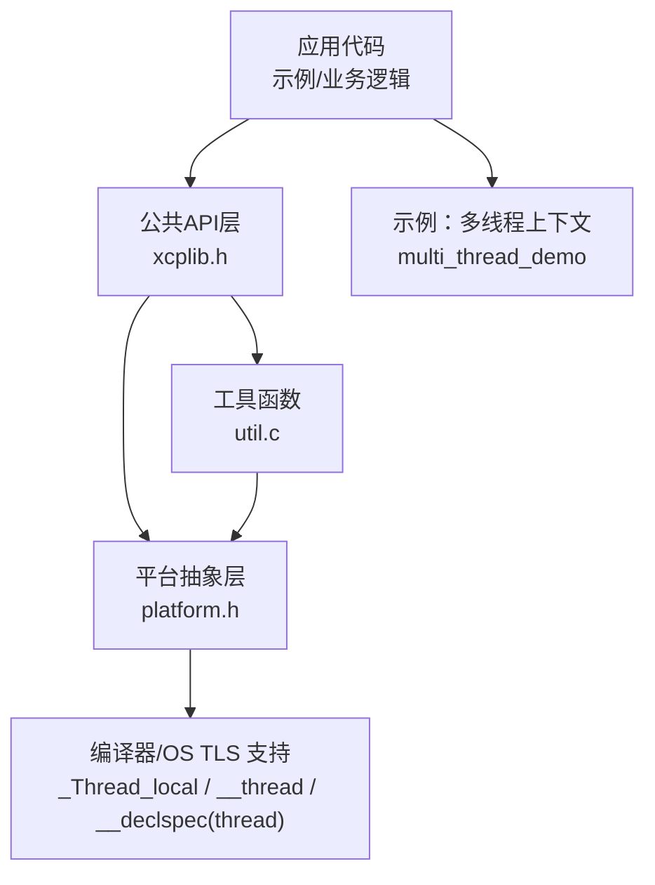
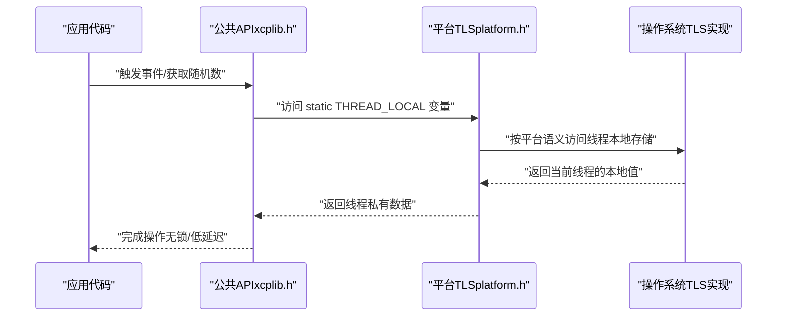
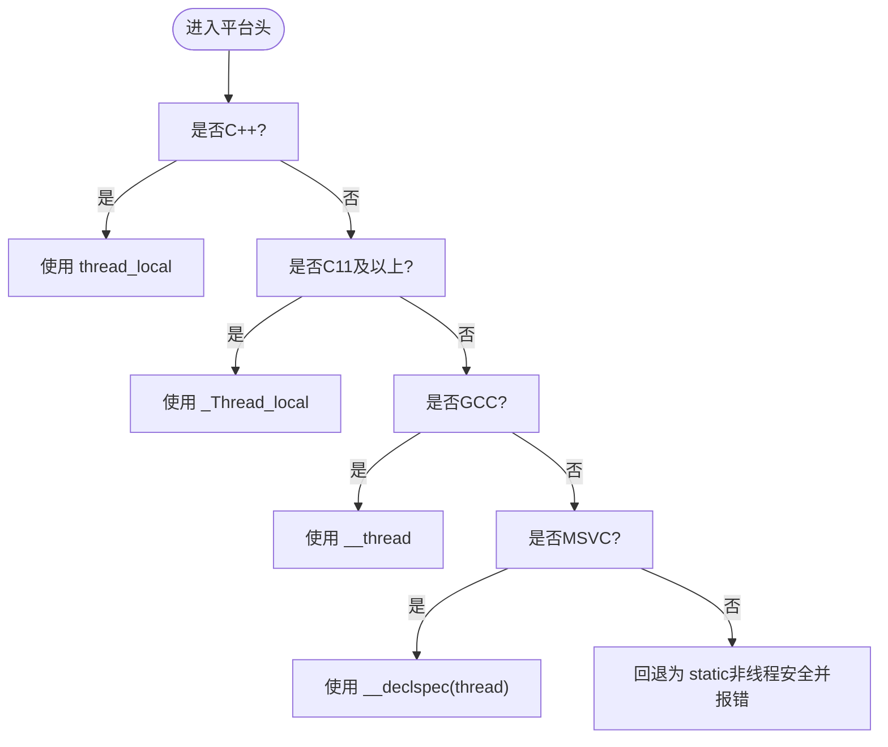
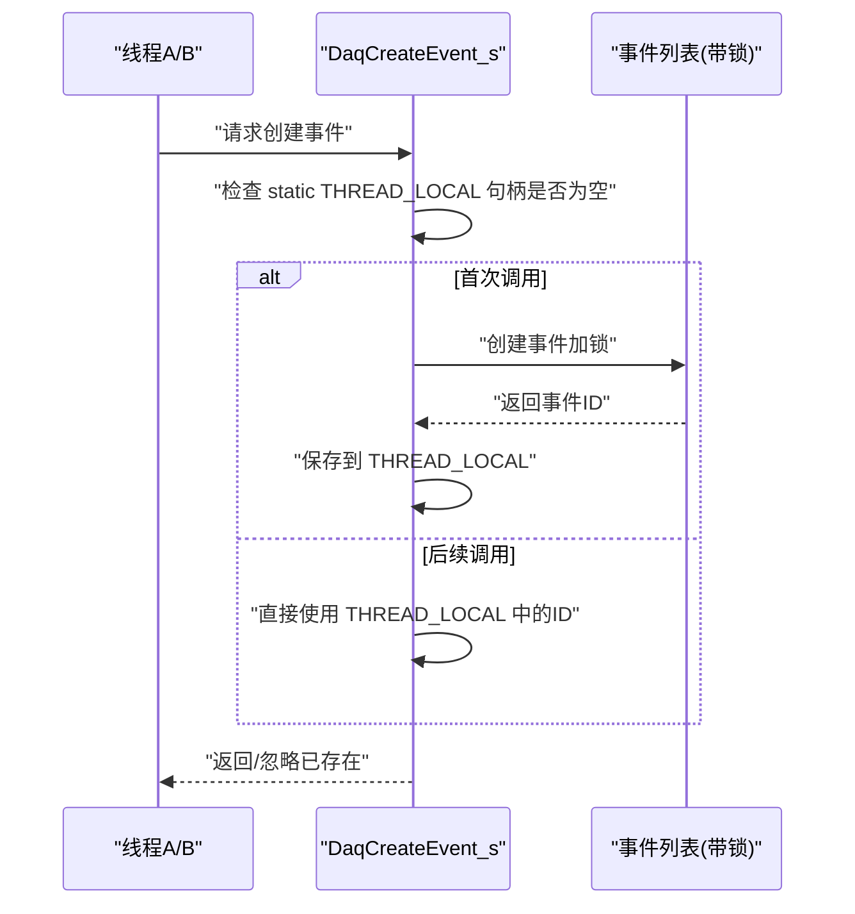
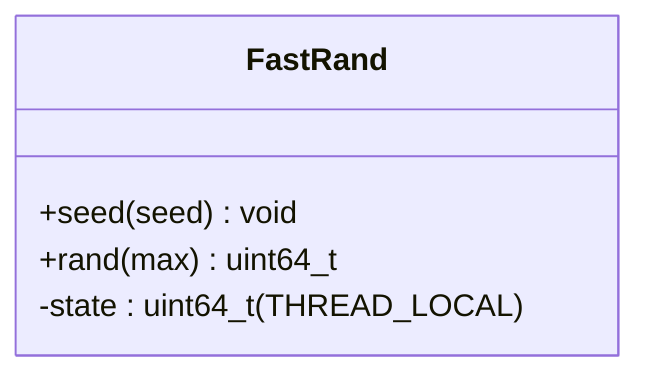
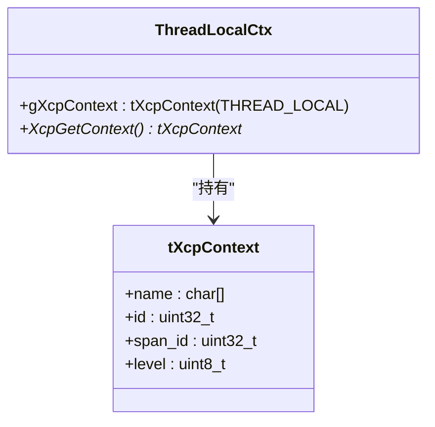
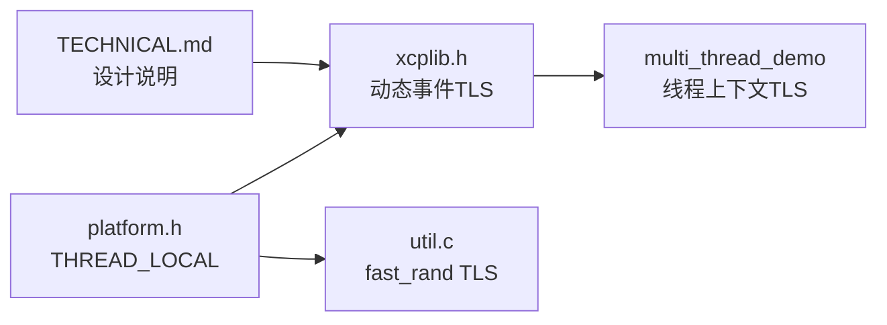

# 线程本地存储

<cite>
**本文引用的文件**
- [platform.h](file://src/platform.h)
- [xcplib.h](file://inc/xcplib.h)
- [util.c](file://src/util.c)
- [xcplite.c](file://src/xcplite.c)
- [multi_thread_demo main.c](file://examples/multi_thread_demo/src/main.c)
- [TECHNICAL.md](file://docs/TECHNICAL.md)
- [FreeRTOSConfig.h（STM32）](file://examples/freertos_demo/freertos_stm32_demo/Core/Inc/FreeRTOSConfig.h)
- [lwipopts.h（STM32）](file://examples/freertos_demo/freertos_stm32_demo/LWIP/Target/lwipopts.h)
</cite>

## 目录
1. [简介](#简介)
2. [项目结构](#项目结构)
3. [核心组件](#核心组件)
4. [架构总览](#架构总览)
5. [详细组件分析](#详细组件分析)
6. [依赖关系分析](#依赖关系分析)
7. [性能考量](#性能考量)
8. [故障排查指南](#故障排查指南)
9. [结论](#结论)
10. [附录](#附录)

## 简介
本文件系统性阐述 XCPlite 中的线程本地存储（TLS）实现与应用。内容涵盖：
- TLS 的概念与作用：线程安全的数据隔离、避免锁竞争、提升访问性能。
- 平台差异与底层机制：POSIX pthreads 的 _Thread_local 语义、Windows 的 __declspec(thread)/TlsAlloc/TlsSetValue 等，以及 FreeRTOS 的 per-task TLS 槽位。
- XCPlite 如何使用 TLS：事件实例每线程一次创建、随机数状态每线程独立、示例中线程上下文隔离等。
- 生命周期管理：键/槽位的创建、数据设置与清理策略（在 C/C++ 语言级 TLS 下由运行时自动管理）。
- 与全局变量的对比：内存占用、访问性能、初始化开销。
- 最佳实践与常见问题：命名冲突、尺寸限制、清理时机、跨平台兼容等。

## 项目结构
XCPlite 将 TLS 能力抽象为统一的宏与头文件，并在多处使用：
- 平台抽象层提供 THREAD_LOCAL 宏，屏蔽编译器/平台差异。
- 公共 API 层在动态事件创建等处使用 TLS 实现“每线程一次”模式。
- 工具函数利用 TLS 保存每线程随机数状态，避免锁。
- 示例工程展示如何在应用层用 TLS 维护线程上下文。

图表来源
- [platform.h:454-467](file://src/platform.h#L454-L467)
- [xcplib.h:280-301](file://inc/xcplib.h#L280-L301)
- [util.c:47-83](file://src/util.c#L47-L83)
- [multi_thread_demo main.c:86-162](file://examples/multi_thread_demo/src/main.c#L86-L162)

章节来源
- [platform.h:454-467](file://src/platform.h#L454-L467)
- [xcplib.h:280-301](file://inc/xcplib.h#L280-L301)
- [util.c:47-83](file://src/util.c#L47-L83)
- [multi_thread_demo main.c:86-162](file://examples/multi_thread_demo/src/main.c#L86-L162)

## 核心组件
- 平台 TLS 宏定义：THREAD_LOCAL 在不同编译器和平台上映射到对应关键字或属性，保证一致的线程局部变量声明方式。
- 动态事件“每线程一次”：通过 static THREAD_LOCAL 变量 + 条件判断，实现在每个线程内仅首次创建事件实例。
- 每线程随机数状态：splitmix64 的 fast_rand_state 使用 THREAD_LOCAL，避免多线程竞争与锁。
- 示例线程上下文：在多线程演示中，使用 THREAD_LOCAL 保存线程专属上下文（名称、ID、级别等），实现日志/追踪上下文隔离。

章节来源
- [platform.h:454-467](file://src/platform.h#L454-L467)
- [xcplib.h:422-453](file://inc/xcplib.h#L422-L453)
- [util.c:47-83](file://src/util.c#L47-L83)
- [multi_thread_demo main.c:86-162](file://examples/multi_thread_demo/src/main.c#L86-L162)

## 架构总览
下图展示了 TLS 在 XCPlite 中的层次化使用：应用调用公共 API，API 内部借助平台提供的 THREAD_LOCAL 能力，实现线程安全且高性能的局部状态管理。

图表来源
- [xcplib.h:422-453](file://inc/xcplib.h#L422-L453)
- [platform.h:454-467](file://src/platform.h#L454-L467)

## 详细组件分析

### 平台抽象层：THREAD_LOCAL 宏
- 作用：统一不同编译器/平台的线程局部变量声明方式。
- 行为：
  - C++：thread_local
  - C11：_Thread_local
  - GCC：__thread
  - MSVC：__declspec(thread)
  - 不支持时回退为 static（非线程安全），并报错提示。
- 影响范围：所有使用 THREAD_LOCAL 的地方均获得一致语义。

图表来源
- [platform.h:454-467](file://src/platform.h#L454-L467)

章节来源
- [platform.h:454-467](file://src/platform.h#L454-L467)

### 动态事件“每线程一次”创建
- 设计要点：
  - 使用 static THREAD_LOCAL tXcpEventId 保存每线程的事件句柄。
  - 首次调用时创建事件，后续调用直接复用，避免重复创建和锁竞争。
  - 与全局事件列表互斥保护配合，确保线程安全。
- 适用场景：DAQ 事件、测量点、回调注册等需要线程隔离的标识符。

图表来源
- [xcplib.h:422-453](file://inc/xcplib.h#L422-L453)

章节来源
- [xcplib.h:422-453](file://inc/xcplib.h#L422-L453)

### 每线程随机数状态（fast_rand）
- 实现：
  - 使用 splitmix64 算法生成高质量伪随机数。
  - 状态 fast_rand_state 声明为 THREAD_LOCAL，避免锁与竞争。
- 优势：
  - 无锁、低延迟、可并行。
  - 适合高频采样、抖动估计、统计滤波等场景。

图表来源
- [util.c:47-83](file://src/util.c#L47-L83)

章节来源
- [util.c:47-83](file://src/util.c#L47-L83)

### 示例：多线程上下文隔离
- 设计：
  - 定义 tXcpContext 结构体，包含名称、ID、级别等。
  - 使用 THREAD_LOCAL gXcpContext 保存每线程上下文。
  - 提供 XcpGetContext() 等内联函数快速访问。
- 用途：
  - 日志上下文、追踪跨度ID、线程专属配置等。

图表来源
- [multi_thread_demo main.c:86-162](file://examples/multi_thread_demo/src/main.c#L86-L162)

章节来源
- [multi_thread_demo main.c:86-162](file://examples/multi_thread_demo/src/main.c#L86-L162)

### 与全局变量的对比
- 内存占用：
  - 全局变量：单份，常驻内存。
  - TLS：每线程一份，线程越多占用越大；但避免共享区放大。
- 访问性能：
  - 全局变量：需加锁或原子操作，存在竞争与缓存失效。
  - TLS：无锁访问，通常更快，缓存友好。
- 初始化开销：
  - 全局变量：进程启动时一次性初始化。
  - TLS：线程创建时分配/初始化，销毁时释放；现代运行时优化良好。
- 适用性：
  - 全局变量：适合真正共享的状态。
  - TLS：适合线程私有状态（错误码、日志上下文、随机数种子、临时缓冲等）。

[本节为概念性对比，不直接分析具体文件]

## 依赖关系分析
- xcplib.h 依赖 platform.h 提供的 THREAD_LOCAL。
- util.c 依赖 platform.h 的 THREAD_LOCAL 以声明线程局部状态。
- 示例工程依赖 xcplib.h 的 TLS 模式进行上下文隔离。
- 文档 TECHNICAL.md 描述了使用 THREAD_LOCAL 的设计意图与约束。

图表来源
- [platform.h:454-467](file://src/platform.h#L454-L467)
- [xcplib.h:422-453](file://inc/xcplib.h#L422-L453)
- [util.c:47-83](file://src/util.c#L47-L83)
- [multi_thread_demo main.c:86-162](file://examples/multi_thread_demo/src/main.c#L86-L162)
- [TECHNICAL.md:131-131](file://docs/TECHNICAL.md#L131-L131)

章节来源
- [platform.h:454-467](file://src/platform.h#L454-L467)
- [xcplib.h:422-453](file://inc/xcplib.h#L422-L453)
- [util.c:47-83](file://src/util.c#L47-L83)
- [multi_thread_demo main.c:86-162](file://examples/multi_thread_demo/src/main.c#L86-L162)
- [TECHNICAL.md:131-131](file://docs/TECHNICAL.md#L131-L131)

## 性能考量
- 无锁访问：TLS 避免了互斥锁带来的上下文切换与缓存一致性开销。
- 缓存友好：线程私有数据减少跨核共享，降低伪共享。
- 初始化成本：线程创建时的 TLS 分配在现代系统中代价较低；注意避免在热点路径中进行昂贵初始化。
- 内存增长：线程数量多时，TLS 总量线性增长；应控制每线程数据大小。
- 随机数质量：splitmix64 在高并发下仍保持良好统计特性，适合高频采样。

[本节为通用性能讨论，不直接分析具体文件]

## 故障排查指南
- 现象：多线程下出现数据错乱或竞争。
  - 可能原因：误用全局变量而非 TLS；未正确使用 static THREAD_LOCAL。
  - 解决：改用 THREAD_LOCAL 声明线程私有状态；对共享资源加锁或使用队列。
- 现象：事件重复创建或 ID 冲突。
  - 可能原因：未在每线程维护独立的句柄；或命名不规范。
  - 解决：使用 DaqCreateEvent_s 的每线程 once 模式；确保事件名唯一。
- 现象：随机数序列相关或退化。
  - 可能原因：多线程共享种子；或种子初始化不当。
  - 解决：使用 fast_rand_seed 在每线程初始化；保持 THREAD_LOCAL 状态。
- 现象：嵌入式平台 TLS 槽位不足。
  - 可能原因：FreeRTOS configNUM_THREAD_LOCAL_STORAGE_POINTERS 过小。
  - 解决：增大槽位数以满足需求（如 LwIP 每线程 netconn 信号量需要 TLS 槽）。

章节来源
- [FreeRTOSConfig.h（STM32）:171-171](file://examples/freertos_demo/freertos_stm32_demo/Core/Inc/FreeRTOSConfig.h#L171-L171)
- [lwipopts.h（STM32）:147-166](file://examples/freertos_demo/freertos_stm32_demo/LWIP/Target/lwipopts.h#L147-L166)

## 结论
XCPlite 通过统一的 THREAD_LOCAL 抽象，在公共 API、工具函数与示例工程中广泛采用 TLS，实现了线程安全、低延迟、可扩展的线程私有状态管理。相比全局变量，TLS 在多线程环境下具备更优的性能与更清晰的隔离边界。结合平台能力（POSIX、Windows、FreeRTOS），可在多种目标上稳定运行。建议开发者遵循本文的最佳实践，合理划分共享与私有状态，充分利用 TLS 的优势。

[本节为总结性内容，不直接分析具体文件]

## 附录

### 平台 TLS 机制对照
- POSIX（Linux/macOS/QNX）：_Thread_local 由系统运行时管理，线程退出时自动清理。
- Windows：__declspec(thread) 由 CRT/内核支持；也可使用 TlsAlloc/TlsGetValue/TlsSetValue 进行显式管理。
- FreeRTOS：configNUM_THREAD_LOCAL_STORAGE_POINTERS 指定每任务 TLS 槽数量；LwIP 等库通过 vTaskSetThreadLocalStoragePointer 存取槽位。

章节来源
- [platform.h:454-467](file://src/platform.h#L454-L467)
- [lwipopts.h（STM32）:147-166](file://examples/freertos_demo/freertos_stm32_demo/LWIP/Target/lwipopts.h#L147-L166)
- [FreeRTOSConfig.h（STM32）:171-171](file://examples/freertos_demo/freertos_stm32_demo/Core/Inc/FreeRTOSConfig.h#L171-L171)

### 生命周期管理与清理
- 静态 THREAD_LOCAL 变量：随线程生命周期自动创建/销毁，无需手动释放。
- 动态分配：若 TLS 中存放指针，需在合适的时机（线程退出钩子/任务删除前）释放内存，避免泄漏。
- 事件句柄：由框架管理，用户无需手动释放；避免重复创建。

[本节为通用指导，不直接分析具体文件]

### 最佳实践
- 优先使用 THREAD_LOCAL 保存线程私有状态（错误码、日志上下文、随机数种子、临时缓冲）。
- 避免在 TLS 中放置过大对象；必要时使用指针+按需分配。
- 对共享资源仍需用互斥或队列保护；TLS 不是万能钥匙。
- 在嵌入式平台关注 TLS 槽位上限，合理规划。
- 在高频路径中避免昂贵的初始化；将初始化放在线程启动处。

[本节为通用指导，不直接分析具体文件]