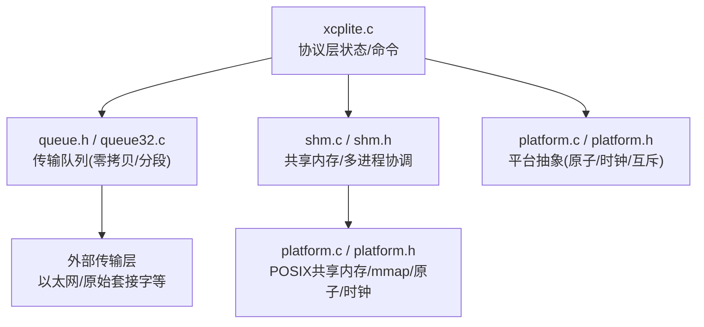
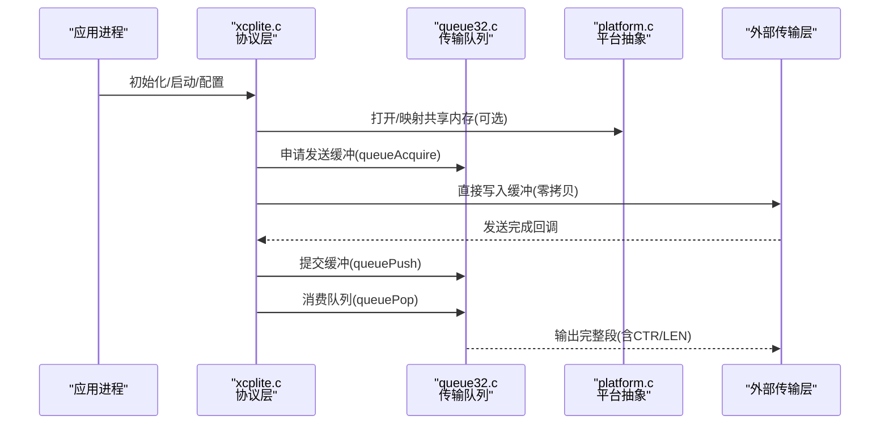
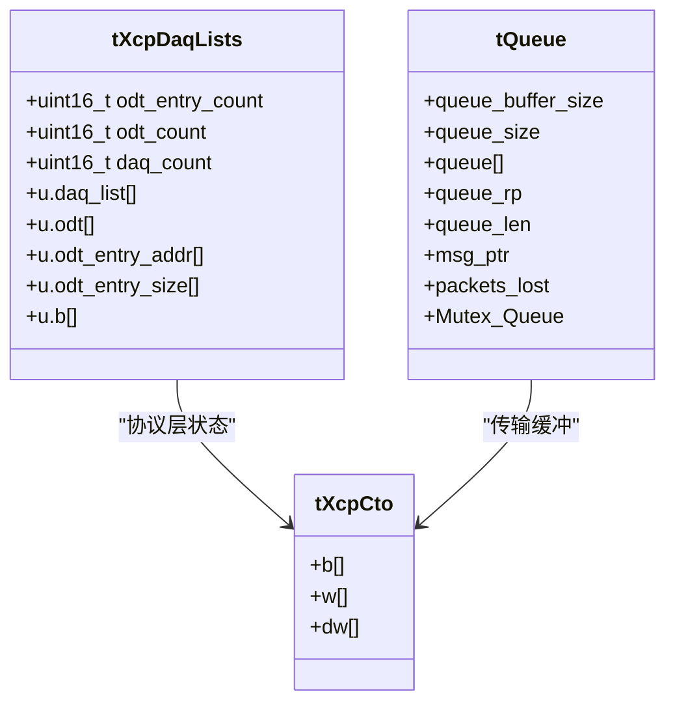
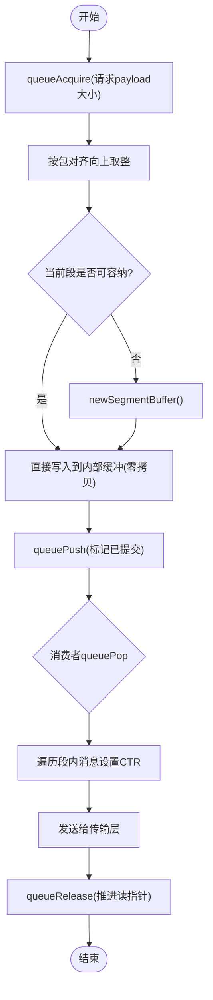
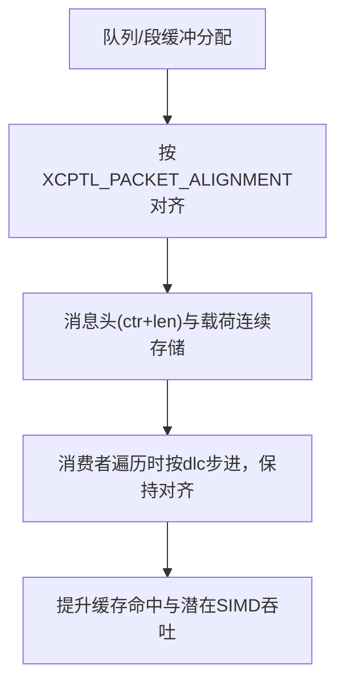
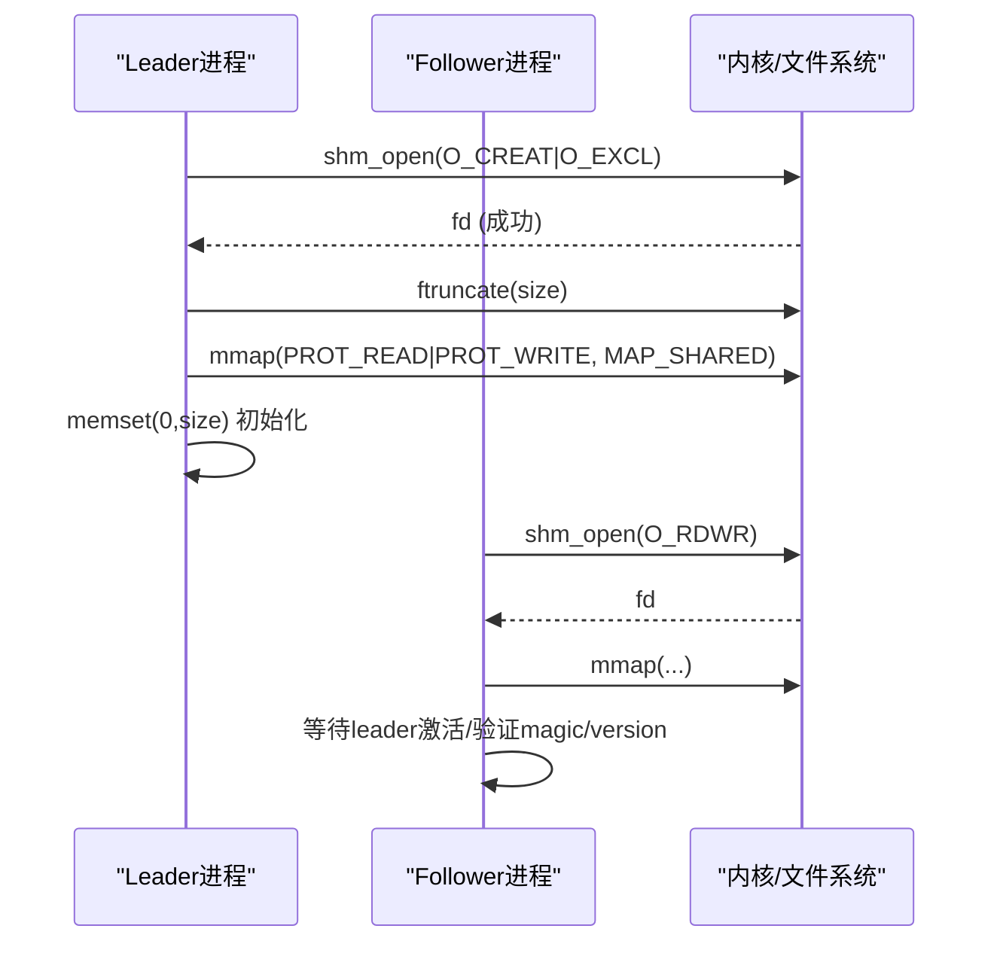
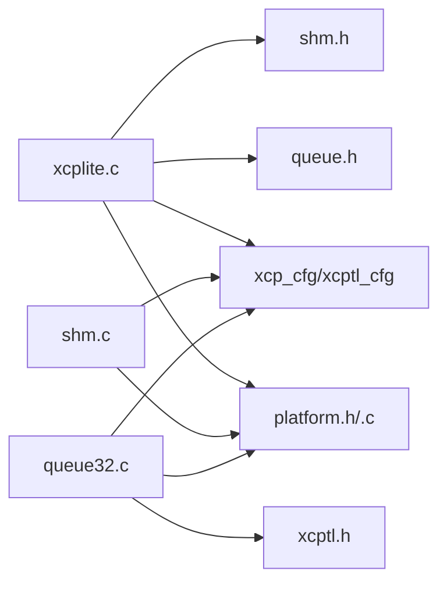

# 内存管理优化

<cite>
**本文引用的文件**
- [src/xcplite.c](file://src/xcplite.c)
- [src/xcplite.h](file://src/xcplite.h)
- [src/shm.c](file://src/shm.c)
- [src/shm.h](file://src/shm.h)
- [src/platform.c](file://src/platform.c)
- [src/platform.h](file://src/platform.h)
- [src/queue.h](file://src/queue.h)
- [src/queue32.c](file://src/queue32.c)
- [docs/SHM.md](file://docs/SHM.md)
</cite>

## 目录
1. [简介](#简介)
2. [项目结构](#项目结构)
3. [核心组件](#核心组件)
4. [架构总览](#架构总览)
5. [详细组件分析](#详细组件分析)
6. [依赖关系分析](#依赖关系分析)
7. [性能考量](#性能考量)
8. [故障排查指南](#故障排查指南)
9. [结论](#结论)
10. [附录](#附录)

## 简介
本文件聚焦 XCPlite 的内存管理优化策略，围绕以下主题展开：
- 静态内存池与预分配策略、对齐与碎片控制
- 零拷贝传输与缓冲区复用（含队列段聚合）
- 内存对齐优化（缓存行对齐、结构体填充、SIMD友好布局）
- 共享内存机制（POSIX 共享内存、内存映射、多进程通信优化）
- 内存安全保护（边界检查、越界检测、泄漏防护）
- 内存使用分析与调试技巧

## 项目结构
XCPlite 将协议层、平台抽象、共享内存与队列子系统解耦，便于在不同平台上实现一致的内存与传输语义。关键路径包括：
- 协议层状态与命令处理：xcplite.c/h
- 共享内存与多应用协调：shm.c/h
- 平台抽象（原子、时钟、内存映射、互斥锁等）：platform.c/h
- 传输队列（零拷贝/分段聚合）：queue.h, queue32.c
- 共享内存模式说明文档：docs/SHM.md

图表来源
- [src/xcplite.c:188-241](file://src/xcplite.c#L188-L241)
- [src/shm.c:69-215](file://src/shm.c#L69-L215)
- [src/platform.c:167-363](file://src/platform.c#L167-L363)
- [src/queue.h:29-82](file://src/queue.h#L29-L82)
- [src/queue32.c:57-100](file://src/queue32.c#L57-L100)

章节来源
- [src/xcplite.c:188-241](file://src/xcplite.c#L188-L241)
- [src/shm.c:69-215](file://src/shm.c#L69-L215)
- [src/platform.c:167-363](file://src/platform.c#L167-L363)
- [src/queue.h:29-82](file://src/queue.h#L29-L82)
- [src/queue32.c:57-100](file://src/queue32.c#L57-L100)

## 核心组件
- 协议层全局/共享状态 tXcpData：包含会话状态、响应缓冲、DAQ列表、事件列表、校准段列表等；在 SHM 模式下可驻留于共享内存，跨进程访问需无指针或偏移。
- 进程本地状态 tXcpLocalData：每个进程一份，包含 MTA、队列句柄、线程局部变量、A2L/EPK 名称等。
- 共享内存头 tShmHeader：控制区（首缓存行）+ 应用列表，用于多应用注册、存活计数、A2L 最终化协作。
- 传输队列：支持固定/可变条目大小，提供零拷贝获取缓冲、分段聚合发送、溢出统计。
- 平台抽象：POSIX 共享内存创建/映射、原子操作、时钟、互斥量、睡眠等。

章节来源
- [src/xcplite.h:382-495](file://src/xcplite.h#L382-L495)
- [src/shm.h:67-81](file://src/shm.h#L67-L81)
- [src/queue.h:29-82](file://src/queue.h#L29-L82)
- [src/platform.h:266-298](file://src/platform.h#L266-L298)

## 架构总览
XCPlite 通过“协议层 + 平台抽象 + 共享内存 + 传输队列”的分层设计，实现高性能、可移植、可多进程协作的 XCP 服务。

图表来源
- [src/xcplite.c:188-241](file://src/xcplite.c#L188-L241)
- [src/queue32.c:207-304](file://src/queue32.c#L207-L304)
- [src/platform.c:201-319](file://src/platform.c#L201-L319)

## 详细组件分析

### 静态内存池与预分配策略
- DAQ 列表采用线性块内联合数组布局，按固定步长划分不同子表（DAQ/Odt/地址/尺寸/扩展），避免运行时动态分配与碎片。
- 响应缓冲 CRM 为固定大小结构，确保对齐与快速访问。
- 队列在初始化时一次性分配环形段缓冲，生产者以“获取缓冲—写入—提交”的方式零拷贝入队，消费者批量弹出并设置传输计数器。

图表来源
- [src/xcplite.h:334-376](file://src/xcplite.h#L334-L376)
- [src/xcplite.h:114-120](file://src/xcplite.h#L114-L120)
- [src/queue32.c:85-100](file://src/queue32.c#L85-L100)

章节来源
- [src/xcplite.h:334-376](file://src/xcplite.h#L334-L376)
- [src/queue32.c:146-183](file://src/queue32.c#L146-L183)

### 零拷贝传输与缓冲区复用
- 生产者通过 queueAcquire 获得指向队列内部缓冲区的指针，直接写入数据，无需额外拷贝。
- 提交时仅更新元信息（长度、未提交计数、CTR占位），由消费者在 queuePop 统一设置传输计数器并输出。
- 32位队列实现将多条消息聚合成一个段（UDP载荷），减少系统调用与上下文切换开销。

图表来源
- [src/queue32.c:207-304](file://src/queue32.c#L207-L304)
- [src/queue32.c:333-403](file://src/queue32.c#L333-L403)

章节来源
- [src/queue32.c:207-304](file://src/queue32.c#L207-L304)
- [src/queue32.c:333-403](file://src/queue32.c#L333-L403)

### 内存对齐优化
- 队列与段缓冲按 XCPTL_PACKET_ALIGNMENT 对齐，保证后续消息头部对齐，利于 CPU 读取与可能的 SIMD 向量化。
- tXcpCto 使用 union 保证字节/字/双字视图一致，并通过 static_assert 校验大小与对齐。
- 共享内存头控制区被刻意限制在一个缓存行（64 字节），降低多核竞争导致的伪共享。

图表来源
- [src/queue.h:29-82](file://src/queue.h#L29-L82)
- [src/xcplite.h:114-120](file://src/xcplite.h#L114-L120)
- [src/shm.h:67-81](file://src/shm.h#L67-L81)

章节来源
- [src/queue.h:29-82](file://src/queue.h#L29-L82)
- [src/xcplite.h:114-120](file://src/xcplite.h#L114-L120)
- [src/shm.h:67-81](file://src/shm.h#L67-L81)

### 共享内存机制（POSIX 共享内存与内存映射）
- 使用 POSIX shm_open/ftruncate/mmap 创建/映射共享内存区域，首个进程成为 leader 负责初始化，其他进程作为 follower 附加。
- 通过 flock 序列化 leader 选举窗口，避免竞态；leader 在持有锁期间清零区域，保证 follower 看到干净状态。
- 应用通过 tShmHeader.app_list 注册，维护 alive_counter 检测僵尸进程，支持 A2L 最终化协作与主 A2L 合并。

图表来源
- [src/platform.c:201-319](file://src/platform.c#L201-L319)
- [src/shm.c:162-208](file://src/shm.c#L162-L208)

章节来源
- [src/platform.c:201-319](file://src/platform.c#L201-L319)
- [src/shm.c:162-208](file://src/shm.c#L162-L208)
- [docs/SHM.md:14-25](file://docs/SHM.md#L14-L25)

### 内存安全保护
- 边界检查：队列 acquire 对 payload 大小进行范围校验与对齐；段内消息长度合法性断言。
- 越界检测：队列段缓冲 magic 校验、未提交计数递减与断言；消费者遍历前断言 dlc 与 ctr 状态。
- 泄漏防护：队列释放时推进读指针并递减长度；共享内存关闭时可选择 unlink；异常路径清理资源（如失败时 unmap/unlink）。
- 访问权限：绝对地址模式下通过 ApplXcpCheckMemory 校验访问权限；MTA 设置时对扩展类型与范围进行检查。

章节来源
- [src/queue32.c:207-280](file://src/queue32.c#L207-L280)
- [src/queue32.c:333-403](file://src/queue32.c#L333-L403)
- [src/xcplite.c:618-711](file://src/xcplite.c#L618-L711)
- [src/platform.c:344-360](file://src/platform.c#L344-L360)

### 调试与分析工具
- 共享内存调试打印：XcpShmDebugPrint 输出 header、应用列表、事件、校准段等信息，辅助定位多应用状态。
- 队列级别与丢失统计：queueLevel 返回队列深度；queuePop 可获取 packets_lost 统计，帮助评估拥塞与丢包。
- 日志级别：XcpSetLogLevel 动态调整日志粒度，便于生产环境裁剪。

章节来源
- [src/shm.c:221-277](file://src/shm.c#L221-L277)
- [src/queue32.c:313-326](file://src/queue32.c#L313-L326)
- [src/xcplite.c:349-374](file://src/xcplite.c#L349-L374)

## 依赖关系分析
- xcplite.c 依赖 platform.h（原子/时钟/互斥）、queue.h（队列接口）、shm.h（共享内存接口）、xcp_cfg/xcptl_cfg（协议与传输参数）。
- shm.c 依赖 platform.c（POSIX 共享内存、mmap）、persistence（持久化）、xcp_cfg/xcptl_cfg。
- queue32.c 依赖 platform.h（互斥）、xcptl_cfg（段/包大小与对齐）、xcptl.h（CTR 生成）。

图表来源
- [src/xcplite.c:49-85](file://src/xcplite.c#L49-L85)
- [src/shm.c:12-36](file://src/shm.c#L12-L36)
- [src/queue32.c:16-35](file://src/queue32.c#L16-L35)

章节来源
- [src/xcplite.c:49-85](file://src/xcplite.c#L49-L85)
- [src/shm.c:12-36](file://src/shm.c#L12-L36)
- [src/queue32.c:16-35](file://src/queue32.c#L16-L35)

## 性能考量
- 预分配与零拷贝：DAQ 列表与队列缓冲一次性分配，避免运行时分配与碎片；生产者直接写入队列内部缓冲，减少拷贝。
- 对齐与缓存友好：包对齐与共享内存头控制区单缓存行布局，降低伪共享与缓存失效。
- 分段聚合：32位队列将多条消息聚合成一段，减少系统调用与上下文切换。
- 原子与无锁路径：共享状态使用原子字段与宽松内存序，减少锁竞争；仅在必要时使用互斥。

[本节为通用性能讨论，不直接分析具体文件]

## 故障排查指南
- 共享内存异常
  - 现象：无法附加或版本不匹配
  - 排查：检查 magic/version、size 一致性；使用 tools/shm_cleanup.sh 清理残留对象；确认 leader 已完成初始化
  - 参考：platformShmOpen 错误分支与提示
- 队列溢出
  - 现象：packets_lost 增加，部分数据丢失
  - 排查：增大队列缓冲、降低生产者速率、检查消费者处理延迟
  - 参考：queueAcquire/queuePop 中的溢出与丢失统计
- 内存访问违规
  - 现象：SET_MTA/SHORT_DOWNLOAD 返回访问拒绝
  - 排查：检查 MTA 扩展类型与范围、ApplXcpCheckMemory 实现、绝对地址转换
  - 参考：XcpSetMta 与 XcpWriteMta/XcpReadMta

章节来源
- [src/platform.c:201-319](file://src/platform.c#L201-L319)
- [src/queue32.c:207-280](file://src/queue32.c#L207-L280)
- [src/queue32.c:333-403](file://src/queue32.c#L333-L403)
- [src/xcplite.c:618-711](file://src/xcplite.c#L618-L711)

## 结论
XCPlite 通过静态预分配、零拷贝队列、严格对齐与共享内存协作，实现了高效且可靠的 XCP 协议栈。其设计兼顾了多进程场景下的内存安全与性能，提供了完善的调试与诊断能力，适合在高吞吐、低延迟的数据采集与标定场景中部署。

[本节为总结性内容，不直接分析具体文件]

## 附录
- 共享内存模式概述与工具：参见 docs/SHM.md
- 队列参数与对齐：参见 queue.h 中 QUEUE_* 宏定义
- 平台抽象接口：参见 platform.h 中共享内存与原子相关声明

章节来源
- [docs/SHM.md:14-25](file://docs/SHM.md#L14-L25)
- [src/queue.h:29-82](file://src/queue.h#L29-L82)
- [src/platform.h:266-298](file://src/platform.h#L266-L298)