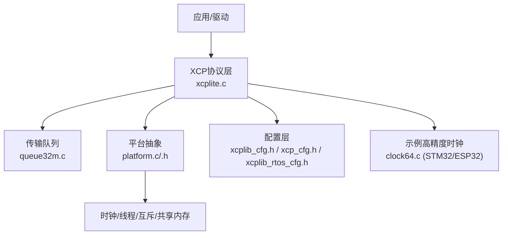
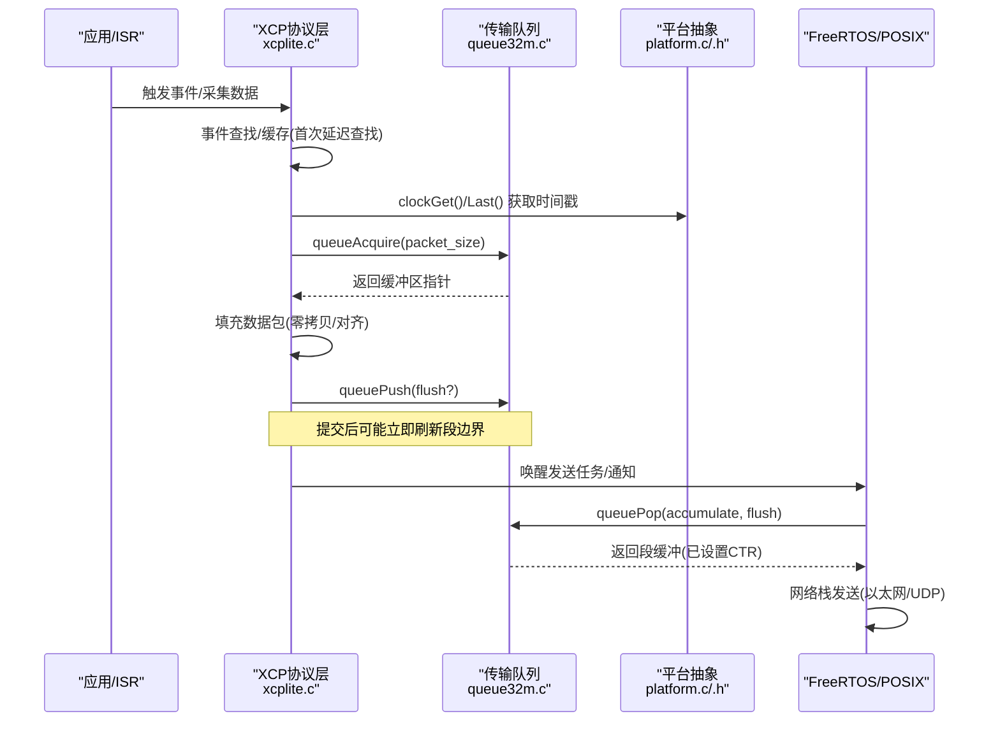
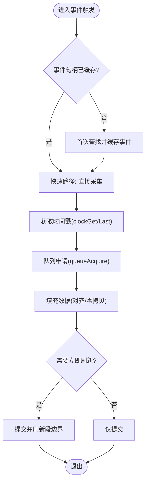
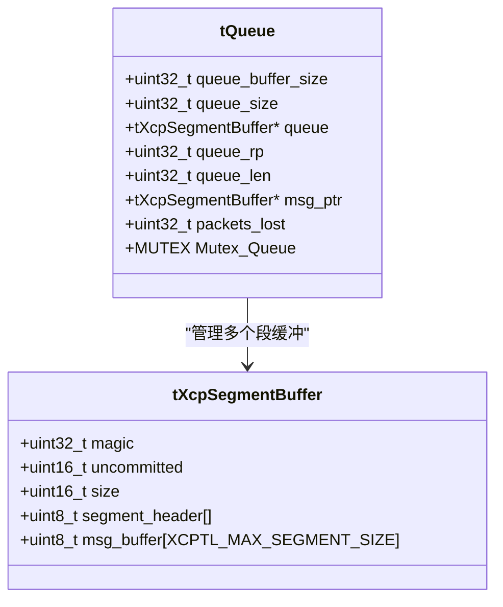
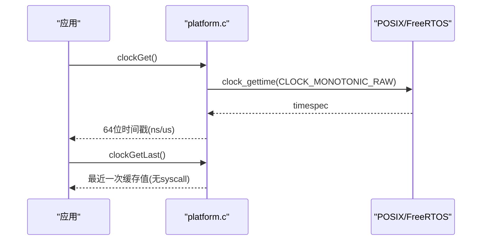
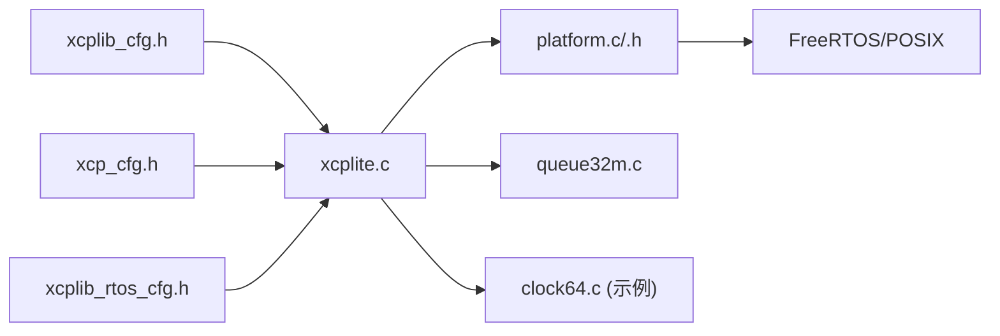

# 实时性优化

<cite>
**本文引用的文件**
- [src/xcplite.c](file://src/xcplite.c)
- [src/platform.c](file://src/platform.c)
- [src/platform.h](file://src/platform.h)
- [src/xcp_cfg.h](file://src/xcp_cfg.h)
- [src/xcplib_cfg.h](file://src/xcplib_cfg.h)
- [src/xcplib_rtos_cfg.h](file://src/xcplib_rtos_cfg.h)
- [src/queue32m.c](file://src/queue32m.c)
- [examples/freertos_demo/freertos_stm32_demo/Core/Src/clock64.c](file://examples/freertos_demo/freertos_stm32_demo/Core/Src/clock64.c)
- [examples/freertos_demo/freertos_esp32_demo/src/clock64.c](file://examples/freertos_demo/freertos_esp32_demo/src/clock64.c)
- [docs/TECHNICAL.md](file://docs/TECHNICAL.md)
</cite>

## 目录
1. [简介](#简介)
2. [项目结构](#项目结构)
3. [核心组件](#核心组件)
4. [架构总览](#架构总览)
5. [详细组件分析](#详细组件分析)
6. [依赖关系分析](#依赖关系分析)
7. [性能考量](#性能考量)
8. [故障排查指南](#故障排查指南)
9. [结论](#结论)
10. [附录](#附录)

## 简介
本文件聚焦XCPlite在嵌入式与类POSIX环境下的实时性优化策略，覆盖确定性执行时间、内存分配、性能调优、高精度时钟、FreeRTOS集成、以及测试与调试方法。内容基于源码实现与配置头文件，提供可操作的指导与可视化图示，帮助读者在资源受限平台上获得稳定、低抖动、高吞吐的XCP数据采集与标定能力。

## 项目结构
- 协议层与核心状态：位于 src/xcplite.c，集中管理会话状态、事件列表、DAQ/OPT、MTA访问、校验和等。
- 平台抽象：src/platform.c/.h 提供原子操作、线程/互斥、睡眠、共享内存、时钟（含CLOCK_MONOTONIC_RAW）、系统调用封装。
- 配置层：src/xcplib_cfg.h（通用选项）、src/xcp_cfg.h（协议层参数）、src/xcplib_rtos_cfg.h（FreeRTOS覆盖）。
- 传输队列：src/queue32m.c 为32位/RTOS场景的多生产者单消费者队列，支持关键路径临界区或互斥保护、段缓冲与对齐。
- 示例时钟：freertos_stm32_demo 与 freertos_esp32_demo 中的 clock64.c 展示微秒级高精度时钟实现。
- 技术文档：docs/TECHNICAL.md 描述资源消耗、仪器化开销、已知问题等。

**图表来源**
- [src/xcplite.c:188-256](file://src/xcplite.c#L188-L256)
- [src/platform.c:435-654](file://src/platform.c#L435-L654)
- [src/queue32m.c:81-137](file://src/queue32m.c#L81-L137)
- [src/xcplib_cfg.h:120-162](file://src/xcplib_cfg.h#L120-L162)
- [src/xcp_cfg.h:408-449](file://src/xcp_cfg.h#L408-L449)
- [src/xcplib_rtos_cfg.h:44-135](file://src/xcplib_rtos_cfg.h#L44-L135)

**章节来源**
- [src/xcplite.c:188-256](file://src/xcplite.c#L188-L256)
- [src/platform.c:435-654](file://src/platform.c#L435-L654)
- [src/queue32m.c:81-137](file://src/queue32m.c#L81-L137)
- [src/xcplib_cfg.h:120-162](file://src/xcplib_cfg.h#L120-L162)
- [src/xcp_cfg.h:408-449](file://src/xcp_cfg.h#L408-L449)
- [src/xcplib_rtos_cfg.h:44-135](file://src/xcplib_rtos_cfg.h#L44-L135)
- [docs/TECHNICAL.md:5-24](file://docs/TECHNICAL.md#L5-L24)

## 核心组件
- XCP协议层与状态机：维护会话状态、事件列表、DAQ运行标志、MTA读写、校验和计算；通过宏与原子变量保证并发安全与快速路径。
- 平台抽象层：统一时钟（含CLOCK_MONOTONIC_RAW）、线程/互斥、睡眠、共享内存；提供last值缓存减少系统调用。
- 传输队列：多生产者单消费者环形缓冲，按段累积消息，支持对齐、溢出计数、快速提交与消费。
- 配置体系：通过xcplib_cfg.h/xcp_cfg.h/xcplib_rtos_cfg.h组合裁剪功能、内存、队列、时钟分辨率与RTOS特性。
- 高精度时钟：FreeRTOS使用任务tick或外部回调；POSIX使用CLOCK_MONOTONIC_RAW；MCU示例使用DWT/ESP-IDF定时器实现us级精度。

**章节来源**
- [src/xcplite.c:188-256](file://src/xcplite.c#L188-L256)
- [src/platform.c:435-654](file://src/platform.c#L435-L654)
- [src/queue32m.c:81-137](file://src/queue32m.c#L81-L137)
- [src/xcplib_cfg.h:120-162](file://src/xcplib_cfg.h#L120-L162)
- [src/xcp_cfg.h:408-449](file://src/xcp_cfg.h#L408-L449)
- [src/xcplib_rtos_cfg.h:44-135](file://src/xcplib_rtos_cfg.h#L44-L135)

## 架构总览
下图展示了从触发DAQ到发送数据的关键路径，包括事件查找、无锁采集、队列写入与消费、平台时钟与调度集成。

**图表来源**
- [src/xcplite.c:779-797](file://src/xcplite.c#L779-L797)
- [src/queue32m.c:275-361](file://src/queue32m.c#L275-L361)
- [src/platform.c:600-654](file://src/platform.c#L600-L654)

## 详细组件分析

### 确定性执行时间与关键路径保护
- 事件列表与快速路径：事件首次创建时进行名称查找并缓存，后续触发走快速路径；事件计数使用relaxed原子读用于热路径，acquire/release用于跨线程可见性。
- DAQ运行标志：使用原子变量标记DAQ运行状态，配合会话状态位判断是否允许读取。
- 临界区与互斥：队列在FreeRTOS下可选择taskENTER_CRITICAL或互斥量；避免中断上下文调用临界区，确保确定性。
- MTA写路径：对1/2/4/8字节采用“原子”拷贝假设目标对齐，减少分支与循环开销。

**图表来源**
- [src/xcplite.c:779-797](file://src/xcplite.c#L779-L797)
- [src/queue32m.c:275-361](file://src/queue32m.c#L275-L361)
- [src/platform.c:600-654](file://src/platform.c#L600-L654)

**章节来源**
- [src/xcplite.c:779-797](file://src/xcplite.c#L779-L797)
- [src/xcplite.c:509-565](file://src/xcplite.c#L509-L565)
- [src/queue32m.c:153-177](file://src/queue32m.c#L153-L177)

### 内存分配策略
- 静态内存池与固定大小：队列段缓冲数组静态分配，避免运行时分配；FreeRTOS下可通过StaticTask_t与静态堆减少动态分配。
- 零拷贝传输：队列返回指向段缓冲内数据的指针，上层直接填充，减少memcpy；对齐要求确保高效DMA与CPU访问。
- 内存对齐优化：队列条目与段缓冲按XCPTL_PACKET_ALIGNMENT对齐，满足16位字段与DMA需求；STM32H7可将热点头部放入DTCM，段缓冲放入非缓存SRAM以避免缓存一致性开销。
- 共享内存：POSIX下使用shm_open/mmap实现进程间共享，领导者选举与初始化顺序保证一致性。

**图表来源**
- [src/queue32m.c:81-137](file://src/queue32m.c#L81-L137)
- [src/queue32m.c:117-150](file://src/queue32m.c#L117-L150)

**章节来源**
- [src/queue32m.c:81-137](file://src/queue32m.c#L81-L137)
- [src/platform.c:167-187](file://src/platform.c#L167-L187)
- [src/platform.c:201-360](file://src/platform.c#L201-L360)

### 性能调优方法
- CPU亲和性与调度优先级：FreeRTOS下通过OPTION_FREERTOS_PRIORITY设置XCP任务优先级；POSIX可使用sched_setaffinity（由上层应用配置）绑定关键线程到特定核。
- 缓存优化：将队列头部置于DTCM（零等待），段缓冲置于非缓存SRAM，避免DMA与CPU缓存不一致导致的额外清理/失效操作。
- 流水线并行化：队列支持段累积与批量提交，发送端可流水线处理多个消息；接收端按需flush控制段边界，降低延迟。
- 队列尺寸与MTU：根据预期流量峰值配置队列大小，确保至少覆盖10ms峰值；MTU默认1500，适配标准以太网路径。

**章节来源**
- [src/xcplib_rtos_cfg.h:44-88](file://src/xcplib_rtos_cfg.h#L44-L88)
- [src/queue32m.c:101-150](file://src/queue32m.c#L101-L150)
- [docs/TECHNICAL.md:5-24](file://docs/TECHNICAL.md#L5-L24)

### 高精度时间戳与纳秒级精度
- POSIX时钟：默认使用CLOCK_MONOTONIC_RAW（或QNX上的CLOCK_MONOTONIC），提供单调且不受NTP调整影响的时钟；支持ns/us分辨率，并提供last值缓存以减少syscall。
- FreeRTOS时钟：默认基于xTaskGetTickCount，粒度受configTICK_RATE_HZ限制；可通过ApplXcpRegisterGetClockCallback注册更高精度时钟。
- MCU示例：STM32使用DWT CYCCNT构建64位us级时钟，ESP32使用ESP-IDF esp_timer_get_time；两者均提供Update/Get接口供上层集成。

**图表来源**
- [src/platform.c:505-654](file://src/platform.c#L505-L654)
- [src/platform.c:458-500](file://src/platform.c#L458-L500)
- [examples/freertos_demo/freertos_stm32_demo/Core/Src/clock64.c:21-74](file://examples/freertos_demo/freertos_stm32_demo/Core/Src/clock64.c#L21-L74)
- [examples/freertos_demo/freertos_esp32_demo/src/clock64.c:10-16](file://examples/freertos_demo/freertos_esp32_demo/src/clock64.c#L10-L16)

**章节来源**
- [src/platform.c:505-654](file://src/platform.c#L505-L654)
- [src/platform.c:458-500](file://src/platform.c#L458-L500)
- [examples/freertos_demo/freertos_stm32_demo/Core/Src/clock64.c:21-74](file://examples/freertos_demo/freertos_stm32_demo/Core/Src/clock64.c#L21-L74)
- [examples/freertos_demo/freertos_esp32_demo/src/clock64.c:10-16](file://examples/freertos_demo/freertos_esp32_demo/src/clock64.c#L10-L16)

### FreeRTOS集成与抢占式调度优化
- 任务栈与优先级：通过OPTION_FREERTOS_STACK_BYTES与OPTION_FREERTOS_PRIORITY配置XCP任务栈深度与优先级，确保及时响应。
- 静态分配：支持StaticTask_t与StaticSemaphore_t，避免运行时分配，提升确定性。
- 临界区选择：在STM32等平台优先使用taskENTER_CRITICAL以降低开销；避免在ISR中调用临界区。
- 队列同步：32位队列在FreeRTOS下可选critical section或互斥量，平衡性能与可移植性。

**章节来源**
- [src/xcplib_rtos_cfg.h:44-135](file://src/xcplib_rtos_cfg.h#L44-L135)
- [src/platform.c:370-432](file://src/platform.c#L370-L432)
- [src/queue32m.c:153-177](file://src/queue32m.c#L153-L177)

### 实时性测试、基准与调试技巧
- 指标与统计：启用TEST_ENABLE_DBG_METRICS可统计TX/RX包数、事件计数等；TEST_CLOCK_GET_STATISTIC可统计clockGet调用次数。
- 队列溢出检测：queueLevel与packets_lost用于监控拥塞；合理增大队列与调整flush策略。
- 日志级别：通过XcpSetLogLevel控制输出级别，生产环境建议关闭或限制至错误/警告。
- 已知问题：参考TECHNICAL.md中CANape兼容性问题与规避方案。

**章节来源**
- [src/xcplite.c:335-343](file://src/xcplite.c#L335-L343)
- [src/platform.c:445-453](file://src/platform.c#L445-L453)
- [src/queue32m.c:370-382](file://src/queue32m.c#L370-L382)
- [docs/TECHNICAL.md:396-412](file://docs/TECHNICAL.md#L396-L412)

## 依赖关系分析
- 配置依赖：xcplib_cfg.h定义全局选项（队列类型、DAQ内存、持久化等），xcp_cfg.h定义协议层参数（事件数量、时间戳单位、PTP支持等），xcplib_rtos_cfg.h针对FreeRTOS覆盖默认值。
- 运行时依赖：xcplite.c依赖platform.c提供的时钟/线程/互斥；队列依赖平台抽象与配置；示例时钟依赖具体MCU/RTOS。
- 潜在循环依赖：通过头文件分层与条件编译避免；队列与协议层通过接口解耦。

**图表来源**
- [src/xcplib_cfg.h:120-162](file://src/xcplib_cfg.h#L120-L162)
- [src/xcp_cfg.h:408-449](file://src/xcp_cfg.h#L408-L449)
- [src/xcplib_rtos_cfg.h:44-135](file://src/xcplib_rtos_cfg.h#L44-L135)

**章节来源**
- [src/xcplib_cfg.h:120-162](file://src/xcplib_cfg.h#L120-L162)
- [src/xcp_cfg.h:408-449](file://src/xcp_cfg.h#L408-L449)
- [src/xcplib_rtos_cfg.h:44-135](file://src/xcplib_rtos_cfg.h#L44-L135)

## 性能考量
- 队列尺寸与流量模型：队列应能容纳至少10ms的峰值流量，避免丢包；结合MTU与DTO大小权衡内存与吞吐。
- 对齐与DMA：确保数据包与段缓冲对齐，减少CPU拷贝与缓存失效；在STM32H7上利用DTCM与非缓存SRAM。
- 时钟开销：优先使用clockGetLast减少syscall；在高频率DAQ中评估CLOCK_TICKS_PER_S与平台分辨率。
- 任务优先级：XCP任务优先级需高于普通应用但低于关键控制任务，避免抢占导致抖动。

[本节为通用指导，不直接分析具体文件]

## 故障排查指南
- 队列溢出：检查queueLevel与packets_lost，增大队列或降低DAQ频率；确认flush策略是否合适。
- 时间戳异常：验证CLOCK_TICKS_PER_S配置与平台时钟源；在FreeRTOS下考虑注册更高精度回调。
- 日志过多：调整XcpSetLogLevel，生产环境关闭调试输出。
- CANape兼容：参考TECHNICAL.md中COPY_CAL_PAGE、EPK等问题及规避方法。

**章节来源**
- [src/queue32m.c:370-382](file://src/queue32m.c#L370-L382)
- [src/platform.c:573-598](file://src/platform.c#L573-L598)
- [docs/TECHNICAL.md:396-412](file://docs/TECHNICAL.md#L396-L412)

## 结论
XCPlite通过无锁事件路径、静态内存池、对齐与缓存优化、高精度时钟与FreeRTOS集成，实现了低抖动、高吞吐的实时XCP数据采集与标定能力。合理配置队列、时钟与任务优先级，并结合测试与调试工具，可在多种嵌入式平台上获得稳定可靠的实时性能。

[本节为总结，不直接分析具体文件]

## 附录
- 配置清单：根据目标平台选择合适的xcplib_cfg.h与xcplib_rtos_cfg.h组合；必要时自定义覆盖头。
- 示例参考：freertos_stm32_demo与freertos_esp32_demo中的clock64.c可作为高精度时钟实现参考。
- 工具链：xcpclient可用于离线A2L生成与测试；CANape需注意已知兼容性问题。

[本节为补充信息，不直接分析具体文件]