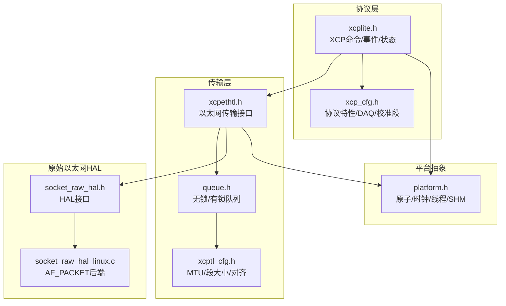
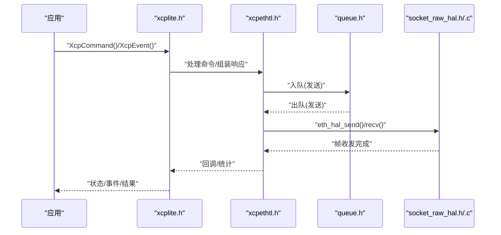
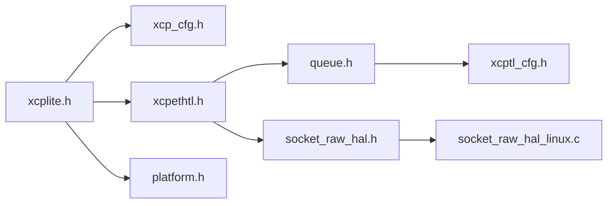

# 性能调优指南

<cite>
**本文引用的文件**
- [src/xcplite.h](file://src/xcplite.h)
- [src/xcplib_cfg.h](file://src/xcplib_cfg.h)
- [src/platform.h](file://src/platform.h)
- [src/xcpethtl.h](file://src/xcpethtl.h)
- [src/socket_raw_hal.h](file://src/socket_raw_hal.h)
- [src/queue.h](file://src/queue.h)
- [src/xcptl_cfg.h](file://src/xcptl_cfg.h)
- [src/xcp_cfg.h](file://src/xcp_cfg.h)
- [src/queue64v.c](file://src/queue64v.c)
- [src/socket_raw_hal_linux.c](file://src/socket_raw_hal_linux.c)
- [CMakeLists.txt](file://CMakeLists.txt)
</cite>

## 目录
1. [简介](#简介)
2. [项目结构](#项目结构)
3. [核心组件](#核心组件)
4. [架构总览](#架构总览)
5. [详细组件分析](#详细组件分析)
6. [依赖关系分析](#依赖关系分析)
7. [性能考虑](#性能考虑)
8. [故障排查指南](#故障排查指南)
9. [结论](#结论)
10. [附录](#附录)

## 简介
本指南面向XCPlite的高性能部署与调优，围绕以下主题提供可操作建议：CPU亲和性与线程绑定、NUMA感知编程、缓存友好数据结构与预取、指令级并行与数据流管道化、网络I/O优化（套接字缓冲、批量传输、零拷贝）、编译器优化选项、性能分析工具使用，以及基于仓库内配置与实现的基准测试思路与案例。内容严格基于仓库中的头文件、实现与构建配置进行归纳与可视化说明。

## 项目结构
XCPlite采用分层设计：协议层（XCP）+ 传输层（以太网/UDP/TCP或原始以太网HAL）+ 平台抽象（原子、时钟、线程、共享内存）。关键路径包括命令处理、DAQ事件触发、队列缓冲、发送/接收线程与底层HAL。

**图表来源**
- [src/xcplite.h:42-120](file://src/xcplite.h#L42-L120)
- [src/xcp_cfg.h:23-30](file://src/xcp_cfg.h#L23-L30)
- [src/xcpethtl.h:21-32](file://src/xcpethtl.h#L21-L32)
- [src/queue.h:8-23](file://src/queue.h#L8-L23)
- [src/xcptl_cfg.h:37-67](file://src/xcptl_cfg.h#L37-L67)
- [src/platform.h:23-85](file://src/platform.h#L23-L85)
- [src/socket_raw_hal.h:3-40](file://src/socket_raw_hal.h#L3-L40)
- [src/socket_raw_hal_linux.c:1-19](file://src/socket_raw_hal_linux.c#L1-L19)

**章节来源**
- [src/xcplite.h:42-120](file://src/xcplite.h#L42-L120)
- [src/xcptl_cfg.h:37-67](file://src/xcptl_cfg.h#L37-L67)
- [src/platform.h:23-85](file://src/platform.h#L23-L85)
- [src/queue.h:8-23](file://src/queue.h#L8-L23)
- [src/socket_raw_hal.h:3-40](file://src/socket_raw_hal.h#L3-L40)
- [src/socket_raw_hal_linux.c:1-19](file://src/socket_raw_hal_linux.c#L1-L19)

## 核心组件
- 协议层接口与状态：命令处理、事件管理、DAQ列表、本地与共享状态。
- 传输层：以太网传输初始化、命令处理入口、可选多播支持。
- 队列子系统：多实现（64位无锁变长/定长、32位有锁累积），用于高吞吐消息传递。
- 平台抽象：原子、时钟、线程、互斥量、共享内存、系统调用封装。
- 原始以太网HAL：Linux AF_PACKET后端，提供帧级收发能力。

**章节来源**
- [src/xcplite.h:42-120](file://src/xcplite.h#L42-L120)
- [src/xcpethtl.h:21-32](file://src/xcpethtl.h#L21-L32)
- [src/queue.h:8-23](file://src/queue.h#L8-L23)
- [src/platform.h:23-85](file://src/platform.h#L23-L85)
- [src/socket_raw_hal.h:3-40](file://src/socket_raw_hal.h#L3-L40)

## 架构总览
下图展示从应用侧到协议层、传输层、队列与底层HAL的调用链，体现高吞吐DAQ与命令响应的数据流。

**图表来源**
- [src/xcplite.h:68-80](file://src/xcplite.h#L68-L80)
- [src/xcpethtl.h:24-32](file://src/xcpethtl.h#L24-L32)
- [src/queue.h:122-176](file://src/queue.h#L122-L176)
- [src/socket_raw_hal.h:74-105](file://src/socket_raw_hal.h#L74-L105)

## 详细组件分析

### CPU亲和性与线程绑定策略
- 线程模型：平台抽象提供跨平台线程创建/销毁/ID获取宏，便于在POSIX/Windows/FreeRTOS上统一调度。
- 亲和性建议：
  - 将接收线程与发送线程绑定到不同物理核，减少缓存抖动与上下文切换。
  - 将DAQ触发线程与事件处理线程绑定到同一NUMA节点，降低跨节点访问延迟。
  - 对高频DAQ事件，使用独立线程并设置高优先级，避免被低优先级任务抢占。
- 参考点：
  - 线程API与宏定义位于平台抽象层，便于在各平台上实施绑定策略。
  - 队列实现为多生产者单消费者，适合将DAQ触发作为生产者线程，传输消费线程专核运行。

**章节来源**
- [src/platform.h:351-433](file://src/platform.h#L351-L433)
- [src/queue.h:8-23](file://src/queue.h#L8-L23)

### NUMA感知编程
- 共享内存与队列：
  - 共享内存区域通过平台抽象打开/关闭，适合跨进程共享XCP状态与队列。
  - 队列可在用户提供的内存中初始化，便于放置在NUMA本地内存区。
- 建议：
  - 将队列缓冲区与DAQ数据放置于本地NUMA节点内存，减少跨节点访问。
  - 使用进程本地状态与共享状态分离的设计，避免不必要的远程访问。

**章节来源**
- [src/platform.h:272-298](file://src/platform.h#L272-L298)
- [src/queue.h:106-114](file://src/queue.h#L106-L114)
- [src/xcplite.h:382-495](file://src/xcplite.h#L382-L495)

### 缓存优化技术
- 数据结构与对齐：
  - 传输层段大小按MTU计算并对齐，确保消息头部按字访问，减少未对齐访问开销。
  - 队列条目大小与对齐参数受控，保证原子头部对齐与缓存行友好布局。
- 预取与一致性：
  - 64位无锁队列注释指出尾部释放/获取会引发缓存一致性流量；在高吞吐场景下，固定长度队列可能更优。
  - 合理设置XCPTL_MAX_DTO_SIZE与队列项大小，使其接近缓存行尺寸，提升局部性。
- 建议：
  - 优先选择固定长度队列（当负载稳定时），减少清理与对齐带来的额外写放大。
  - 调整OPTION_MTU与XCPTL_MAX_SEGMENT_SIZE，使数据包尽量填满缓存行而不产生多余填充。

**章节来源**
- [src/xcptl_cfg.h:37-67](file://src/xcptl_cfg.h#L37-L67)
- [src/queue.h:29-55](file://src/queue.h#L29-L55)
- [src/queue64v.c:15-34](file://src/queue64v.c#L15-L34)

### 流水线并行化与异步处理
- 指令级并行：
  - 使用原子操作与无锁队列减少同步开销，提高并发度。
  - 传输层消息累积与向量发送（在32位队列中）可将多个小消息合并为大段，减少系统调用次数。
- 数据流管道化：
  - 接收线程→队列→传输发送线程形成流水线，解耦I/O与协议处理。
  - DAQ事件触发与事件列表管理异步执行，避免阻塞命令处理线程。
- 建议：
  - 启用队列的消息累积功能（32位实现），提高批量发送效率。
  - 将DAQ事件与命令处理分离到不同线程，降低尾延迟。

**章节来源**
- [src/queue.h:156-168](file://src/queue.h#L156-L168)
- [src/xcplite.h:205-283](file://src/xcplite.h#L205-L283)
- [src/xcptl_cfg.h:116-126](file://src/xcptl_cfg.h#L116-L126)

### 网络I/O优化
- 套接字缓冲与MTU：
  - XCPTL_MAX_SEGMENT_SIZE由OPTION_MTU推导，确保IP包不超过链路MTU，避免分片。
  - 在lwIP环境下需特别注意DF标志与分片行为，确保OPTION_MTU设置正确。
- 批量传输：
  - 32位队列支持消息累积，将多个消息打包为一个段发送，减少系统调用与内核拷贝。
- 零拷贝网络栈：
  - 原始以太网HAL预留发送头空间（TX_HEADROOM），允许直接在内核态写入链路头，避免额外拷贝。
  - Linux AF_PACKET后端通过eventfd实现即时唤醒，缩短关闭路径延迟。
- 建议：
  - 在生产环境开启RAW模式并配置合适的MTU，结合队列累积提升吞吐。
  - 使用平台提供的原子与时钟优化，减少系统调用开销。

**章节来源**
- [src/xcptl_cfg.h:51-82](file://src/xcptl_cfg.h#L51-L82)
- [src/xcptl_cfg.h:94-109](file://src/xcptl_cfg.h#L94-L109)
- [src/socket_raw_hal_linux.c:137-145](file://src/socket_raw_hal_linux.c#L137-L145)
- [src/socket_raw_hal_linux.c:176-200](file://src/socket_raw_hal_linux.c#L176-L200)

### 编译器优化选项
- 内联函数：
  - 平台层提供大量静态内联函数（如safe_strnlen），减少函数调用开销。
- 循环展开与向量化：
  - 通过合理的队列布局与对齐，使编译器更容易生成向量化代码处理大块数据。
- 建议：
  - 使用CMake默认标准与优化级别，保持跨平台一致性。
  - 针对目标平台开启适当的优化开关（如-O2/-O3），并结合性能分析验证收益。

**章节来源**
- [src/platform.h:220-249](file://src/platform.h#L220-L249)
- [CMakeLists.txt:172-186](file://CMakeLists.txt#L172-L186)

### 性能分析工具使用方法
- 性能计数器：
  - 启用TEST_ENABLE_DBG_METRICS后，可收集写挂起计数、发布计数、事件计数、收发包数等指标。
- 火焰图与热点识别：
  - 使用平台时钟（高精度单调时钟）测量关键路径耗时，结合队列获取时间直方图定位瓶颈。
- 建议：
  - 在调试构建中启用统计与直方图，生产构建中仅保留必要计数器。
  - 结合xcpclient与示例程序进行端到端压测，观察队列溢出与丢包情况。

**章节来源**
- [src/xcplite.h:637-652](file://src/xcplite.h#L637-L652)
- [src/queue64v.c:108-200](file://src/queue64v.c#L108-L200)

### 实际基准测试与优化案例研究
- 队列性能：
  - 64位无锁队列在高吞吐场景下表现优异，但需注意尾部清理带来的缓存一致性流量。
  - 固定长度队列在负载稳定时可减少内存碎片与对齐开销。
- RAW模式：
  - Linux AF_PACKET后端提供低延迟收发，配合eventfd实现快速唤醒。
  - 注意MTU与帧大小限制，避免EMSGSIZE错误。
- 建议：
  - 在不同队列实现间进行对比测试，选择最适合负载特性的方案。
  - 调整OPTION_MTU与XCPTL_MAX_DTO_SIZE，平衡吞吐与延迟。

**章节来源**
- [src/queue64v.c:15-34](file://src/queue64v.c#L15-L34)
- [src/socket_raw_hal_linux.c:176-200](file://src/socket_raw_hal_linux.c#L176-L200)
- [src/xcptl_cfg.h:37-67](file://src/xcptl_cfg.h#L37-L67)

## 依赖关系分析
下图展示关键模块间的依赖关系，突出协议层、传输层、队列与平台抽象之间的耦合。

**图表来源**
- [src/xcplite.h:42-120](file://src/xcplite.h#L42-L120)
- [src/xcp_cfg.h:23-30](file://src/xcp_cfg.h#L23-L30)
- [src/xcpethtl.h:21-32](file://src/xcpethtl.h#L21-L32)
- [src/queue.h:8-23](file://src/queue.h#L8-L23)
- [src/xcptl_cfg.h:37-67](file://src/xcptl_cfg.h#L37-L67)
- [src/socket_raw_hal.h:3-40](file://src/socket_raw_hal.h#L3-L40)
- [src/socket_raw_hal_linux.c:1-19](file://src/socket_raw_hal_linux.c#L1-L19)
- [src/platform.h:23-85](file://src/platform.h#L23-L85)

**章节来源**
- [src/xcplite.h:42-120](file://src/xcplite.h#L42-L120)
- [src/xcptl_cfg.h:37-67](file://src/xcptl_cfg.h#L37-L67)
- [src/platform.h:23-85](file://src/platform.h#L23-L85)

## 性能考虑
- 队列选择：根据负载特性选择无锁变长/定长或有锁累积队列，权衡吞吐与延迟。
- MTU与段大小：确保XCPTL_MAX_SEGMENT_SIZE与链路MTU匹配，避免分片与EMSGSIZE错误。
- 线程绑定：将关键线程绑定到专用核，减少上下文切换与缓存抖动。
- 缓存友好：使用对齐的数据结构与固定长度队列，提升局部性。
- 零拷贝：在RAW模式下利用TX_HEADROOM减少拷贝。
- 编译器优化：启用适当优化级别，结合性能分析验证收益。

[本节为通用指导，不直接分析具体文件]

## 故障排查指南
- RAW模式权限：
  - Linux下需要CAP_NET_RAW权限，否则AF_PACKET socket创建失败。
- MTU不匹配：
  - 若帧过大，eth_hal_send返回ETH_HAL_ERROR_SIZE，需检查OPTION_MTU与链路MTU。
- 队列溢出：
  - queueAcquire返回size=0表示队列满，需增大队列缓冲区或降低生产速率。
- 时钟与同步：
  - 使用高精度单调时钟测量关键路径，确保时间戳一致性与准确性。

**章节来源**
- [src/socket_raw_hal_linux.c:72-83](file://src/socket_raw_hal_linux.c#L72-L83)
- [src/socket_raw_hal_linux.c:186-191](file://src/socket_raw_hal_linux.c#L186-L191)
- [src/queue.h:122-132](file://src/queue.h#L122-L132)
- [src/platform.h:470-506](file://src/platform.h#L470-L506)

## 结论
XCPlite通过分层架构与可配置选项提供了高性能的XCP实现。通过合理选择队列、调整MTU、绑定线程、优化缓存与使用零拷贝，可在不同平台上获得优异的吞吐与低延迟。建议结合性能分析工具持续监控与调优，确保满足特定应用场景的需求。

[本节为总结，不直接分析具体文件]

## 附录
- 构建配置：
  - 通过CMake选择不同配置（default/no_a2l/ptp/shm/rtos/raw），影响编译选项与功能集。
- 示例与测试：
  - 使用示例程序与测试套件进行端到端验证，观察队列与网络行为。

**章节来源**
- [CMakeLists.txt:17-35](file://CMakeLists.txt#L17-L35)
- [CMakeLists.txt:111-148](file://CMakeLists.txt#L111-L148)