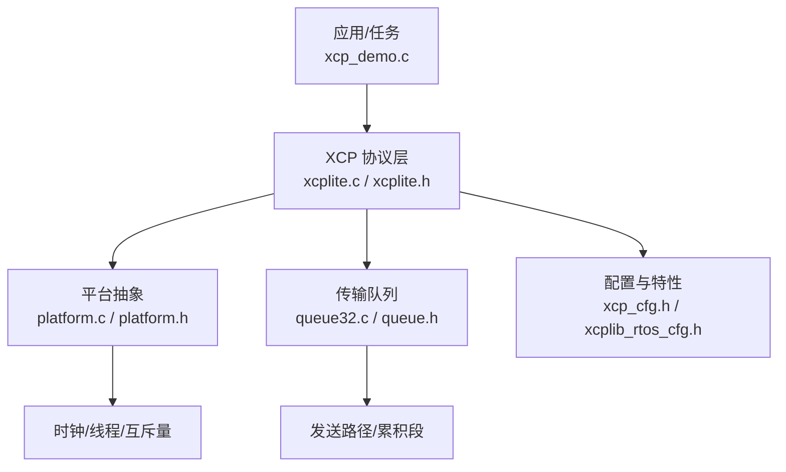
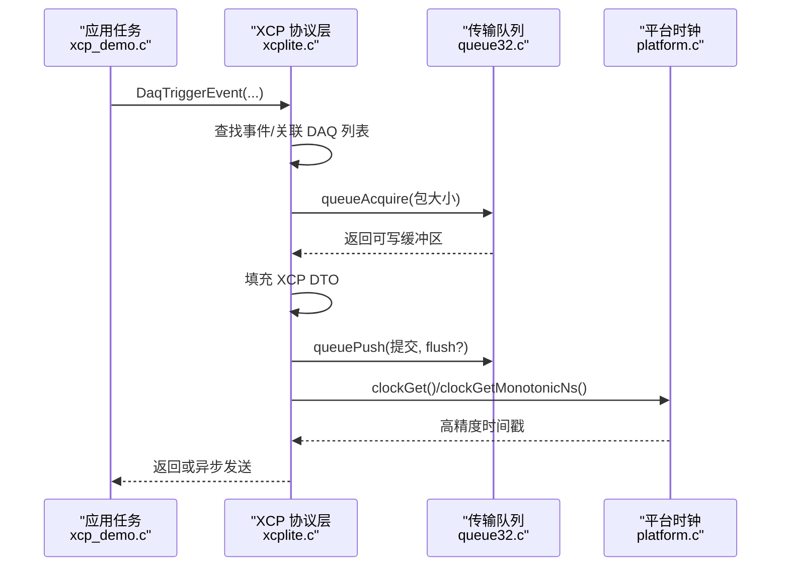
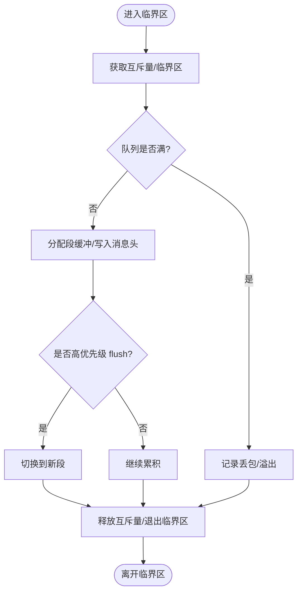
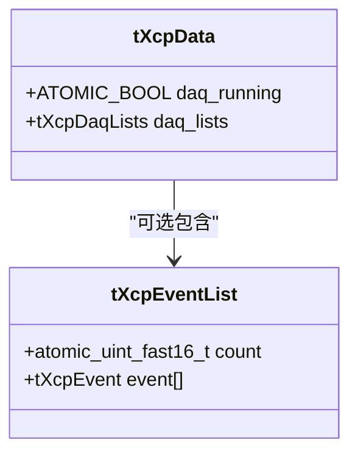
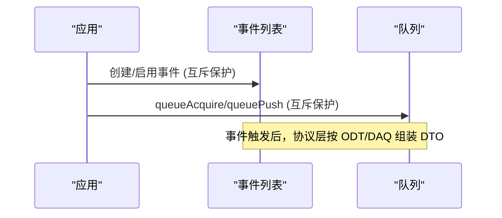
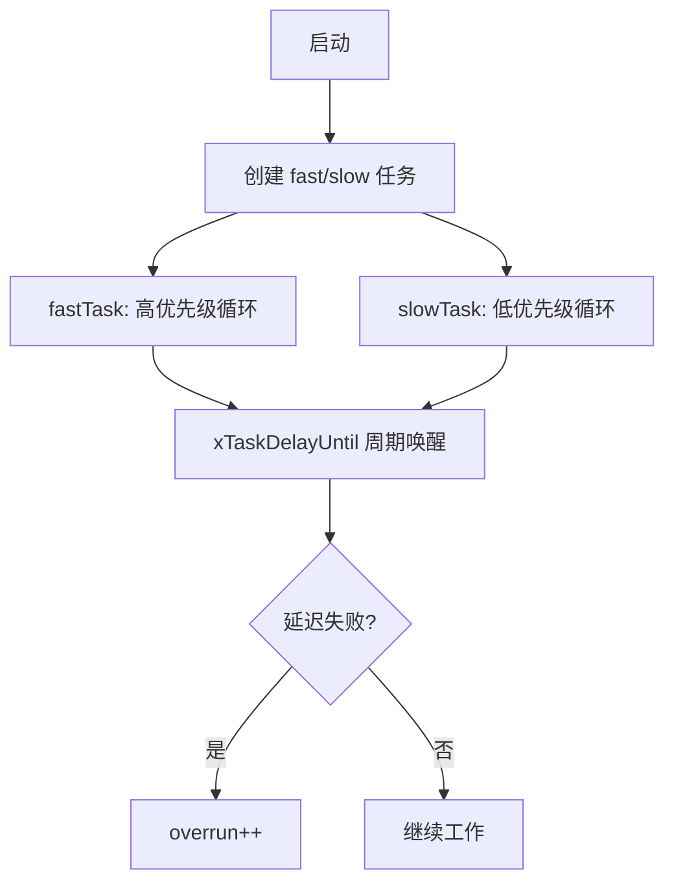
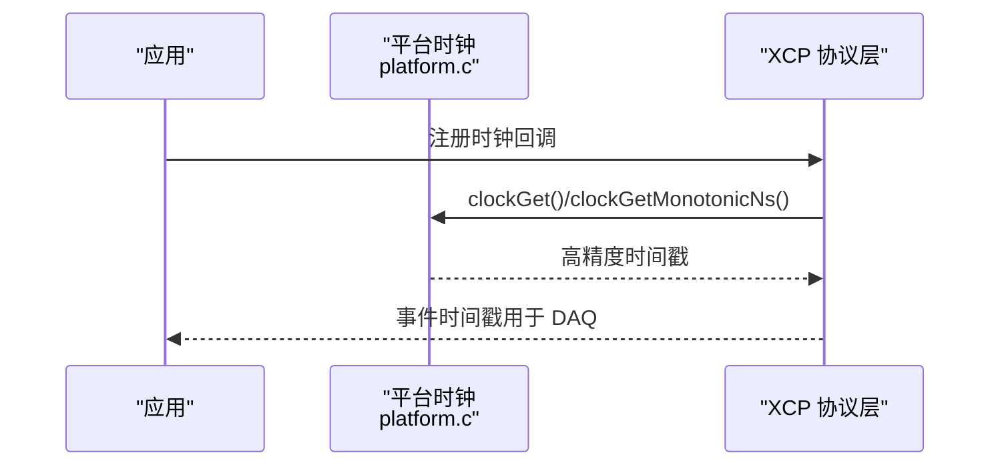
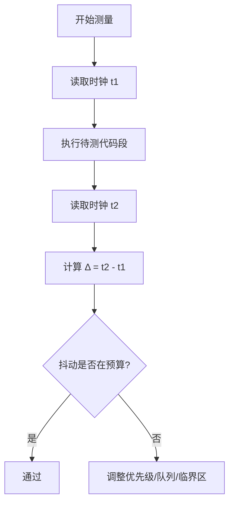
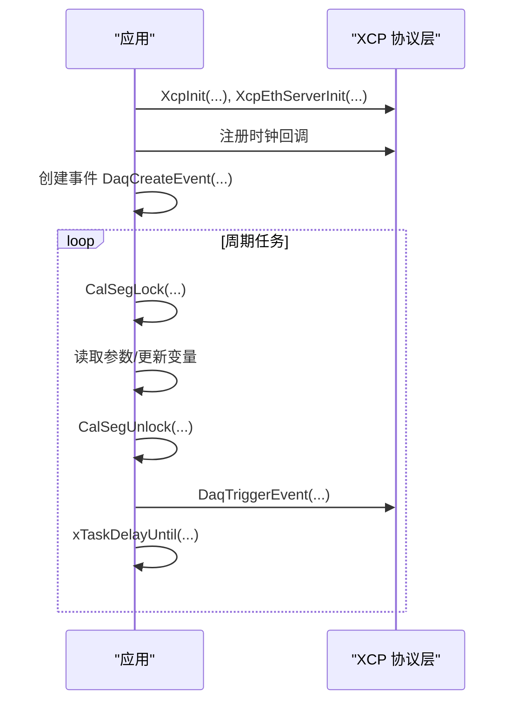
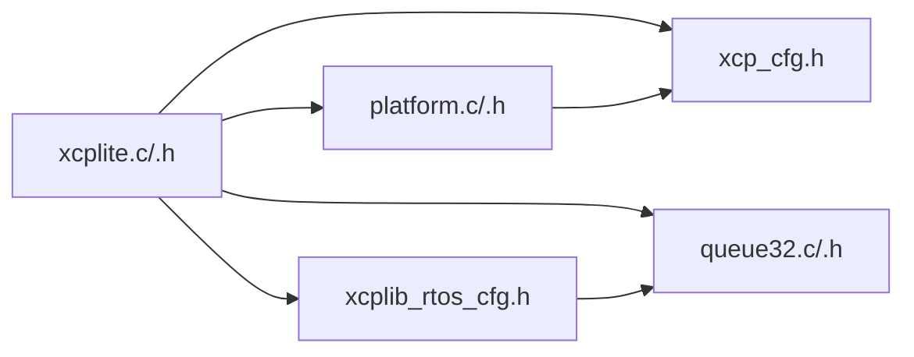

# 确定性执行时间

<cite>
**本文引用的文件**
- [xcplite.c](file://src/xcplite.c)
- [xcplite.h](file://src/xcplite.h)
- [platform.c](file://src/platform.c)
- [platform.h](file://src/platform.h)
- [xcp_cfg.h](file://src/xcp_cfg.h)
- [xcplib_rtos_cfg.h](file://src/xcplib_rtos_cfg.h)
- [queue32.c](file://src/queue32.c)
- [queue.h](file://src/queue.h)
- [xcp_demo.c](file://examples/freertos_demo/xcp_demo.c)
- [main.cpp](file://test/clock_test/src/main.cpp)
</cite>

## 目录
1. [简介](#简介)
2. [项目结构](#项目结构)
3. [核心组件](#核心组件)
4. [架构总览](#架构总览)
5. [详细组件分析](#详细组件分析)
6. [依赖关系分析](#依赖关系分析)
7. [性能考量](#性能考量)
8. [故障排查指南](#故障排查指南)
9. [结论](#结论)
10. [附录](#附录)

## 简介
本文件聚焦于 XCPlite 在实时与确定性执行方面的实现机制，重点覆盖：
- 中断禁用策略、临界区保护与原子操作的使用
- 关键代码段的识别与保护（自旋锁/互斥锁/内存屏障）
- 调度器集成（FreeRTOS 任务优先级、抢占式调度、时间片轮转优化）
- 高精度时钟系统（CLOCK_MONOTONIC_RAW 使用与纳秒级精度保证）
- 实时性测试方法（执行时间测量、抖动分析与性能基准）
- 确定性的 XCP 协议处理流程示例

## 项目结构
XCPlite 将“协议层”“平台抽象”“传输队列”“配置”“示例与测试”分层组织。与确定性执行密切相关的核心位置如下：
- 协议层状态与命令处理：src/xcplite.c, src/xcplite.h
- 平台抽象（时钟、线程、互斥量、共享内存等）：src/platform.c, src/platform.h
- 传输队列（多生产者单消费者，含消息累积与溢出统计）：src/queue32.c, src/queue.h
- 协议与特性配置（DAQ 事件、地址模式、时钟分辨率等）：src/xcp_cfg.h
- FreeRTOS 目标覆盖配置（栈大小、优先级、队列选择等）：src/xcplib_rtos_cfg.h
- 示例应用（事件触发、参数段锁定、任务周期控制）：examples/freertos_demo/xcp_demo.c
- 时钟同步与测试（单调时钟、PTP 信息、抖动注入）：test/clock_test/src/main.cpp

**图示来源**
- [xcplite.c:185-256](file://src/xcplite.c#L185-L256)
- [platform.c:435-653](file://src/platform.c#L435-L653)
- [queue32.c:85-100](file://src/queue32.c#L85-L100)
- [xcp_cfg.h:408-449](file://src/xcp_cfg.h#L408-L449)
- [xcplib_rtos_cfg.h:44-88](file://src/xcplib_rtos_cfg.h#L44-L88)

**章节来源**
- [xcplite.c:185-256](file://src/xcplite.c#L185-L256)
- [platform.c:435-653](file://src/platform.c#L435-L653)
- [queue32.c:85-100](file://src/queue32.c#L85-L100)
- [xcp_cfg.h:408-449](file://src/xcp_cfg.h#L408-L449)
- [xcplib_rtos_cfg.h:44-88](file://src/xcplib_rtos_cfg.h#L44-L88)

## 核心组件
- 协议层全局与进程本地状态：tXcpData（共享/跨进程安全字段）、tXcpLocalData（每进程私有）
- 事件列表与 DAQ 表：动态事件管理、ODT/DAQ 列表、事件到 DAQ 的映射
- 传输队列：多生产者单消费者，支持消息累积为段，提供溢出计数与 flush 语义
- 平台抽象：原子操作、互斥量、睡眠、时钟（单调/实时/自定义回调）
- 配置：DAQ 事件数量、内存布局、地址模式、时钟分辨率、PTP 支持等

**章节来源**
- [xcplite.h:382-495](file://src/xcplite.h#L382-L495)
- [xcplite.c:270-317](file://src/xcplite.c#L270-L317)
- [queue.h:1-55](file://src/queue.h#L1-L55)
- [platform.h:470-506](file://src/platform.h#L470-L506)

## 架构总览
下图展示从应用任务触发 DAQ 事件到协议层处理、队列写入、平台时钟读取的整体数据流。

**图示来源**
- [xcplite.c:779-800](file://src/xcplite.c#L779-L800)
- [queue32.c:207-304](file://src/queue32.c#L207-L304)
- [platform.c:600-653](file://src/platform.c#L600-L653)
- [xcp_demo.c:259-314](file://examples/freertos_demo/xcp_demo.c#L259-L314)

## 详细组件分析

### 中断禁用策略与临界区保护
- 互斥量用于保护队列和初始化阶段的关键区域，避免并发竞争。例如队列初始化、清空、获取/释放段缓冲时通过互斥量加锁。
- 在 FreeRTOS 目标上，队列实现可选择“临界区”而非互斥量，以缩短锁定序列的开销，适合极短临界区。
- 原子变量用于轻量级共享标志（如 daq_running、event_list.count），配合 acquire/release 内存序确保可见性。

**图示来源**
- [queue32.c:207-304](file://src/queue32.c#L207-L304)
- [queue32.c:333-417](file://src/queue32.c#L333-L417)
- [xcplib_rtos_cfg.h:126-135](file://src/xcplib_rtos_cfg.h#L126-L135)

**章节来源**
- [queue32.c:140-200](file://src/queue32.c#L140-L200)
- [queue32.c:207-304](file://src/queue32.c#L207-L304)
- [queue32.c:333-417](file://src/queue32.c#L333-L417)
- [xcplib_rtos_cfg.h:126-135](file://src/xcplib_rtos_cfg.h#L126-L135)

### 原子操作与内存屏障
- 事件计数采用原子加载/存储，并使用 memory_order_acquire/memory_order_release 保证跨线程可见性。
- 共享状态中的 daq_running 使用原子布尔，配合 relaxed 访问进行快速检查。
- 平台层对 Windows 提供原子内建模拟，确保 RMW 操作的内存屏障语义。

**图示来源**
- [xcplite.h:224-242](file://src/xcplite.h#L224-L242)
- [xcplite.h:382-423](file://src/xcplite.h#L382-L423)
- [xcplite.c:779-789](file://src/xcplite.c#L779-L789)
- [platform.h:520-672](file://src/platform.h#L520-L672)

**章节来源**
- [xcplite.c:779-789](file://src/xcplite.c#L779-L789)
- [xcplite.h:224-242](file://src/xcplite.h#L224-L242)
- [platform.h:520-672](file://src/platform.h#L520-L672)

### 关键代码段识别与保护
- 事件创建与列表更新：使用互斥量保护事件列表的增删改，避免多线程同时注册事件导致竞争。
- 校准段访问：通过 CalSegLock/CalSegUnlock 或 C++ 封装 lock() 提供无阻塞的原子锁定语义，确保读一致性。
- 队列操作：生产端通过互斥量保护段缓冲分配与提交；消费端由单线程顺序弹出并设置传输计数器。

**图示来源**
- [xcplite.c:792-800](file://src/xcplite.c#L792-L800)
- [queue32.c:207-304](file://src/queue32.c#L207-L304)
- [xcp_demo.c:272-301](file://examples/freertos_demo/xcp_demo.c#L272-L301)

**章节来源**
- [xcplite.c:792-800](file://src/xcplite.c#L792-L800)
- [queue32.c:207-304](file://src/queue32.c#L207-L304)
- [xcp_demo.c:272-301](file://examples/freertos_demo/xcp_demo.c#L272-L301)

### 调度器集成技术（FreeRTOS）
- 任务优先级：默认内部任务优先级基于 tskIDLE_PRIORITY+2，可通过配置调整。
- 抢占式调度：高优先级任务（如 fastTask）优先获得 CPU，低优先级任务（slowTask）周期性运行。
- 时间片轮转：使用 xTaskDelayUntil 精确唤醒，检测延迟失败以统计 overrun。
- 队列实现选择：FreeRTOS 目标可使用临界区替代互斥量，减少锁定开销。

**图示来源**
- [xcplib_rtos_cfg.h:44-53](file://src/xcplib_rtos_cfg.h#L44-L53)
- [xcp_demo.c:245-314](file://examples/freertos_demo/xcp_demo.c#L245-L314)
- [xcp_demo.c:318-388](file://examples/freertos_demo/xcp_demo.c#L318-L388)

**章节来源**
- [xcplib_rtos_cfg.h:44-53](file://src/xcplib_rtos_cfg.h#L44-L53)
- [xcp_demo.c:245-314](file://examples/freertos_demo/xcp_demo.c#L245-L314)
- [xcp_demo.c:318-388](file://examples/freertos_demo/xcp_demo.c#L318-L388)

### 时钟系统与高精度时间戳
- 平台时钟：
  - POSIX：默认使用 CLOCK_MONOTONIC_RAW（或根据配置选择），提供单调且不受 NTP 调整的时钟，纳秒级精度。
  - FreeRTOS：默认基于 tick 转换至配置的时钟分辨率（通常为 1us），可注册更高精度回调。
- 应用回调：通过 ApplXcpRegisterGetClockCallback 注册自定义时钟函数，使 XCP 事件时间戳与应用高精度时钟一致。
- 测试用例：clock_test 演示了系统单调时钟与 PTP 信息的集成，以及抖动/漂移注入。

**图示来源**
- [platform.c:505-653](file://src/platform.c#L505-L653)
- [platform.c:455-500](file://src/platform.c#L455-L500)
- [xcp_demo.c:51-56](file://examples/freertos_demo/xcp_demo.c#L51-L56)
- [main.cpp:158-209](file://test/clock_test/src/main.cpp#L158-L209)

**章节来源**
- [platform.c:505-653](file://src/platform.c#L505-L653)
- [platform.c:455-500](file://src/platform.c#L455-L500)
- [xcp_demo.c:51-56](file://examples/freertos_demo/xcp_demo.c#L51-L56)
- [main.cpp:158-209](file://test/clock_test/src/main.cpp#L158-L209)

### 实时性测试方法
- 执行时间测量：
  - 使用 ApplXcpGetClock64 或注册的时钟回调获取事件时间戳，比较两次调用差值评估处理耗时。
  - 在 fastTask 中二次触发事件以测量 DaqTriggerEvent 自身开销。
- 抖动分析：
  - 通过 clock_test 注入 jitter/drift/drift_drift，观察事件时间戳波动。
  - 统计 overrun 次数（xTaskDelayUntil 返回 pdFALSE）评估调度抖动。
- 性能基准：
  - 队列溢出计数（packets_lost）衡量发送路径瓶颈。
  - 日志级别与指标开关（TEST_ENABLE_DBG_METRICS）辅助定位热点。

**图示来源**
- [xcp_demo.c:300-314](file://examples/freertos_demo/xcp_demo.c#L300-L314)
- [main.cpp:329-395](file://test/clock_test/src/main.cpp#L329-L395)
- [queue32.c:333-417](file://src/queue32.c#L333-L417)

**章节来源**
- [xcp_demo.c:300-314](file://examples/freertos_demo/xcp_demo.c#L300-L314)
- [main.cpp:329-395](file://test/clock_test/src/main.cpp#L329-L395)
- [queue32.c:333-417](file://src/queue32.c#L333-L417)

### 确定性的 XCP 协议处理流程示例
- 初始化：设置项目名/EPK，初始化协议层，注册以太网服务器与高精度时钟回调。
- 事件定义：通过 DaqCreateEvent/DaqCreateAndTriggerEvent 创建并触发事件，捕获局部变量或全局变量。
- 参数段锁定：使用 CalSegLock/CalSegUnlock 或 C++ lock() 在无阻塞情况下读取校准参数，避免长临界区。
- 周期任务：使用 xTaskDelayUntil 保持严格周期，检测 overrun 并统计。

**图示来源**
- [xcp_demo.c:39-64](file://examples/freertos_demo/xcp_demo.c#L39-L64)
- [xcp_demo.c:259-314](file://examples/freertos_demo/xcp_demo.c#L259-L314)
- [xcp_demo.c:318-388](file://examples/freertos_demo/xcp_demo.c#L318-L388)

**章节来源**
- [xcp_demo.c:39-64](file://examples/freertos_demo/xcp_demo.c#L39-L64)
- [xcp_demo.c:259-314](file://examples/freertos_demo/xcp_demo.c#L259-L314)
- [xcp_demo.c:318-388](file://examples/freertos_demo/xcp_demo.c#L318-L388)

## 依赖关系分析
- 协议层依赖平台抽象（时钟、互斥量、原子）与传输队列（多生产者单消费者）。
- FreeRTOS 目标通过覆盖配置选择队列实现与任务优先级，确保资源受限环境下的确定性。
- 配置项决定地址模式、DAQ 内存布局、事件数量、时钟分辨率等，直接影响运行时行为。

**图示来源**
- [xcplite.c:49-85](file://src/xcplite.c#L49-L85)
- [xcplite.h:21-36](file://src/xcplite.h#L21-L36)
- [queue32.c:16-35](file://src/queue32.c#L16-L35)
- [xcp_cfg.h:14-30](file://src/xcp_cfg.h#L14-L30)
- [xcplib_rtos_cfg.h:44-88](file://src/xcplib_rtos_cfg.h#L44-L88)

**章节来源**
- [xcplite.c:49-85](file://src/xcplite.c#L49-L85)
- [xcplite.h:21-36](file://src/xcplite.h#L21-L36)
- [queue32.c:16-35](file://src/queue32.c#L16-L35)
- [xcp_cfg.h:14-30](file://src/xcp_cfg.h#L14-L30)
- [xcplib_rtos_cfg.h:44-88](file://src/xcplib_rtos_cfg.h#L44-L88)

## 性能考量
- 队列累积与 flush：在高优先级数据提交时强制切分新段，降低尾延迟。
- 临界区长度：FreeRTOS 目标可用临界区替代互斥量，缩短锁定时间。
- 原子访问：事件计数使用 acquire/release 语义，避免不必要的内存屏障。
- 时钟开销：使用 last-known 值减少 syscall 频率，必要时注册高精度回调。
- 溢出监控：packets_lost 与 overrun 统计帮助定位瓶颈。

[本节为通用指导，不直接分析具体文件]

## 故障排查指南
- 队列溢出：检查 queueLevel/packets_lost，增大队列或降低生产者负载。
- 事件未触发：确认事件已创建且关联 DAQ 列表，检查事件启用状态。
- 时钟异常：验证时钟回调注册与分辨率配置，对比系统单调时钟与 XCP 事件时间戳。
- 参数不一致：确保使用 CalSegLock/CalSegUnlock 或 lock() 访问校准段，避免竞态。

**章节来源**
- [queue32.c:333-417](file://src/queue32.c#L333-L417)
- [xcplite.c:779-800](file://src/xcplite.c#L779-L800)
- [platform.c:600-653](file://src/platform.c#L600-L653)
- [xcp_demo.c:272-301](file://examples/freertos_demo/xcp_demo.c#L272-L301)

## 结论
XCPlite 通过原子操作、互斥量/临界区保护、高精度时钟与可配置的调度策略，实现了确定性的 XCP 协议处理流程。结合队列累积与 flush、事件列表管理、以及严格的周期任务控制，能够在多种平台（POSIX/FreeRTOS）下提供稳定、可预测的实时性能。通过内置的测试与指标，用户可量化执行时间与抖动，进一步优化系统以满足严苛的实时需求。

[本节为总结，不直接分析具体文件]

## 附录
- 配置要点：
  - 时钟分辨率：OPTION_CLOCK_TICKS_1US/1NS 或自定义 CLOCK_TICKS_PER_S
  - 事件数量：OPTION_DAQ_EVENT_COUNT
  - DAQ 内存：OPTION_DAQ_MEM_SIZE
  - 地址模式：XCP_ADDRESS_MODE_XCPLITE__CASDD/ACSDD/CXSDD
- 推荐实践：
  - 使用 CalSegLock/CalSegUnlock 或 lock() 访问共享参数
  - 在高优先级路径避免长临界区，尽量使用原子与无锁队列
  - 定期统计 packets_lost 与 overrun，及时调整任务优先级与队列大小

[本节为补充说明，不直接分析具体文件]