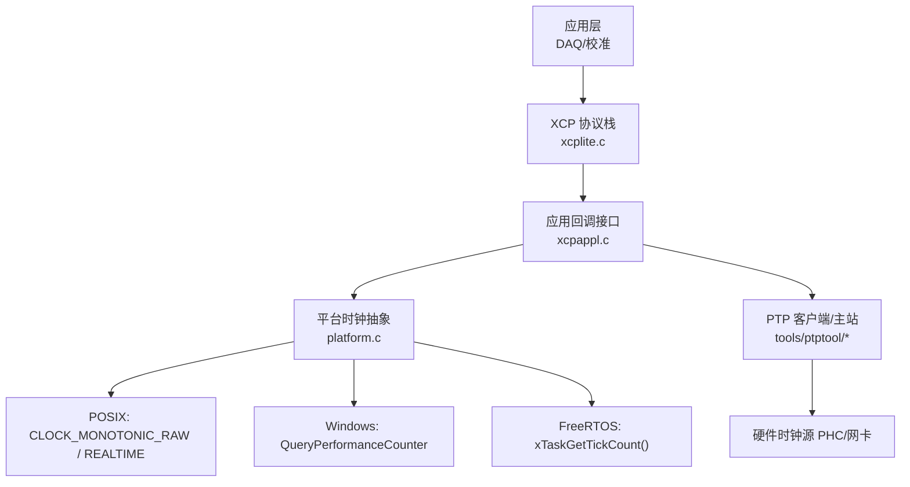
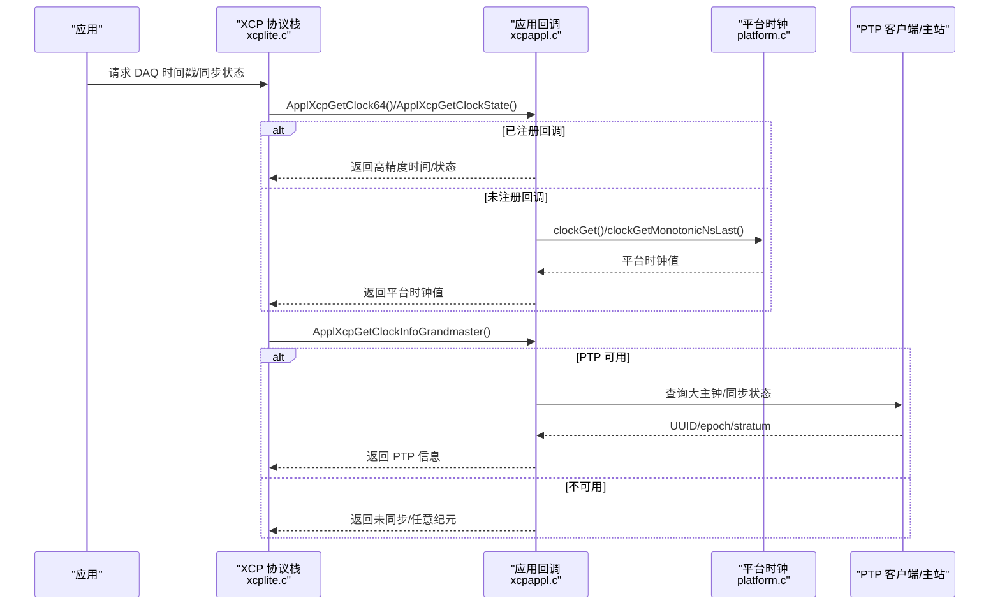
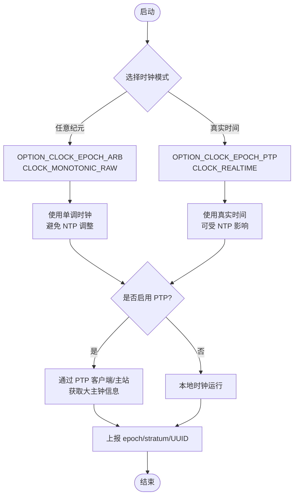
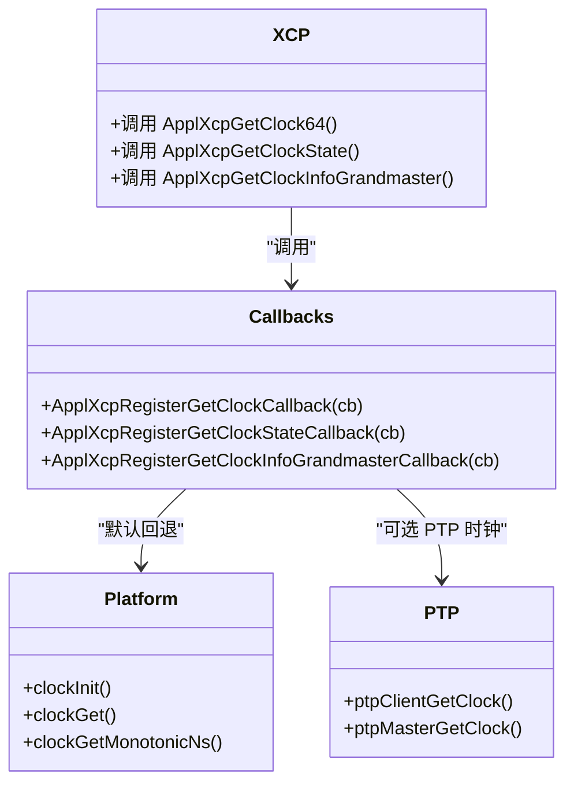
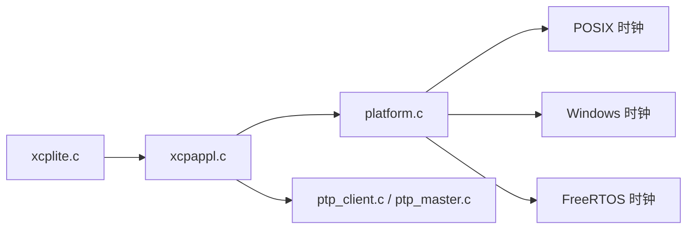

# 高精度时钟系统

<cite>
**本文引用的文件**
- [platform.c](file://src/platform.c)
- [xcplib.h](file://inc/xcplib.h)
- [xcpappl.c](file://src/xcpappl.c)
- [xcplite.c](file://src/xcplite.c)
- [clock64.h（ESP32）](file://examples/freertos_demo/freertos_esp32_demo/include/clock64.h)
- [clock64.c（ESP32）](file://examples/freertos_demo/freertos_esp32_demo/src/clock64.c)
- [clock64.h（STM32）](file://examples/freertos_demo/freertos_stm32_demo/Core/Inc/clock64.h)
- [clock64.c（STM32）](file://examples/freertos_demo/freertos_stm32_demo/Core/Src/clock64.c)
- [ptp.c](file://tools/ptptool/src/ptp/ptp.c)
- [ptp_client.c](file://tools/ptptool/src/ptp/ptp_client.c)
- [ptp_master.c](file://tools/ptptool/src/ptp/ptp_master.c)
- [main.cpp（PTP4L 示例）](file://examples/ptp4l_demo/src/main.cpp)
</cite>

## 目录
1. [简介](#简介)
2. [项目结构](#项目结构)
3. [核心组件](#核心组件)
4. [架构总览](#架构总览)
5. [详细组件分析](#详细组件分析)
6. [依赖关系分析](#依赖关系分析)
7. [性能考量](#性能考量)
8. [故障排查指南](#故障排查指南)
9. [结论](#结论)
10. [附录](#附录)

## 简介
本文件系统性阐述 XCPlite 的高精度时钟子系统，覆盖多平台时钟源选择、分辨率配置与纳秒级精度保证、时钟同步（PTP/NTP）、精度验证方法、回调机制与性能评估工具。目标是帮助开发者在不同目标平台（Linux/POSIX、Windows、FreeRTOS 嵌入式）上选择合适的时钟配置以满足实时性与时间一致性要求。

## 项目结构
XCPlite 的时钟能力由“平台抽象层 + 应用回调 + 协议集成”三部分构成：
- 平台抽象层：提供 clockGet/clockInit 等接口，封装 POSIX CLOCK_MONOTONIC_RAW、Windows QueryPerformanceCounter、FreeRTOS tick 计数器等底层实现。
- 应用回调：通过 ApplXcpRegister* 系列函数将上层时钟源（如 PTP 客户端或 DWT 高精度计数器）接入 XCP 数据采集与时间戳体系。
- 协议集成：XCP 在获取 DAQ 时钟、同步状态与大主钟信息时调用应用回调，从而将外部时间源纳入 XCP 报文。

图表来源
- [xcplite.c:2759-2876](file://src/xcplite.c#L2759-L2876)
- [xcpappl.c:126-157](file://src/xcpappl.c#L126-L157)
- [platform.c:455-800](file://src/platform.c#L455-L800)
- [ptp_client.c](file://tools/ptptool/src/ptp/ptp_client.c)
- [ptp_master.c](file://tools/ptptool/src/ptp/ptp_master.c)

章节来源
- [xcplite.c:2759-2876](file://src/xcplite.c#L2759-L2876)
- [xcpappl.c:126-157](file://src/xcpappl.c#L126-L157)
- [platform.c:455-800](file://src/platform.c#L455-L800)

## 核心组件
- 平台时钟抽象（platform.c）
  - FreeRTOS：基于 xTaskGetTickCount() 并转换为配置的 CLOCK_TICKS_PER_S 单位；建议注册更高精度回调。
  - POSIX：支持 CLOCK_MONOTONIC_RAW（默认无 NTP 调整）与 CLOCK_REALTIME（可受 NTP 影响），按选项选择纪元。
  - Windows：基于 QueryPerformanceCounter，初始化时计算频率换算因子与偏移，支持任意纪元或 UNIX 纪元。
- 应用回调（xcpappl.c + xcplib.h）
  - 注册时钟读取、时钟状态、大主钟信息的回调，供 XCP 在 DAQ 与同步相关命令中调用。
- 协议集成（xcplite.c）
  - 在 GET_DAQ_CLOCK_*、CRM_TIME_SYNCH_PROPERTIES 等流程中调用应用回调以获取时间与同步状态。

章节来源
- [platform.c:455-800](file://src/platform.c#L455-L800)
- [xcplib.h:945-987](file://inc/xcplib.h#L945-L987)
- [xcpappl.c:126-157](file://src/xcpappl.c#L126-L157)
- [xcplite.c:2759-2876](file://src/xcplite.c#L2759-L2876)

## 架构总览
下图展示从 XCP 协议到具体时钟源的调用链，以及 PTP 集成点。

图表来源
- [xcplite.c:2759-2876](file://src/xcplite.c#L2759-L2876)
- [xcpappl.c:126-157](file://src/xcpappl.c#L126-L157)
- [platform.c:455-800](file://src/platform.c#L455-L800)
- [ptp_client.c](file://tools/ptptool/src/ptp/ptp_client.c)
- [ptp_master.c](file://tools/ptptool/src/ptp/ptp_master.c)

## 详细组件分析

### 平台时钟源选择与实现
- FreeRTOS
  - 使用 xTaskGetTickCount() 作为基础计时源，并通过 tickToClockUnit_ 转换为配置的 CLOCK_TICKS_PER_S 单位。
  - 提供 clockGetLast() 缓存最近一次结果以降低系统调用开销。
  - 建议在资源受限场景下注册更高精度的回调（例如 DWT 或外设定时器）。
- POSIX（Linux/macOS/QNX）
  - 根据 OPTION_CLOCK_EPOCH_ARB/OPTION_CLOCK_EPOCH_PTP 选择 CLOCK_MONOTONIC_RAW 或 CLOCK_REALTIME。
  - 提供 monotonic/realtime 的 ns/us 访问接口与 Last 版本以减少 syscall。
  - 支持打印分辨率与初始时钟值用于调试。
- Windows
  - 使用 QueryPerformanceCounter 获取高性能计数器，初始化时计算 sFactor/sDivide/sOffset 以映射到 CLOCK_TICKS_PER_S。
  - 支持任意纪元或 UNIX 纪元显示与转换。

章节来源
- [platform.c:455-500](file://src/platform.c#L455-L500)
- [platform.c:505-654](file://src/platform.c#L505-L654)
- [platform.c:657-800](file://src/platform.c#L657-L800)

### 时钟分辨率与纳秒级精度保证
- 分辨率宏 CLOCK_TICKS_PER_S
  - 定义每秒刻度数，常见为 1e6（微秒）或 1e9（纳秒）。
  - platform.c 中对 1ns/1us 两种分辨率进行编译期分支处理，确保正确转换。
- 精度保证机制
  - POSIX：优先使用 CLOCK_MONOTONIC_RAW 避免 NTP 调整带来的漂移；提供 monotonic/realtime 双通道。
  - Windows：通过高精度性能计数器与初始化偏移计算，达到亚毫秒至纳秒级映射。
  - FreeRTOS：tick 粒度受 configTICK_RATE_HZ 限制，建议注册更高精度回调以获得稳定高分辨率。
- 嵌入式高分辨率时钟（DWT/ESP-IDF）
  - STM32：基于 DWT CYCCNT 构建 64 位微秒级时钟，支持 CONVERT_TO_US 编译开关，使用整数运算避免浮点与累积误差。
  - ESP32：基于 esp_timer_get_time() 提供 1us 分辨率的高精度时钟。

章节来源
- [platform.c:438-443](file://src/platform.c#L438-L443)
- [platform.c:600-625](file://src/platform.c#L600-L625)
- [platform.c:693-783](file://src/platform.c#L693-L783)
- [clock64.h（STM32）:1-26](file://examples/freertos_demo/freertos_stm32_demo/Core/Inc/clock64.h#L1-L26)
- [clock64.c（STM32）:1-77](file://examples/freertos_demo/freertos_stm32_demo/Core/Src/clock64.c#L1-L77)
- [clock64.h（ESP32）:1-11](file://examples/freertos_demo/freertos_esp32_demo/include/clock64.h#L1-L11)
- [clock64.c（ESP32）:1-22](file://examples/freertos_demo/freertos_esp32_demo/src/clock64.c#L1-L22)

### 时钟同步技术（PTP/NTP 与跨平台一致性）
- PTP 集成
  - 应用可通过 ApplXcpRegisterGetClockInfoGrandmasterCallback 提供大主钟 UUID、epoch、stratum 等信息。
  - tools/ptptool 提供 PTP 客户端/主站/观察者实现，可与网络 PHC 交互，获得高精度时间同步。
  - 示例 ptp4l_demo 中将 PTP 时钟回调注册到 XCP，使 DAQ 时间戳与 PTP 对齐。
- NTP 与跨平台一致性
  - POSIX 的 CLOCK_REALTIME 可能受 NTP 调整影响；若需稳定单调时间，应使用 CLOCK_MONOTONIC_RAW。
  - 通过统一的应用回调与 XCP 协议字段，可在不同平台上向主机报告一致的同步状态与时钟信息。

图表来源
- [xcplib.h:953-987](file://inc/xcplib.h#L953-L987)
- [xcplite.c:2759-2876](file://src/xcplite.c#L2759-L2876)
- [ptp_client.c](file://tools/ptptool/src/ptp/ptp_client.c)
- [ptp_master.c](file://tools/ptptool/src/ptp/ptp_master.c)
- [main.cpp（PTP4L 示例）:146](file://examples/ptp4l_demo/src/main.cpp#L146)

章节来源
- [xcplib.h:953-987](file://inc/xcplib.h#L953-L987)
- [xcplite.c:2759-2876](file://src/xcplite.c#L2759-L2876)
- [main.cpp（PTP4L 示例）:146](file://examples/ptp4l_demo/src/main.cpp#L146)

### 时钟精度验证方法
- 时钟漂移检测
  - 对比单调时钟与真实时间的长期偏差，结合 PTP stratum/epoch 判断是否发生跳变或漂移。
  - 利用 clockGetMonotonicNsLast/clockGetRealtimeNsLast 减少 syscall 开销的同时进行采样统计。
- 频率校准
  - 在 Windows 平台，初始化阶段计算性能计数器到 CLOCK_TICKS_PER_S 的换算因子与偏移，确保映射准确。
  - 在 FreeRTOS 平台，建议使用 DWT 或外设定时器替代 tick 计数，降低粒度限制。
- 时间戳准确性测试
  - 使用 PTP 主站/客户端对端比对，或在同一节点内比较不同时钟源（monotonic vs realtime）的一致性。
  - 借助 tools/ptptool 进行端到端测量与可视化。

章节来源
- [platform.c:627-654](file://src/platform.c#L627-L654)
- [platform.c:693-783](file://src/platform.c#L693-L783)
- [xcplib.h:1058-1066](file://inc/xcplib.h#L1058-L1066)

### 时钟回调机制（高精度定时器注册、事件触发、中断服务优化）
- 回调注册
  - 通过 ApplXcpRegisterGetClockCallback 替换 ApplXcpGetClock64 的数据源，使其返回 1/CLOCK_TICKS_PER_S 刻度的时间值。
  - 通过 ApplXcpRegisterGetClockStateCallback 与 ApplXcpRegisterGetClockInfoGrandmasterCallback 提供同步状态与大主钟信息。
- 事件触发与 ISR 优化
  - 在 FreeRTOS 上，Tick 粒度有限，ISR 中应避免复杂操作；推荐在任务或专用上下文中维护高精度时钟（如 DWT 更新）。
  - 使用 clockGetLast() 缓存最近值，减少高频调用时的系统开销。
- 示例
  - freertos_demo 中将 Clock64_Get 注册为 XCP 时钟回调，使 DAQ 时间戳具备微秒级精度。
  - ptp4l_demo 中将 PTP 客户端提供的时钟回调注册到 XCP，实现网络时间对齐。

图表来源
- [xcplib.h:945-987](file://inc/xcplib.h#L945-L987)
- [xcpappl.c:126-157](file://src/xcpappl.c#L126-L157)
- [platform.c:455-800](file://src/platform.c#L455-L800)
- [ptp_client.c](file://tools/ptptool/src/ptp/ptp_client.c)
- [ptp_master.c](file://tools/ptptool/src/ptp/ptp_master.c)

章节来源
- [xcplib.h:945-987](file://inc/xcplib.h#L945-L987)
- [xcpappl.c:126-157](file://src/xcpappl.c#L126-L157)
- [platform.c:455-800](file://src/platform.c#L455-L800)

## 依赖关系分析
- 模块耦合
  - xcplite.c 依赖 xcpappl.c 暴露的回调接口；xcpappl.c 在缺省情况下回退到 platform.c 的时钟实现。
  - platform.c 根据编译选项与平台宏选择具体时钟源。
- 外部依赖
  - POSIX：time.h、unistd.h 等系统库。
  - Windows：Win32 Performance Counter API。
  - FreeRTOS：xTaskGetTickCount() 及 configTICK_RATE_HZ。
  - PTP：tools/ptptool 中的客户端/主站实现。

图表来源
- [xcplite.c:2759-2876](file://src/xcplite.c#L2759-L2876)
- [xcpappl.c:126-157](file://src/xcpappl.c#L126-L157)
- [platform.c:455-800](file://src/platform.c#L455-L800)
- [ptp_client.c](file://tools/ptptool/src/ptp/ptp_client.c)
- [ptp_master.c](file://tools/ptptool/src/ptp/ptp_master.c)

章节来源
- [xcplite.c:2759-2876](file://src/xcplite.c#L2759-L2876)
- [xcpappl.c:126-157](file://src/xcpappl.c#L126-L157)
- [platform.c:455-800](file://src/platform.c#L455-L800)

## 性能考量
- 系统调用优化
  - 使用 clockGetLast()/MonotonicNsLast()/RealtimeNsLast() 缓存最近时钟值，减少频繁 syscall。
- 平台差异
  - POSIX：CLOCK_MONOTONIC_RAW 更稳定；CLOCK_REALTIME 可能受 NTP 影响。
  - Windows：QueryPerformanceCounter 提供高精度计数，但需注意频率与偏移初始化。
  - FreeRTOS：tick 粒度受限，建议注册 DWT/定时器回调以提升分辨率。
- 回调设计
  - 回调函数应尽量轻量，避免阻塞；ISR 中仅做最小必要工作，复杂逻辑放入任务上下文。

[本节为通用指导，不直接分析具体文件]

## 故障排查指南
- 常见问题
  - 未定义时钟纪元选项导致编译错误：需在 POSIX 平台定义 OPTION_CLOCK_EPOCH_ARB 或 OPTION_CLOCK_EPOCH_PTP。
  - 分辨率不匹配：CLOCK_TICKS_PER_S 必须为 1e6 或 1e9，否则编译报错。
  - Windows 性能计数器不可用：检查系统支持与返回值。
- 诊断步骤
  - 启用调试日志查看时钟分辨率与初始值。
  - 对比单调时钟与真实时间，识别 NTP 调整导致的跳变。
  - 在 FreeRTOS 上确认是否已注册高精度回调，避免 tick 粒度限制。
- 参考定位
  - 平台初始化与错误输出位于 platform.c 的 clockInit 分支。
  - 回调注册与默认回退逻辑位于 xcpappl.c。

章节来源
- [platform.c:505-549](file://src/platform.c#L505-L549)
- [platform.c:600-625](file://src/platform.c#L600-L625)
- [platform.c:693-783](file://src/platform.c#L693-L783)
- [xcpappl.c:126-157](file://src/xcpappl.c#L126-L157)

## 结论
XCPlite 的高精度时钟系统通过平台抽象与应用回调解耦了底层时钟源与上层协议需求。开发者可根据目标平台选择合适的时钟源（POSIX MONOTONIC_RAW、Windows QPC、FreeRTOS tick/DWT），并通过 PTP 集成实现跨设备时间一致性。合理配置 CLOCK_TICKS_PER_S、使用 Last 缓存与回调机制，可在保证精度的同时控制运行时开销。

[本节为总结性内容，不直接分析具体文件]

## 附录
- 使用示例
  - 在 freertos_demo 中将 Clock64_Get 注册为 XCP 时钟回调，获得微秒级 DAQ 时间戳。
  - 在 ptp4l_demo 中将 PTP 客户端提供的时钟回调注册到 XCP，实现网络时间对齐。
- 工具与参考
  - tools/ptptool：提供 PTP 客户端/主站/观察者，可用于时间同步与精度验证。
  - 文档与配置：参考 xcplib_cfg.md 中关于时钟纪元选项的说明。

章节来源
- [xcplib.h:945-987](file://inc/xcplib.h#L945-L987)
- [main.cpp（PTP4L 示例）:146](file://examples/ptp4l_demo/src/main.cpp#L146)
- [ptp_client.c](file://tools/ptptool/src/ptp/ptp_client.c)
- [ptp_master.c](file://tools/ptptool/src/ptp/ptp_master.c)