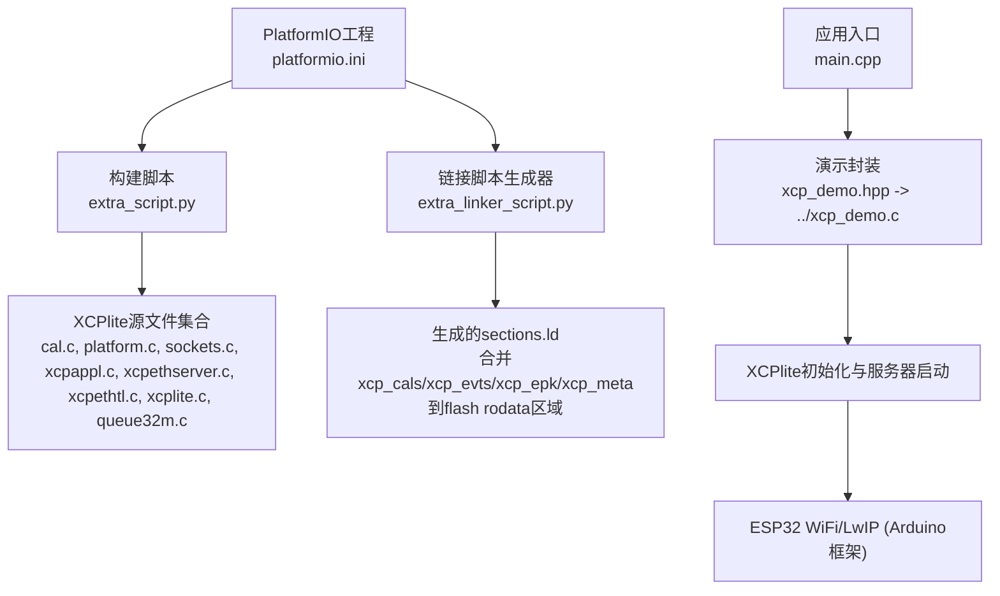
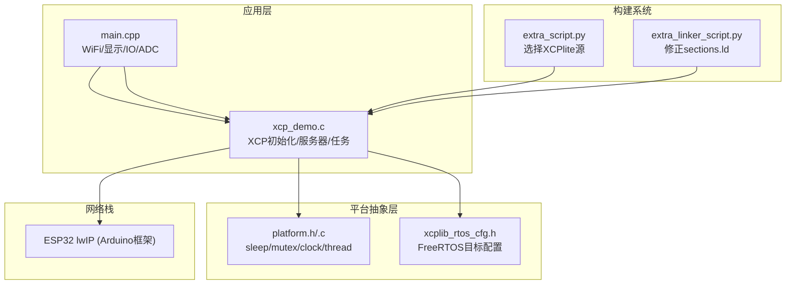
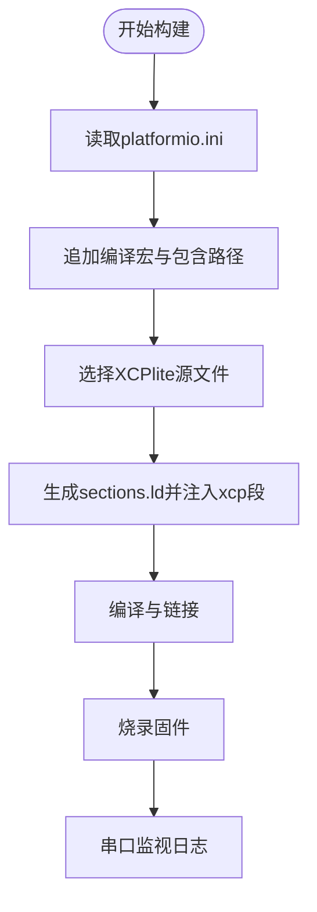
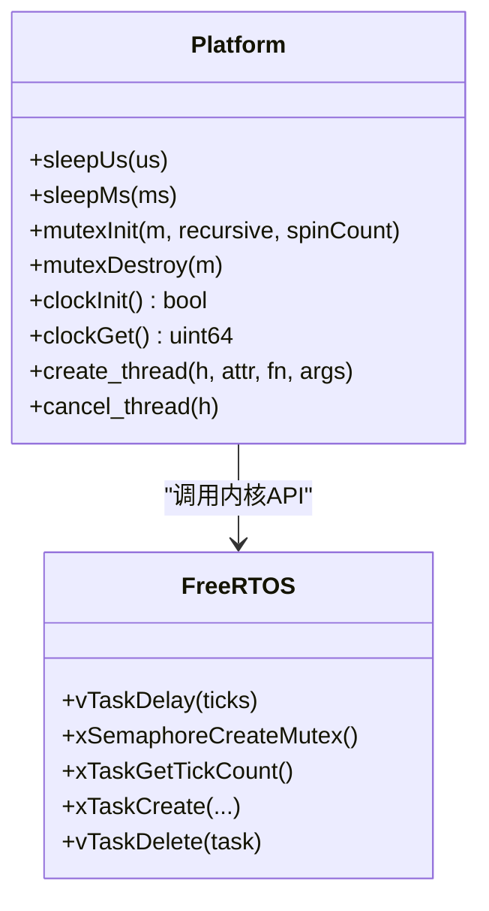
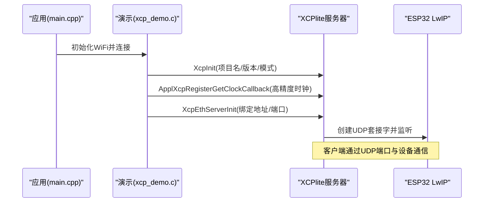
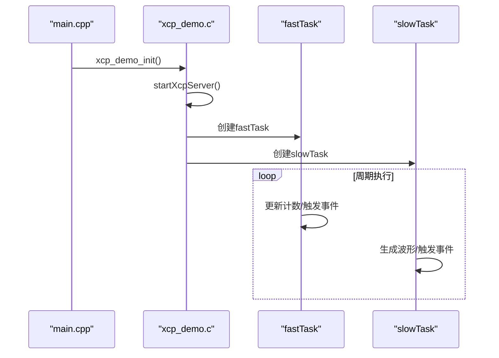
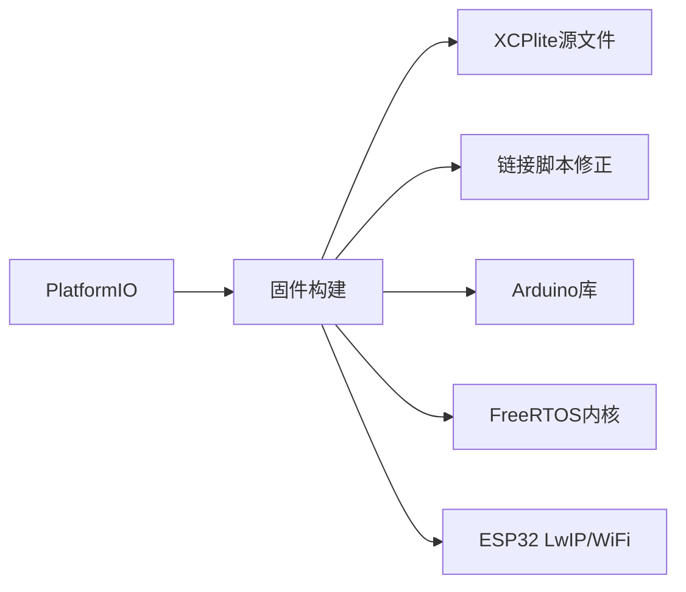

# ESP32平台移植

<cite>
**本文引用的文件**
- [platformio.ini](file://examples/freertos_demo/freertos_esp32_demo/platformio.ini)
- [extra_script.py](file://examples/freertos_demo/freertos_esp32_demo/extra_script.py)
- [extra_linker_script.py](file://examples/freertos_demo/freertos_esp32_demo/extra_linker_script.py)
- [README.md](file://examples/freertos_demo/freertos_esp32_demo/README.md)
- [main.cpp](file://examples/freertos_demo/freertos_esp32_demo/src/main.cpp)
- [xcp_demo.hpp](file://examples/freertos_demo/freertos_esp32_demo/include/xcp_demo.hpp)
- [xcp_demo.c](file://examples/freertos_demo/xcp_demo.c)
- [platform.h](file://src/platform.h)
- [platform.c](file://src/platform.c)
- [xcplib_rtos_cfg.h](file://src/xcplib_rtos_cfg.h)
- [socket_raw_hal.h](file://src/socket_raw_hal.h)
</cite>

## 目录
1. [简介](#简介)
2. [项目结构](#项目结构)
3. [核心组件](#核心组件)
4. [架构总览](#架构总览)
5. [详细组件分析](#详细组件分析)
6. [依赖关系分析](#依赖关系分析)
7. [性能考虑](#性能考虑)
8. [故障排除指南](#故障排除指南)
9. [结论](#结论)
10. [附录](#附录)

## 简介
本文件系统性阐述XCPlite在ESP32平台上的完整移植与实现细节，覆盖PlatformIO工程配置、链接脚本修改、硬件抽象层（HAL）与FreeRTOS集成、ESP32网络栈（LwIP）使用方式、以太网接口初始化流程、中断与定时器相关要点、内存管理策略（SRAM/PSRAM）、构建流程（工具链、依赖、编译）、以及调试技巧（串口日志、内存分析与性能监控）。文档同时提供可操作的部署步骤与常见问题排查方法，帮助开发者在ESP32上稳定部署并高效调试XCPlite。

## 项目结构
ESP32示例位于 examples/freertos_demo/freertos_esp32_demo，采用PlatformIO + Arduino框架，通过自定义脚本将XCPlite源码纳入构建，并通过额外链接脚本修正ESP-IDF的sections.ld以正确放置XCP元数据段。应用层通过WiFi连接建立UDP服务，启动XCPlite服务器，并在FreeRTOS任务中运行DAQ事件与校准参数访问。

图表来源
- [platformio.ini:11-43](file://examples/freertos_demo/freertos_esp32_demo/platformio.ini#L11-L43)
- [extra_script.py:1-29](file://examples/freertos_demo/freertos_esp32_demo/extra_script.py#L1-L29)
- [extra_linker_script.py:1-73](file://examples/freertos_demo/freertos_esp32_demo/extra_linker_script.py#L1-L73)
- [main.cpp:377-415](file://examples/freertos_demo/freertos_esp32_demo/src/main.cpp#L377-L415)
- [xcp_demo.c:39-65](file://examples/freertos_demo/xcp_demo.c#L39-L65)

章节来源
- [platformio.ini:11-43](file://examples/freertos_demo/freertos_esp32_demo/platformio.ini#L11-L43)
- [extra_script.py:1-29](file://examples/freertos_demo/freertos_esp32_demo/extra_script.py#L1-L29)
- [extra_linker_script.py:1-73](file://examples/freertos_demo/freertos_esp32_demo/extra_linker_script.py#L1-L73)
- [README.md:83-169](file://examples/freertos_demo/freertos_esp32_demo/README.md#L83-L169)

## 核心组件
- PlatformIO工程配置：定义目标板、框架、编译宏、库依赖、上传与监视端口等。
- XCPlite源码选择与包含：通过extra_script.py将必要的XCPlite源文件加入构建。
- 链接脚本修正：通过extra_linker_script.py生成局部sections.ld，确保xcp_cals、xcp_evts、xcp_epk、xcp_meta与ESP-IDF的.flash.rodata相邻且对齐，避免DROM分段映射错误。
- 应用入口与WiFi初始化：main.cpp负责串口、显示、IO、模拟输入、WiFi连接与XCPlite演示初始化。
- 演示逻辑与XCP服务器：xcp_demo.c完成XCP初始化、注册高精度时钟回调、启动以太网服务器、创建演示任务。
- 平台抽象层（HAL）：platform.h/.c提供FreeRTOS下的sleep、mutex、clock、线程创建等抽象；xcplib_rtos_cfg.h提供FreeRTOS目标专用配置。

章节来源
- [platformio.ini:11-43](file://examples/freertos_demo/freertos_esp32_demo/platformio.ini#L11-L43)
- [extra_script.py:13-28](file://examples/freertos_demo/freertos_esp32_demo/extra_script.py#L13-L28)
- [extra_linker_script.py:8-73](file://examples/freertos_demo/freertos_esp32_demo/extra_linker_script.py#L8-L73)
- [main.cpp:377-415](file://examples/freertos_demo/freertos_esp32_demo/src/main.cpp#L377-L415)
- [xcp_demo.c:39-65](file://examples/freertos_demo/xcp_demo.c#L39-L65)
- [platform.h:303-451](file://src/platform.h#L303-L451)
- [platform.c:78-155](file://src/platform.c#L78-L155)
- [xcplib_rtos_cfg.h:44-142](file://src/xcplib_rtos_cfg.h#L44-L142)

## 架构总览
ESP32示例基于Arduino框架与ESP32 FreeRTOS/lwIP运行时。应用层通过WiFi连接后绑定UDP端口，启动XCPlite以太网服务器；平台抽象层提供FreeRTOS原语（任务、信号量、时钟），XCPlite通过lwIP socket API进行UDP通信。链接阶段通过脚本保证XCP元数据段与ESP-IDF闪存布局兼容。

图表来源
- [main.cpp:377-415](file://examples/freertos_demo/freertos_esp32_demo/src/main.cpp#L377-L415)
- [xcp_demo.c:39-65](file://examples/freertos_demo/xcp_demo.c#L39-L65)
- [platform.h:303-451](file://src/platform.h#L303-L451)
- [platform.c:78-155](file://src/platform.c#L78-L155)
- [xcplib_rtos_cfg.h:44-142](file://src/xcplib_rtos_cfg.h#L44-L142)
- [extra_script.py:13-28](file://examples/freertos_demo/freertos_esp32_demo/extra_script.py#L13-L28)
- [extra_linker_script.py:8-73](file://examples/freertos_demo/freertos_esp32_demo/extra_linker_script.py#L8-L73)

## 详细组件分析

### PlatformIO工程配置与构建流程
- 目标与框架：指定espressif32平台与lilygo-t-display-s3板型，使用Arduino框架。
- 编译宏：启用_FREE_RTOS、XCPLITE_CONFIGURATION=rtos、XCPLIB_CFG_OVERRIDE指向xcplib_rtos_cfg.h，可选OPTION_DISPLAY、OPTION_IO等。
- 库依赖：LovyanGFX用于显示，ADS1X15用于模拟输入。
- 构建脚本：extra_script.py将XCPlite必要源文件加入构建路径与编译列表。
- 链接脚本：extra_linker_script.py生成sections.ld，将xcp_cals、xcp_evts放入.flash.rodata起始处，并将xcp_epk、xcp_meta放在其后，保持对齐与相邻，避免ESP-IDF DROM映射问题。

图表来源
- [platformio.ini:11-43](file://examples/freertos_demo/freertos_esp32_demo/platformio.ini#L11-L43)
- [extra_script.py:1-29](file://examples/freertos_demo/freertos_esp32_demo/extra_script.py#L1-L29)
- [extra_linker_script.py:8-73](file://examples/freertos_demo/freertos_esp32_demo/extra_linker_script.py#L8-L73)

章节来源
- [platformio.ini:11-43](file://examples/freertos_demo/freertos_esp32_demo/platformio.ini#L11-L43)
- [extra_script.py:1-29](file://examples/freertos_demo/freertos_esp32_demo/extra_script.py#L1-L29)
- [extra_linker_script.py:8-73](file://examples/freertos_demo/freertos_esp32_demo/extra_linker_script.py#L8-L73)
- [README.md:151-199](file://examples/freertos_demo/freertos_esp32_demo/README.md#L151-L199)

### 链接脚本修改与XCP元数据段布局
- 目的：确保xcp_cals、xcp_evts、xcp_epk、xcp_meta与ESP-IDF的.flash.rodata相邻并保持对齐，避免多DROM段导致启动崩溃。
- 机制：从ESP-IDF的sections.ld复制并插入标记位置，添加边界符号__start_xcp_*与__stop_xcp_*，保留独立输出段名称以便xcpclient定位。
- 影响：这些段在初始化时被读取并驻留在缓存映射的Flash中，不长期占用内部RAM。

章节来源
- [extra_linker_script.py:8-73](file://examples/freertos_demo/freertos_esp32_demo/extra_linker_script.py#L8-L73)
- [README.md:307-338](file://examples/freertos_demo/freertos_esp32_demo/README.md#L307-L338)

### 硬件抽象层（FreeRTOS）与平台API
- 睡眠与时序：sleepUs/sleepMs基于FreeRTOS TickType_t转换，最小粒度为configTICK_RATE_HZ。
- 互斥锁：MUTEX封装FreeRTOS信号量，支持递归与非递归，静态分配或动态分配。
- 时钟：FreeRTOS clockInit/clockGet基于xTaskGetTickCount，支持CLOCK_TICKS_PER_S分辨率；可通过ApplXcpRegisterGetClockCallback注册更高精度时钟。
- 线程：create_thread/join_thread/cancel_thread适配FreeRTOS任务创建与删除；ESP_PLATFORM下堆栈深度按字节计算。

图表来源
- [platform.c:78-155](file://src/platform.c#L78-L155)
- [platform.c:370-432](file://src/platform.c#L370-L432)
- [platform.c:455-500](file://src/platform.c#L455-L500)
- [platform.h:303-451](file://src/platform.h#L303-L451)

章节来源
- [platform.c:78-155](file://src/platform.c#L78-L155)
- [platform.c:370-432](file://src/platform.c#L370-L432)
- [platform.c:455-500](file://src/platform.c#L455-L500)
- [platform.h:303-451](file://src/platform.h#L303-L451)

### ESP32网络栈配置（LwIP）与以太网接口初始化
- 使用方式：ESP32示例通过Arduino框架提供的WiFi与LwIP套接字API进行UDP通信；XCPlite在FreeRTOS目标下启用OPTION_FREERTOS_LWIP，使用lwIP socket API。
- 服务器初始化：xcp_demo.c调用XcpEthServerInit绑定任意地址与端口，监听UDP请求。
- 以太网接口：ESP32由Arduino/WiFi驱动底层以太网接口，应用无需直接操作HAL；若需原始以太网帧传输，可使用socket_raw HAL（当前Linux后端可用，ESP32需外部实现）。

图表来源
- [main.cpp:377-415](file://examples/freertos_demo/freertos_esp32_demo/src/main.cpp#L377-L415)
- [xcp_demo.c:39-65](file://examples/freertos_demo/xcp_demo.c#L39-L65)
- [xcplib_rtos_cfg.h:54-88](file://src/xcplib_rtos_cfg.h#L54-L88)
- [socket_raw_hal.h:47-63](file://src/socket_raw_hal.h#L47-L63)

章节来源
- [xcp_demo.c:39-65](file://examples/freertos_demo/xcp_demo.c#L39-L65)
- [xcplib_rtos_cfg.h:54-88](file://src/xcplib_rtos_cfg.h#L54-L88)
- [socket_raw_hal.h:47-63](file://src/socket_raw_hal.h#L47-L63)

### 中断处理与定时器配置
- 中断：ESP32示例未直接实现以太网接收中断；数据包由LwIP/Arduino WiFi栈处理并投递至套接字接收队列。
- 定时器：FreeRTOS任务使用xTaskDelayUntil实现周期性调度；XCPlite DAQ时钟默认基于Tick，可通过ApplXcpRegisterGetClockCallback注册更高精度时钟（如ESP32硬件定时器）。
- 注意：在高负载场景下，建议评估Tick频率与任务优先级，避免超时与丢包。

章节来源
- [platform.c:455-500](file://src/platform.c#L455-L500)
- [xcp_demo.c:51-56](file://examples/freertos_demo/xcp_demo.c#L51-L56)
- [xcp_demo.c:245-315](file://examples/freertos_demo/xcp_demo.c#L245-L315)

### 内存管理策略（SRAM与PSRAM优化）
- 配置目标：FreeRTOS目标减少内存占用，关闭TCP、PTP、文件系统、A2L生成/上传等功能，使用绝对寻址与固定大小队列。
- 队列与DAQ：使用32位无锁队列（OPTION_QUEUE_32）与临界区替代互斥，降低开销；DAQ内存与事件数量可调以适应SRAM限制。
- 校准段：校准段内存分配器大小与数量受限，避免过大占用；元数据段驻留Flash，不常驻RAM。
- PSRAM：示例未显式启用PSRAM；如需扩展内存，可在ESP-IDF/Arduino配置中启用PSRAM，并确保XCPlite分配的缓冲区与队列大小合理。

章节来源
- [xcplib_rtos_cfg.h:80-142](file://src/xcplib_rtos_cfg.h#L80-L142)
- [platform.h:381-418](file://src/platform.h#L381-L418)
- [README.md:307-338](file://examples/freertos_demo/freertos_esp32_demo/README.md#L307-L338)

### 应用层与演示任务
- main.cpp：初始化串口、显示、IO、ADC，连接WiFi，启动xcp_demo_init。
- xcp_demo.c：设置日志级别、创建EPK、初始化XCP、注册高精度时钟、启动以太网服务器、创建fastTask与slowTask，演示DAQ事件与校准参数访问。
- 任务行为：fastTask周期性递增计数器并触发事件；slowTask生成正弦波并更新通道值，同时触发事件。

图表来源
- [main.cpp:377-415](file://examples/freertos_demo/freertos_esp32_demo/src/main.cpp#L377-L415)
- [xcp_demo.c:245-389](file://examples/freertos_demo/xcp_demo.c#L245-L389)

章节来源
- [main.cpp:377-415](file://examples/freertos_demo/freertos_esp32_demo/src/main.cpp#L377-L415)
- [xcp_demo.c:245-389](file://examples/freertos_demo/xcp_demo.c#L245-L389)

## 依赖关系分析
- 构建依赖：PlatformIO框架、ESP32工具链、Arduino库（WiFi、LovyanGFX、ADS1X15）。
- 源码依赖：XCPlite核心模块（xcplite.c、xcpappl.c、xcpethserver.c、xcpethtl.c、sockets.c、platform.c、cal.c、queue32m.c）。
- 链接依赖：ESP-IDF sections.ld被脚本修改以容纳XCP元数据段。
- 运行时依赖：FreeRTOS内核、ESP32 LwIP、WiFi驱动。

图表来源
- [platformio.ini:11-43](file://examples/freertos_demo/freertos_esp32_demo/platformio.ini#L11-L43)
- [extra_script.py:13-28](file://examples/freertos_demo/freertos_esp32_demo/extra_script.py#L13-L28)
- [extra_linker_script.py:8-73](file://examples/freertos_demo/freertos_esp32_demo/extra_linker_script.py#L8-L73)

章节来源
- [platformio.ini:11-43](file://examples/freertos_demo/freertos_esp32_demo/platformio.ini#L11-L43)
- [extra_script.py:13-28](file://examples/freertos_demo/freertos_esp32_demo/extra_script.py#L13-L28)
- [extra_linker_script.py:8-73](file://examples/freertos_demo/freertos_esp32_demo/extra_linker_script.py#L8-L73)

## 性能考虑
- 时钟分辨率：默认1us分辨率，可根据ESP32硬件定时器提升精度；高频率DAQ需注意CPU占用。
- 队列与临界区：使用32位队列与临界区减少锁开销；调整队列大小与DAQ内存以满足实时性。
- 任务优先级：fastTask与slowTask优先级差异影响事件触发与响应延迟；必要时调整优先级与核心绑定。
- 网络吞吐：UDP端口与MTU配置影响带宽；避免过大帧导致链路丢弃。
- 内存占用：校准段与DAQ表大小需权衡；尽量将元数据驻留Flash，减少RAM压力。

[本节为通用指导，不直接分析具体文件]

## 故障排除指南
- 启动崩溃或多DROM段：检查extra_linker_script.py是否正确生成sections.ld并放置xcp段；确认ALIGN(8)与相邻布局。
- WiFi连接失败：确认SSID与密码、2.4GHz频段、AP范围；查看串口日志中的状态码与断开原因。
- XCP服务器未启动：检查XcpInit与XcpEthServerInit返回值；确认端口未被占用。
- 日志级别与调试：通过XCP_LOG_LEVEL调整日志输出；使用串口监视器观察初始化与任务状态。
- 离线A2L生成：使用xcpclient从ELF生成A2L；确保xcp_meta注释与单元信息正确。

章节来源
- [extra_linker_script.py:8-73](file://examples/freertos_demo/freertos_esp32_demo/extra_linker_script.py#L8-L73)
- [main.cpp:172-304](file://examples/freertos_demo/freertos_esp32_demo/src/main.cpp#L172-L304)
- [xcp_demo.c:39-65](file://examples/freertos_demo/xcp_demo.c#L39-L65)
- [README.md:194-264](file://examples/freertos_demo/freertos_esp32_demo/README.md#L194-L264)

## 结论
通过在ESP32上使用PlatformIO与Arduino框架，结合XCPlite的FreeRTOS目标配置与链接脚本修正，可实现稳定的XCP测量与校准功能。利用ESP32的LwIP与WiFi能力，快速搭建UDP通信；通过平台抽象层与任务调度，满足实时性与资源约束。合理配置内存与队列、优化时钟与任务优先级，可获得良好的性能与稳定性。借助串口日志与xcpclient工具，可高效调试与验证。

[本节为总结，不直接分析具体文件]

## 附录
- 快速路径：配置WiFi、构建上传、串口监视、离线A2L生成、CANape或xcpclient测试。
- 适配其他ESP32硬件：修改platformio.ini中的board与库依赖。
- 构建注意事项：清理构建后重新编译以确保外部头文件变更生效。

章节来源
- [README.md:83-169](file://examples/freertos_demo/freertos_esp32_demo/README.md#L83-L169)
- [README.md:267-338](file://examples/freertos_demo/freertos_esp32_demo/README.md#L267-L338)