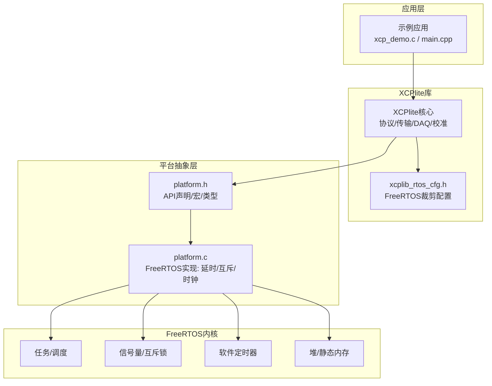
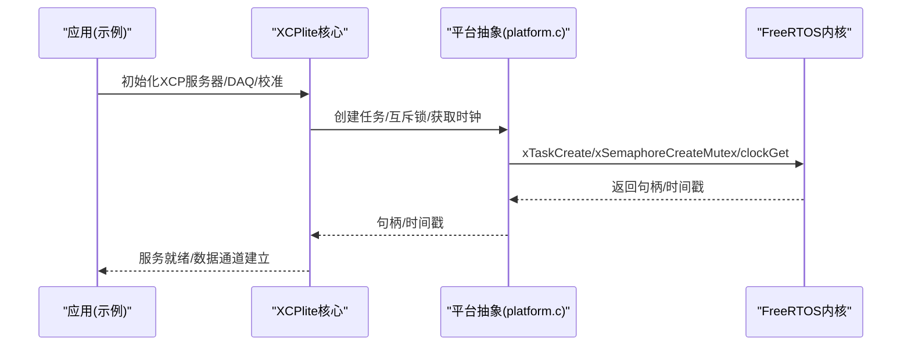
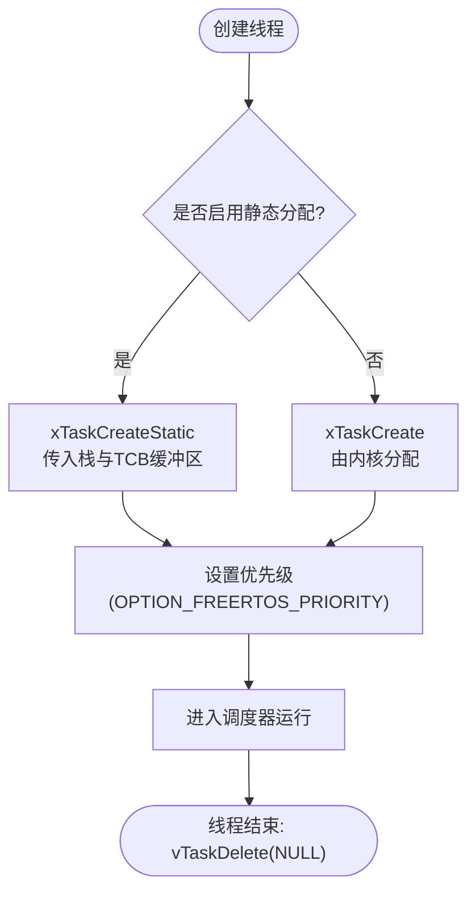
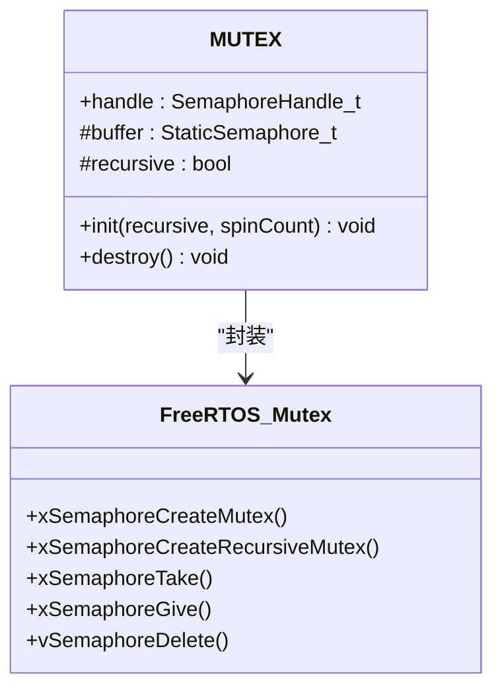
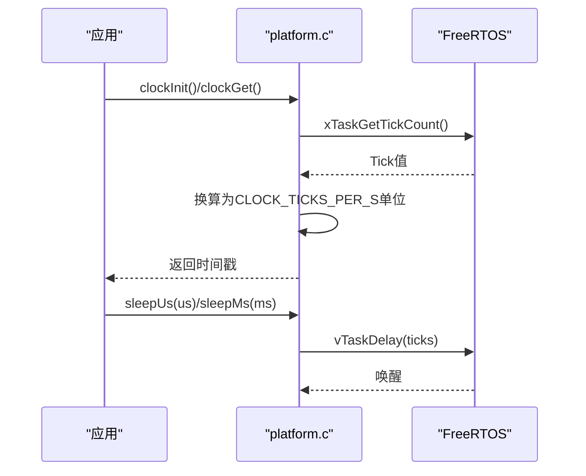
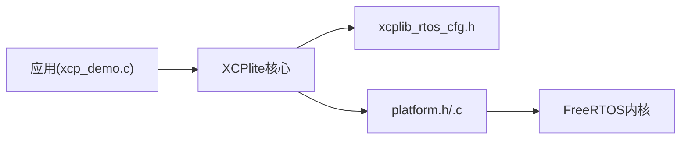

# FreeRTOS支持

<cite>
**本文引用的文件**
- [src/xcplib_rtos_cfg.h](file://src/xcplib_rtos_cfg.h)
- [src/platform.c](file://src/platform.c)
- [src/platform.h](file://src/platform.h)
- [examples/freertos_demo/xcp_demo.c](file://examples/freertos_demo/xcp_demo.c)
- [examples/freertos_demo/freertos_esp32_demo/src/main.cpp](file://examples/freertos_demo/freertos_esp32_demo/src/main.cpp)
- [examples/freertos_demo/freertos_stm32_demo/Core/Src/main.c](file://examples/freertos_demo/freertos_stm32_demo/Core/Src/main.c)
- [examples/freertos_demo/freertos_stm32_demo/Core/Inc/FreeRTOSConfig.h](file://examples/freertos_demo/freertos_stm32_demo/Core/Inc/FreeRTOSConfig.h)
- [examples/freertos_demo/freertos_emu_demo/src/main.c](file://examples/freertos_demo/freertos_emu_demo/src/main.c)
</cite>

## 目录
1. [简介](#简介)
2. [项目结构](#项目结构)
3. [核心组件](#核心组件)
4. [架构总览](#架构总览)
5. [详细组件分析](#详细组件分析)
6. [依赖关系分析](#依赖关系分析)
7. [性能考虑](#性能考虑)
8. [故障排除指南](#故障排除指南)
9. [结论](#结论)
10. [附录](#附录)

## 简介
本文件系统性阐述XCPlite在FreeRTOS实时操作系统上的完整支持与实现，覆盖任务管理、信号量与互斥锁、定时器与时钟适配、静态与动态内存分配策略；并针对ESP32、STM32等嵌入式平台给出栈大小、优先级与内存布局优化建议；同时说明FreeRTOS POSIX模拟器的使用方法与调试技巧，提供移植指南（工具链配置、链接脚本修改、硬件抽象层实现）以及性能调优建议（调度、中断、内存使用分析），帮助开发者在不同FreeRTOS平台上部署XCPlite并获得稳定高效的运行体验。

## 项目结构
围绕FreeRTOS的XCPlite支持主要由以下部分构成：
- 平台抽象层（platform.h/.c）：统一封装线程、互斥锁、时钟、延时、原子操作等，提供FreeRTOS路径实现。
- FreeRTOS专用配置（xcplib_rtos_cfg.h）：针对嵌入式目标裁剪功能、设置MTU、队列、DAQ内存、时钟分辨率、A2L生成开关等。
- 示例工程：
  - ESP32示例：基于Arduino/ESP-IDF风格，演示WiFi连接、显示、XCP服务器启动与任务。
  - STM32示例：基于CubeMX+CMSIS-RTOS v2，展示系统初始化、MPU配置、Systick与FreeRTOS启动流程。
  - POSIX模拟器示例：在Linux/macOS上以FreeRTOS POSIX端口运行，便于开发与调试。

图表来源
- [src/platform.h:100-162](file://src/platform.h#L100-L162)
- [src/platform.c:78-155](file://src/platform.c#L78-L155)
- [src/platform.c:370-432](file://src/platform.c#L370-L432)
- [src/platform.c:455-500](file://src/platform.c#L455-L500)
- [src/xcplib_rtos_cfg.h:44-89](file://src/xcplib_rtos_cfg.h#L44-L89)

章节来源
- [src/platform.h:100-162](file://src/platform.h#L100-L162)
- [src/platform.c:78-155](file://src/platform.c#L78-L155)
- [src/platform.c:370-432](file://src/platform.c#L370-L432)
- [src/platform.c:455-500](file://src/platform.c#L455-L500)
- [src/xcplib_rtos_cfg.h:44-89](file://src/xcplib_rtos_cfg.h#L44-L89)

## 核心组件
- 平台抽象层（FreeRTOS路径）
  - 延时：sleepUs/sleepMs基于vTaskDelay，粒度为tick。
  - 互斥锁：mutexInit/mutexDestroy封装xSemaphoreCreateMutex/RecursiveMutexStatic或动态创建，支持静态/动态内存。
  - 时钟：clockInit/clockGet基于xTaskGetTickCount，按CLOCK_TICKS_PER_S换算；可注册高精度回调用于DAQ。
  - 线程：create_thread/join_thread/cancel_thread封装xTaskCreate/xTaskCreateStatic/vTaskDelete，支持ESP平台StackType_t转换。
- FreeRTOS专用配置
  - 栈大小与优先级：默认4KB（POSIX模拟器更大），优先级tskIDLE_PRIORITY+2。
  - 网络：启用lwIP socket API，禁用TCP，标准MTU 1500。
  - 时钟：默认1us分辨率，任意纪元；DAQ事件列表关闭，固定队列缓冲。
  - 校准段：绝对地址模式，限制段数量与内存占用。
  - A2L/ELF上传：禁用（无文件系统）。
- 示例集成
  - ESP32：WiFi连接、可选显示/IO/ADC，启动XCP服务器与任务。
  - STM32：CubeMX初始化、MPU、Systick、CMSIS-RTOS v2启动。
  - POSIX模拟器：在主机上以FreeRTOS任务方式运行XCPlite，便于调试。

章节来源
- [src/platform.c:78-155](file://src/platform.c#L78-L155)
- [src/platform.c:370-432](file://src/platform.c#L370-L432)
- [src/platform.c:455-500](file://src/platform.c#L455-L500)
- [src/xcplib_rtos_cfg.h:44-142](file://src/xcplib_rtos_cfg.h#L44-L142)
- [examples/freertos_demo/xcp_demo.c:38-65](file://examples/freertos_demo/xcp_demo.c#L38-L65)
- [examples/freertos_demo/freertos_esp32_demo/src/main.cpp:378-408](file://examples/freertos_demo/freertos_esp32_demo/src/main.cpp#L378-L408)
- [examples/freertos_demo/freertos_stm32_demo/Core/Src/main.c:86-153](file://examples/freertos_demo/freertos_stm32_demo/Core/Src/main.c#L86-L153)
- [examples/freertos_demo/freertos_emu_demo/src/main.c:71-86](file://examples/freertos_demo/freertos_emu_demo/src/main.c#L71-L86)

## 架构总览
下图展示了XCPlite在FreeRTOS上的整体调用关系：应用通过XCPlite API初始化XCP服务器与DAQ/校准；平台抽象层将线程、互斥锁、时钟等映射到FreeRTOS内核能力；FreeRTOS专用配置对资源进行裁剪以满足嵌入式约束。

图表来源
- [examples/freertos_demo/xcp_demo.c:38-65](file://examples/freertos_demo/xcp_demo.c#L38-L65)
- [src/platform.c:370-432](file://src/platform.c#L370-L432)
- [src/platform.c:455-500](file://src/platform.c#L455-L500)

## 详细组件分析

### 任务管理与线程抽象
- 线程创建：
  - 支持静态与动态两种分配：当configSUPPORT_STATIC_ALLOCATION=1时，使用xTaskCreateStatic并提供StaticTask_t与StackType_t缓冲区；否则使用xTaskCreate。
  - 栈深度单位处理：ESP平台直接传字节数，其他平台转换为StackType_t计数。
  - 优先级：默认tskIDLE_PRIORITY+2，可通过OPTION_FREERTOS_PRIORITY调整。
- 线程生命周期：
  - 退出使用vTaskDelete(NULL)，不阻塞等待join（FreeRTOS语义）。
  - 线程函数返回类型与结束宏跨平台一致（THREAD_FUNC_RETURN/THREAD_FUNC_END）。

图表来源
- [src/platform.h:381-418](file://src/platform.h#L381-L418)
- [src/platform.h:435-451](file://src/platform.h#L435-L451)

章节来源
- [src/platform.h:381-418](file://src/platform.h#L381-L418)
- [src/platform.h:435-451](file://src/platform.h#L435-L451)

### 信号量与互斥锁
- 互斥锁初始化：
  - 支持递归与非递归：根据configUSE_RECURSIVE_MUTEXES选择xSemaphoreCreateRecursiveMutex或xSemaphoreCreateMutex。
  - 静态/动态：当configSUPPORT_STATIC_ALLOCATION=1时使用StaticSemaphore_t缓冲，否则动态分配。
- 加解锁宏：
  - 递归模式下使用xSemaphoreTakeRecursive/GiveRecursive；非递归模式使用xSemaphoreTake/Give。
- 销毁：
  - vSemaphoreDelete释放句柄，重置状态。

图表来源
- [src/platform.h:310-348](file://src/platform.h#L310-L348)
- [src/platform.c:370-432](file://src/platform.c#L370-L432)

章节来源
- [src/platform.h:310-348](file://src/platform.h#L310-L348)
- [src/platform.c:370-432](file://src/platform.c#L370-L432)

### 定时器与时钟
- 时钟源：
  - 默认使用xTaskGetTickCount()作为单调时钟，按CLOCK_TICKS_PER_S换算为所需分辨率（默认1us）。
  - 可在应用中注册高精度回调（如ESP32的Clock64_Get）以获得更高精度DAQ时间戳。
- 延时：
  - sleepUs/sleepMs基于vTaskDelay，最小粒度为1 tick（通常1ms）。
- 定时器：
  - FreeRTOS软件定时器可用（configUSE_TIMERS=1），示例中主要使用任务延时（xTaskDelayUntil）实现周期任务。

图表来源
- [src/platform.c:78-155](file://src/platform.c#L78-L155)
- [src/platform.c:455-500](file://src/platform.c#L455-L500)
- [examples/freertos_demo/xcp_demo.c:51-56](file://examples/freertos_demo/xcp_demo.c#L51-L56)

章节来源
- [src/platform.c:78-155](file://src/platform.c#L78-L155)
- [src/platform.c:455-500](file://src/platform.c#L455-L500)
- [examples/freertos_demo/xcp_demo.c:51-56](file://examples/freertos_demo/xcp_demo.c#L51-L56)

### 静态与动态内存分配策略
- 任务控制块与栈：
  - 静态分配：StaticTask_t与StackType_t数组在编译期分配，避免运行时堆碎片，适合严格内存预算。
  - 动态分配：xTaskCreate由内核从堆分配，需确保configTOTAL_HEAP_SIZE足够。
- 互斥锁：
  - 静态：StaticSemaphore_t缓冲，减少运行时开销。
  - 动态：xSemaphoreCreate*系列函数。
- 队列与DAQ缓冲：
  - 通过xcplib_rtos_cfg.h中的OPTION_QUEUE_32_SIZE与OPTION_DAQ_MEM_SIZE固定大小，避免运行时分配。
- 校准段：
  - 使用bump allocator与限定段数量/内存大小，避免文件系统与动态扩展。

章节来源
- [src/platform.h:381-418](file://src/platform.h#L381-L418)
- [src/platform.c:370-432](file://src/platform.c#L370-L432)
- [src/xcplib_rtos_cfg.h:98-134](file://src/xcplib_rtos_cfg.h#L98-L134)

### 平台特定优化（ESP32与STM32）
- ESP32：
  - 栈深度：FREERTOS_TASK_STACK_DEPTH直接传字节数，避免StackType_t转换误差。
  - WiFi与外设：示例展示WiFi连接、显示、ADC等，XCP服务器在WiFi就绪后启动。
  - 高优先级任务：fastTask与slowTask分别以不同优先级运行，体现调度行为。
- STM32：
  - CubeMX初始化：系统时钟、外设、MPU配置，Systick驱动SysTick中断。
  - CMSIS-RTOS v2：osKernelInitialize/osKernelStart启动调度器。
  - 中断优先级：configMAX_SYSCALL_INTERRUPT_PRIORITY限制可调用FreeRTOS API的中断优先级。

章节来源
- [src/platform.h:393-397](file://src/platform.h#L393-L397)
- [examples/freertos_demo/freertos_esp32_demo/src/main.cpp:378-408](file://examples/freertos_demo/freertos_esp32_demo/src/main.cpp#L378-L408)
- [examples/freertos_demo/freertos_stm32_demo/Core/Src/main.c:86-153](file://examples/freertos_demo/freertos_stm32_demo/Core/Src/main.c#L86-L153)
- [examples/freertos_demo/freertos_stm32_demo/Core/Inc/FreeRTOSConfig.h:130-153](file://examples/freertos_demo/freertos_stm32_demo/Core/Inc/FreeRTOSConfig.h#L130-L153)

### FreeRTOS POSIX模拟器使用与调试
- 用途：在Linux/macOS上使用FreeRTOS POSIX端口运行XCPlite，便于开发阶段验证逻辑。
- 特点：
  - 每个FreeRTOS任务对应一个pthread，调度通过SIGUSR1/SIGUSR2触发，不影响宿主进程的其他线程。
  - 可使用预生成的A2L或通过xcpclient生成，无需目标设备文件系统。
- 调试技巧：
  - 信号处理：捕获SIGINT/SIGTERM优雅关闭XCP服务器。
  - 日志级别：调整XCP日志级别观察命令交互。
  - 任务监控：检查任务堆栈水位与超时（overrun）统计。

章节来源
- [examples/freertos_demo/freertos_emu_demo/src/main.c:1-27](file://examples/freertos_demo/freertos_emu_demo/src/main.c#L1-L27)
- [examples/freertos_demo/freertos_emu_demo/src/main.c:57-86](file://examples/freertos_demo/freertos_emu_demo/src/main.c#L57-L86)
- [examples/freertos_demo/xcp_demo.c:38-65](file://examples/freertos_demo/xcp_demo.c#L38-L65)

## 依赖关系分析
- 应用依赖XCPlite核心，后者依赖平台抽象层提供的线程、互斥锁、时钟等。
- 平台抽象层在FreeRTOS路径下直接调用FreeRTOS API。
- FreeRTOS专用配置影响XCPlite的资源使用（队列、DAQ、校准段、网络MTU等）。

图表来源
- [examples/freertos_demo/xcp_demo.c:38-65](file://examples/freertos_demo/xcp_demo.c#L38-L65)
- [src/xcplib_rtos_cfg.h:44-142](file://src/xcplib_rtos_cfg.h#L44-L142)
- [src/platform.h:100-162](file://src/platform.h#L100-L162)
- [src/platform.c:78-155](file://src/platform.c#L78-L155)

章节来源
- [examples/freertos_demo/xcp_demo.c:38-65](file://examples/freertos_demo/xcp_demo.c#L38-L65)
- [src/xcplib_rtos_cfg.h:44-142](file://src/xcplib_rtos_cfg.h#L44-L142)
- [src/platform.h:100-162](file://src/platform.h#L100-L162)
- [src/platform.c:78-155](file://src/platform.c#L78-L155)

## 性能考虑
- 任务调度优化：
  - 合理设置任务优先级与栈大小，避免低优先级任务饥饿或高优先级任务抢占过度。
  - 使用xTaskDelayUntil保证周期任务准时唤醒，检测overrun统计。
- 中断处理：
  - 限制可调用FreeRTOS API的中断优先级，避免高优先级中断阻塞调度。
  - 在中断中仅做最小工作，将耗时操作放入任务。
- 内存使用分析：
  - 优先使用静态分配（任务、互斥锁、队列缓冲），减少堆碎片。
  - 调整DAQ内存与队列大小，平衡吞吐与内存占用。
  - 校准段数量与大小受限，避免过大SRAM占用。
- 时钟与定时：
  - 使用高精度时钟回调提升DAQ时间戳精度。
  - 延时粒度受tick限制，必要时结合硬件定时器。

[本节为通用指导，不直接分析具体文件]

## 故障排除指南
- 任务创建失败：
  - 检查栈大小是否足够（ESP平台注意字节与StackType_t转换）。
  - 确认静态分配缓冲区已定义且对齐。
- 互斥锁死锁：
  - 确认递归/非递归模式匹配使用场景。
  - 避免长持有锁期间执行阻塞操作。
- 时钟不准确：
  - 确认CLOCK_TICKS_PER_S与实际tick频率匹配。
  - 注册高精度回调以提升DAQ精度。
- 网络问题：
  - 确认lwIP初始化与端口绑定正确。
  - 检查防火墙与路由器设置。
- POSIX模拟器异常：
  - 确保GNU_SOURCE已定义。
  - 使用信号处理优雅退出，避免僵尸任务。

章节来源
- [src/platform.h:381-418](file://src/platform.h#L381-L418)
- [src/platform.c:370-432](file://src/platform.c#L370-L432)
- [src/platform.c:455-500](file://src/platform.c#L455-L500)
- [examples/freertos_demo/freertos_emu_demo/src/main.c:57-86](file://examples/freertos_demo/freertos_emu_demo/src/main.c#L57-L86)

## 结论
XCPlite在FreeRTOS上提供了完整的任务、同步、时钟与内存管理抽象，并通过专用配置满足嵌入式平台的资源约束。ESP32与STM32示例展示了实际部署流程与优化要点。FreeRTOS POSIX模拟器极大提升了开发与调试效率。遵循本文档的移植指南与性能建议，可在多种FreeRTOS平台上稳定高效地运行XCPlite。

[本节为总结性内容，不直接分析具体文件]

## 附录
- 移植清单：
  - 工具链：确保GNU_SOURCE（Linux）、FreeRTOS头文件路径正确。
  - 链接脚本：根据目标内存布局调整段位置（如ESP32/STM32示例中的链接脚本）。
  - 硬件抽象层：实现高精度时钟回调（如ESP32的Clock64_Get），配置Systick与中断优先级。
  - 构建选项：启用XCPLITE_CONFIGURATION=rtos，按需开启示例与测试。
- 参考示例：
  - ESP32：main.cpp中WiFi与XCP服务器启动流程。
  - STM32：main.c中系统初始化与FreeRTOS启动。
  - POSIX模拟器：main.c中信号处理与调度器启动。

章节来源
- [examples/freertos_demo/freertos_esp32_demo/src/main.cpp:378-408](file://examples/freertos_demo/freertos_esp32_demo/src/main.cpp#L378-L408)
- [examples/freertos_demo/freertos_stm32_demo/Core/Src/main.c:86-153](file://examples/freertos_demo/freertos_stm32_demo/Core/Src/main.c#L86-L153)
- [examples/freertos_demo/freertos_emu_demo/src/main.c:71-86](file://examples/freertos_demo/freertos_emu_demo/src/main.c#L71-L86)