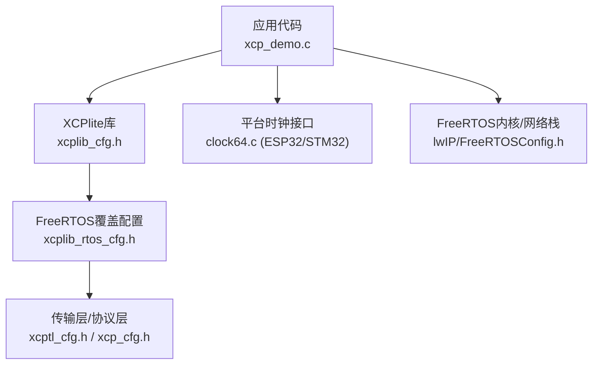
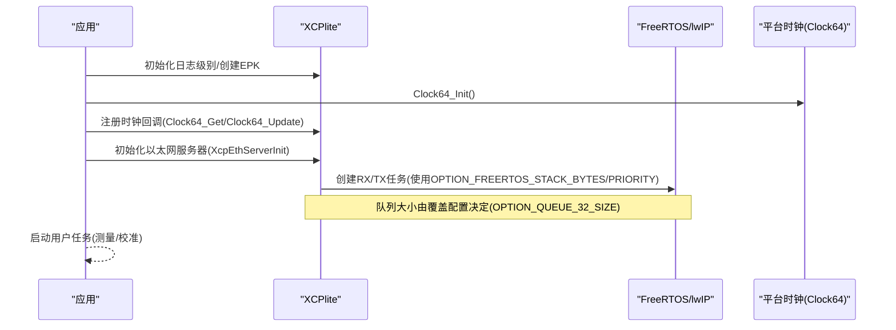
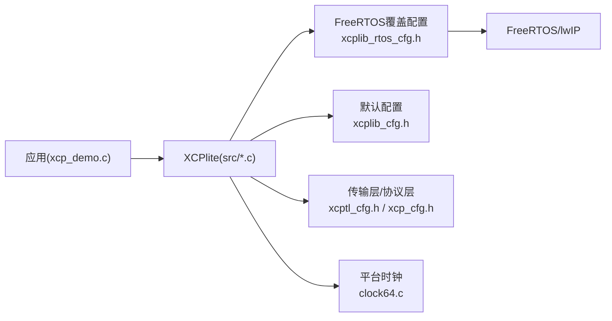

# FreeRTOS配置指南

<cite>
**本文引用的文件**
- [src/xcplib_rtos_cfg.h](file://src/xcplib_rtos_cfg.h)
- [src/xcplib_cfg.h](file://src/xcplib_cfg.h)
- [docs/xcplib_cfg.md](file://docs/xcplib_cfg.md)
- [examples/freertos_demo/xcp_demo.c](file://examples/freertos_demo/xcp_demo.c)
- [examples/freertos_demo/freertos_stm32_demo/Core/Src/main.c](file://examples/freertos_demo/freertos_stm32_demo/Core/Src/main.c)
- [examples/freertos_demo/freertos_stm32_demo/Core/Src/clock64.c](file://examples/freertos_demo/freertos_stm32_demo/Core/Src/clock64.c)
- [examples/freertos_demo/freertos_esp32_demo/src/clock64.c](file://examples/freertos_demo/freertos_esp32_demo/src/clock64.c)
- [examples/freertos_demo/freertos_esp32_demo/include/clock64.h](file://examples/freertos_demo/freertos_esp32_demo/include/clock64.h)
- [examples/fetchcontent_example/config/xcplib_app_cfg.h](file://examples/fetchcontent_example/config/xcplib_app_cfg.h)
- [src/platform.c](file://src/platform.c)
</cite>

## 目录
1. [简介](#简介)
2. [项目结构](#项目结构)
3. [核心组件](#核心组件)
4. [架构总览](#架构总览)
5. [详细组件分析](#详细组件分析)
6. [依赖关系分析](#依赖关系分析)
7. [性能考量](#性能考量)
8. [故障排查指南](#故障排查指南)
9. [结论](#结论)
10. [附录：平台特定配置与示例](#附录平台特定配置与示例)

## 简介
本指南聚焦于XCPlite在FreeRTOS环境下的完整配置选项与设置方法，围绕xcplib_rtos_cfg.h中的关键宏进行逐项说明，包括栈大小、任务优先级、内存分配策略、DAQ队列、时钟分辨率（CLOCK_TICKS_PER_S）等。同时给出ESP32、STM32等平台的特定配置要求与最佳实践，并提供配置验证方法与常见错误的诊断建议，帮助开发者依据硬件资源选择合适的参数。

## 项目结构
- 库默认配置位于 src/xcplib_cfg.h，提供通用功能开关与默认值。
- FreeRTOS专用覆盖配置位于 src/xcplib_rtos_cfg.h，通过构建系统以“覆盖头”方式在默认配置之后应用。
- 传输层与协议层配置分别由 xcptl_cfg.h 与 xcp_cfg.h 管理（参考文档）。
- 示例工程展示了如何在不同平台上集成XCPlite与FreeRTOS，并实现高精度时钟接口。

图表来源
- [src/xcplib_cfg.h:1-204](file://src/xcplib_cfg.h#L1-L204)
- [src/xcplib_rtos_cfg.h:1-142](file://src/xcplib_rtos_cfg.h#L1-L142)
- [examples/freertos_demo/xcp_demo.c:1-460](file://examples/freertos_demo/xcp_demo.c#L1-L460)
- [examples/freertos_demo/freertos_esp32_demo/src/clock64.c:1-22](file://examples/freertos_demo/freertos_esp32_demo/src/clock64.c#L1-L22)
- [examples/freertos_demo/freertos_stm32_demo/Core/Src/clock64.c:1-77](file://examples/freertos_demo/freertos_stm32_demo/Core/Src/clock64.c#L1-L77)

章节来源
- [src/xcplib_cfg.h:1-204](file://src/xcplib_cfg.h#L1-L204)
- [src/xcplib_rtos_cfg.h:1-142](file://src/xcplib_rtos_cfg.h#L1-L142)
- [examples/freertos_demo/xcp_demo.c:1-460](file://examples/freertos_demo/xcp_demo.c#L1-L460)

## 核心组件
- 覆盖配置头 xcplib_rtos_cfg.h：针对FreeRTOS目标对默认配置进行覆写，包含栈大小、优先级、MTU、时钟分辨率、DAQ队列、校准段数量与内存等关键参数。
- 默认配置头 xcplib_cfg.h：定义通用选项与默认值，并在末尾支持应用级覆盖头（XCPLIB_CFG_OVERRIDE）。
- 传输层与协议层配置：控制XCP命令包/数据包大小、对齐、多播端口等（详见文档）。
- 平台时钟接口：为DAQ时间戳提供高精度时钟源（ESP32使用esp_timer，STM32使用DWT周期计数器）。

章节来源
- [src/xcplib_rtos_cfg.h:1-142](file://src/xcplib_rtos_cfg.h#L1-L142)
- [src/xcplib_cfg.h:1-204](file://src/xcplib_cfg.h#L1-L204)
- [docs/xcplib_cfg.md:1-187](file://docs/xcplib_cfg.md#L1-L187)

## 架构总览
下图展示FreeRTOS环境下XCPlite的配置与应用启动流程，以及时钟回调注册与以太网服务器初始化顺序。

图表来源
- [examples/freertos_demo/xcp_demo.c:38-65](file://examples/freertos_demo/xcp_demo.c#L38-L65)
- [src/xcplib_rtos_cfg.h:44-56](file://src/xcplib_rtos_cfg.h#L44-L56)
- [src/xcplib_rtos_cfg.h:126-135](file://src/xcplib_rtos_cfg.h#L126-L135)

## 详细组件分析

### 1) FreeRTOS任务栈与优先级
- OPTION_FREERTOS_STACK_BYTES：定义RX/TX任务栈深度（字节）。POSIX模拟器需要更大栈；嵌入式目标通常设置为较小值以节省SRAM。
- OPTION_FREERTOS_PRIORITY：设置任务优先级，示例中为空闲任务优先级+2。需根据系统实时性需求调整。

影响与建议
- 过小栈可能导致溢出崩溃；过大则浪费SRAM。建议结合堆栈统计或调试信息评估实际占用。
- 优先级过高可能抢占其他关键任务；过低则可能影响响应时延。

章节来源
- [src/xcplib_rtos_cfg.h:44-52](file://src/xcplib_rtos_cfg.h#L44-L52)

### 2) 网络与MTU
- OPTION_MTU：以太网MTU，FreeRTOS覆盖配置设为标准1500字节，UDP载荷最大约1472字节。
- 禁用TCP（未实现），仅启用UDP（通过lwIP）。

影响与建议
- MTU必须能被8整除；若网络路径不支持巨型帧，保持1500以避免分片问题。
- 如需更高吞吐，可评估链路MTU并相应调整，但需确保两端一致。

章节来源
- [src/xcplib_rtos_cfg.h:80-88](file://src/xcplib_rtos_cfg.h#L80-L88)
- [docs/xcplib_cfg.md:30-40](file://docs/xcplib_cfg.md#L30-L40)

### 3) 时钟分辨率与CLOCK_TICKS_PER_S
- FreeRTOS覆盖配置默认采用1us分辨率（OPTION_CLOCK_TICKS_1US），并强制要求定义CLOCK_TICKS_PER_S为DAQ时钟每秒滴答数。
- 未定义时会触发编译错误，提示必须配置。

平台差异
- ESP32：使用esp_timer_get_time()返回微秒级计数，满足1us分辨率。
- STM32：使用DWT周期计数器，按CPU主频计算每微秒滴答数；需在构建时正确设置CLOCK_TICKS_PER_S。

影响与建议
- 分辨率越高，时间戳精度越好，但数值范围与舍入误差需考虑。
- 对于非1us/1ns的时钟，需确保CLOCK_TICKS_PER_S与实际时钟频率匹配，避免累积漂移。

章节来源
- [src/xcplib_rtos_cfg.h:65-78](file://src/xcplib_rtos_cfg.h#L65-L78)
- [examples/freertos_demo/freertos_esp32_demo/src/clock64.c:1-22](file://examples/freertos_demo/freertos_esp32_demo/src/clock64.c#L1-L22)
- [examples/freertos_demo/freertos_stm32_demo/Core/Src/clock64.c:1-77](file://examples/freertos_demo/freertos_stm32_demo/Core/Src/clock64.c#L1-L77)
- [src/platform.c:565-620](file://src/platform.c#L565-L620)

### 4) 内存分配策略与队列
- 传输层队列：FreeRTOS覆盖配置强制使用32位队列（OPTION_QUEUE_32），固定缓冲区大小为16倍tXcpSegmentBuffer，并使用临界区而非互斥量以减少锁开销。
- 默认配置中64位平台使用无锁可变长队列；32位平台回退到带锁队列。

影响与建议
- 队列大小直接影响吞吐与延迟；应保证至少能容纳预期峰值流量（如10ms数据）。
- 临界区适用于短临界区场景；若存在较长阻塞操作，需评估是否改用互斥量。

章节来源
- [src/xcplib_rtos_cfg.h:126-135](file://src/xcplib_rtos_cfg.h#L126-L135)
- [src/xcplib_cfg.h:143-162](file://src/xcplib_cfg.h#L143-L162)
- [docs/xcplib_cfg.md:178-187](file://docs/xcplib_cfg.md#L178-L187)

### 5) DAQ事件与表内存
- OPTION_DAQ_MEM_SIZE：DAQ表内存大小，示例中为512*6字节（约3KB）。每个信号最多占用约6字节（最大碎片化）。
- OPTION_DAQ_EVENT_COUNT：DAQ事件数量上限，示例中为16。

影响与建议
- 事件过多或信号过大会导致内存不足；应根据实际采集需求估算。
- 若关闭动态事件管理（OPTION_DAQ_EVENT_LIST），事件编号将绑定，减少开销。

章节来源
- [src/xcplib_rtos_cfg.h:116-124](file://src/xcplib_rtos_cfg.h#L116-L124)
- [docs/xcplib_cfg.md:138-148](file://docs/xcplib_cfg.md#L138-L148)

### 6) 校准段与持久化
- 覆盖配置启用绝对寻址（OPTION_CAL_SEGMENTS_ABS），限制校准段数量为8，总内存4KB。
- 禁用持久化（无文件系统），因此无法保存工作页或A2L/ELF上传。

影响与建议
- 绝对寻址兼容多数A2L工具；若需相对寻址，请评估兼容性。
- 无持久化意味着重启后校准数据丢失；可通过外部工具生成稳定A2L。

章节来源
- [src/xcplib_rtos_cfg.h:90-112](file://src/xcplib_rtos_cfg.h#L90-L112)
- [src/xcplib_cfg.h:82-118](file://src/xcplib_cfg.h#L82-L118)

### 7) 日志与调试
- 覆盖配置禁用stderr输出（无标准错误流），默认日志级别降低。
- 可在运行时通过API调整日志级别，便于调试。

章节来源
- [src/xcplib_rtos_cfg.h:57-61](file://src/xcplib_rtos_cfg.h#L57-L61)
- [docs/xcplib_cfg.md:57-65](file://docs/xcplib_cfg.md#L57-L65)

## 依赖关系分析
- 应用层调用XCPlite API，依赖覆盖配置确定行为。
- 覆盖配置依赖FreeRTOS与lwIP（或原始套接字HAL）。
- 时钟接口由平台实现，需与CLOCK_TICKS_PER_S一致。

图表来源
- [examples/freertos_demo/xcp_demo.c:1-460](file://examples/freertos_demo/xcp_demo.c#L1-L460)
- [src/xcplib_rtos_cfg.h:1-142](file://src/xcplib_rtos_cfg.h#L1-L142)
- [src/xcplib_cfg.h:1-204](file://src/xcplib_cfg.h#L1-L204)

章节来源
- [examples/freertos_demo/xcp_demo.c:1-460](file://examples/freertos_demo/xcp_demo.c#L1-L460)
- [src/xcplib_rtos_cfg.h:1-142](file://src/xcplib_rtos_cfg.h#L1-L142)
- [src/xcplib_cfg.h:1-204](file://src/xcplib_cfg.h#L1-L204)

## 性能考量
- 队列大小与吞吐：队列过小会导致丢包或阻塞；建议根据峰值流量与抖动预留缓冲。
- 栈大小与优先级：合理设置栈与优先级，避免溢出与抢占冲突。
- 时钟分辨率：高精度时钟带来更准确的时间戳，但需注意数值范围与舍入误差。
- 内存布局：DAQ表与校准段内存需根据信号数量与段大小估算，避免碎片化导致的额外开销。

[本节为通用指导，不直接分析具体文件]

## 故障排查指南
常见问题与解决思路
- 编译错误：未定义CLOCK_TICKS_PER_S。检查平台时钟实现并确保该宏已正确定义。
- 运行崩溃：栈溢出。增大OPTION_FREERTOS_STACK_BYTES或使用堆栈统计工具定位。
- 网络不通：MTU不匹配。确认链路MTU与OPTION_MTU一致，避免分片。
- 时间戳异常：CLOCK_TICKS_PER_S与实际时钟频率不一致。核对平台时钟实现与宏定义。
- 队列满/丢包：增大OPTION_QUEUE_32_SIZE或优化数据采集频率。

章节来源
- [src/xcplib_rtos_cfg.h:65-78](file://src/xcplib_rtos_cfg.h#L65-L78)
- [src/xcplib_rtos_cfg.h:126-135](file://src/xcplib_rtos_cfg.h#L126-L135)
- [src/platform.c:565-620](file://src/platform.c#L565-L620)

## 结论
在FreeRTOS环境中，XCPlite通过覆盖配置头提供了针对嵌入式目标的精简与优化选项。合理设置栈大小、任务优先级、MTU、队列大小与时钟分辨率，是确保系统稳定与高性能的关键。结合ESP32与STM32平台的具体实现，开发者可根据硬件资源与实时性需求灵活调整参数，并通过日志与调试手段验证配置有效性。

[本节为总结，不直接分析具体文件]

## 附录：平台特定配置与示例

### ESP32
- 时钟实现：使用esp_timer_get_time()，返回微秒级计数。
- 构建：通过PlatformIO外部构建，复用xcplib_rtos_cfg.h覆盖配置。
- 注意事项：确保CLOCK_TICKS_PER_S与esp_timer分辨率一致（通常为1us）。

章节来源
- [examples/freertos_demo/freertos_esp32_demo/src/clock64.c:1-22](file://examples/freertos_demo/freertos_esp32_demo/src/clock64.c#L1-L22)
- [examples/freertos_demo/freertos_esp32_demo/include/clock64.h:1-11](file://examples/freertos_demo/freertos_esp32_demo/include/clock64.h#L1-L11)
- [src/xcplib_rtos_cfg.h:65-78](file://src/xcplib_rtos_cfg.h#L65-L78)

### STM32
- 时钟实现：基于DWT周期计数器，按CPU主频计算每微秒滴答数；需设置CLOCK_TICKS_PER_S。
- 构建：CubeMX生成的FreeRTOS工程，集成XCPlite与lwIP。
- 注意事项：确保MPU与缓存配置正确，避免访问异常。

章节来源
- [examples/freertos_demo/freertos_stm32_demo/Core/Src/clock64.c:1-77](file://examples/freertos_demo/freertos_stm32_demo/Core/Src/clock64.c#L1-L77)
- [examples/freertos_demo/freertos_stm32_demo/Core/Src/main.c:100-140](file://examples/freertos_demo/freertos_stm32_demo/Core/Src/main.c#L100-L140)
- [src/xcplib_rtos_cfg.h:65-78](file://src/xcplib_rtos_cfg.h#L65-L78)

### 应用级覆盖配置示例
- 示例工程展示了如何禁用动态事件、限制日志级别、仅启用UDP、设置MTU与队列类型等。
- 可作为自定义配置的参考模板。

章节来源
- [examples/fetchcontent_example/config/xcplib_app_cfg.h:1-112](file://examples/fetchcontent_example/config/xcplib_app_cfg.h#L1-L112)