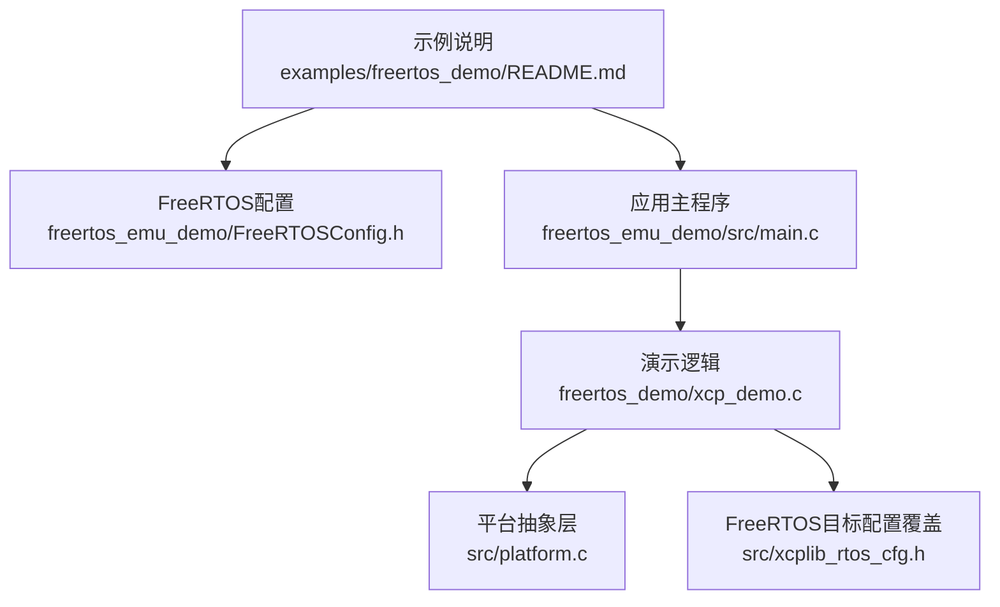
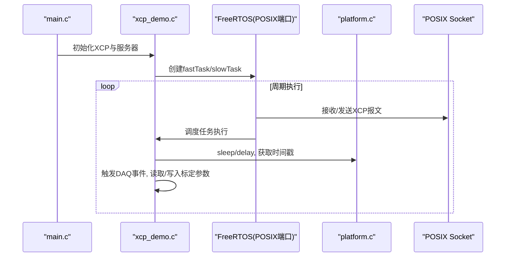
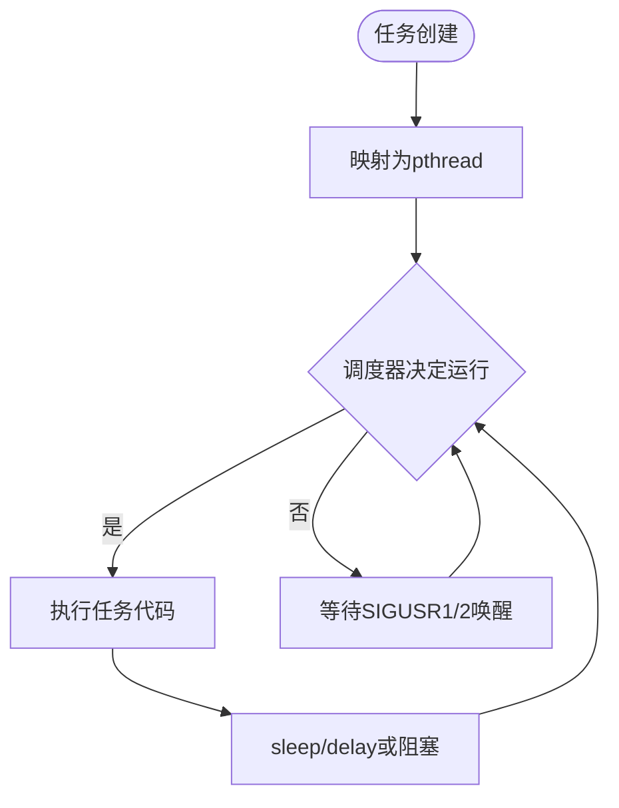
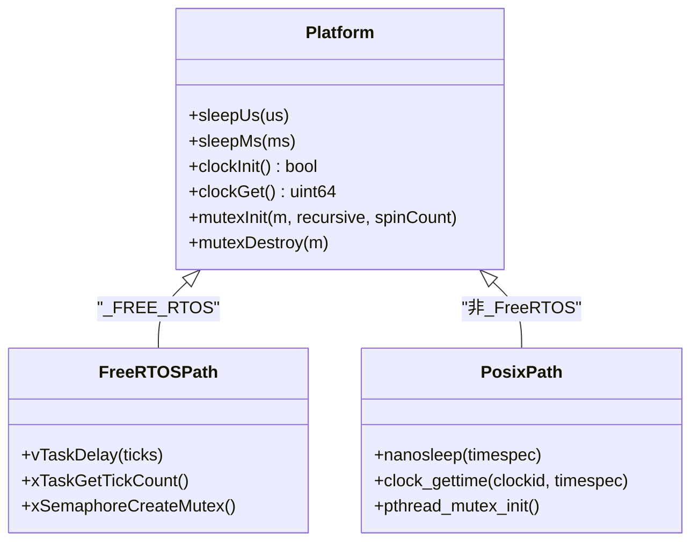
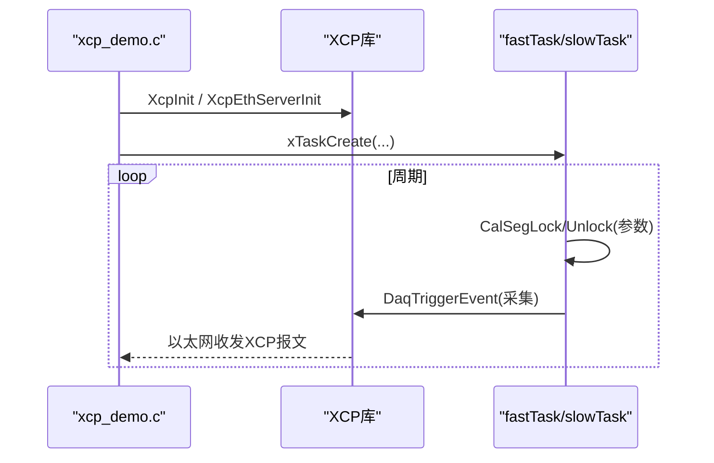
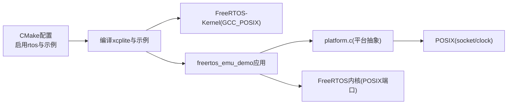

# POSIX模拟器

<cite>
**本文引用的文件**
- [README.md](file://README.md)
- [examples/freertos_demo/README.md](file://examples/freertos_demo/README.md)
- [examples/freertos_demo/freertos_emu_demo/README.md](file://examples/freertos_demo/freertos_emu_demo/README.md)
- [examples/freertos_demo/freertos_emu_demo/src/main.c](file://examples/freertos_demo/freertos_emu_demo/src/main.c)
- [examples/freertos_demo/freertos_emu_demo/FreeRTOSConfig.h](file://examples/freertos_demo/freertos_emu_demo/FreeRTOSConfig.h)
- [examples/freertos_demo/xcp_demo.c](file://examples/freertos_demo/xcp_demo.c)
- [src/platform.c](file://src/platform.c)
- [src/xcplib_rtos_cfg.h](file://src/xcplib_rtos_cfg.h)
</cite>

## 目录
1. [简介](#简介)
2. [项目结构](#项目结构)
3. [核心组件](#核心组件)
4. [架构总览](#架构总览)
5. [详细组件分析](#详细组件分析)
6. [依赖关系分析](#依赖关系分析)
7. [性能考虑](#性能考虑)
8. [故障排查指南](#故障排查指南)
9. [结论](#结论)
10. [附录](#附录)

## 简介
本文件面向希望在Linux/Windows主机上使用FreeRTOS POSIX模拟器进行XCPlite开发与测试的开发者，系统阐述如何在模拟环境中运行FreeRTOS任务、使用XCP测量与标定、并通过POSIX网络与时钟能力完成端到端验证。内容覆盖：
- FreeRTOS内核的POSIX端口实现要点（任务到pthread映射、信号驱动调度）
- 系统调用与文件操作在模拟环境中的虚拟化策略（通过平台抽象层）
- 配置选项与性能调优（线程调度、内存分配、定时器精度）
- 单元测试、集成测试与性能基准测试方法
- 完整的开发工作流（编写、编译、调试、测试自动化）
- 模拟器限制与注意事项（与真实硬件的差异）
- 基于模拟器的快速原型开发与验证方法

## 项目结构
围绕FreeRTOS POSIX模拟器的关键目录与文件如下：
- 示例入口与说明：examples/freertos_demo/README.md
- 模拟器示例工程：examples/freertos_demo/freertos_emu_demo/
  - FreeRTOS内核配置：FreeRTOSConfig.h
  - 应用主函数：src/main.c
  - 演示逻辑：../xcp_demo.c
- 平台抽象与时钟/睡眠/共享内存等：src/platform.c
- FreeRTOS目标配置覆盖：src/xcplib_rtos_cfg.h

图表来源
- [examples/freertos_demo/README.md:1-120](file://examples/freertos_demo/README.md#L1-L120)
- [examples/freertos_demo/freertos_emu_demo/FreeRTOSConfig.h:14-92](file://examples/freertos_demo/freertos_emu_demo/FreeRTOSConfig.h#L14-L92)
- [examples/freertos_demo/freertos_emu_demo/src/main.c:71-86](file://examples/freertos_demo/freertos_emu_demo/src/main.c#L71-L86)
- [examples/freertos_demo/xcp_demo.c:38-65](file://examples/freertos_demo/xcp_demo.c#L38-L65)
- [src/platform.c:78-155](file://src/platform.c#L78-L155)
- [src/xcplib_rtos_cfg.h:44-142](file://src/xcplib_rtos_cfg.h#L44-L142)

章节来源
- [examples/freertos_demo/README.md:1-120](file://examples/freertos_demo/README.md#L1-L120)
- [examples/freertos_demo/freertos_emu_demo/README.md:1-66](file://examples/freertos_demo/freertos_emu_demo/README.md#L1-L66)

## 核心组件
- FreeRTOS POSIX端口与调度
  - 每个FreeRTOS任务映射为一个pthread；任务切换通过向特定线程发送SIGUSR1/SIGUSR2实现，避免进程级信号干扰，使POSIX API（如socket、clock）在任务内正常工作。
- 平台抽象层（sleep/clock/mutex/shm）
  - 在_FREE_RTOS分支下提供vTaskDelay驱动的sleepUs/sleepMs；时钟默认基于xTaskGetTickCount，可注册高精度回调；非FreeRTOS分支使用POSIX clock_gettime等。
- FreeRTOS目标配置覆盖
  - 针对嵌入式目标调整MTU、队列、DAQ/Calibration内存、事件数量、栈大小与优先级等；对POSIX模拟器特别增大RX/TX任务栈。
- 示例应用与XCP服务器
  - 初始化XCP、创建以太网服务器、注册高精度时钟（在非模拟器目标上）、创建fastTask/slowTask并周期性触发DAQ事件、读写标定参数段。

章节来源
- [examples/freertos_demo/freertos_emu_demo/README.md:9-12](file://examples/freertos_demo/freertos_emu_demo/README.md#L9-L12)
- [src/platform.c:78-155](file://src/platform.c#L78-L155)
- [src/platform.c:455-500](file://src/platform.c#L455-L500)
- [src/xcplib_rtos_cfg.h:44-52](file://src/xcplib_rtos_cfg.h#L44-L52)
- [examples/freertos_demo/xcp_demo.c:38-65](file://examples/freertos_demo/xcp_demo.c#L38-L65)

## 架构总览
下图展示FreeRTOS POSIX模拟器下的整体数据与控制流：应用主程序启动XCP服务器与FreeRTOS任务；任务中周期性触发DAQ事件并访问标定参数；平台抽象层提供sleep/clock/mutex等能力；FreeRTOS内核通过POSIX端口将任务调度到pthread并由信号驱动切换。

图表来源
- [examples/freertos_demo/freertos_emu_demo/src/main.c:71-86](file://examples/freertos_demo/freertos_emu_demo/src/main.c#L71-L86)
- [examples/freertos_demo/xcp_demo.c:38-65](file://examples/freertos_demo/xcp_demo.c#L38-L65)
- [src/platform.c:78-155](file://src/platform.c#L78-L155)
- [src/platform.c:455-500](file://src/platform.c#L455-L500)

## 详细组件分析

### FreeRTOS POSIX端口与任务调度
- 任务到线程映射：每个FreeRTOS任务对应一个pthread，由FreeRTOS内核管理生命周期。
- 调度机制：通过向目标线程发送SIGUSR1/SIGUSR2触发上下文切换，保证POSIX API在任务内可用且不受进程级信号影响。
- 配置要点：configTICK_RATE_HZ=1000（1ms tick），启用时间片轮转与互斥量，软件定时器可用；堆使用heap_3委托给malloc/free，适合开发调试。

图表来源
- [examples/freertos_demo/freertos_emu_demo/README.md:9-12](file://examples/freertos_demo/freertos_emu_demo/README.md#L9-L12)
- [examples/freertos_demo/freertos_emu_demo/FreeRTOSConfig.h:14-92](file://examples/freertos_demo/freertos_emu_demo/FreeRTOSConfig.h#L14-L92)

章节来源
- [examples/freertos_demo/freertos_emu_demo/README.md:9-12](file://examples/freertos_demo/freertos_emu_demo/README.md#L9-L12)
- [examples/freertos_demo/freertos_emu_demo/FreeRTOSConfig.h:14-92](file://examples/freertos_demo/freertos_emu_demo/FreeRTOSConfig.h#L14-L92)

### 平台抽象层：睡眠、时钟与同步
- 睡眠
  - FreeRTOS路径：sleepUs/sleepMs基于vTaskDelay，粒度受tick率限制（默认1ms）。
  - 非FreeRTOS路径：使用nanosleep等POSIX接口，支持微秒级延时。
- 时钟
  - FreeRTOS路径：默认基于xTaskGetTickCount，可通过ApplXcpRegisterGetClockCallback注册高精度时钟（例如DWT）。
  - 非FreeRTOS路径：基于clock_gettime(CLOCK_MONOTONIC_RAW/CLOCK_REALTIME)，支持us/ns分辨率。
- 同步
  - FreeRTOS路径：使用FreeRTOS互斥量（静态或动态分配）。
  - 其他平台：使用pthread_mutex或Windows临界区。

图表来源
- [src/platform.c:78-155](file://src/platform.c#L78-L155)
- [src/platform.c:455-500](file://src/platform.c#L455-L500)
- [src/platform.c:370-432](file://src/platform.c#L370-L432)

章节来源
- [src/platform.c:78-155](file://src/platform.c#L78-L155)
- [src/platform.c:455-500](file://src/platform.c#L455-L500)
- [src/platform.c:370-432](file://src/platform.c#L370-L432)

### FreeRTOS目标配置覆盖（xcplib_rtos_cfg.h）
- 栈与优先级：POSIX模拟器下RX/TX任务栈显著增大（16KB vs 4KB），优先级高于空闲任务。
- 网络与MTU：仅UDP，标准以太网MTU 1500（最大UDP载荷1472字节）。
- 内存与队列：DAQ表与校准段静态分配，队列使用固定缓冲，避免堆分配。
- 时钟：默认1us分辨率，任意纪元；可替换为高精度时钟源。
- 文件系统：禁用A2L生成/上传与持久化，适配无文件系统目标。

章节来源
- [src/xcplib_rtos_cfg.h:44-142](file://src/xcplib_rtos_cfg.h#L44-L142)

### 示例应用与XCP服务器（xcp_demo.c）
- 初始化流程
  - 设置日志级别、创建EPK、初始化XCP协议层、注册高精度时钟（非模拟器目标）、启动以太网服务器。
- 任务与DAQ
  - fastTask/slowTask分别以不同周期运行，周期性触发DAQ事件，采集全局与局部变量。
- 标定参数
  - 使用CalSegDecl/CalSegDeclRef声明参数段，任务中以无锁方式读取参数（RCU原子更新），安全且低开销。

图表来源
- [examples/freertos_demo/xcp_demo.c:38-65](file://examples/freertos_demo/xcp_demo.c#L38-L65)
- [examples/freertos_demo/xcp_demo.c:245-315](file://examples/freertos_demo/xcp_demo.c#L245-L315)
- [examples/freertos_demo/xcp_demo.c:318-389](file://examples/freertos_demo/xcp_demo.c#L318-L389)

章节来源
- [examples/freertos_demo/xcp_demo.c:38-65](file://examples/freertos_demo/xcp_demo.c#L38-L65)
- [examples/freertos_demo/xcp_demo.c:245-315](file://examples/freertos_demo/xcp_demo.c#L245-L315)
- [examples/freertos_demo/xcp_demo.c:318-389](file://examples/freertos_demo/xcp_demo.c#L318-L389)

### 主程序与信号处理（main.c）
- 安装SIGINT/SIGTERM处理器，优雅关闭XCP服务器并退出。
- 先初始化XCP，再启动FreeRTOS调度器（阻塞式）。

章节来源
- [examples/freertos_demo/freertos_emu_demo/src/main.c:57-86](file://examples/freertos_demo/freertos_emu_demo/src/main.c#L57-L86)

## 依赖关系分析
- 构建与配置
  - 通过CMake启用rtos配置与示例，定义_FREE_RTOS与FREE_RTOS_POSIX_SIM以选择平台代码路径。
  - FreeRTOS-Kernel通过FetchContent下载并使用GCC_POSIX端口。
- 运行时依赖
  - 平台抽象层依赖操作系统提供的POSIX socket与clock（在模拟器下）。
  - FreeRTOS内核负责任务调度与同步原语。

图表来源
- [examples/freertos_demo/freertos_emu_demo/README.md:23-41](file://examples/freertos_demo/freertos_emu_demo/README.md#L23-L41)
- [examples/freertos_demo/README.md:305-367](file://examples/freertos_demo/README.md#L305-L367)

章节来源
- [examples/freertos_demo/freertos_emu_demo/README.md:23-41](file://examples/freertos_demo/freertos_emu_demo/README.md#L23-L41)
- [examples/freertos_demo/README.md:305-367](file://examples/freertos_demo/README.md#L305-L367)

## 性能考虑
- 线程调度模拟
  - 任务切换通过信号驱动，注意在高负载下信号处理的开销；合理设置任务优先级与栈大小。
- 内存分配模拟
  - FreeRTOS heap_3委托malloc/free，开发阶段便于调试；生产目标应评估静态分配与队列缓冲大小。
- 定时器精度控制
  - FreeRTOS路径默认1ms tick；如需更高精度，注册高精度时钟回调（如DWT）并在XCP中使用。
- 网络与队列
  - MTU=1500，队列缓冲静态分配；根据DAQ突发容量调整队列段数与缓冲区大小。
- 日志与调试
  - 提高日志级别观察内存与队列使用情况；关注任务栈高水位与超时统计。

[本节为通用指导，不直接分析具体文件]

## 故障排查指南
- 无法连接XCP服务器
  - 检查端口与IP绑定；确认以太网服务器已初始化；查看日志级别输出。
- 任务未按时唤醒
  - 检查period参数是否过小导致overrun；观察fastTaskOverruns/slowTaskOverruns计数。
- 时间戳异常
  - 确认是否注册了高精度时钟回调；在模拟器下默认使用POSIX时钟，确保系统时间源可用。
- 内存不足
  - 调整OPTION_QUEUE_32_SEGMENT_COUNT、OPTION_DAQ_MEM_SIZE、OPTION_CAL_MEM_SIZE；检查任务栈大小。
- 信号处理问题
  - 确保SIGINT/SIGTERM处理器正确安装；在POSIX模拟器下，任务切换信号不会干扰Ctrl-C。

章节来源
- [examples/freertos_demo/freertos_emu_demo/src/main.c:57-86](file://examples/freertos_demo/freertos_emu_demo/src/main.c#L57-L86)
- [examples/freertos_demo/xcp_demo.c:245-315](file://examples/freertos_demo/xcp_demo.c#L245-L315)
- [examples/freertos_demo/xcp_demo.c:318-389](file://examples/freertos_demo/xcp_demo.c#L318-L389)
- [src/xcplib_rtos_cfg.h:44-142](file://src/xcplib_rtos_cfg.h#L44-L142)

## 结论
FreeRTOS POSIX模拟器为XCPlite提供了在主机上快速验证FreeRTOS任务、XCP测量与标定的有效手段。通过平台抽象层与FreeRTOS内核的POSIX端口，开发者可以在Linux/macOS环境下复现接近真实目标的运行行为，同时利用POSIX网络与时钟能力进行端到端测试。结合合理的配置与性能调优，可在开发早期发现调度、内存与定时相关问题，提升移植效率与质量。

[本节为总结性内容，不直接分析具体文件]

## 附录

### 使用方法与工作流
- 构建与运行
  - 使用CMake启用rtos配置与示例，编译后运行freertos_emu_demo；或通过脚本一键构建与运行。
- 生成A2L与测试
  - 使用xcpclient从ELF离线生成A2L模板或直接生成A2L；通过命令行或CANape进行测量与标定。
- 单元测试与集成测试
  - 利用xcpclient进行连接、测量与标定测试；结合日志与计数器（如overrun）评估稳定性。
- 性能基准测试
  - 调整period与DAQ事件频率，观察CPU占用与抖动；对比不同时钟源与队列配置的影响。

章节来源
- [examples/freertos_demo/README.md:79-127](file://examples/freertos_demo/README.md#L79-L127)
- [examples/freertos_demo/README.md:257-301](file://examples/freertos_demo/README.md#L257-L301)
- [examples/freertos_demo/freertos_emu_demo/README.md:23-41](file://examples/freertos_demo/freertos_emu_demo/README.md#L23-L41)

### 限制与注意事项
- 任务切换依赖信号，极端高负载下可能引入额外延迟。
- 默认时钟粒度受FreeRTOS tick限制；需高精度场景时务必注册外部时钟。
- 无文件系统：不支持在线A2L生成与持久化；需离线生成A2L。
- 与真实硬件差异：网络栈、时钟源、内存布局与中断模型不同，需在目标上进行最终验证。

章节来源
- [examples/freertos_demo/freertos_emu_demo/README.md:9-12](file://examples/freertos_demo/freertos_emu_demo/README.md#L9-L12)
- [src/platform.c:455-500](file://src/platform.c#L455-L500)
- [src/xcplib_rtos_cfg.h:105-142](file://src/xcplib_rtos_cfg.h#L105-L142)