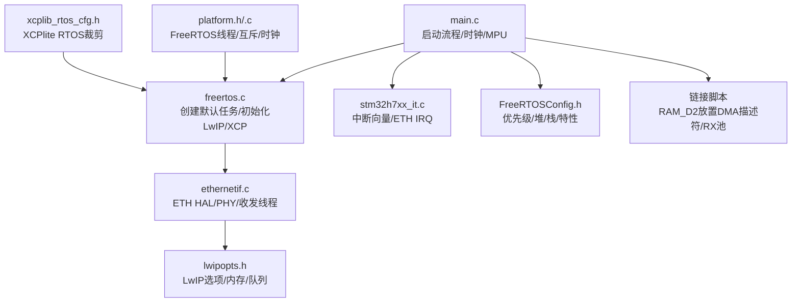
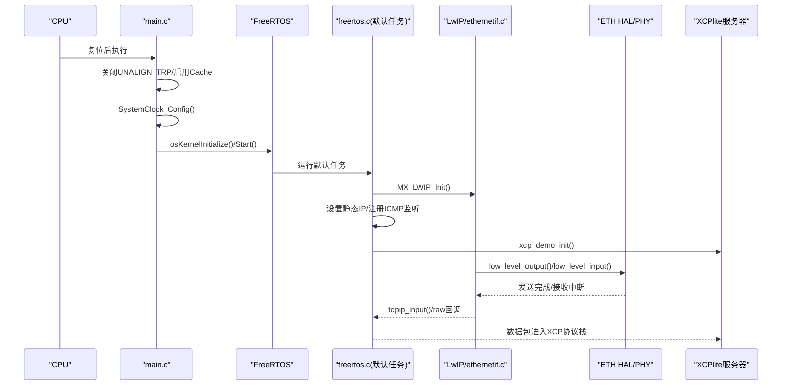
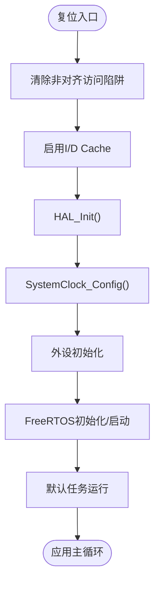
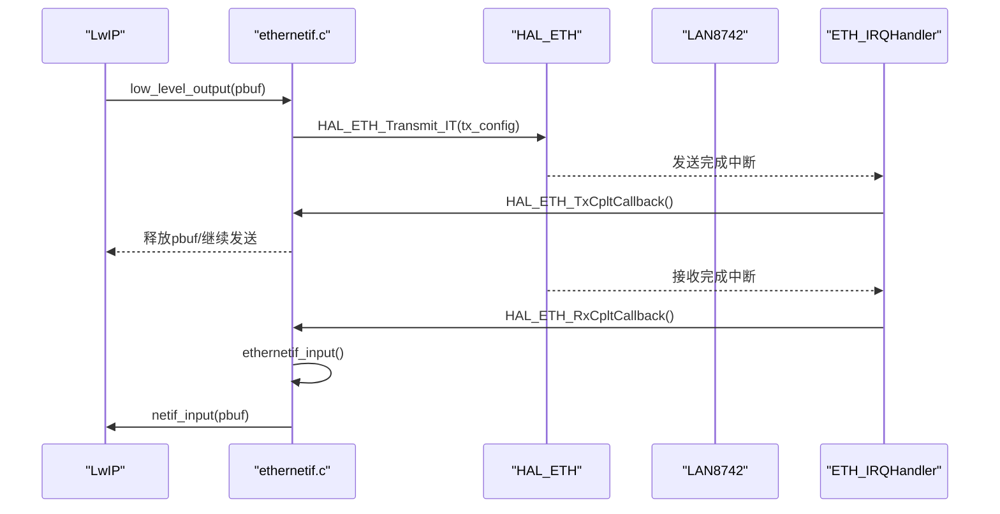
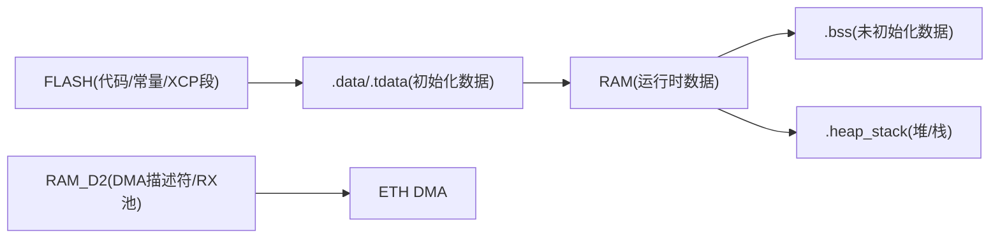
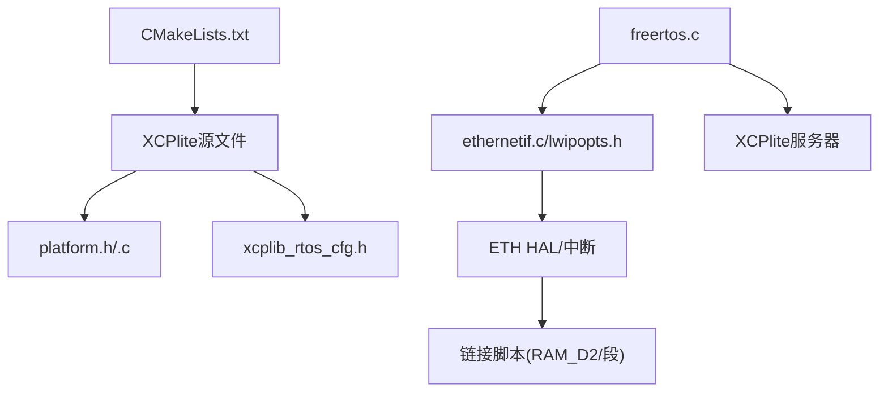

# STM32平台移植

<cite>
**本文引用的文件**
- [README.md](file://examples/freertos_demo/freertos_stm32_demo/README.md)
- [main.c](file://examples/freertos_demo/freertos_stm32_demo/Core/Src/main.c)
- [stm32h7xx_it.c](file://examples/freertos_demo/freertos_stm32_demo/Core/Src/stm32h7xx_it.c)
- [ethernetif.c](file://examples/freertos_demo/freertos_stm32_demo/LWIP/Target/ethernetif.c)
- [lwipopts.h](file://examples/freertos_demo/freertos_stm32_demo/LWIP/Target/lwipopts.h)
- [CMakeLists.txt](file://examples/freertos_demo/freertos_stm32_demo/CMakeLists.txt)
- [FreeRTOSConfig.h](file://examples/freertos_demo/freertos_stm32_demo/Core/Inc/FreeRTOSConfig.h)
- [freertos.c](file://examples/freertos_demo/freertos_stm32_demo/Core/Src/freertos.c)
- [STM32H753XX_FLASH.ld](file://examples/freertos_demo/freertos_stm32_demo/STM32H753XX_FLASH.ld)
- [STM32H753XX_FLASH_changed.ld](file://examples/freertos_demo/freertos_stm32_demo/STM32H753XX_FLASH_changed.ld)
- [platform.h](file://src/platform.h)
- [platform.c](file://src/platform.c)
- [socket_raw_hal.h](file://src/socket_raw_hal.h)
- [xcplib_rtos_cfg.h](file://src/xcplib_rtos_cfg.h)
</cite>

## 目录
1. [简介](#简介)
2. [项目结构](#项目结构)
3. [核心组件](#核心组件)
4. [架构总览](#架构总览)
5. [详细组件分析](#详细组件分析)
6. [依赖关系分析](#依赖关系分析)
7. [性能考虑](#性能考虑)
8. [故障排查指南](#故障排查指南)
9. [结论](#结论)
10. [附录](#附录)

## 简介
本文件面向在STM32微控制器上完整移植XCPlite（XCP over Ethernet）的开发者，基于仓库中的STM32 FreeRTOS示例工程进行系统化说明。内容涵盖：
- STM32CubeMX工程生成与关键修改点
- FreeRTOS集成、任务与中断优先级配置
- LwIP网络栈配置与以太网MAC初始化
- DMA描述符与RX池内存布局、MPU与缓存策略
- 时钟树配置与系统时钟优化
- 链接脚本与存储优化（Flash与SRAM分区、段保留）
- 交叉编译环境搭建要点（ARM GCC、OpenOCD/JTAG-SWD）
- 性能优化（DMA传输、中断优先级、低功耗）
- 部署与调试方法（断点、HardFault信息捕获、串口打印）

## 项目结构
该示例位于 examples/freertos_demo/freertos_stm32_demo，包含：
- Core/Src: main.c、stm32h7xx_it.c、freertos.c 等应用与系统初始化
- LWIP/Target: ethernetif.c、lwipopts.h 等网络接口与LwIP选项
- CMakeLists.txt: 构建配置与XCPlite源文件集成
- FreeRTOSConfig.h: FreeRTOS内核配置
- 链接脚本: STM32H753XX_FLASH.ld 与修改版 STM32H753XX_FLASH_changed.ld
- 平台抽象: src/platform.h/.c 提供FreeRTOS路径下的线程、互斥量、时钟等实现
- XCPlite RTOS配置: src/xcplib_rtos_cfg.h 针对嵌入式目标裁剪与优化

图表来源
- [main.c:86-153](file://examples/freertos_demo/freertos_stm32_demo/Core/Src/main.c#L86-L153)
- [freertos.c:229-277](file://examples/freertos_demo/freertos_stm32_demo/Core/Src/freertos.c#L229-L277)
- [ethernetif.c:211-359](file://examples/freertos_demo/freertos_stm32_demo/LWIP/Target/ethernetif.c#L211-L359)
- [lwipopts.h:47-170](file://examples/freertos_demo/freertos_stm32_demo/LWIP/Target/lwipopts.h#L47-L170)
- [stm32h7xx_it.c:186-194](file://examples/freertos_demo/freertos_stm32_demo/Core/Src/stm32h7xx_it.c#L186-L194)
- [FreeRTOSConfig.h:59-171](file://examples/freertos_demo/freertos_stm32_demo/Core/Inc/FreeRTOSConfig.h#L59-L171)
- [STM32H753XX_FLASH_changed.ld:255-278](file://examples/freertos_demo/freertos_stm32_demo/STM32H753XX_FLASH_changed.ld#L255-L278)
- [xcplib_rtos_cfg.h:44-142](file://src/xcplib_rtos_cfg.h#L44-L142)

章节来源
- [README.md:1-172](file://examples/freertos_demo/freertos_stm32_demo/README.md#L1-L172)
- [CMakeLists.txt:1-118](file://examples/freertos_demo/freertos_stm32_demo/CMakeLists.txt#L1-L118)

## 核心组件
- 启动与系统初始化
  - 关闭非对齐访问陷阱，启用I/D Cache，HAL_Init，SystemClock_Config，外设初始化，FreeRTOS调度器启动
- FreeRTOS任务与线程
  - 默认任务初始化LwIP、设置静态IP、注册ICMP监听、启动XCP演示服务
- 以太网驱动与LwIP
  - ETH HAL初始化、PHY初始化、接收/发送线程、零拷贝RX池、TX单pbuf复制策略
- 中断与异常处理
  - ETH_IRQHandler转发到HAL_ETH_IRQHandler；HardFault捕获寄存器信息便于调试
- 链接脚本与内存布局
  - 将DMA描述符和RX池放置在RAM_D2（可被ETH DMA访问），保持XCP校准与事件段存活
- 平台抽象与RTOS适配
  - FreeRTOS线程、互斥、时钟、延时；XCPlite RTOS配置裁剪内存与功能

章节来源
- [main.c:86-153](file://examples/freertos_demo/freertos_stm32_demo/Core/Src/main.c#L86-L153)
- [freertos.c:229-277](file://examples/freertos_demo/freertos_stm32_demo/Core/Src/freertos.c#L229-L277)
- [ethernetif.c:211-359](file://examples/freertos_demo/freertos_stm32_demo/LWIP/Target/ethernetif.c#L211-L359)
- [stm32h7xx_it.c:86-105](file://examples/freertos_demo/freertos_stm32_demo/Core/Src/stm32h7xx_it.c#L86-L105)
- [STM32H753XX_FLASH_changed.ld:112-145](file://examples/freertos_demo/freertos_stm32_demo/STM32H753XX_FLASH_changed.ld#L112-L145)
- [platform.c:78-155](file://src/platform.c#L78-L155)
- [xcplib_rtos_cfg.h:44-142](file://src/xcplib_rtos_cfg.h#L44-L142)

## 架构总览
下图展示了从启动到网络数据收发的整体流程，包括FreeRTOS任务、LwIP、ETH HAL与XCPlite的交互。

图表来源
- [main.c:86-153](file://examples/freertos_demo/freertos_stm32_demo/Core/Src/main.c#L86-L153)
- [freertos.c:229-277](file://examples/freertos_demo/freertos_stm32_demo/Core/Src/freertos.c#L229-L277)
- [ethernetif.c:377-446](file://examples/freertos_demo/freertos_stm32_demo/LWIP/Target/ethernetif.c#L377-L446)
- [ethernetif.c:456-499](file://examples/freertos_demo/freertos_stm32_demo/LWIP/Target/ethernetif.c#L456-L499)

## 详细组件分析

### 启动流程与时钟树配置
- 启动关键点
  - 清除SCB_CCR_UNALIGN_TRP以允许非对齐访问（LwIP/XCP需要）
  - 启用I-Cache与D-Cache提升性能
  - HAL_Init后调用SystemClock_Config配置PLL与分频，AHB时钟提升至200MHz以满足100Mbps以太网带宽
- 错误处理
  - Error_Handler中禁用中断并进入死循环，便于调试时查看完整调用栈

图表来源
- [main.c:91-121](file://examples/freertos_demo/freertos_stm32_demo/Core/Src/main.c#L91-L121)
- [main.c:159-211](file://examples/freertos_demo/freertos_stm32_demo/Core/Src/main.c#L159-L211)
- [main.c:294-303](file://examples/freertos_demo/freertos_stm32_demo/Core/Src/main.c#L294-L303)

章节来源
- [main.c:86-211](file://examples/freertos_demo/freertos_stm32_demo/Core/Src/main.c#L86-L211)

### MPU与缓存策略
- 区域0：全地址空间强序/不可缓存，保障外设安全
- 区域1：RAM_D2（0x30000000, 256KB）设为可缓存，供以太网DMA缓冲区使用
- 区域2：AXI SRAM（0x24000000, 512KB）设为可缓存+缓冲，提升CPU访问效率
- 通过MPU确保DMA与CPU对共享内存的一致性与可见性

章节来源
- [main.c:219-266](file://examples/freertos_demo/freertos_stm32_demo/Core/Src/main.c#L219-L266)
- [README.md:73-126](file://examples/freertos_demo/freertos_stm32_demo/README.md#L73-L126)

### FreeRTOS集成与任务模型
- 默认任务
  - 初始化LwIP、设置静态IP、注册ICMP raw回调、启动XCP演示服务
  - 周期性LED闪烁与统计输出
- 线程与优先级
  - LwIP以太网接口线程优先级设置为实时，保证高负载下及时接收包
  - 任务栈大小与优先级可在FreeRTOSConfig.h与CMakeLists中调整

章节来源
- [freertos.c:229-277](file://examples/freertos_demo/freertos_stm32_demo/Core/Src/freertos.c#L229-L277)
- [FreeRTOSConfig.h:59-171](file://examples/freertos_demo/freertos_stm32_demo/Core/Inc/FreeRTOSConfig.h#L59-L171)
- [README.md:112-120](file://examples/freertos_demo/freertos_stm32_demo/README.md#L112-L120)

### 以太网MAC初始化与DMA配置
- MAC初始化
  - 设置MAC地址、RMII模式、TX/RX描述符指针、RX缓冲区长度
  - 初始化RX Pool，创建信号量用于收发同步
- PHY初始化
  - 通过MDIO配置LAN8742，检测链路状态并配置双工/速率
- DMA收发
  - 发送：组装TxBuffer链，调用HAL_ETH_Transmit_IT，忙等释放描述符
  - 接收：中断触发信号量，ethernetif_input读取pbuf并交给tcpip_input
- 中断优先级
  - ETH_IRQn优先级需满足FreeRTOS最大系统调用中断优先级约束

图表来源
- [ethernetif.c:211-359](file://examples/freertos_demo/freertos_stm32_demo/LWIP/Target/ethernetif.c#L211-L359)
- [ethernetif.c:377-446](file://examples/freertos_demo/freertos_stm32_demo/LWIP/Target/ethernetif.c#L377-L446)
- [ethernetif.c:456-499](file://examples/freertos_demo/freertos_stm32_demo/LWIP/Target/ethernetif.c#L456-L499)
- [stm32h7xx_it.c:186-194](file://examples/freertos_demo/freertos_stm32_demo/Core/Src/stm32h7xx_it.c#L186-L194)

章节来源
- [ethernetif.c:211-499](file://examples/freertos_demo/freertos_stm32_demo/LWIP/Target/ethernetif.c#L211-L499)
- [stm32h7xx_it.c:186-194](file://examples/freertos_demo/freertos_stm32_demo/Core/Src/stm32h7xx_it.c#L186-L194)

### LwIP选项与内存管理
- 关键选项
  - WITH_RTOS=1、CHECKSUM_BY_HARDWARE=1、MEM_ALIGNMENT=4
  - MEM_SIZE、TCPIP_MBOX_SIZE、RAW/UDP/TCP接收队列大小
  - LWIP_NETCONN_SEM_PER_THREAD=1，结合TLS索引实现每线程信号量
  - LWIP_NETIF_TX_SINGLE_PBUF=1强制TX数据复制到单pbuf，避免DMA不可达内存
- RX池与堆重定位
  - RX池占用RAM_D2特定范围，LwIP堆起始地址后移以避免重叠
- 自定义pbuf释放回调
  - pbuf_free_custom回收RX池，并在池耗尽时重建描述符

章节来源
- [lwipopts.h:47-170](file://examples/freertos_demo/freertos_stm32_demo/LWIP/Target/lwipopts.h#L47-L170)
- [ethernetif.c:93-133](file://examples/freertos_demo/freertos_stm32_demo/LWIP/Target/ethernetif.c#L93-L133)
- [ethernetif.c:581-598](file://examples/freertos_demo/freertos_stm32_demo/LWIP/Target/ethernetif.c#L581-L598)

### 链接脚本与存储优化
- Flash段保留
  - xcp_cals、xcp_evts、xcp_meta段使用KEEP确保裁剪后仍存活
- RAM布局
  - .data/.tdata/.tbss/.bss映射至RAM或DTCMRAM
  - DMA描述符与RX池置于RAM_D2（ETH DMA可访问）
- 栈与堆
  - 栈从RAM顶端开始，堆紧随其后，确保不越界

图表来源
- [STM32H753XX_FLASH.ld:58-281](file://examples/freertos_demo/freertos_stm32_demo/STM32H753XX_FLASH.ld#L58-L281)
- [STM32H753XX_FLASH_changed.ld:112-278](file://examples/freertos_demo/freertos_stm32_demo/STM32H753XX_FLASH_changed.ld#L112-L278)

章节来源
- [STM32H753XX_FLASH.ld:58-281](file://examples/freertos_demo/freertos_stm32_demo/STM32H753XX_FLASH.ld#L58-L281)
- [STM32H753XX_FLASH_changed.ld:112-278](file://examples/freertos_demo/freertos_stm32_demo/STM32H753XX_FLASH_changed.ld#L112-L278)

### 中断向量表与异常处理
- HardFault增强
  - 捕获HFSR、CFSR、MMFAR、BFAR、AFSR及PC，便于事后调试
- 以太网中断
  - ETH_IRQHandler直接转发到HAL_ETH_IRQHandler，确保LwIP与ETH驱动正常工作

章节来源
- [stm32h7xx_it.c:86-105](file://examples/freertos_demo/freertos_stm32_demo/Core/Src/stm32h7xx_it.c#L86-L105)
- [stm32h7xx_it.c:186-194](file://examples/freertos_demo/freertos_stm32_demo/Core/Src/stm32h7xx_it.c#L186-L194)

### 平台抽象与XCPlite RTOS配置
- FreeRTOS路径
  - 线程创建/销毁、互斥量、延时、时钟（基于Tick）
  - 支持静态分配与动态分配两种模式
- XCPlite RTOS裁剪
  - 标准MTU、无TCP、减少内存占用、32位队列、1us时钟分辨率
  - 绝对地址寻址、无文件系统、无A2L/ELF上传
  - 队列与DAQ事件数量调优以适应嵌入式SRAM

章节来源
- [platform.h:310-451](file://src/platform.h#L310-L451)
- [platform.c:78-155](file://src/platform.c#L78-L155)
- [xcplib_rtos_cfg.h:44-142](file://src/xcplib_rtos_cfg.h#L44-L142)

### 原始套接字HAL（可选）
- socket_raw_hal.h定义了原始以太网帧收发接口，适用于无IP栈场景
- 当前仅Linux后端可用，或通过外部后端扩展

章节来源
- [socket_raw_hal.h:1-108](file://src/socket_raw_hal.h#L1-L108)

## 依赖关系分析
- 构建依赖
  - CMakeLists.txt引入XCPlite源文件与头文件，定义_FREE_RTOS与RTOS配置覆盖
- 运行时依赖
  - FreeRTOS内核、LwIP网络栈、ETH HAL/PHY驱动、XCPlite服务器
- 模块耦合
  - main.c负责系统初始化与调度；freertos.c协调LwIP与XCP；ethernetif.c桥接LwIP与ETH HAL；链接脚本决定内存布局

图表来源
- [CMakeLists.txt:45-92](file://examples/freertos_demo/freertos_stm32_demo/CMakeLists.txt#L45-L92)
- [platform.h:310-451](file://src/platform.h#L310-L451)
- [xcplib_rtos_cfg.h:44-142](file://src/xcplib_rtos_cfg.h#L44-L142)
- [ethernetif.c:211-359](file://examples/freertos_demo/freertos_stm32_demo/LWIP/Target/ethernetif.c#L211-L359)
- [STM32H753XX_FLASH_changed.ld:255-278](file://examples/freertos_demo/freertos_stm32_demo/STM32H753XX_FLASH_changed.ld#L255-L278)

章节来源
- [CMakeLists.txt:45-92](file://examples/freertos_demo/freertos_stm32_demo/CMakeLists.txt#L45-L92)

## 性能考虑
- 时钟与缓存
  - AHB时钟提升至200MHz，启用I/D Cache提升指令与数据访问速度
- DMA优化
  - TX单pbuf复制避免DMA不可达内存；RX零拷贝池减少拷贝开销
- 中断优先级
  - ETH中断优先级满足FreeRTOS最大系统调用中断优先级，避免阻塞
- 内存布局
  - DMA描述符与RX池置于RAM_D2，确保DMA可达与缓存一致性
- 任务与队列
  - 以太网接口线程实时优先级；增大TCPIP_MBOX_SIZE应对高负载

章节来源
- [main.c:159-211](file://examples/freertos_demo/freertos_stm32_demo/Core/Src/main.c#L159-L211)
- [ethernetif.c:377-446](file://examples/freertos_demo/freertos_stm32_demo/LWIP/Target/ethernetif.c#L377-L446)
- [lwipopts.h:86-144](file://examples/freertos_demo/freertos_stm32_demo/LWIP/Target/lwipopts.h#L86-L144)
- [README.md:131-158](file://examples/freertos_demo/freertos_stm32_demo/README.md#L131-L158)

## 故障排查指南
- HardFault调试
  - 捕获HFSR、CFSR、MMFAR、BFAR、AFSR与PC，结合调试器查看崩溃上下文
- 以太网问题
  - 检查ETH_IRQn优先级与使能；确认PHY链路状态与MAC配置
- 内存与缓存
  - 确认DMA描述符与RX池位于RAM_D2；MPU区域1/2正确配置
- 构建与链接
  - 使用修改版链接脚本保留XCP段；确保LwIP堆不与RX池重叠
- 串口与日志
  - 提高波特率以便快速输出；重定向printf到USART

章节来源
- [stm32h7xx_it.c:86-105](file://examples/freertos_demo/freertos_stm32_demo/Core/Src/stm32h7xx_it.c#L86-L105)
- [ethernetif.c:678-682](file://examples/freertos_demo/freertos_stm32_demo/LWIP/Target/ethernetif.c#L678-L682)
- [STM32H753XX_FLASH_changed.ld:112-278](file://examples/freertos_demo/freertos_stm32_demo/STM32H753XX_FLASH_changed.ld#L112-L278)
- [README.md:108-120](file://examples/freertos_demo/freertos_stm32_demo/README.md#L108-L120)

## 结论
通过在STM32H753上集成FreeRTOS与LwIP，并对DMA、MPU、时钟、链接脚本进行针对性优化，XCPlite能够在嵌入式平台上稳定运行并提供高效的XCP over Ethernet能力。示例工程提供了完整的参考实现，开发者可据此快速移植到自己的硬件与项目中。

## 附录
- 交叉编译环境搭建要点
  - ARM GCC工具链：安装对应版本的arm-none-eabi-gcc，配置PATH
  - OpenOCD与JTAG/SWD：安装OpenOCD，配置目标板配置文件（如stlink.cfg），验证连接
  - 构建命令：使用CMake生成构建系统，指定工具链文件与构建类型
  - 调试：通过OpenOCD连接ST-Link，加载ELF文件，设置断点与观察变量
- 参考资源
  - 示例README与CMakeLists提供构建与测试步骤
  - platform.h/.c与xcplib_rtos_cfg.h提供RTOS适配细节

[本节为通用指导，无需具体文件引用]