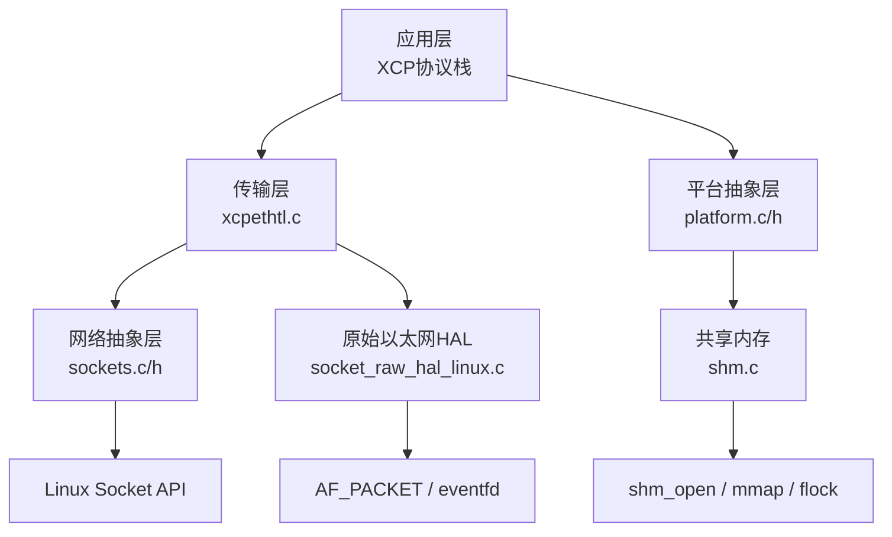
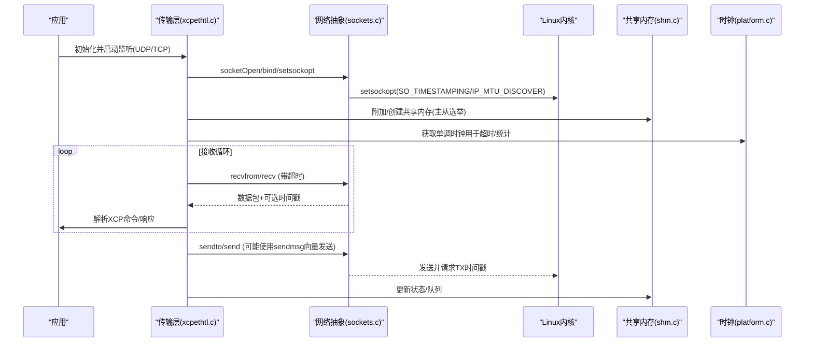
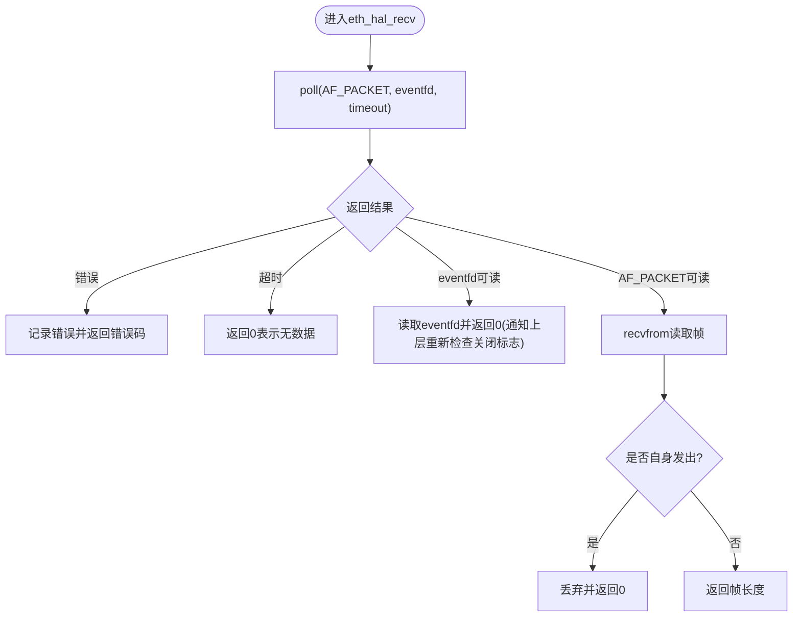
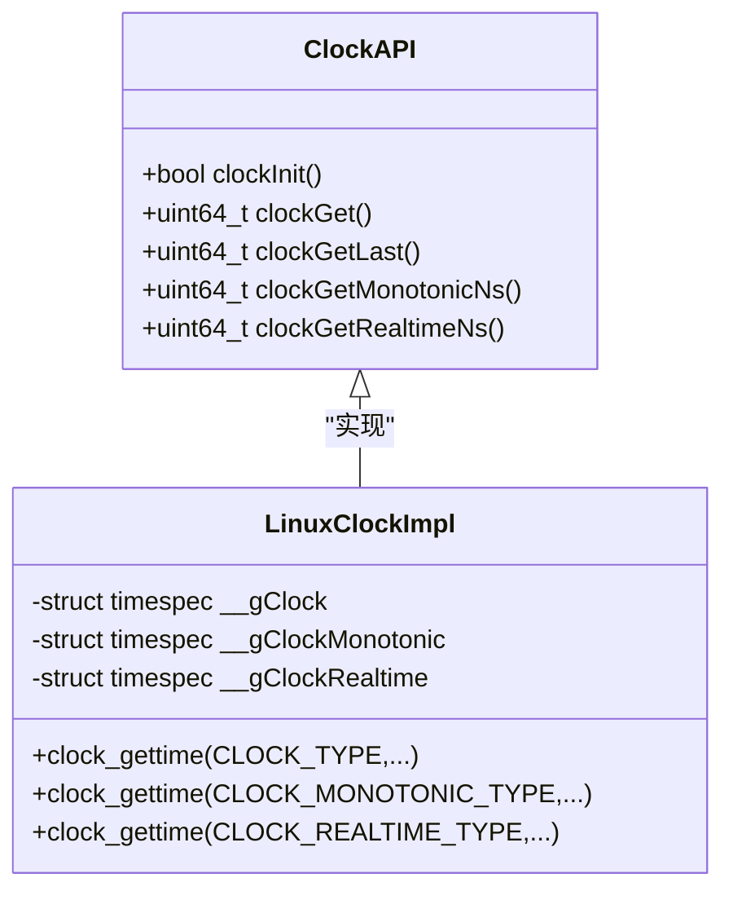
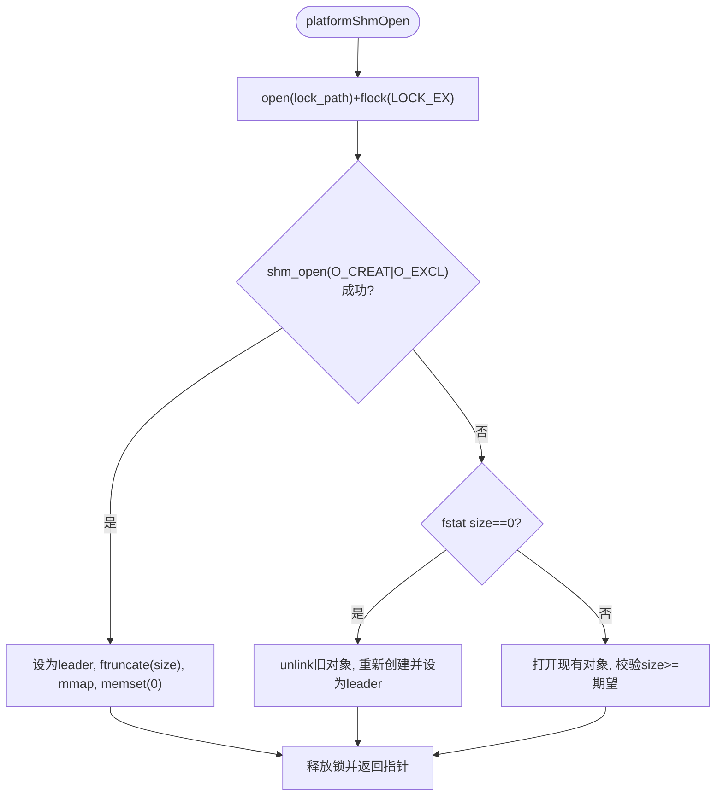
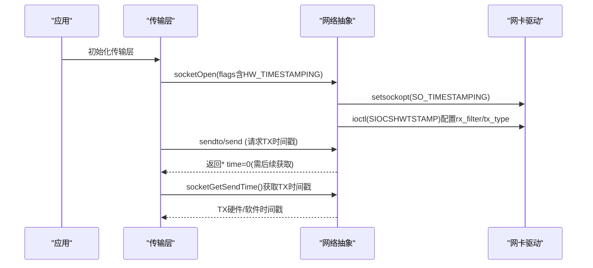
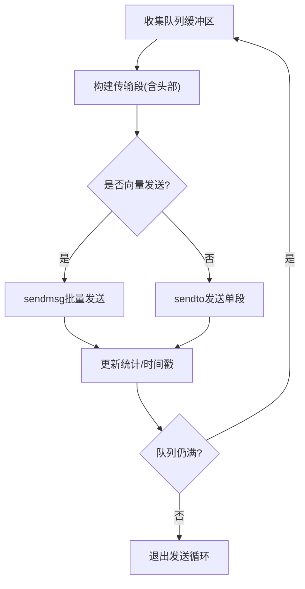
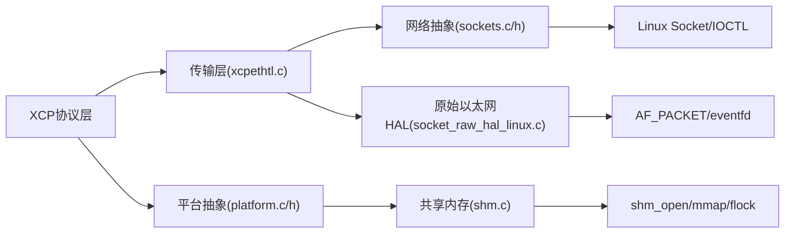

# Linux系统优化

<cite>
**本文引用的文件**
- [platform.c](file://src/platform.c)
- [platform.h](file://src/platform.h)
- [shm.c](file://src/shm.c)
- [sockets.c](file://src/sockets.c)
- [sockets.h](file://src/sockets.h)
- [socket_raw_hal_linux.c](file://src/socket_raw_hal_linux.c)
- [xcpethtl.c](file://src/xcpethtl.c)
</cite>

## 目录
1. [简介](#简介)
2. [项目结构](#项目结构)
3. [核心组件](#核心组件)
4. [架构总览](#架构总览)
5. [详细组件分析](#详细组件分析)
6. [依赖关系分析](#依赖关系分析)
7. [性能考量](#性能考量)
8. [故障排除指南](#故障排除指南)
9. [结论](#结论)
10. [附录](#附录)

## 简介
本文件聚焦XCPlite在Linux平台上的特定优化实现，围绕以下主题展开：事件驱动I/O模型与文件描述符管理、Linux时钟源选择策略（CLOCK_MONOTONIC_RAW与CLOCK_REALTIME的精度差异）、共享内存实现（shm_open/mmap/flock的系统调用优化）、网络套接字高级功能（SO_TIMESTAMPING硬件时间戳、TCP_NODELAY选项、网络接口绑定），以及内核参数调优建议与性能分析工具使用指南。文档同时提供部署最佳实践与故障排除技巧，帮助开发者在Linux上获得稳定、低延迟、高吞吐的XCP通信体验。

## 项目结构
XCPlite将平台相关能力抽象到独立模块中：
- 平台抽象层：platform.c/h 提供线程、互斥、时钟、共享内存等跨平台接口
- 网络抽象层：sockets.c/h 提供统一的Socket API，并在Linux下启用硬件时间戳、设备绑定等特性
- 以太网传输层：xcpethtl.c 负责XCP命令/数据在UDP/TCP上的收发与队列聚合
- 原始以太网HAL：socket_raw_hal_linux.c 基于AF_PACKET实现零拷贝/低开销的以太网帧收发
- 共享内存：shm.c 通过POSIX共享内存实现多进程状态共享与主从协调

图表来源
- [xcpethtl.c:603-715](file://src/xcpethtl.c#L603-L715)
- [sockets.c:307-443](file://src/sockets.c#L307-L443)
- [socket_raw_hal_linux.c:55-157](file://src/socket_raw_hal_linux.c#L55-L157)
- [shm.c:162-208](file://src/shm.c#L162-L208)
- [platform.c:201-319](file://src/platform.c#L201-L319)

章节来源
- [xcpethtl.c:603-715](file://src/xcpethtl.c#L603-L715)
- [sockets.c:307-443](file://src/sockets.c#L307-L443)
- [socket_raw_hal_linux.c:55-157](file://src/socket_raw_hal_linux.c#L55-L157)
- [shm.c:162-208](file://src/shm.c#L162-L208)
- [platform.c:201-319](file://src/platform.c#L201-L319)

## 核心组件
- 平台抽象层（platform.c/h）
  - 高精度时钟：支持CLOCK_MONOTONIC_RAW与CLOCK_REALTIME，提供ns/us分辨率与“最近值”缓存以减少syscall开销
  - 共享内存：基于shm_open/mmap/flock的主从选举与原子初始化，保证follower看到一致状态
  - 线程与互斥：pthread封装，支持递归锁与自旋计数
- 网络抽象层（sockets.c/h）
  - 统一Socket API，Linux下支持IP_MTU_DISCOVER、SO_TIMESTAMPING、SO_BINDTODEVICE、IP_PKTINFO等
  - 可选硬件时间戳路径：通过SIOCSHWTSTAMP配置网卡驱动，结合recvmsg/sendmsg获取精确时间戳
- 以太网传输层（xcpethtl.c）
  - UDP/TCP双模式，支持多播、队列聚合发送、超时控制与连接生命周期管理
- 原始以太网HAL（socket_raw_hal_linux.c）
  - AF_PACKET + eventfd实现可中断阻塞接收，避免SO_RCVTIMEO带来的延迟抖动
  - 自动过滤自身发出的报文，支持MTU诊断

章节来源
- [platform.c:438-654](file://src/platform.c#L438-L654)
- [platform.c:201-319](file://src/platform.c#L201-L319)
- [sockets.c:307-443](file://src/sockets.c#L307-L443)
- [sockets.c:472-587](file://src/sockets.c#L472-L587)
- [xcpethtl.c:603-715](file://src/xcpethtl.c#L603-L715)
- [socket_raw_hal_linux.c:55-157](file://src/socket_raw_hal_linux.c#L55-L157)

## 架构总览
下图展示了XCPlite在Linux上的关键数据流与控制流：应用层通过传输层进行XCP消息处理；传输层根据配置选择UDP/TCP或原始以太网；网络抽象层在Linux下启用硬件时间戳和设备绑定；平台层提供时钟与共享内存；原始以太网HAL通过eventfd实现快速唤醒。

图表来源
- [xcpethtl.c:603-715](file://src/xcpethtl.c#L603-L715)
- [sockets.c:307-443](file://src/sockets.c#L307-L443)
- [shm.c:162-208](file://src/shm.c#L162-L208)
- [platform.c:601-654](file://src/platform.c#L601-L654)

## 详细组件分析

### 事件驱动I/O模型与文件描述符管理
- 原始以太网HAL采用poll(eventfd, AF_PACKET)组合，使阻塞接收可通过eventfd立即唤醒，避免SO_RCVTIMEO带来的最大一个超时周期的延迟抖动。
- 对AF_PACKET套接字设置PACKET_IGNORE_OUTGOING（若可用）以丢弃自身发出的帧，并提供sll_pkttype回退判断。
- 传输层在TCP模式下为接收设置超时，以便周期性检查关闭信号与后台任务；在UDP模式下同样设置超时，配合轮询完成非阻塞式事件驱动。

图表来源
- [socket_raw_hal_linux.c:204-255](file://src/socket_raw_hal_linux.c#L204-L255)

章节来源
- [socket_raw_hal_linux.c:55-157](file://src/socket_raw_hal_linux.c#L55-L157)
- [socket_raw_hal_linux.c:204-255](file://src/socket_raw_hal_linux.c#L204-L255)
- [xcpethtl.c:379-534](file://src/xcpethtl.c#L379-L534)

### Linux时钟源选择策略
- 默认在非PTP模式下使用CLOCK_MONOTONIC_RAW作为主时钟，提供单调且不受NTP/PTP调整影响的稳定时间源；在PTP模式下使用CLOCK_REALTIME以获得与UTC对齐的时间。
- 提供单调与时钟的“最近值”访问函数（如clockGetMonotonicNsLast），减少频繁syscall开销。
- 支持ns/us两种分辨率，并通过编译期宏切换。

图表来源
- [platform.c:505-654](file://src/platform.c#L505-L654)

章节来源
- [platform.c:505-654](file://src/platform.c#L505-L654)
- [platform.h:472-506](file://src/platform.h#L472-L506)

### 共享内存实现（shm_open/mmap/flock优化）
- 使用flock对锁文件加独占锁，确保只有一个进程成为leader并创建共享内存；其他进程作为follower直接附加。
- leader通过shm_unlink(O_EXCL)创建对象后ftruncate至期望大小，随后mmap映射并清零区域，保证follower看到干净状态。
- follower在附加前校验已存在共享内存的大小：若为零说明leader崩溃未初始化，可安全回收；否则拒绝以避免破坏运行中的共享状态。
- 提供attach-only路径（platformShmOpenAttach）供已知follower快速附加，跳过选举流程。

图表来源
- [platform.c:201-319](file://src/platform.c#L201-L319)
- [shm.c:162-208](file://src/shm.c#L162-L208)

章节来源
- [platform.c:201-319](file://src/platform.c#L201-L319)
- [shm.c:162-208](file://src/shm.c#L162-L208)

### 网络套接字高级功能
- SO_TIMESTAMPING硬件时间戳：在Linux下通过setsockopt启用SOF_TIMESTAMPING_*标志，并结合SIOCSHWTSTAMP配置网卡驱动，实现RX/TX硬件时间戳；当驱动不支持时优雅降级为软件时间戳。
- TCP_NODELAY：代码中未显式设置该选项；如需降低小包延迟，可在应用侧通过socketSetsockopt扩展添加。
- 网络接口绑定：提供socketBindToDevice以将套接字绑定到指定网卡，便于多网卡环境下的精准收发与时间戳采集。
- IP_MTU_DISCOVER：对UDP禁用分片，避免丢包与重装配抖动，提升DAQ测量质量。

图表来源
- [sockets.c:373-443](file://src/sockets.c#L373-L443)
- [sockets.c:472-587](file://src/sockets.c#L472-L587)

章节来源
- [sockets.c:307-443](file://src/sockets.c#L307-L443)
- [sockets.c:472-587](file://src/sockets.c#L472-L587)
- [sockets.h:201-250](file://src/sockets.h#L201-L250)

### 传输层与队列聚合发送
- 传输层维护发送队列，支持将多个XCP DTO消息聚合为一个UDP段，减少系统调用与上下文切换。
- 在启用64位队列时，使用向量发送（sendmsg）批量提交缓冲区，提高吞吐并降低CPU占用。
- 对TCP模式，设置接收超时以允许周期性检查关闭与后台任务，增强可响应性。

图表来源
- [xcpethtl.c:777-800](file://src/xcpethtl.c#L777-L800)
- [xcpethtl.c:182-237](file://src/xcpethtl.c#L182-L237)

章节来源
- [xcpethtl.c:182-237](file://src/xcpethtl.c#L182-L237)
- [xcpethtl.c:777-800](file://src/xcpethtl.c#L777-L800)

## 依赖关系分析
- 传输层依赖网络抽象层提供的Socket API，并在Linux下可选择启用硬件时间戳与设备绑定。
- 平台抽象层为传输层提供时钟与线程原语，并为共享内存提供底层系统调用封装。
- 原始以太网HAL独立于标准Socket路径，适用于无TCP/IP栈的目标，通过AF_PACKET直接与内核交互。

图表来源
- [xcpethtl.c:603-715](file://src/xcpethtl.c#L603-L715)
- [sockets.c:307-443](file://src/sockets.c#L307-L443)
- [socket_raw_hal_linux.c:55-157](file://src/socket_raw_hal_linux.c#L55-L157)
- [shm.c:162-208](file://src/shm.c#L162-L208)
- [platform.c:201-319](file://src/platform.c#L201-L319)

章节来源
- [xcpethtl.c:603-715](file://src/xcpethtl.c#L603-L715)
- [sockets.c:307-443](file://src/sockets.c#L307-L443)
- [socket_raw_hal_linux.c:55-157](file://src/socket_raw_hal_linux.c#L55-L157)
- [shm.c:162-208](file://src/shm.c#L162-L208)
- [platform.c:201-319](file://src/platform.c#L201-L319)

## 性能考量
- 事件驱动I/O：使用poll(eventfd, AF_PACKET)避免长阻塞，缩短关闭路径延迟；UDP/TCP接收设置超时以支持后台任务与优雅关闭。
- 时间戳精度：启用SO_TIMESTAMPING与SIOCSHWTSTAMP可获得硬件级时间戳；若无驱动支持则回退到软件时间戳。
- 队列聚合：通过向量发送减少系统调用次数，提高吞吐；合理设置XCPTL_MAX_SEGMENT_SIZE与队列深度以平衡延迟与带宽。
- MTU与分片：对UDP禁用分片（IP_MTU_DISCOVER），避免丢包与重装配抖动；对RAW以太网路径报告MTU限制，便于快速定位问题。
- 共享内存：通过flock序列化主从选举，leader零初始化共享内存，保证一致性；follower快速附加路径减少启动延迟。

[本节为通用性能讨论，不直接分析具体文件]

## 故障排除指南
- 权限问题
  - 原始以太网HAL需要CAP_NET_RAW：使用sudo setcap cap_net_raw+ep <binary>或在root下运行。
  - 硬件时间戳配置需要CAP_NET_ADMIN或root权限；若失败会降级为软件时间戳。
- 套接字错误
  - EMSGSIZE：数据包超过路径MTU；检查OPTION_MTU与链路MTU，必要时调整或启用分片检测。
  - 端口占用：绑定失败时检查端口是否被占用，必要时启用SO_REUSEADDR。
- 共享内存异常
  - 版本不匹配：若检测到共享内存尺寸小于期望，提示清理残留对象；可使用tools/shm_cleanup.sh清理。
  - 主从竞争：若follower发现共享内存未激活，尝试unlink并重新作为leader创建。
- 时钟与时间戳
  - 若硬件时间戳不可用，确认驱动支持与SIOCSHWTSTAMP配置；必要时回退到软件时间戳。
  - 使用CLOCK_MONOTONIC_RAW保证单调性与稳定性；在PTP场景使用CLOCK_REALTIME以对齐UTC。

章节来源
- [socket_raw_hal_linux.c:72-84](file://src/socket_raw_hal_linux.c#L72-L84)
- [sockets.c:345-371](file://src/sockets.c#L345-L371)
- [sockets.c:472-587](file://src/sockets.c#L472-L587)
- [platform.c:201-319](file://src/platform.c#L201-L319)
- [shm.c:162-208](file://src/shm.c#L162-L208)

## 结论
XCPlite在Linux平台上通过事件驱动I/O、高精度时钟、共享内存与网络套接字的高级特性，实现了低延迟、高吞吐、可扩展的XCP通信方案。结合硬件时间戳、MTU管理与队列聚合发送，能够在多种网络环境下保持稳定的测量与标定性能。建议在部署时关注权限、内核参数与驱动支持，并使用性能分析工具进行持续优化。

[本节为总结性内容，不直接分析具体文件]

## 附录

### Linux内核参数调优建议
- net.core.somaxconn：增大监听队列长度，缓解高并发连接时的accept拥塞。
- net.ipv4.tcp_max_syn_backlog：增加半连接队列，提升SYN洪泛防护能力。
- vm.overcommit_memory：根据内存使用策略调整，避免在高负载下OOM风险。
- net.core.rmem_max/net.core.wmem_max：增大收发缓冲区上限，提升大数据量传输吞吐。
- net.ipv4.ip_no_pmtu_disc：谨慎使用；当前代码对UDP启用IP_MTU_DISCOVER以避免分片抖动。

[本节为通用指导，不直接分析具体文件]

### 性能分析工具使用指南
- perf：用于采样CPU热点与系统调用分布，识别瓶颈点。
- strace：跟踪系统调用序列与耗时，辅助定位阻塞与错误。
- systemtap：动态探针内核事件，深入分析网络栈与时间戳路径。

[本节为通用指导，不直接分析具体文件]

### 部署最佳实践
- 权限最小化：仅授予必要的CAP_NET_RAW/CAP_NET_ADMIN能力。
- 时间同步：在PTP场景启用CLOCK_REALTIME并确保PTP服务正常运行。
- 资源隔离：使用cgroup限制CPU/内存，避免干扰实时任务。
- 监控告警：记录关键指标（队列长度、丢包率、时间戳偏差），设置阈值告警。

[本节为通用指导，不直接分析具体文件]