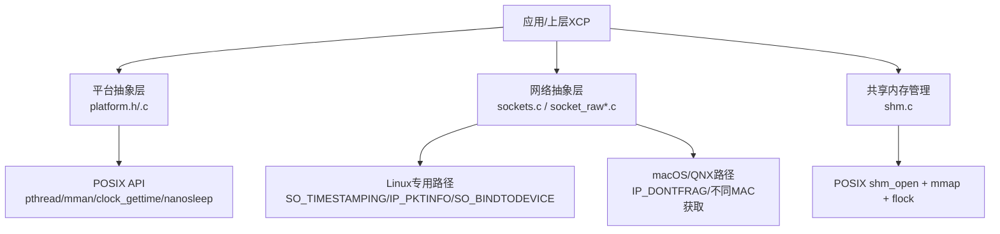
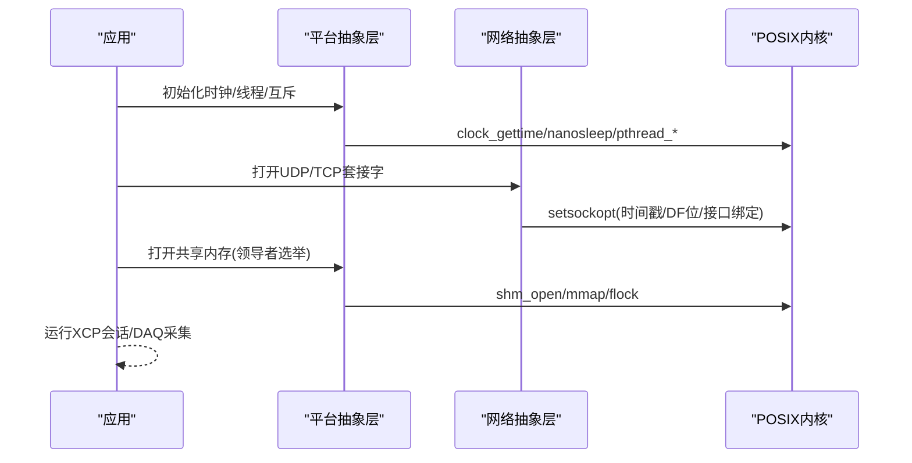
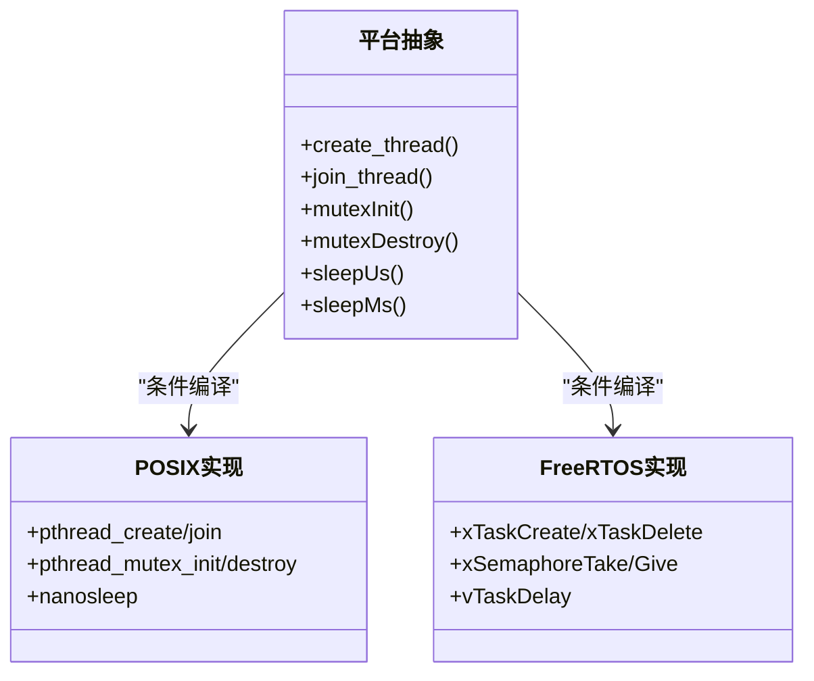
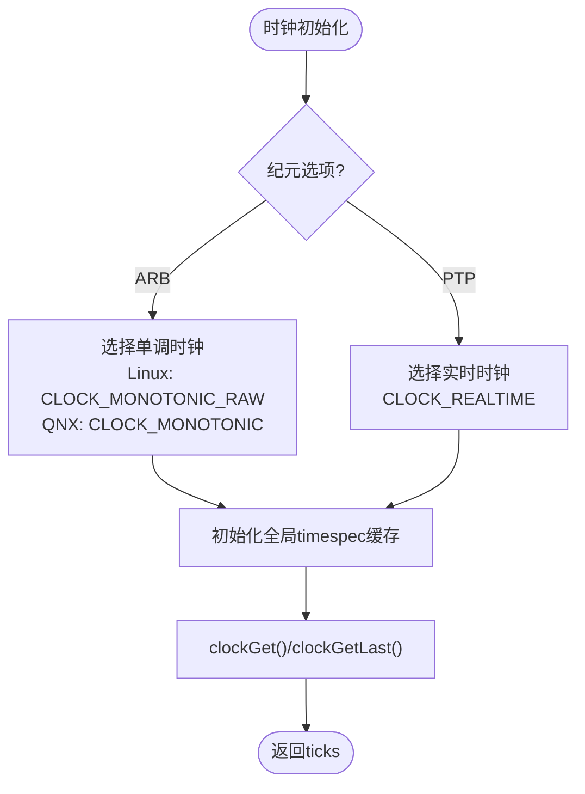
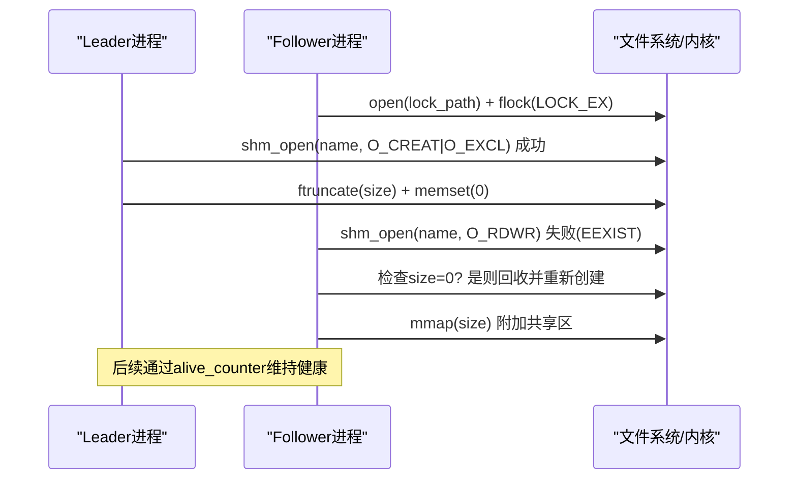
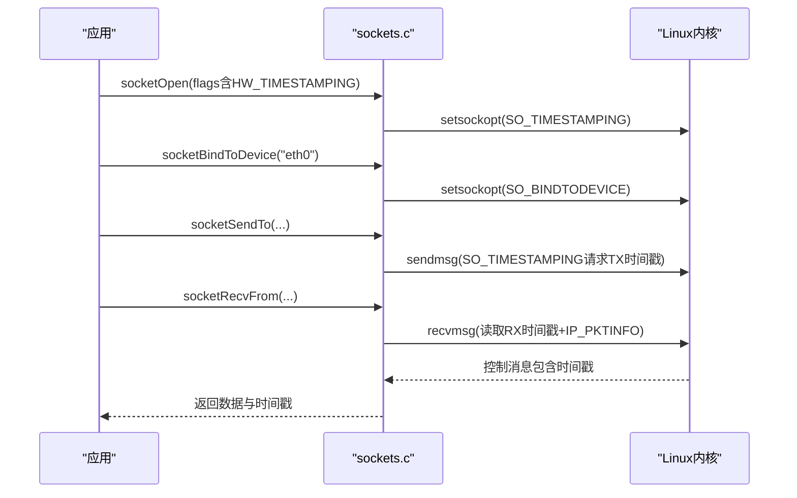
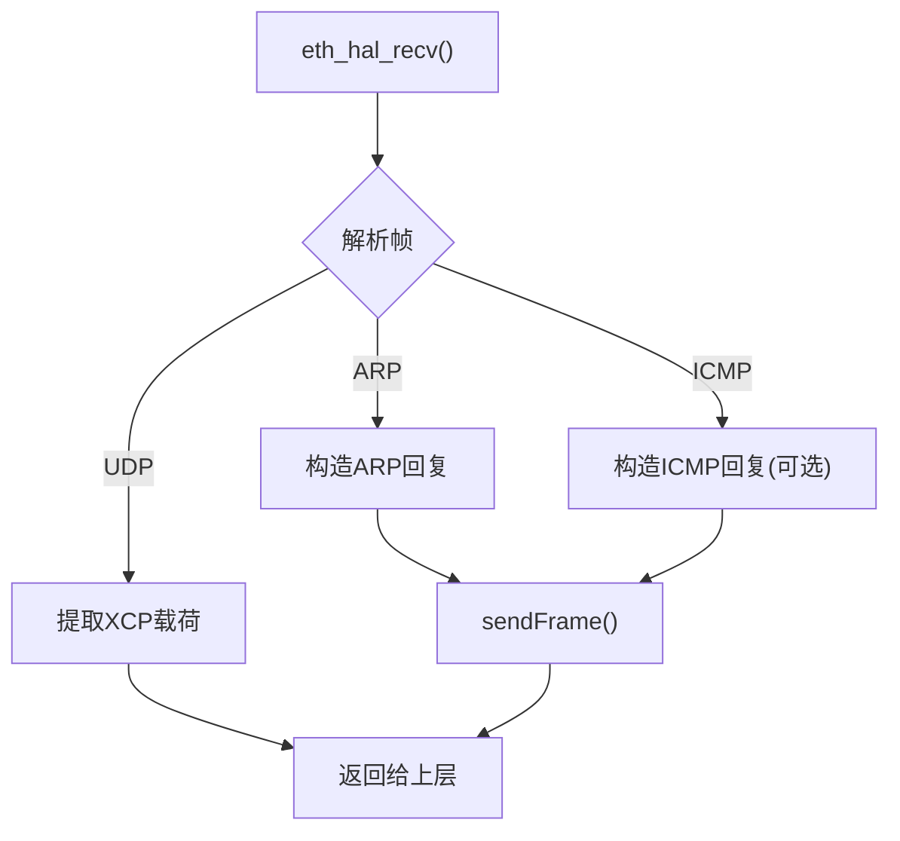
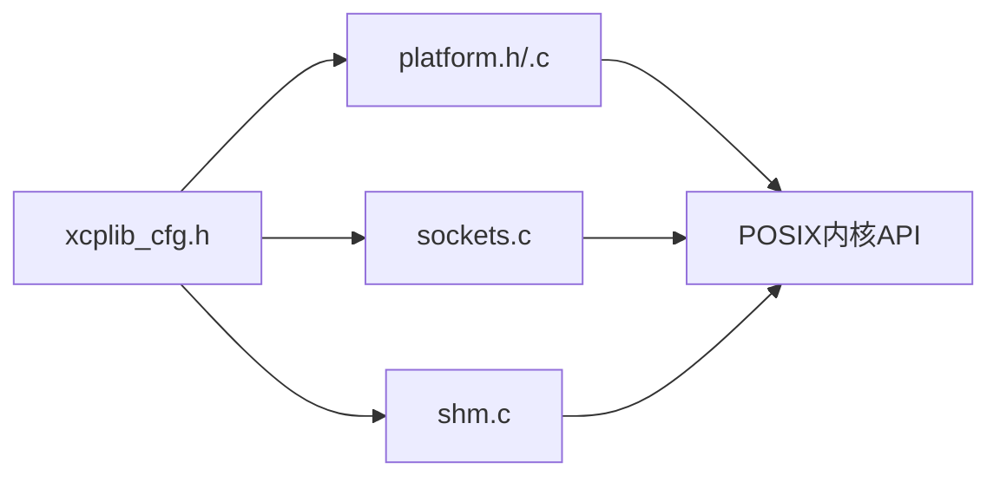

# POSIX系统适配

<cite>
**本文引用的文件**
- [platform.c](file://src/platform.c)
- [platform.h](file://src/platform.h)
- [sockets.c](file://src/sockets.c)
- [socket_raw.c](file://src/socket_raw.c)
- [socket_raw_hal_linux.c](file://src/socket_raw_hal_linux.c)
- [shm.c](file://src/shm.c)
- [xcplib_cfg.h](file://src/xcplib_cfg.h)
</cite>

## 目录
1. [简介](#简介)
2. [项目结构](#项目结构)
3. [核心组件](#核心组件)
4. [架构总览](#架构总览)
5. [详细组件分析](#详细组件分析)
6. [依赖关系分析](#依赖关系分析)
7. [性能考量](#性能考量)
8. [故障排查指南](#故障排查指南)
9. [结论](#结论)
10. [附录](#附录)

## 简介
本文件系统性阐述XCPlite在POSIX兼容系统（Linux、macOS、QNX）上的平台适配实现，覆盖线程与同步抽象、时钟源选择策略、共享内存机制、网络套接字高级能力（含时间戳与接口绑定），以及交叉编译与性能调优建议。目标是帮助开发者在不同POSIX平台上正确部署、定制并优化XCPlite。

## 项目结构
- 平台抽象层：提供线程、互斥锁、睡眠、时钟、共享内存等统一API
- 网络抽象层：封装TCP/UDP套接字、原始以太网传输、硬件时间戳、组播与接口绑定
- 共享内存管理：进程间状态共享、领导者选举、A2L最终化协调
- 配置层：通过宏开关控制功能特性与时钟分辨率等

**图示来源**
- [platform.h:23-86](file://src/platform.h#L23-L86)
- [sockets.c:282-443](file://src/sockets.c#L282-L443)
- [shm.c:162-208](file://src/shm.c#L162-L208)

**章节来源**
- [platform.h:23-86](file://src/platform.h#L23-L86)
- [xcplib_cfg.h:55-80](file://src/xcplib_cfg.h#L55-L80)

## 核心组件
- 线程与同步：跨平台线程创建/销毁、互斥锁初始化/销毁、自旋计数支持（FreeRTOS/POSIX/Windows）
- 时钟：可配置CLOCK_TICKS_PER_S（1ns或1us），支持任意纪元或PTP纪元；提供单调与时实时钟快速访问
- 共享内存：基于POSIX shm_open/mmap/flock的领导者选举与零拷贝映射，支持附加模式与清理
- 网络：统一UDP/TCP接口，Linux下启用SO_TIMESTAMPING、IP_PKTINFO、SO_BINDTODEVICE；macOS/QNX使用IP_DONTFRAG；原始以太网HAL用于无协议栈场景

**章节来源**
- [platform.h:300-506](file://src/platform.h#L300-L506)
- [platform.c:434-654](file://src/platform.c#L434-L654)
- [platform.c:161-363](file://src/platform.c#L161-L363)
- [sockets.c:304-443](file://src/sockets.c#L304-L443)
- [shm.c:69-208](file://src/shm.c#L69-L208)

## 架构总览
XCPlite通过平台抽象层屏蔽底层差异，将线程、时钟、共享内存、网络等能力暴露为稳定接口。上层XCP协议与传输层仅依赖这些接口，从而在Linux/macOS/QNX上获得一致行为。

**图示来源**
- [platform.c:434-654](file://src/platform.c#L434-L654)
- [sockets.c:304-443](file://src/sockets.c#L304-L443)
- [platform.c:161-363](file://src/platform.c#L161-L363)

## 详细组件分析

### 线程管理与同步
- 线程：统一的create/join/cancel/get_id宏，适配POSIX pthread、Windows CreateThread、FreeRTOS任务
- 互斥锁：支持递归与非递归，FreeRTOS静态分配，POSIX pthread_mutex_t
- 睡眠：高精度sleepUs/sleepMs，POSIX使用nanosleep，FreeRTOS基于tick

**图示来源**
- [platform.h:350-451](file://src/platform.h#L350-L451)
- [platform.c:366-432](file://src/platform.c#L366-L432)
- [platform.c:74-155](file://src/platform.c#L74-L155)

**章节来源**
- [platform.h:350-451](file://src/platform.h#L350-L451)
- [platform.c:74-155](file://src/platform.c#L74-L155)
- [platform.c:366-432](file://src/platform.c#L366-L432)

### 时钟源选择策略
- 分辨率：通过OPTION_CLOCK_TICKS_1NS或OPTION_CLOCK_TICKS_1US定义CLOCK_TICKS_PER_S
- 纪元：OPTION_CLOCK_EPOCH_ARB使用单调时钟（Linux用CLOCK_MONOTONIC_RAW，QNX用CLOCK_MONOTONIC）；OPTION_CLOCK_EPOCH_PTP使用CLOCK_REALTIME
- 快速访问：clockGetLast/clockGetMonotonicNsLast等缓存最近值以减少syscall开销

**图示来源**
- [platform.c:434-654](file://src/platform.c#L434-L654)
- [xcplib_cfg.h:55-65](file://src/xcplib_cfg.h#L55-L65)

**章节来源**
- [platform.c:434-654](file://src/platform.c#L434-L654)
- [xcplib_cfg.h:55-65](file://src/xcplib_cfg.h#L55-L65)

### 共享内存实现
- 领导者选举：通过flock序列化关键窗口，首个成功shm_open(O_CREAT|O_EXCL)的进程成为leader
- 映射与清理：mmap共享区域，leader负责清零；follower直接附加；支持attach-only快速路径
- 版本与存活检测：magic/version校验，alive_counter检测僵尸进程，必要时回收SHM

**图示来源**
- [platform.c:201-319](file://src/platform.c#L201-L319)
- [shm.c:162-208](file://src/shm.c#L162-L208)

**章节来源**
- [platform.c:201-319](file://src/platform.c#L201-L319)
- [shm.c:162-208](file://src/shm.c#L162-L208)
- [shm.c:433-517](file://src/shm.c#L433-L517)

### 网络套接字高级功能
- Linux时间戳：启用SO_TIMESTAMPING获取硬件/软件时间戳，结合IP_PKTINFO获取接口信息
- 不分片：非TCP路径设置IP_MTU_DISCOVER(IP_PMTUDISC_DO)或IP_DONTFRAG，避免静默丢包
- 接口绑定：SO_BINDTODEVICE绑定到指定网卡，便于多播接收与PTP时间戳
- macOS/QNX：使用IP_DONTFRAG，MAC地址通过AF_LINK获取

**图示来源**
- [sockets.c:373-443](file://src/sockets.c#L373-L443)
- [sockets.c:472-587](file://src/sockets.c#L472-L587)
- [sockets.c:1080-1233](file://src/sockets.c#L1080-L1233)
- [sockets.c:1333-1430](file://src/sockets.c#L1333-L1430)

**章节来源**
- [sockets.c:304-443](file://src/sockets.c#L304-L443)
- [sockets.c:472-587](file://src/sockets.c#L472-L587)
- [sockets.c:1080-1233](file://src/sockets.c#L1080-L1233)
- [sockets.c:1333-1430](file://src/sockets.c#L1333-L1430)

### 原始以太网传输（无协议栈）
- 纯用户态构建ETH/IPv4/UDP头，ARP应答与可选ICMP回显
- Linux后端使用AF_PACKET，eventfd实现可中断阻塞接收
- 严格帧大小检查，避免超出链路MTU

**图示来源**
- [socket_raw.c:282-403](file://src/socket_raw.c#L282-L403)
- [socket_raw.c:413-526](file://src/socket_raw.c#L413-L526)
- [socket_raw_hal_linux.c:204-255](file://src/socket_raw_hal_linux.c#L204-L255)

**章节来源**
- [socket_raw.c:282-403](file://src/socket_raw.c#L282-L403)
- [socket_raw.c:413-526](file://src/socket_raw.c#L413-L526)
- [socket_raw_hal_linux.c:204-255](file://src/socket_raw_hal_linux.c#L204-L255)

## 依赖关系分析
- 平台抽象层依赖POSIX标准库（pthread、mman、unistd、time.h）
- 网络层依赖具体平台扩展（Linux: linux/net_tstamp.h、sys/ioctl.h；macOS/QNX: net/if_dl.h）
- 共享内存依赖POSIX shm_open/mmap/flock
- 配置宏决定编译分支与功能开关

**图示来源**
- [xcplib_cfg.h:55-80](file://src/xcplib_cfg.h#L55-L80)
- [platform.h:23-86](file://src/platform.h#L23-L86)

**章节来源**
- [xcplib_cfg.h:55-80](file://src/xcplib_cfg.h#L55-L80)
- [platform.h:23-86](file://src/platform.h#L23-L86)

## 性能考量
- 时钟：优先使用clockGetLast减少syscall；合理选择CLOCK_TICKS_PER_S平衡精度与开销
- 网络：禁用分片避免重组抖动；Linux启用硬件时间戳降低延迟；批量发送使用sendmsg/iov
- 共享内存：leader初始化后follower直接mmap，避免额外同步；alive_counter定期清理僵尸
- 队列：根据平台选择无锁队列（64位）或互斥队列（32位/Windows）

[本节为通用指导，无需特定文件引用]

## 故障排查指南
- 共享内存错误：检查flock权限、shm_open返回值、fstat尺寸匹配；使用tools/shm_cleanup.sh清理残留
- 网络时间戳：确认root/CAP_NET_ADMIN权限；验证NIC驱动支持HWTSTAMP；检查SO_TIMESTAMPING标志
- MTU问题：确保OPTION_MTU不超过链路MTU；Linux使用IP_MTU_DISCOVER，macOS/QNX使用IP_DONTFRAG
- 原始以太网：确认CAP_NET_RAW；检查eventfd唤醒；验证peer MAC学习

**章节来源**
- [platform.c:201-319](file://src/platform.c#L201-L319)
- [sockets.c:373-443](file://src/sockets.c#L373-L443)
- [socket_raw_hal_linux.c:55-157](file://src/socket_raw_hal_linux.c#L55-L157)

## 结论
XCPlite通过严谨的平台抽象与POSIX原生能力结合，在Linux/macOS/QNX上提供了高性能、可移植的线程、时钟、共享内存与网络接口。开发者可通过配置宏灵活裁剪功能，并利用Linux的高级特性（如时间戳、接口绑定）满足高精度测量需求。

[本节为总结性内容，无需特定文件引用]

## 附录
- 交叉编译：在CMake中传递目标工具链与-D_GNU_SOURCE（Linux必需）
- 依赖管理：链接pthread、可选的librt（旧系统）；Linux需CAP_NET_RAW/CAP_NET_ADMIN
- 性能调优：调整OPTION_MTU、队列大小、时钟分辨率；启用硬件时间戳与批量IO

[本节为操作指南，无需特定文件引用]