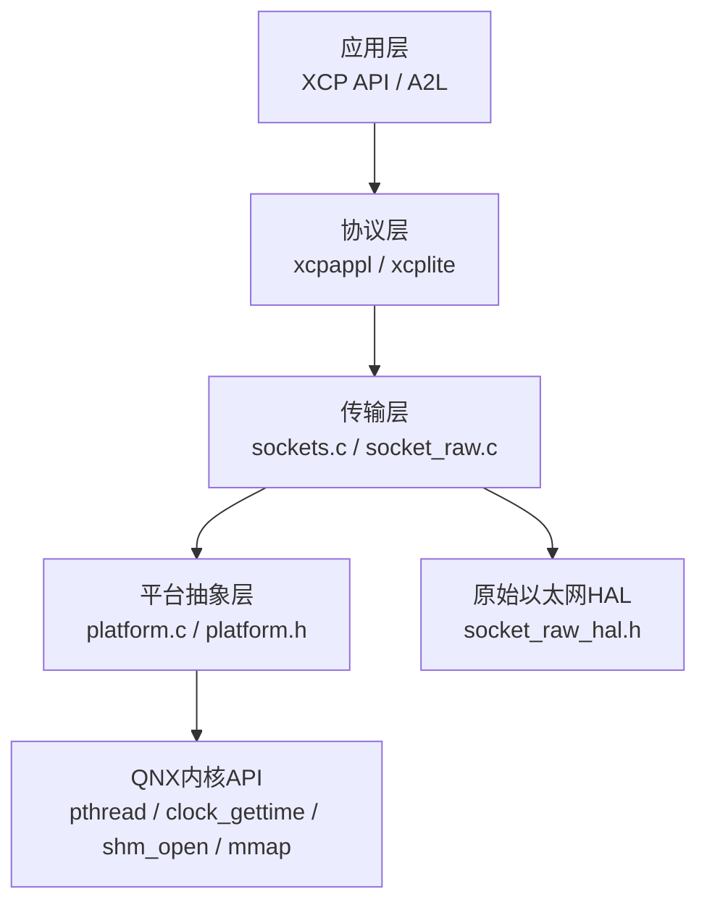
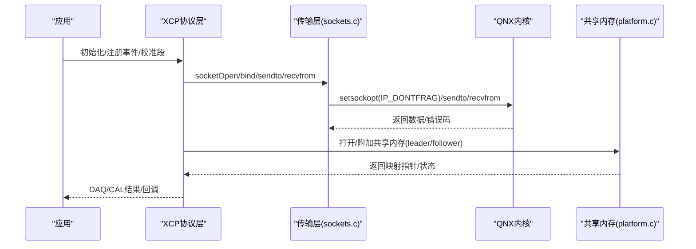
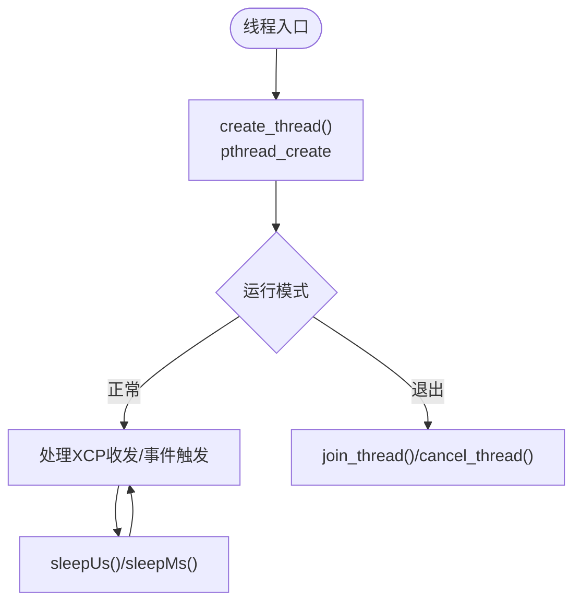
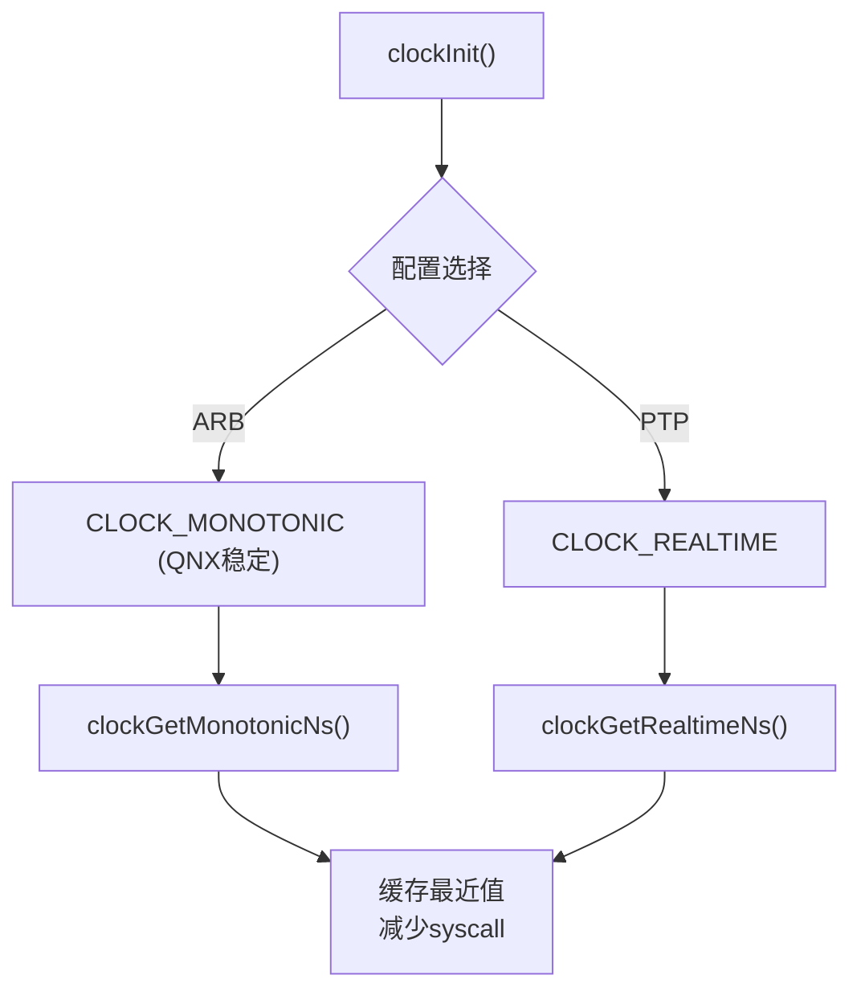
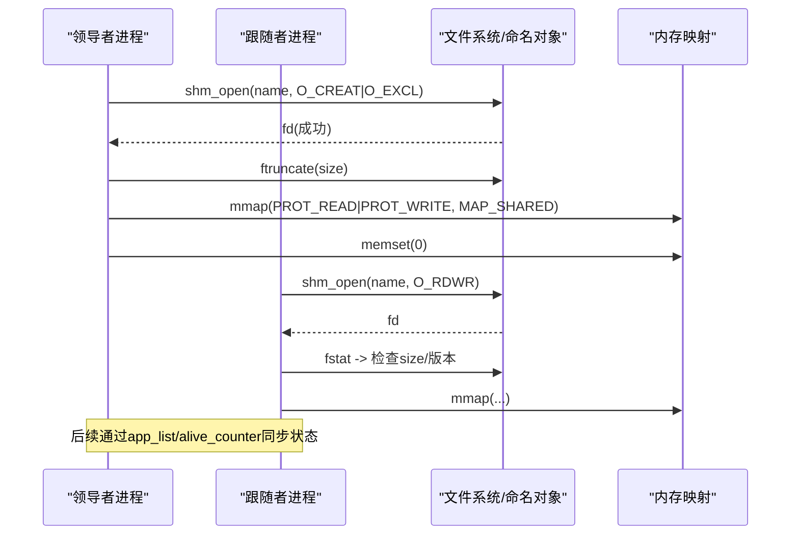
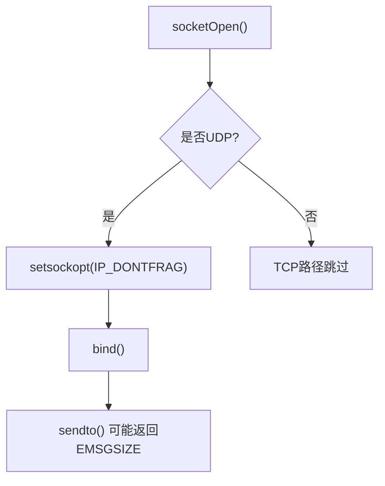
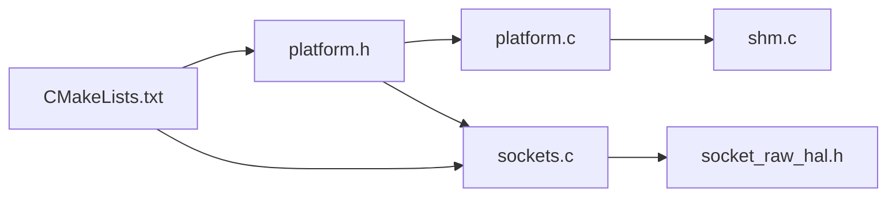

# QNX实时系统

<cite>
**本文引用的文件**   
- [platform.c](file://src/platform.c)
- [platform.h](file://src/platform.h)
- [sockets.c](file://src/sockets.c)
- [shm.c](file://src/shm.c)
- [socket_raw_hal.h](file://src/socket_raw_hal.h)
- [CMakeLists.txt](file://CMakeLists.txt)
- [TECHNICAL.md](file://docs/TECHNICAL.md)
- [SOCKET_RAW.md](file://docs/SOCKET_RAW.md)
</cite>

## 目录
1. [简介](#简介)
2. [项目结构](#项目结构)
3. [核心组件](#核心组件)
4. [架构总览](#架构总览)
5. [详细组件分析](#详细组件分析)
6. [依赖关系分析](#依赖关系分析)
7. [性能考虑](#性能考虑)
8. [故障排查指南](#故障排查指南)
9. [结论](#结论)
10. [附录](#附录)

## 简介
本文件面向在QNX Momentics上集成与部署XCPlite的工程师，聚焦以下主题：
- QNX线程模型与调度机制（优先级继承、实时任务管理）在XCPlite中的体现与使用建议
- QNX时钟源选择策略（CLOCK_MONOTONIC行为差异、高精度计时器使用）
- 共享内存实现（POSIX shm_open/mmap、领导者选举、进程间通信优化）
- 网络套接字在QNX上的特殊配置（DF标志、时间戳、带宽控制思路）
- QNX开发环境配置（交叉编译工具链、CMake集成要点）
- QNX平台性能调优（CPU亲和性、内存分配策略）
- 部署流程（镜像构建、系统集成）

说明：XCPlite通过平台抽象层同时支持Linux/macOS/QNX/Windows/FreeRTOS。本文所有技术断言均基于仓库源码与文档，未涉及的部分以“不适用”或“需外部实现”标注。

## 项目结构
XCPlite采用分层与平台抽象相结合的组织方式：
- 平台抽象层：threads/mutex/clock/sleep/memory-mapping/shm
- 传输层：以太网UDP/TCP或Raw Ethernet（HAL）
- 协议层：XCP应用接口与A2L生成
- 配置与构建：CMake集中管理多配置（default/no_a2l/ptp/shm/rtos/raw）

图表来源
- [sockets.c:300-443](file://src/sockets.c#L300-L443)
- [platform.c:434-654](file://src/platform.c#L434-L654)
- [socket_raw_hal.h:47-108](file://src/socket_raw_hal.h#L47-L108)

章节来源
- [CMakeLists.txt:15-108](file://CMakeLists.txt#L15-L108)
- [TECHNICAL.md:356-394](file://docs/TECHNICAL.md#L356-L394)

## 核心组件
- 平台抽象层（platform.c/h）
  - 线程/互斥/睡眠/时钟/内存映射/共享内存
  - 在QNX路径下走POSIX分支（pthread、clock_gettime、shm_open/mmap）
- 网络套接字（sockets.c）
  - UDP/TCP封装；QNX上启用IP_DONTFRAG避免分片
  - 获取MAC地址使用AF_LINK（QNX/macOS）
- 原始以太网传输（socket_raw_hal.h + socket_raw.c）
  - 当前仅Linux AF_PACKET后端可用；QNX需外部HAL实现
- 共享内存（shm.c + platform.c POSIX SHM）
  - 领导者选举、版本兼容、存活计数、A2L最终化协调

章节来源
- [platform.h:23-72](file://src/platform.h#L23-L72)
- [platform.c:157-363](file://src/platform.c#L157-L363)
- [sockets.c:296-370](file://src/sockets.c#L296-L370)
- [shm.c:162-215](file://src/shm.c#L162-L215)

## 架构总览
下图展示QNX环境下XCPlite的关键调用链：应用通过XCP API进入协议层，传输层在QNX上使用POSIX sockets并设置DF标志；时钟使用CLOCK_MONOTONIC（QNX语义稳定），共享内存通过POSIX shm_open/mmap实现跨进程状态共享。

图表来源
- [sockets.c:300-443](file://src/sockets.c#L300-L443)
- [platform.c:201-363](file://src/platform.c#L201-L363)

## 详细组件分析

### 线程与调度（QNX）
- XCPlite在QNX下使用pthread创建线程，互斥量使用pthread_mutex（可递归）。线程函数签名通过宏适配不同平台ABI。
- 优先级继承：QNX pthread默认支持优先级继承（取决于属性设置），XCPlite未显式设置属性，建议在需要低抖动的高优先级临界区中由上层应用设置合适的线程优先级与继承策略。
- 实时任务管理：XCPlite内部不直接管理任务调度，但提供sleepUs/sleepMs用于轮询退避；在高吞吐DAQ路径应避免阻塞。

图表来源
- [platform.h:350-451](file://src/platform.h#L350-L451)
- [platform.c:125-155](file://src/platform.c#L125-L155)

章节来源
- [platform.h:350-451](file://src/platform.h#L350-L451)
- [platform.c:125-155](file://src/platform.c#L125-L155)

### 时钟源与高精度计时（QNX）
- 主时钟：根据配置选择CLOCK_TYPE。在QNX上，当OPTION_CLOCK_EPOCH_ARB时，代码将CLOCK_TYPE设为CLOCK_MONOTONIC（注释指出QNX上该时钟不可调整且恒定递增），从而获得稳定的单调时钟。
- 单调时钟：CLOCK_MONOTONIC_TYPE在QNX下为CLOCK_MONOTONIC；提供ns/us分辨率的查询与“最近值”缓存以减少系统调用开销。
- 实时时钟：CLOCK_REALTIME_TYPE用于需要绝对时间的场景。

图表来源
- [platform.c:505-654](file://src/platform.c#L505-L654)

章节来源
- [platform.c:505-654](file://src/platform.c#L505-L654)

### 共享内存与进程间通信（QNX）
- 使用POSIX shm_open/mmap创建/映射命名共享内存，配合flock锁文件进行领导者选举与原子初始化。
- 领导者负责零初始化区域，跟随者等待激活状态；支持版本校验与旧对象清理提示。
- 应用侧通过XcpShmAttachOrCreate等接口完成附加/创建，并通过存活计数器检测僵尸进程。

图表来源
- [platform.c:201-363](file://src/platform.c#L201-L363)
- [shm.c:162-215](file://src/shm.c#L162-L215)

章节来源
- [platform.c:201-363](file://src/platform.c#L201-L363)
- [shm.c:162-215](file://src/shm.c#L162-L215)

### 网络套接字在QNX上的特殊配置
- DF标志：QNX属于BSD派生，使用IP_DONTFRAG禁止IPv4分片，确保超MTU报文立即失败（EMSGSIZE），便于诊断。
- MAC地址获取：QNX使用AF_LINK结构读取接口MAC。
- 硬件时间戳：当前库仅在Linux路径启用硬件时间戳；QNX路径未实现，需外部扩展。

图表来源
- [sockets.c:336-370](file://src/sockets.c#L336-L370)

章节来源
- [sockets.c:336-370](file://src/sockets.c#L336-L370)

### 原始以太网传输（QNX）
- HAL接口定义清晰：eth_hal_open/send/recv/wakeup等。
- 当前仓库仅提供Linux AF_PACKET后端；QNX需自行实现HAL并在配置中启用外部后端选项。

章节来源
- [socket_raw_hal.h:47-108](file://src/socket_raw_hal.h#L47-L108)
- [SOCKET_RAW.md:272-293](file://docs/SOCKET_RAW.md#L272-L293)

## 依赖关系分析
- 平台相关头与宏：_QNX在platform.h中识别，驱动后续条件编译分支。
- 传输层依赖：sockets.c在QNX路径下使用POSIX sockets；若启用RAW则依赖外部HAL。
- 共享内存依赖：shm.c依赖platform.c提供的POSIX SHM接口。
- 构建系统：CMakeLists.txt统一配置各目标与平台定义（如GNU_SOURCE仅对Linux生效）。

图表来源
- [platform.h:23-72](file://src/platform.h#L23-L72)
- [CMakeLists.txt:286-303](file://CMakeLists.txt#L286-L303)

章节来源
- [platform.h:23-72](file://src/platform.h#L23-L72)
- [CMakeLists.txt:286-303](file://CMakeLists.txt#L286-L303)

## 性能考虑
- 时钟路径优化：使用“最近值”缓存减少高频clock_gettime调用，降低QNX系统调用开销。
- 网络路径：
  - 禁用分片（IP_DONTFRAG）避免重组抖动与丢包放大。
  - RAW路径在QNX需自定义HAL以降低拷贝与中断延迟（参考HAL接口设计）。
- 共享内存：
  - 领导者先写后释放锁，保证跟随者看到一致初始状态。
  - 使用原子变量维护app_count/alive_counter，避免锁竞争。
- 线程与调度：
  - 高优先级任务应结合QNX优先级继承，避免被中低优先级任务阻塞导致抖动。
  - 避免在DAQ热路径中使用sleepMs/sleepUs过长延时。

章节来源
- [platform.c:505-654](file://src/platform.c#L505-L654)
- [sockets.c:336-370](file://src/sockets.c#L336-L370)
- [shm.c:430-517](file://src/shm.c#L430-L517)

## 故障排查指南
- 共享内存问题
  - 现象：无法附加或版本不匹配
  - 排查：检查fstat大小与magic/version；必要时清理残留对象并重启
  - 参考：platform.c中错误日志与清理提示
- 网络问题
  - 现象：EMSGSIZE或分片导致丢包
  - 排查：确认IP_DONTFRAG已设置；核对OPTION_MTU与链路MTU
  - 参考：sockets.c中DF设置与错误输出
- 时钟问题
  - 现象：时间跳变或不单调
  - 排查：确认使用CLOCK_MONOTONIC（QNX下稳定）；检查CLOCK_TICKS_PER_S配置
  - 参考：platform.c中时钟初始化与解析

章节来源
- [platform.c:201-363](file://src/platform.c#L201-L363)
- [sockets.c:336-370](file://src/sockets.c#L336-L370)
- [platform.c:505-654](file://src/platform.c#L505-L654)

## 结论
XCPlite在QNX上的适配主要依托POSIX子系统：
- 线程与互斥通过pthread实现，适合QNX实时调度模型；建议上层按需求设置优先级与继承策略。
- 时钟在QNX下使用CLOCK_MONOTONIC以获得稳定单调时间，并提供ns/us精度与最近值缓存优化。
- 共享内存通过POSIX shm_open/mmap实现，具备领导者选举与版本兼容能力，适合多进程协作。
- 网络在QNX上遵循BSD风格，设置DF避免分片；硬件时间戳需外部扩展。
- 原始以太网传输在QNX需实现HAL后端以接入。

## 附录

### QNX开发环境配置（交叉编译与工具链）
- 使用QNX Momentics IDE或命令行工具链进行交叉编译。
- 在CMake中，QNX属于UNIX分支，注意：
  - _GNU_SOURCE仅针对Linux启用；QNX不需要该宏。
  - 链接Threads::Threads与math库（UNIX通用）。
- 示例命令（概念性）：
  - cmake -B build-qnx -DCMAKE_TOOLCHAIN_FILE=<qnx_toolchain> -DXCPLITE_CONFIGURATION=default
  - cmake --build build-qnx --config Release

章节来源
- [CMakeLists.txt:195-303](file://CMakeLists.txt#L195-L303)

### QNX特定性能调优建议
- CPU亲和性与优先级
  - 将XCP收发线程绑定到专用核，提高确定性。
  - 为关键线程设置较高优先级并启用优先级继承，避免优先级反转。
- 内存分配策略
  - 尽量使用静态或预分配队列，减少运行时malloc/free。
  - 共享内存用于跨进程状态，避免频繁IPC拷贝。
- 网络栈与带宽控制
  - 保持OPTION_MTU不超过链路MTU，避免EMSGSIZE。
  - 在QNX上可通过系统级流量整形限制突发，保障DAQ稳定性。

[本节为通用指导，不直接引用具体文件]

### QNX平台部署流程（镜像构建与系统集成）
- 构建阶段
  - 选择配置：default/no_a2l/ptp/shm/rtos/raw
  - 交叉编译生成库与示例/工具
- 镜像阶段
  - 将生成的二进制与依赖库打包进QNX镜像
  - 配置启动脚本，确保共享内存名称与权限正确
- 系统集成
  - 启动领导者进程，再启动跟随者
  - 验证A2L最终化与EPK一致性
  - 监控存活计数器与日志，确保无僵尸进程

章节来源
- [CMakeLists.txt:15-108](file://CMakeLists.txt#L15-L108)
- [shm.c:162-215](file://src/shm.c#L162-L215)