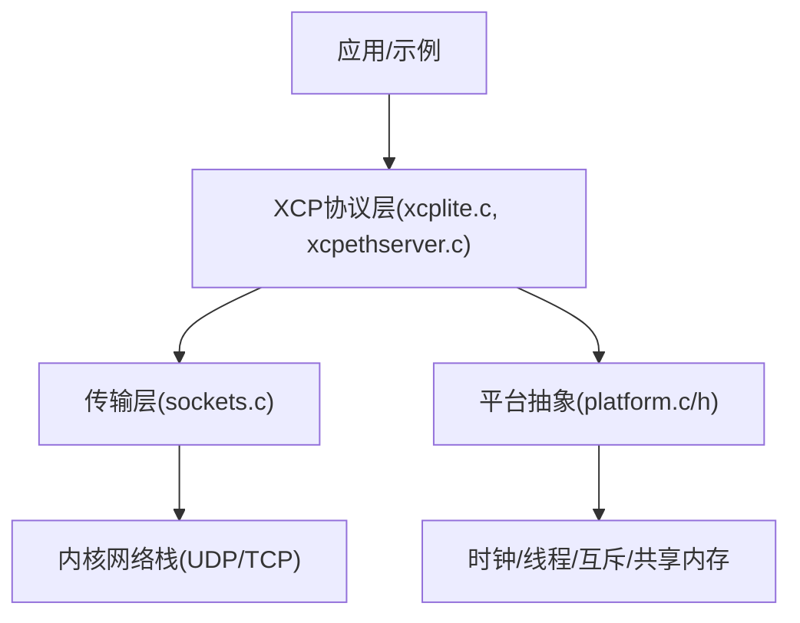
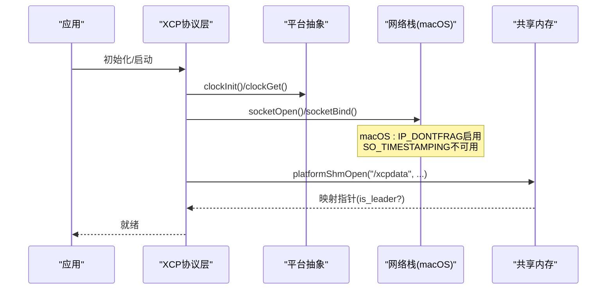
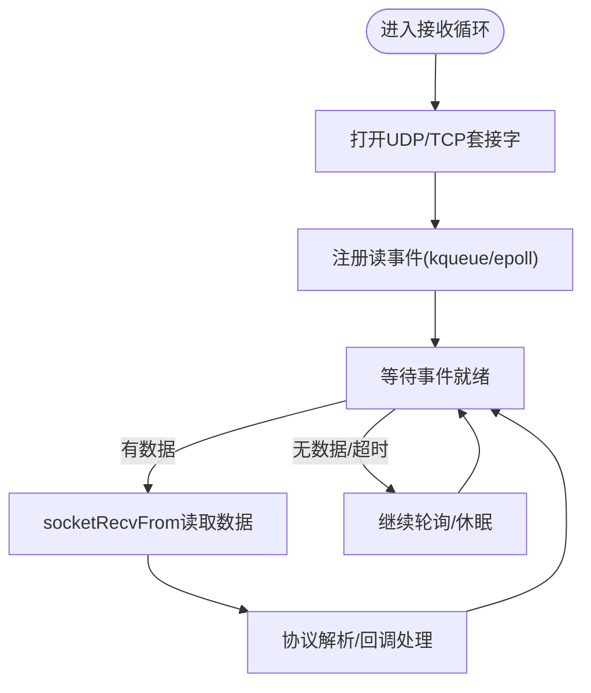
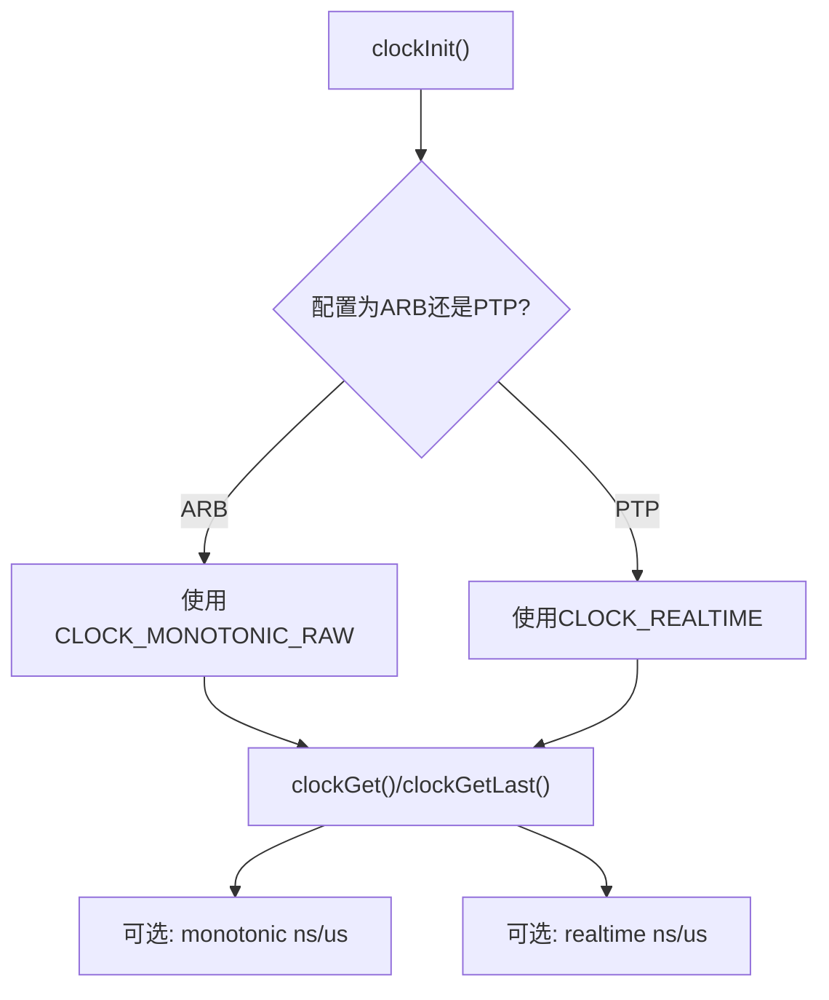
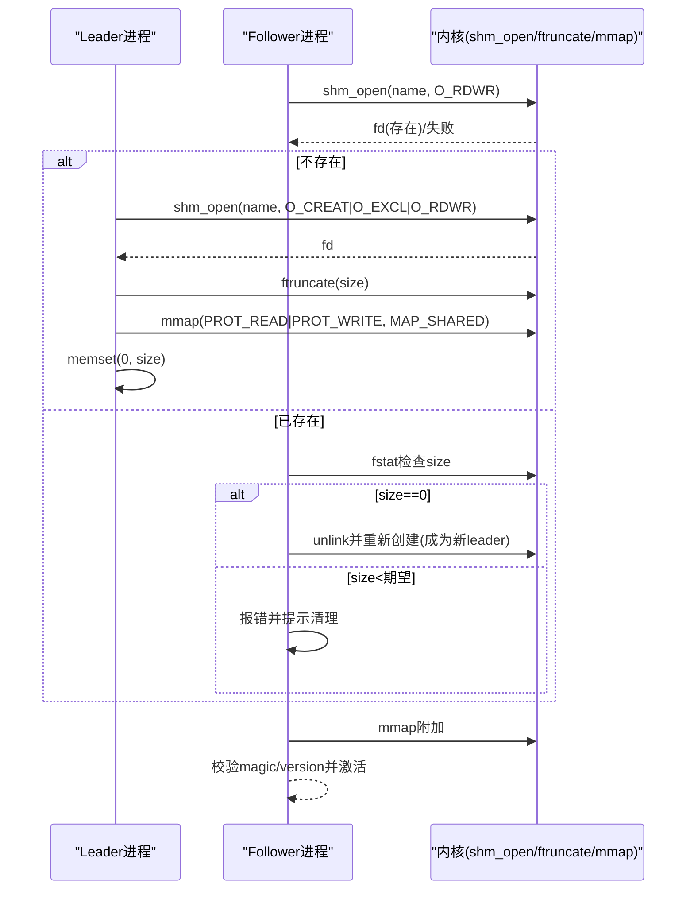
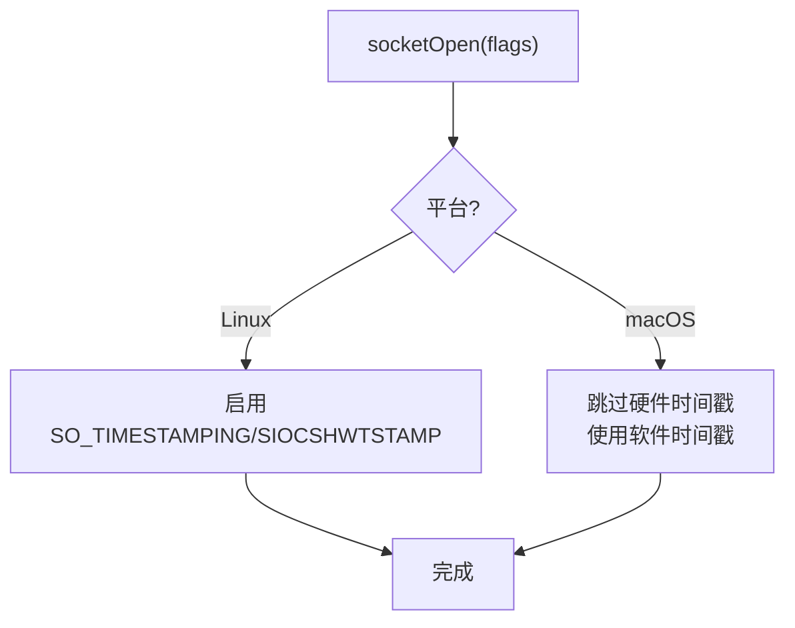
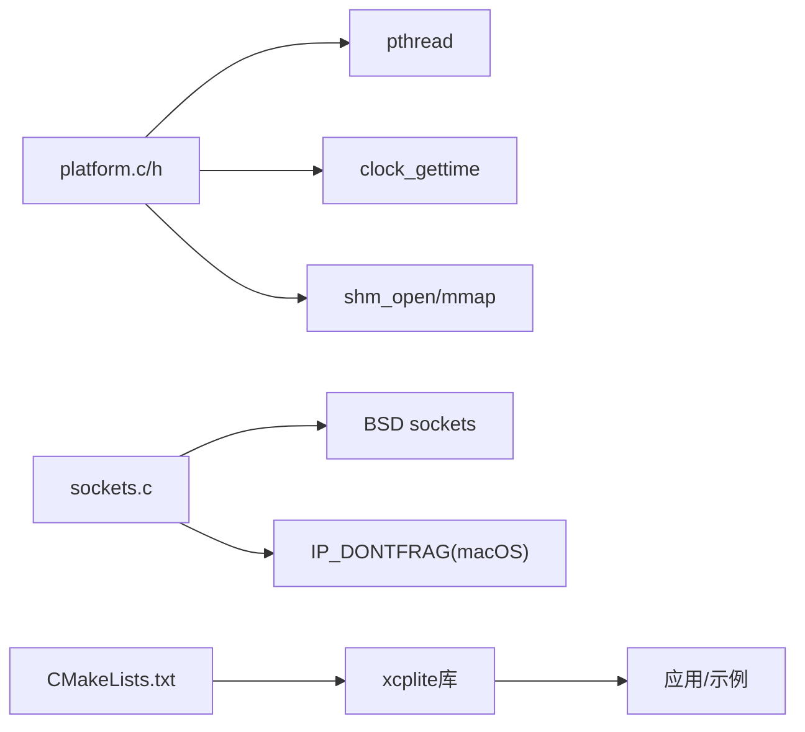

# macOS支持

<cite>
**本文引用的文件**
- [platform.c](file://src/platform.c)
- [platform.h](file://src/platform.h)
- [shm.c](file://src/shm.c)
- [sockets.c](file://src/sockets.c)
- [CMakeLists.txt](file://CMakeLists.txt)
- [xcplib_cfg.h](file://src/xcplib_cfg.h)
- [TECHNICAL.md](file://docs/TECHNICAL.md)
</cite>

## 目录
1. [简介](#简介)
2. [项目结构](#项目结构)
3. [核心组件](#核心组件)
4. [架构总览](#架构总览)
5. [详细组件分析](#详细组件分析)
6. [依赖关系分析](#依赖关系分析)
7. [性能考量](#性能考量)
8. [故障排查指南](#故障排查指南)
9. [结论](#结论)
10. [附录](#附录)

## 简介
本文件聚焦XCPlite在macOS平台上的适配实现，围绕以下主题展开：
- 事件机制：对比kqueue（macOS）与epoll（Linux）的差异，说明事件注册、监控与回调处理在跨平台抽象中的体现。
- 时钟源：解释CLOCK_MONOTONIC_RAW在macOS上的精度限制及替代方案（如CLOCK_MONOTONIC/CLOCK_REALTIME）。
- 共享内存：阐述POSIX shm_open在macOS的行为差异与兼容性处理（ftruncate页对齐、零初始化、领导者选举等）。
- 网络套接字：说明SO_TIMESTAMPING在macOS上的支持与限制，以及不碎片化选项IP_DONTFRAG的使用。
- 构建与配置：Xcode/CMake工程配置、依赖库管理与编译选项设置。
- 调试与部署：Instruments、lldb、Console日志分析方法；沙盒环境权限注意事项。

## 项目结构
XCPlite采用分层设计：
- 平台抽象层：platform.c/h提供线程、互斥、时钟、睡眠、共享内存等系统调用封装。
- 传输层：sockets.c负责TCP/UDP套接字创建、绑定、收发、超时与平台相关特性开关。
- 协议与业务层：xcp*系列文件实现XCP协议栈、A2L生成、校准段管理等。
- 构建系统：CMakeLists.txt统一配置不同目标平台与功能开关。

图表来源
- [CMakeLists.txt:245-298](file://CMakeLists.txt#L245-L298)
- [sockets.c:300-443](file://src/sockets.c#L300-L443)
- [platform.c:434-654](file://src/platform.c#L434-L654)

章节来源
- [CMakeLists.txt:1-150](file://CMakeLists.txt#L1-L150)
- [platform.h:23-72](file://src/platform.h#L23-L72)

## 核心组件
- 平台抽象：线程、互斥、时钟、睡眠、共享内存、键盘输入等。
- 套接字抽象：跨平台socket API，包含错误处理、MTU策略、时间戳能力探测。
- 共享内存管理：多进程协作的领导者/跟随者模型，原子计数与存活检测。
- 构建配置：通过CMake选择不同配置（default/no_a2l/ptp/shm/rtos/raw），并注入编译定义。

章节来源
- [platform.c:157-363](file://src/platform.c#L157-L363)
- [sockets.c:300-443](file://src/sockets.c#L300-L443)
- [shm.c:69-215](file://src/shm.c#L69-L215)
- [CMakeLists.txt:15-108](file://CMakeLists.txt#L15-L108)

## 架构总览
下图展示从应用到内核的关键路径，突出macOS特有行为点：
- 时钟：使用POSIX clock_gettime，根据配置选择CLOCK_MONOTONIC_RAW或CLOCK_MONOTONIC。
- 共享内存：通过shm_open/ftruncate/mmap实现跨进程数据共享，含领导者选举与零初始化。
- 网络：UDP/TCP套接字，macOS上启用IP_DONTFRAG避免分片；硬件时间戳仅Linux可用。

图表来源
- [platform.c:573-654](file://src/platform.c#L573-L654)
- [sockets.c:300-443](file://src/sockets.c#L300-L443)
- [platform.c:201-319](file://src/platform.c#L201-L319)

## 详细组件分析

### 事件机制：kqueue vs epoll
- Linux使用epoll进行I/O事件多路复用；macOS使用kqueue。XCPlite的套接字抽象层屏蔽了底层差异，上层通过统一的socketOpen/socketRecvFrom/socketSendTo接口访问。
- 在 sockets.c 中，非Windows分支对Linux/macOS/QNX共用一套BSD风格API；具体事件循环由上层调度器或示例程序实现，库层不直接暴露kqueue/epoll细节。
- 关键差异：
  - 事件注册：epoll使用epoll_ctl(ADD/MOD/DEL)，kqueue使用kevent(EV_ADD/EV_DELETE)。
  - 等待与回调：epoll_wait返回就绪fd集合；kevent返回事件数组，需遍历处理。
  - 性能特征：kqueue在高并发下表现良好，但事件语义与epoll略有不同（例如EV_EOF/EV_ERROR的处理）。

图表来源
- [sockets.c:300-443](file://src/sockets.c#L300-L443)
- [platform.c:125-155](file://src/platform.c#L125-L155)

章节来源
- [sockets.c:272-443](file://src/sockets.c#L272-L443)
- [platform.c:125-155](file://src/platform.c#L125-L155)

### 时钟源与精度：CLOCK_MONOTONIC_RAW在macOS的限制与替代
- 默认配置使用OPTION_CLOCK_EPOCH_ARB，非Windows平台将选择CLOCK_MONOTONIC_RAW作为主时钟类型；在macOS上该时钟粒度小于1微秒，注释明确标注“<1us granularity on MACOS”。
- 若需要更高稳定性或可预测性，可使用CLOCK_MONOTONIC（可能受频率调整影响）或CLOCK_REALTIME（受NTP/PTP影响）。
- 代码中提供了多种获取方式：
  - clockGet(): 依据配置的主时钟。
  - clockGetMonotonicNs()/Us(): 单调时钟ns/us。
  - clockGetRealtimeNs()/Us(): 实时时钟ns/us。
- 初始化时记录分辨率与初始值，便于诊断。

图表来源
- [platform.c:535-549](file://src/platform.c#L535-L549)
- [platform.c:573-654](file://src/platform.c#L573-L654)

章节来源
- [platform.c:505-654](file://src/platform.c#L505-L654)
- [xcplib_cfg.h:58-64](file://src/xcplib_cfg.h#L58-L64)

### 共享内存：POSIX shm_open在macOS的行为与兼容
- 领导者选举：首次成功O_CREAT|O_EXCL创建shm对象者为leader，负责ftruncate分配大小并清零区域；后续进程以O_RDWR附加为follower。
- 页面对齐：macOS ARM64上ftruncate会按16KiB页对齐放大实际大小；代码通过只映射所需size并在映射后校验magic/version来保证安全。
- 零初始化：leader在持有锁期间清零映射区域，确保follower看到干净状态。
- 失效恢复：若检测到旧版本导致尺寸不匹配，提示运行清理脚本；若发现零尺寸残留，视为崩溃后的可回收状态并重新创建。
- 存活检测：通过alive_counter周期性递增与重置，结合kill(pid,0)判断进程是否存活，清理陈旧条目。

图表来源
- [platform.c:201-319](file://src/platform.c#L201-L319)
- [shm.c:162-215](file://src/shm.c#L162-L215)
- [shm.c:433-517](file://src/shm.c#L433-L517)

章节来源
- [platform.c:193-363](file://src/platform.c#L193-L363)
- [shm.c:69-215](file://src/shm.c#L69-L215)
- [shm.c:433-517](file://src/shm.c#L433-L517)

### 网络套接字：SO_TIMESTAMPING支持与限制
- Linux：可通过SO_TIMESTAMPING启用硬件/软件时间戳，配合SIOCSHWTSTAMP配置网卡驱动；xcplib_ptp_cfg.h启用相关选项。
- macOS：不支持SO_TIMESTAMPING；代码在非Linux分支中提供socketEnableTimestamps空实现并返回false，同时记录错误信息。
- 通用策略：
  - 禁用分片：macOS使用IP_DONTFRAG，避免UDP分片导致的丢包与抖动。
  - 错误处理：统一通过socketGetErrorString输出可读错误。
- 建议：在macOS上使用软件时间戳（应用侧clockGet）或外部同步方案（如PTP用户态工具）进行时间对齐。

图表来源
- [sockets.c:373-427](file://src/sockets.c#L373-L427)
- [sockets.c:500-587](file://src/sockets.c#L500-L587)

章节来源
- [sockets.c:300-443](file://src/sockets.c#L300-L443)
- [sockets.c:500-587](file://src/sockets.c#L500-L587)

### 构建与配置：Xcode/CMake与编译选项
- CMake配置：
  - 通过XCPLITE_CONFIGURATION选择内置配置（default/no_a2l/ptp/shm/rtos/raw）。
  - 通过XCPLITE_CFG_OVERRIDE引入应用级覆盖头文件，用于定制OPTION_*宏。
  - 自动传播_GNU_SOURCE至Linux消费者；macOS无需此宏。
  - 链接Threads::Threads与math库（UNIX）。
- Xcode集成：
  - 可将xcplite作为子项目或通过FetchContent引入；在Xcode中添加target依赖xcplite::xcplite。
  - 设置编译标志以匹配CMake默认（如C11/C++17，警告级别）。
  - 如需自定义配置，可在Xcode的Build Settings中定义XCPLIB_CFG_OVERRIDE指向应用覆盖头。
- 依赖管理：
  - 标准库：pthread、math。
  - 可选：atomic库（某些ARM clang需要）。
  - Rust工具链（可选）：cargo构建xcpclient/bintool。

章节来源
- [CMakeLists.txt:15-108](file://CMakeLists.txt#L15-L108)
- [CMakeLists.txt:172-311](file://CMakeLists.txt#L172-L311)
- [CMakeLists.txt:505-553](file://CMakeLists.txt#L505-L553)

## 依赖关系分析
- 平台抽象依赖：
  - 线程：pthread_create/join/cancel（POSIX）。
  - 时钟：clock_gettime（POSIX）。
  - 共享内存：shm_open/ftruncate/mmap（POSIX）。
- 网络依赖：
  - BSD sockets（AF_INET/UDP/TCP）。
  - 平台特定setsockopt选项（IP_DONTFRAG on macOS）。
- 构建依赖：
  - Threads::Threads、m（UNIX）、可选atomic。
  - 可选Rust工具链（cargo）。

图表来源
- [platform.c:416-432](file://src/platform.c#L416-L432)
- [sockets.c:300-443](file://src/sockets.c#L300-L443)
- [CMakeLists.txt:297-311](file://CMakeLists.txt#L297-L311)

章节来源
- [platform.c:416-432](file://src/platform.c#L416-L432)
- [sockets.c:300-443](file://src/sockets.c#L300-L443)
- [CMakeLists.txt:297-311](file://CMakeLists.txt#L297-L311)

## 性能考量
- 时钟开销：clockGetLast缓存最近一次时钟值，减少系统调用频率，适合慢速超时场景。
- 队列与原子：64位平台默认使用无锁队列（queue64v/queue64f），提升DAQ吞吐；32位或Windows回退到互斥保护队列。
- 网络分片：禁用UDP分片避免丢包与重传抖动，提高测量稳定性。
- 共享内存：leader零初始化+原子计数，降低竞争与脏数据风险。

章节来源
- [platform.c:616-654](file://src/platform.c#L616-L654)
- [xcplib_cfg.h:143-162](file://src/xcplib_cfg.h#L143-L162)
- [sockets.c:345-371](file://src/sockets.c#L345-L371)

## 故障排查指南
- 共享内存问题：
  - 症状：无法附加或尺寸不匹配。
  - 处理：运行tools/shm_cleanup.sh清理残留对象；确认leader已正确ftruncate并清零。
  - 日志：platformShmOpen/print错误信息包含errno描述。
- 时钟精度不足：
  - 症状：DAQ时间戳抖动或分辨率低于预期。
  - 处理：确认CLOCK_TICKS_PER_S配置；在macOS上接受CLOCK_MONOTONIC_RAW <1us限制，必要时改用CLOCK_MONOTONIC。
- 网络时间戳不可用：
  - 症状：socketEnableTimestamps返回false。
  - 处理：macOS不支持硬件时间戳，改用软件时间戳或外部同步；检查IP_DONTFRAG是否启用。
- 构建错误：
  - 症状：_GNU_SOURCE未定义（Linux）或找不到依赖。
  - 处理：使用xcplite::xcplite目标自动传播定义；安装Threads/math库；必要时启用atomic库。

章节来源
- [platform.c:201-319](file://src/platform.c#L201-L319)
- [platform.c:573-654](file://src/platform.c#L573-L654)
- [sockets.c:500-587](file://src/sockets.c#L500-L587)
- [CMakeLists.txt:286-311](file://CMakeLists.txt#L286-L311)

## 结论
XCPlite在macOS上通过POSIX抽象实现了稳定的多线程、时钟、共享内存与网络通信。尽管macOS不支持SO_TIMESTAMPING且CLOCK_MONOTONIC_RAW精度受限，但通过软件时间戳与合理配置仍可满足多数应用场景。共享内存的领导者选举与零初始化确保了多进程协作的安全性。CMake/Xone集成简化了构建与部署流程。建议在macOS上关注分片控制、时间源选择与共享内存清理策略，以获得最佳性能与稳定性。

## 附录
- 参考文档：
  - 技术细节与资源消耗：[TECHNICAL.md](file://docs/TECHNICAL.md)
  - 构建指南：见CMakeLists.txt配置项与注释
- 实用命令：
  - 清理共享内存：./tools/shm_cleanup.sh
  - 查看共享内存状态：./tools/shm_status.sh（如有）
- 调试工具：
  - Instruments：用于性能分析与内存泄漏检测。
  - lldb：断点调试、变量监视、堆栈回溯。
  - Console：系统日志与崩溃报告分析。

章节来源
- [TECHNICAL.md:1-120](file://docs/TECHNICAL.md#L1-L120)
- [CMakeLists.txt:505-553](file://CMakeLists.txt#L505-L553)