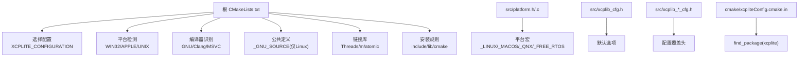
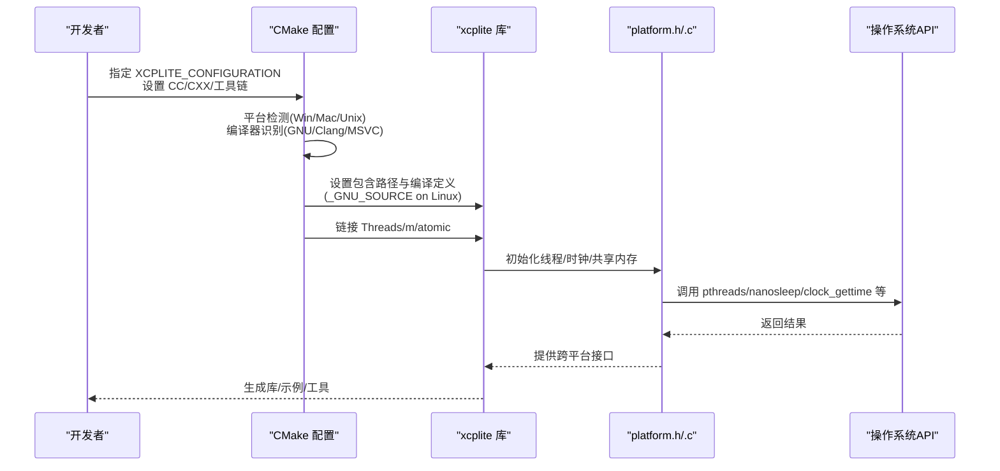
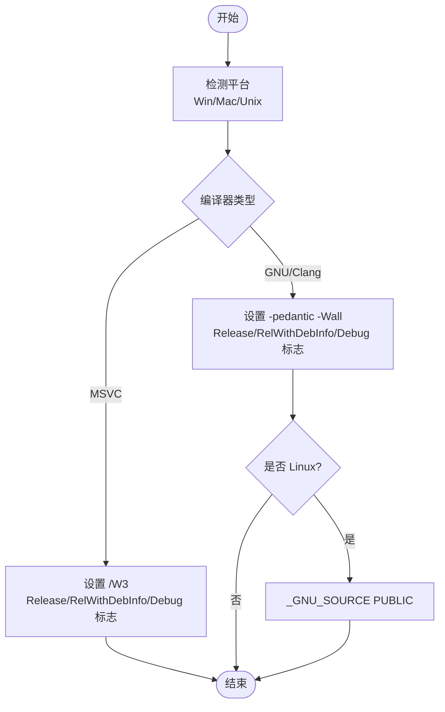
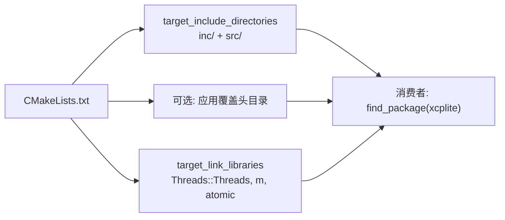
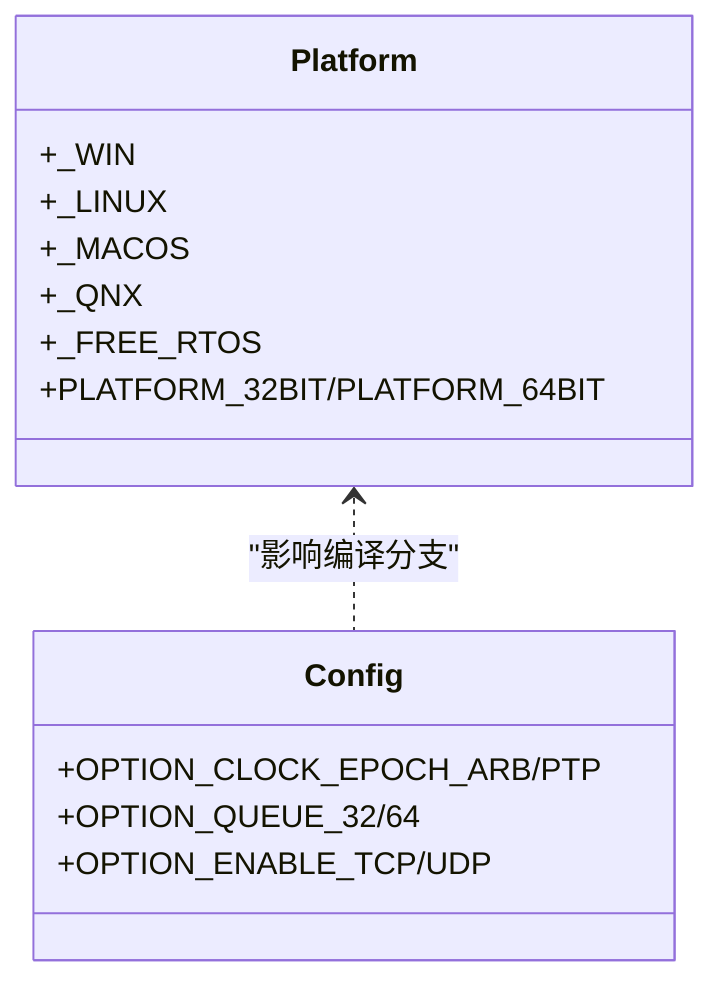
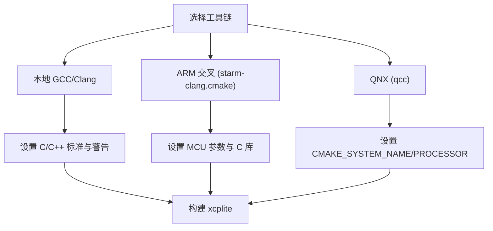
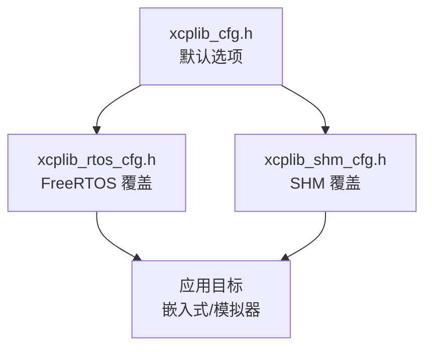
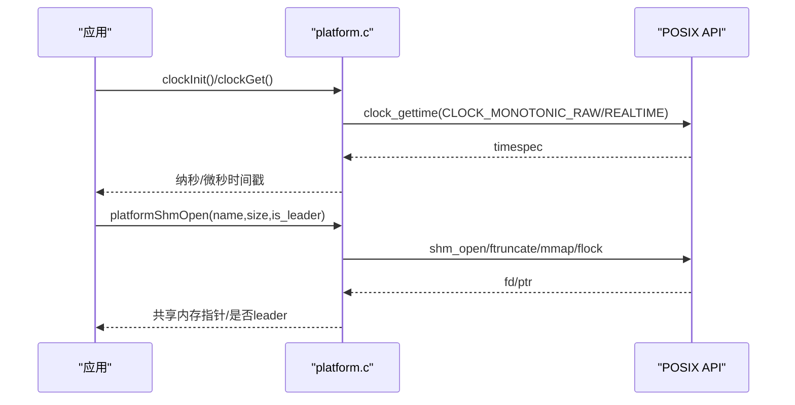
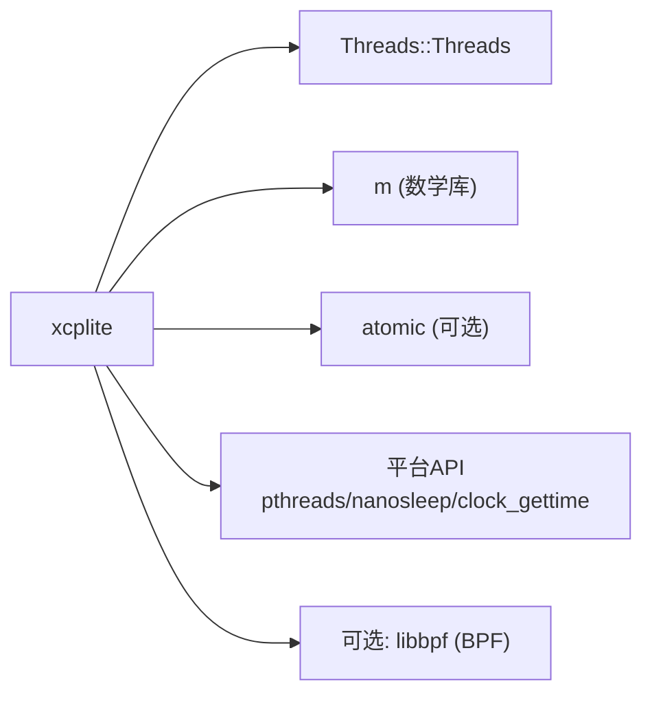

# 交叉编译配置

<cite>
**本文引用的文件**
- [CMakeLists.txt](file://CMakeLists.txt)
- [xcpliteConfig.cmake.in](file://cmake/xcpliteConfig.cmake.in)
- [platform.h](file://src/platform.h)
- [platform.c](file://src/platform.c)
- [BUILDING.md](file://docs/BUILDING.md)
- [xcplib_cfg.h](file://src/xcplib_cfg.h)
- [xcplib_rtos_cfg.h](file://src/xcplib_rtos_cfg.h)
- [xcplib_shm_cfg.h](file://src/xcplib_shm_cfg.h)
- [starm-clang.cmake](file://examples/freertos_demo/freertos_stm32_demo/cmake/starm-clang.cmake)
</cite>

## 目录
1. [简介](#简介)
2. [项目结构](#项目结构)
3. [核心组件](#核心组件)
4. [架构总览](#架构总览)
5. [详细组件分析](#详细组件分析)
6. [依赖关系分析](#依赖关系分析)
7. [性能考量](#性能考量)
8. [故障排查指南](#故障排查指南)
9. [结论](#结论)
10. [附录](#附录)

## 简介
本文件面向需要在不同 POSIX 系统（Linux、macOS、QNX）以及嵌入式 FreeRTOS 目标上进行 XCPlite 交叉编译的开发者。内容涵盖：
- CMake 构建系统的平台检测机制与编译器标志设置
- 针对不同目标平台的工具链配置（GCC、Clang、ARM 交叉编译器）
- 头文件包含路径与库链接配置
- 平台特定宏定义的作用（如 _LINUX、_MACOS、_QNX、_FREE_RTOS）
- 常见交叉编译问题及解决方案（符号解析错误、库版本不匹配、运行时依赖）
- Docker 容器化构建环境示例，确保构建一致性
- 从环境准备到产物验证的完整工作流程

## 项目结构
XCPlite 使用 CMake 作为统一构建系统，通过“配置覆盖头”实现互斥的构建配置（default、no_a2l、ptp、shm、rtos、raw），并通过生成器表达式管理安装与消费时的包含路径。平台抽象层位于 src/platform.h/.c，负责线程、时钟、共享内存等跨平台能力。

图表来源
- [CMakeLists.txt:15-110](file://CMakeLists.txt#L15-L110)
- [CMakeLists.txt:188-243](file://CMakeLists.txt#L188-L243)
- [CMakeLists.txt:265-311](file://CMakeLists.txt#L265-L311)
- [CMakeLists.txt:593-656](file://CMakeLists.txt#L593-L656)
- [xcpliteConfig.cmake.in:1-29](file://cmake/xcpliteConfig.cmake.in#L1-L29)
- [platform.h:23-72](file://src/platform.h#L23-L72)
- [xcplib_cfg.h:36-71](file://src/xcplib_cfg.h#L36-L71)

章节来源
- [CMakeLists.txt:15-110](file://CMakeLists.txt#L15-L110)
- [CMakeLists.txt:188-243](file://CMakeLists.txt#L188-L243)
- [CMakeLists.txt:265-311](file://CMakeLists.txt#L265-L311)
- [CMakeLists.txt:593-656](file://CMakeLists.txt#L593-L656)
- [xcpliteConfig.cmake.in:1-29](file://cmake/xcpliteConfig.cmake.in#L1-L29)
- [platform.h:23-72](file://src/platform.h#L23-L72)
- [xcplib_cfg.h:36-71](file://src/xcplib_cfg.h#L36-L71)

## 核心组件
- 构建配置选择：通过 XCPLITE_CONFIGURATION 指定 default/no_a2l/ptp/shm/rtos/raw，并自动引入对应覆盖头 xcplib_<name>_cfg.h。
- 平台检测与编译器标志：根据 WIN32/APPLE/UNIX 和 GNU/Clang/MSVC 设置标准、警告、优化级别与调试信息；在 Linux 上自动启用 _GNU_SOURCE。
- 头文件与库链接：通过 target_include_directories 暴露 inc/ 与 src/；链接 Threads::Threads、math 库，并在需要时链接 atomic。
- 安装与导出：安装 include、lib、cmake 包配置，供 find_package(xcplite) 使用；导出目标 xcplite::xcplite。
- 平台抽象：platform.h/.c 提供线程、时钟、共享内存、原子操作等跨平台接口，依据 _LINUX/_MACOS/_QNX/_FREE_RTOS 分支。

章节来源
- [CMakeLists.txt:15-110](file://CMakeLists.txt#L15-L110)
- [CMakeLists.txt:188-243](file://CMakeLists.txt#L188-L243)
- [CMakeLists.txt:265-311](file://CMakeLists.txt#L265-L311)
- [CMakeLists.txt:593-656](file://CMakeLists.txt#L593-L656)
- [platform.h:23-72](file://src/platform.h#L23-L72)
- [xcplib_cfg.h:36-71](file://src/xcplib_cfg.h#L36-L71)

## 架构总览
下图展示了从 CMake 配置到平台抽象层的整体流程，包括配置选择、平台检测、编译器标志、包含路径与链接库，以及最终生成的可执行/库产物。

图表来源
- [CMakeLists.txt:188-243](file://CMakeLists.txt#L188-L243)
- [CMakeLists.txt:265-311](file://CMakeLists.txt#L265-L311)
- [platform.c:435-654](file://src/platform.c#L435-L654)

## 详细组件分析

### 平台检测与编译器标志
- 平台检测：基于 CMAKE_SYSTEM_NAME 与 CMAKE_SIZEOF_VOID_P 判断 32/64 位与 Win/Mac/Unix。
- 编译器识别：对 GNU/Clang 启用 -pedantic -Wall；对 MSVC 启用 /W3。
- 构建类型标志：为 Release/RelWithDebInfo/Debug 分别设置优化与调试符号；非顶层项目不覆盖消费者标志。
- Linux 专用：通过 $<$<PLATFORM_ID:Linux>:_GNU_SOURCE> 仅在 Linux 上启用 _GNU_SOURCE，避免 macOS/QNX 的不必要依赖。

图表来源
- [CMakeLists.txt:188-243](file://CMakeLists.txt#L188-L243)
- [CMakeLists.txt:286-295](file://CMakeLists.txt#L286-L295)

章节来源
- [CMakeLists.txt:188-243](file://CMakeLists.txt#L188-L243)
- [CMakeLists.txt:286-295](file://CMakeLists.txt#L286-L295)

### 头文件包含路径与库链接
- 包含路径：BUILD_INTERFACE 指向 inc/ 与 src/；INSTALL_INTERFACE 指向 include/，保证安装后外部项目正确包含。
- 应用自定义覆盖头：若提供 XCPLITE_CFG_OVERRIDE，将其目录加入包含路径，并定义 XCPLIB_CFG_OVERRIDE 给库与消费者一致可见。
- 库链接：始终链接 Threads::Threads；在 UNIX 上链接 m；检测 atomic 库支持并在需要时链接 atomic。

图表来源
- [CMakeLists.txt:265-311](file://CMakeLists.txt#L265-L311)

章节来源
- [CMakeLists.txt:265-311](file://CMakeLists.txt#L265-L311)

### 平台特定宏定义与作用
- 平台宏：platform.h 根据预处理器宏定义 _WIN、_LINUX、_MACOS、_QNX、_FREE_RTOS，用于条件编译平台相关代码。
- 强制要求：未定义任一平台宏将触发编译错误，确保构建期明确目标平台。
- FreeRTOS 模拟：在 FREE_RTOS_POSIX_SIM 下，会根据宿主系统再次定义 _MACOS 或 _LINUX，以便复用主机 socket/clock 实现。

图表来源
- [platform.h:23-72](file://src/platform.h#L23-L72)
- [xcplib_cfg.h:55-71](file://src/xcplib_cfg.h#L55-L71)

章节来源
- [platform.h:23-72](file://src/platform.h#L23-L72)
- [xcplib_cfg.h:55-71](file://src/xcplib_cfg.h#L55-L71)

### 工具链配置（GCC、Clang、ARM 交叉编译器）
- GCC/Clang 本地构建：通过 CC/CXX 环境变量指定编译器；CMake 自动识别并设置标志。
- ARM 交叉编译（STM32/FreeRTOS）：使用 starm-clang.cmake 工具链文件，设置 CMAKE_SYSTEM_NAME=Generic、处理器 arm、编译器前缀 starm-，并配置 MCU 参数（-mcpu、-mfpu、-mfloat-abi）、C 库（newlib/picolibc/hybrid）与链接脚本。
- QNX 构建：需安装 QNX SDP，并通过 build.sh 传入 qcc 路径与架构（x86_64/aarch64le）。

图表来源
- [BUILDING.md:220-237](file://docs/BUILDING.md#L220-L237)
- [starm-clang.cmake:6-71](file://examples/freertos_demo/freertos_stm32_demo/cmake/starm-clang.cmake#L6-L71)

章节来源
- [BUILDING.md:220-237](file://docs/BUILDING.md#L220-L237)
- [starm-clang.cmake:6-71](file://examples/freertos_demo/freertos_stm32_demo/cmake/starm-clang.cmake#L6-L71)

### 配置覆盖头与特性开关
- 默认配置：xcplib_cfg.h 提供通用默认选项（日志、时钟、队列、A2L、DAQ 等）。
- RTOS 配置：xcplib_rtos_cfg.h 针对 FreeRTOS 目标关闭文件系统、A2L 生成、TCP，降低内存占用，设置 1us 时钟分辨率与 32 位队列。
- SHM 配置：xcplib_shm_cfg.h 启用多进程共享模式（POSIX 平台），用于 shmtool/xcpdaemon。

图表来源
- [xcplib_cfg.h:36-71](file://src/xcplib_cfg.h#L36-L71)
- [xcplib_rtos_cfg.h:1-142](file://src/xcplib_rtos_cfg.h#L1-L142)
- [xcplib_shm_cfg.h:1-38](file://src/xcplib_shm_cfg.h#L1-L38)

章节来源
- [xcplib_cfg.h:36-71](file://src/xcplib_cfg.h#L36-L71)
- [xcplib_rtos_cfg.h:1-142](file://src/xcplib_rtos_cfg.h#L1-L142)
- [xcplib_shm_cfg.h:1-38](file://src/xcplib_shm_cfg.h#L1-L38)

### 时钟与共享内存实现（平台抽象）
- 时钟：POSIX 平台使用 clock_gettime(CLOCK_MONOTONIC_RAW/REALTIME)，FreeRTOS 使用 xTaskGetTickCount() 转换；Windows 使用 QueryPerformanceCounter。
- 共享内存：POSIX 使用 shm_open/mmap/ftruncate/flock 实现 leader-follower 模型；Windows 使用 VirtualAlloc/VirtualFree。

图表来源
- [platform.c:435-654](file://src/platform.c#L435-L654)
- [platform.c:161-362](file://src/platform.c#L161-L362)

章节来源
- [platform.c:435-654](file://src/platform.c#L435-L654)
- [platform.c:161-362](file://src/platform.c#L161-L362)

## 依赖关系分析
- 必需依赖：Threads（pthread）、math（m）、可选 atomic。
- 平台依赖：Linux 需要 _GNU_SOURCE；QNX 需要 SDP；FreeRTOS 需要 lwIP 或 raw Ethernet HAL。
- 工具依赖：Rust 工具（xcpclient/bintool）需要 cargo；BPF 示例需要 libbpf。

图表来源
- [CMakeLists.txt:157-161](file://CMakeLists.txt#L157-L161)
- [CMakeLists.txt:297-311](file://CMakeLists.txt#L297-L311)
- [CMakeLists.txt:348-356](file://CMakeLists.txt#L348-L356)

章节来源
- [CMakeLists.txt:157-161](file://CMakeLists.txt#L157-L161)
- [CMakeLists.txt:297-311](file://CMakeLists.txt#L297-L311)
- [CMakeLists.txt:348-356](file://CMakeLists.txt#L348-L356)

## 性能考量
- 队列选择：64 位平台默认使用无锁可变长度队列（queue64v.c）；32 位或启用原子模拟时使用 mutex 队列（queue32.c/m）。
- 原子支持：部分 ARM Clang 需要 -latomic；CMake 自动检测并链接。
- 时钟精度：FreeRTOS 默认 1us 分辨率；POSIX 使用高精度单调时钟；Windows 使用高性能计数器。
- 优化级别：Release 使用 -O2；RelWithDebInfo 使用 -O1 保留更多局部变量地址以支持栈测量。

章节来源
- [xcplib_cfg.h:143-162](file://src/xcplib_cfg.h#L143-L162)
- [CMakeLists.txt:218-243](file://CMakeLists.txt#L218-L243)
- [CMakeLists.txt:305-311](file://CMakeLists.txt#L305-L311)

## 故障排查指南
- 符号解析错误：
  - 确认已链接 Threads::Threads 与 m；在 Linux 上确保 _GNU_SOURCE 已定义。
  - 检查 atomic 库是否存在并链接（部分 ARM Clang 需要 -latomic）。
- 库版本不匹配：
  - 安装后通过 find_package(xcplite) 获取 xcplite::xcplite；检查 XCPLITE_CONFIGURATION_INSTALLED 是否与期望一致。
  - 不同配置需分别安装到不同前缀，避免混用。
- 运行时依赖：
  - SHM 模式需清理残留共享内存对象（tools/shm_cleanup.sh）。
  - Raw Ethernet 传输需 CAP_NET_RAW 权限（Linux）。
  - PTP 模式需具备硬件时间戳网卡并运行 ptp4l。

章节来源
- [CMakeLists.txt:286-311](file://CMakeLists.txt#L286-L311)
- [xcpliteConfig.cmake.in:1-29](file://cmake/xcpliteConfig.cmake.in#L1-L29)
- [platform.c:201-319](file://src/platform.c#L201-L319)
- [BUILDING.md:364-416](file://docs/BUILDING.md#L364-L416)

## 结论
XCPlite 通过 CMake 的配置覆盖头与平台抽象层，提供了在多 POSIX 系统与嵌入式目标上的统一交叉编译体验。借助明确的平台检测、编译器标志、包含路径与链接配置，开发者可以高效地在 Linux、macOS、QNX 与 FreeRTOS 目标上构建与部署。遵循本文的工作流程与故障排查建议，可显著降低交叉编译过程中的不确定性。

## 附录

### 完整交叉编译工作流程（从环境准备到产物验证）
- 环境准备：
  - 安装所需工具链（GCC/Clang、ARM 交叉工具链、QNX SDP、cargo）。
  - 设置 CC/CXX 与工具链文件（如 starm-clang.cmake）。
- 配置与构建：
  - 选择配置：cmake -B build -S . -DXCPLITE_CONFIGURATION=default|no_a2l|ptp|shm|rtos|raw
  - 构建目标：cmake --build build --parallel
  - 可选：构建示例/测试/工具（XCPLITE_BUILD_EXAMPLES/TESTS/TOOLS）
- 安装与发现：
  - cmake --install build（默认安装到 build/install）
  - 外部项目通过 find_package(xcplite) 与 target_link_libraries(your_target PRIVATE xcplite::xcplite) 使用
- 产物验证：
  - 运行示例/测试，检查输出与行为
  - 对于 SHM/Raw/PTP，按文档进行网络与权限配置

章节来源
- [BUILDING.md:85-218](file://docs/BUILDING.md#L85-L218)
- [BUILDING.md:267-362](file://docs/BUILDING.md#L267-L362)

### Docker 容器化构建环境示例
- 基础镜像：选择包含 GCC/Clang、CMake、可选 Rust 工具的镜像（如 ubuntu:22.04、debian:bookworm-slim）
- 安装依赖：apt-get update && apt-get install -y build-essential cmake git
- 复制源码与工具链：将源码与交叉工具链（如 starm-clang）拷贝进镜像
- 构建命令：在容器内执行 cmake -B build -S . -DCMAKE_TOOLCHAIN_FILE=... 与 cmake --build build
- 产物提取：将 build/install 或二进制复制到宿主机

[本节为概念性说明，无需具体文件来源]