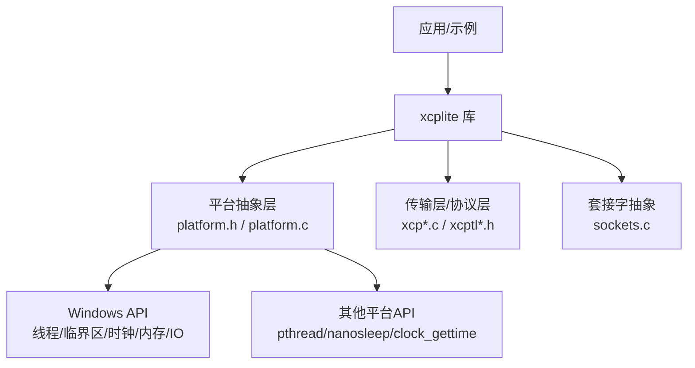
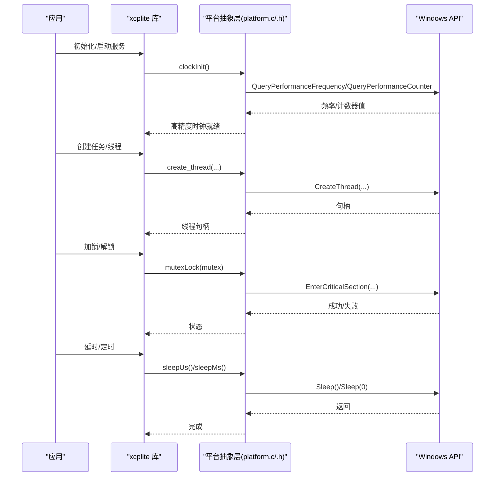
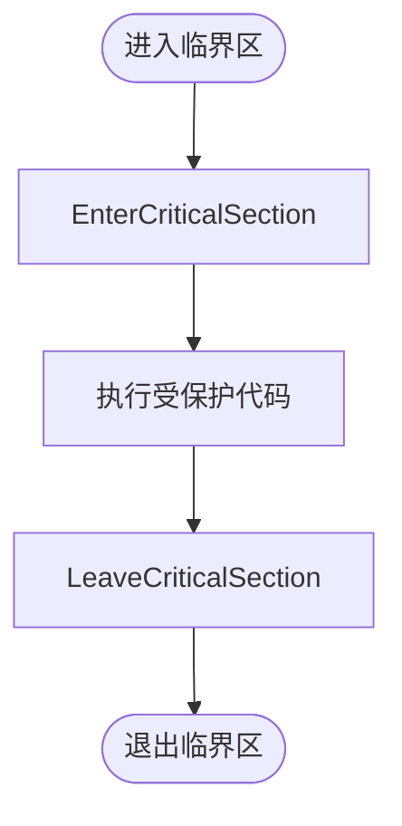
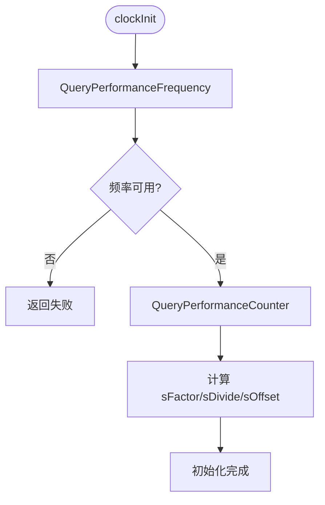
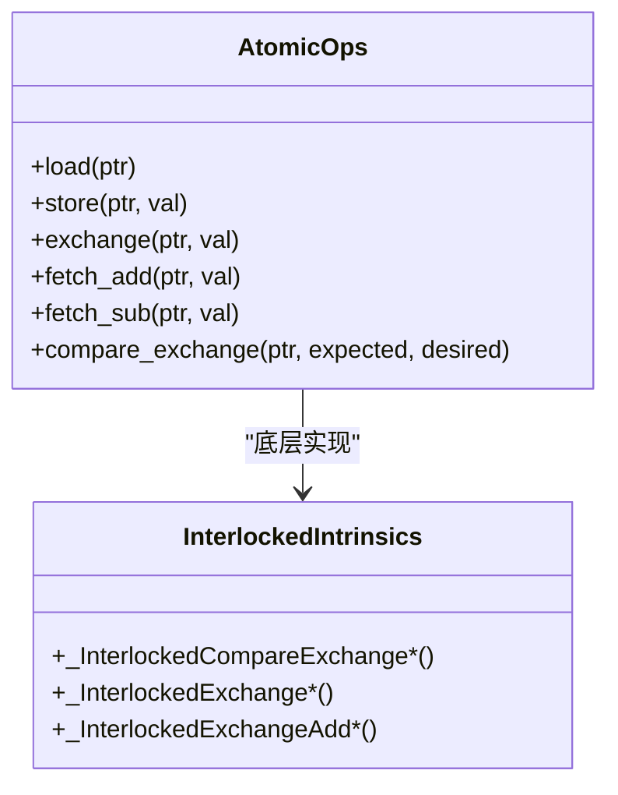
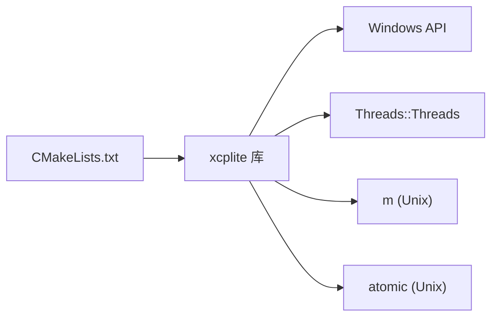

# Windows支持

<cite>
**本文引用的文件**
- [platform.h](file://src/platform.h)
- [platform.c](file://src/platform.c)
- [xcplib_cfg.h](file://src/xcplib_cfg.h)
- [CMakeLists.txt](file://CMakeLists.txt)
- [sockets.c](file://src/sockets.c)
</cite>

## 目录
1. [简介](#简介)
2. [项目结构](#项目结构)
3. [核心组件](#核心组件)
4. [架构总览](#架构总览)
5. [详细组件分析](#详细组件分析)
6. [依赖关系分析](#依赖关系分析)
7. [性能考虑](#性能考虑)
8. [故障排查指南](#故障排查指南)
9. [结论](#结论)
10. [附录](#附录)

## 简介
本章节面向在Windows平台上构建、部署与优化XCPlite的开发者，系统阐述平台抽象层对多线程、同步原语、内存管理、文件系统与时钟的封装；说明Windows特有的原子操作实现（基于Interlocked系列）；解释时钟源选择与精度优化策略；并给出Visual Studio/CMake配置、依赖管理与调试建议。需要特别说明的是：本项目当前未提供IOCP异步I/O与内存映射文件的Windows专用实现，共享内存采用POSIX路径（非Windows），因此本节将明确标注“未实现/不适用”的部分，避免误导。

## 项目结构
- 平台抽象层位于 src/platform.h 与 src/platform.c，统一暴露 sleep/sleepMs、mutex、thread、clock、内存分配、文件存在性检查等接口，并在内部按 _WIN/_LINUX/_MACOS/_QNX/_FREE_RTOS 分支实现。
- 构建系统与配置由根目录 CMakeLists.txt 管理，针对Windows设置C++标准、编译器选项、链接库与安装规则。
- 网络套接字抽象位于 src/sockets.c，包含错误字符串映射与平台相关实现；Windows路径下提供部分错误码映射，但具体socket收发逻辑在本仓库中主要体现为Linux/macOS/QNX分支。
- 编译期配置集中在 src/xcplib_cfg.h，用于启用/禁用功能开关（如原子模拟、队列模式、DAQ/A2L特性等）。

图表来源
- [CMakeLists.txt:245-298](file://CMakeLists.txt#L245-L298)
- [platform.h:23-68](file://src/platform.h#L23-L68)
- [platform.c:92-155](file://src/platform.c#L92-L155)
- [sockets.c:23-50](file://src/sockets.c#L23-L50)

章节来源
- [CMakeLists.txt:172-243](file://CMakeLists.txt#L172-L243)
- [platform.h:23-68](file://src/platform.h#L23-L68)
- [platform.c:92-155](file://src/platform.c#L92-L155)
- [sockets.c:23-50](file://src/sockets.c#L23-L50)

## 核心组件
- 线程与同步
  - 线程创建/等待/取消/ID获取通过宏在Windows上分别映射到 CreateThread、WaitForSingleObject、TerminateThread、GetCurrentThreadId。
  - 互斥量使用 CRITICAL_SECTION 并通过 InitializeCriticalSectionAndSpinCount 初始化，支持自旋计数优化。
- 睡眠与时钟
  - 微秒级睡眠：大于1ms走Sleep(ms)，小于等于1ms采用忙轮询+Sleep(0)以尽量精确。
  - 高精度时钟：基于 QueryPerformanceCounter 与频率换算，支持任意时间起点或UNIX时间起点两种模式。
- 内存与文件
  - 匿名内存分配/释放：VirtualAlloc/VirtualFree。
  - 文件存在性检查：_access。
- 原子操作（Windows）
  - 通过 OPTION_ATOMIC_EMULATION 启用基于 Interlocked* 内建的原子操作模拟，覆盖load/store/exchange/fetch_add/sub/CAS等，保证跨平台一致的语义。
- 套接字
  - 提供 socketGetErrorString 的错误码映射；Windows路径下返回可读字符串，便于诊断。

章节来源
- [platform.h:303-348](file://src/platform.h#L303-L348)
- [platform.h:368-433](file://src/platform.h#L368-L433)
- [platform.c:92-155](file://src/platform.c#L92-L155)
- [platform.c:659-818](file://src/platform.c#L659-L818)
- [platform.c:167-187](file://src/platform.c#L167-L187)
- [platform.c:824-848](file://src/platform.c#L824-L848)
- [platform.h:520-672](file://src/platform.h#L520-L672)
- [xcplib_cfg.h:67-71](file://src/xcplib_cfg.h#L67-L71)
- [sockets.c:23-50](file://src/sockets.c#L23-L50)

## 架构总览
下图展示了XCPlite在Windows上的调用链路与关键模块关系：应用通过xcplite库访问平台抽象层，后者在Windows上调用内核API完成线程、同步、时钟、内存与文件操作；网络层通过sockets.c进行错误处理与平台适配。

图表来源
- [platform.c:693-783](file://src/platform.c#L693-L783)
- [platform.c:786-818](file://src/platform.c#L786-L818)
- [platform.h:368-433](file://src/platform.h#L368-L433)
- [platform.c:92-155](file://src/platform.c#L92-L155)

## 详细组件分析

### 线程与同步（Windows）
- 线程模型
  - 使用 CreateThread 创建线程，WaitForSingleObject 等待结束，TerminateThread 强制终止并关闭句柄，GetCurrentThreadId 获取线程ID。
  - 线程函数签名通过 THREAD_FUNC_RETURN/THREAD_FUNC_END 适配不同平台ABI。
- 互斥量
  - 使用 CRITICAL_SECTION，InitializeCriticalSectionAndSpinCount 支持自旋计数，EnterCriticalSection/LeaveCriticalSection 加解锁。
  - 注意：Windows临界区天然可重入，代码中忽略 recursive 参数。

图表来源
- [platform.h:303-348](file://src/platform.h#L303-L348)
- [platform.h:368-433](file://src/platform.h#L368-L433)

章节来源
- [platform.h:303-348](file://src/platform.h#L303-L348)
- [platform.h:368-433](file://src/platform.h#L368-L433)

### 睡眠与时钟（Windows）
- 睡眠
  - sleepMs：直接调用 Sleep(ms)。
  - sleepUs：>1ms 使用 Sleep(us/1000)；<=1ms 使用忙轮询结合 Sleep(0) 提高精度。
- 时钟
  - 初始化时查询 QueryPerformanceFrequency 得到频率，计算转换因子与偏移，支持任意时间起点或UNIX时间起点。
  - clockGet 通过 QueryPerformanceCounter 读取计数器并按配置转换为纳秒或微秒刻度。
  - 提供 last 值缓存以减少系统调用开销。

图表来源
- [platform.c:693-783](file://src/platform.c#L693-L783)
- [platform.c:786-818](file://src/platform.c#L786-L818)

章节来源
- [platform.c:92-155](file://src/platform.c#L92-L155)
- [platform.c:659-818](file://src/platform.c#L659-L818)

### 内存与文件系统（Windows）
- 内存分配/释放
  - 使用 VirtualAlloc 分配可读写的匿名内存，VirtualFree 释放。
- 文件存在性检查
  - 使用 _access 判断文件是否可访问。

章节来源
- [platform.c:167-187](file://src/platform.c#L167-L187)
- [platform.c:824-848](file://src/platform.c#L824-L848)

### 原子操作（Windows）
- 通过 OPTION_ATOMIC_EMULATION 启用，使用 MSVC Interlocked 内建函数实现 load/store/exchange/fetch_add/sub/CAS 等，覆盖8/16/32/64位类型，并提供 memory_order 语义常量占位以满足跨平台接口一致性。
- 该实现仅适用于Windows且要求64位平台。

图表来源
- [platform.h:520-672](file://src/platform.h#L520-L672)
- [xcplib_cfg.h:67-71](file://src/xcplib_cfg.h#L67-L71)

章节来源
- [platform.h:520-672](file://src/platform.h#L520-L672)
- [xcplib_cfg.h:67-71](file://src/xcplib_cfg.h#L67-L71)

### 网络套接字（Windows）
- 错误字符串映射
  - 在Windows路径下，将内部错误码映射为可读字符串，便于日志与诊断。
- 其他socket收发细节
  - 本仓库中Windows平台的socket收发实现未在此处展开，主要逻辑见Linux/macOS/QNX分支；Windows端可通过相同接口接入上层逻辑。

章节来源
- [sockets.c:23-50](file://src/sockets.c#L23-L50)

## 依赖关系分析
- 构建期
  - Windows下C++标准为C++20，MSVC警告级别设置为/W3，Release/RelWithDebInfo/Debug各有对应优化与调试符号配置。
  - 链接 Threads::Threads 以支持线程相关功能；Unix平台额外链接 m 与 atomic（按需）。
  - 定义 _CRT_SECURE_NO_WARNINGS 以抑制安全CRT告警。
- 运行期
  - 依赖Windows内核API：CreateThread、WaitForSingleObject、TerminateThread、GetCurrentThreadId、InitializeCriticalSectionAndSpinCount、Enter/LeaveCriticalSection、VirtualAlloc/VirtualFree、QueryPerformanceFrequency/QueryPerformanceCounter、_access。

图表来源
- [CMakeLists.txt:172-243](file://CMakeLists.txt#L172-L243)
- [CMakeLists.txt:286-311](file://CMakeLists.txt#L286-L311)

章节来源
- [CMakeLists.txt:172-243](file://CMakeLists.txt#L172-L243)
- [CMakeLists.txt:286-311](file://CMakeLists.txt#L286-L311)

## 性能考虑
- 时钟精度与开销
  - 使用 QueryPerformanceCounter 提供高精度计时；通过 sFactor/sDivide/sOffset 将计数器值转换为所需分辨率（ns/us），并缓存最近一次值以降低频繁调用的系统开销。
- 睡眠策略
  - 短延时采用忙轮询+Sleep(0)提升精度，长延时使用Sleep减少CPU占用。
- 同步原语
  - 临界区支持自旋计数，适合短临界区场景降低上下文切换成本。
- 队列与原子
  - 在Windows/32位平台默认切换到基于互斥量的队列实现（OPTION_QUEUE_32），以保证正确性与可移植性；若需更高吞吐，可在满足条件时评估无锁队列的适用性。

章节来源
- [platform.c:693-818](file://src/platform.c#L693-L818)
- [platform.c:92-155](file://src/platform.c#L92-L155)
- [xcplib_cfg.h:155-162](file://src/xcplib_cfg.h#L155-L162)

## 故障排查指南
- 时钟初始化失败
  - 现象：clockInit 返回失败。
  - 可能原因：QueryPerformanceFrequency 不可用或返回值异常。
  - 建议：确认系统支持高性能计数器；检查日志输出中的错误信息。
- 线程/同步问题
  - 现象：死锁或崩溃。
  - 建议：确保所有线程路径均成对调用 Enter/LeaveCriticalSection；避免长时间持有临界区；必要时增加日志定位。
- 内存泄漏
  - 现象：进程内存持续增长。
  - 建议：核对 VirtualAlloc/VirtualFree 配对；确保异常路径也释放内存。
- 文件访问失败
  - 现象：fexists 返回false。
  - 建议：检查路径权限与有效性；确认文件名编码与大小写。
- 网络错误
  - 现象：socketGetErrorString 返回未知错误。
  - 建议：核对错误码映射表；在Windows路径下查看具体错误码并补充映射。

章节来源
- [platform.c:693-783](file://src/platform.c#L693-L783)
- [platform.c:824-848](file://src/platform.c#L824-L848)
- [sockets.c:23-50](file://src/sockets.c#L23-L50)

## 结论
XCPlite在Windows平台提供了完整的线程、同步、时钟、内存与文件基础能力，并通过Interlocked系列实现了跨平台一致的原子操作语义。其高精度时钟基于QueryPerformanceCounter，具备纳秒/微秒分辨率与低开销last值缓存。构建层面通过CMake统一配置，适配MSVC与Windows环境。需要注意的是，当前仓库未提供IOCP异步I/O、内存映射文件以及Windows共享内存的实现，这些属于“未实现/不适用”范畴；如需引入，应在平台抽象层新增相应后端并保持接口一致。

## 附录
- Visual Studio/CMake构建要点
  - 使用CMake生成VS工程；Windows下C++标准为C++20；Release/RelWithDebInfo/Debug已预设优化与调试符号。
  - 链接 Threads::Threads；Unix平台额外链接 m 与 atomic（按需）。
  - 通过 XCPLITE_CONFIGURATION 选择功能集（default/no_a2l/ptp/shm/rtos/raw），并结合 XCPLITE_CFG_OVERRIDE 进行应用级配置覆盖。
- 依赖与头文件
  - 平台相关头文件由 platform.h 统一引入；Windows路径包含 windows.h、time.h 等。
  - 配置项集中在 xcplib_cfg.h，可按需启用/禁用功能。
- 调试技巧
  - 开启 OPTION_ENABLE_DBG_PRINTS 与合适的日志级别；利用 clockGetString 打印时间戳辅助时序分析。
  - 使用VS调试器附加进程，观察临界区持有时间与线程栈回溯，定位潜在瓶颈。

章节来源
- [CMakeLists.txt:172-243](file://CMakeLists.txt#L172-L243)
- [CMakeLists.txt:286-311](file://CMakeLists.txt#L286-L311)
- [platform.h:101-105](file://src/platform.h#L101-L105)
- [xcplib_cfg.h:44-53](file://src/xcplib_cfg.h#L44-L53)
- [platform.c:671-689](file://src/platform.c#L671-L689)