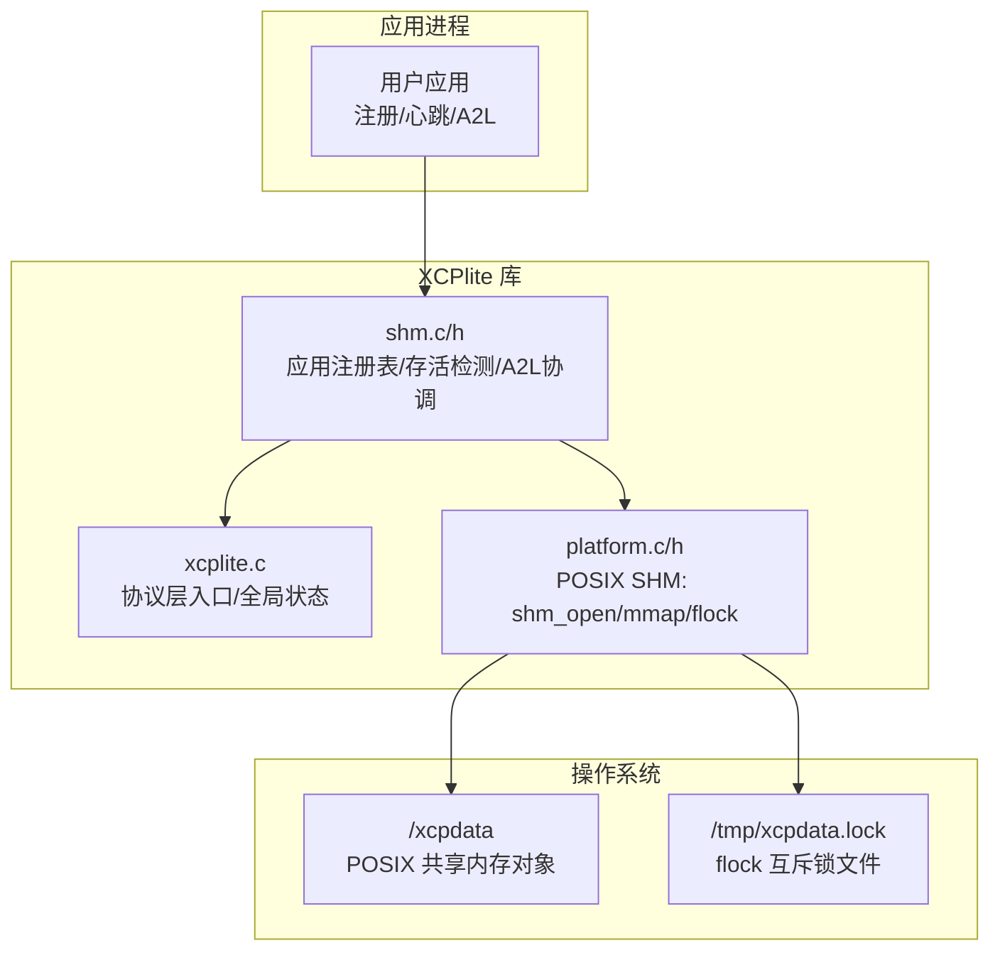
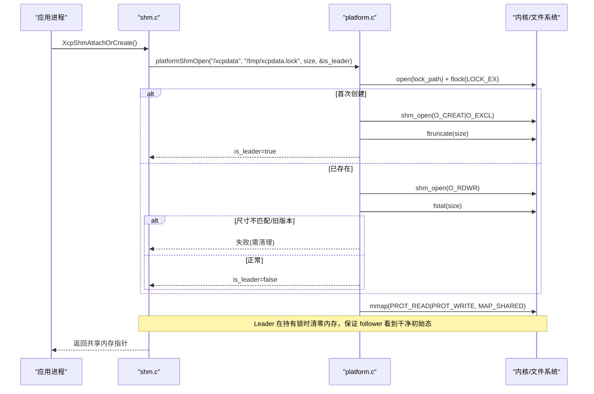
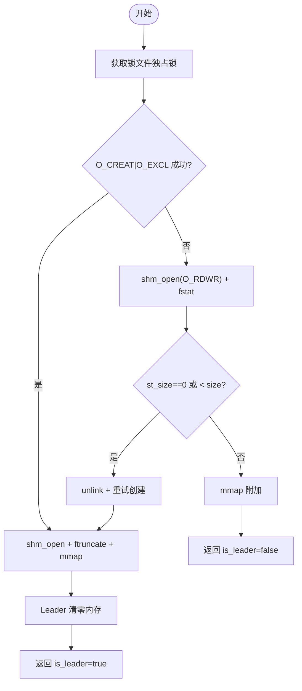
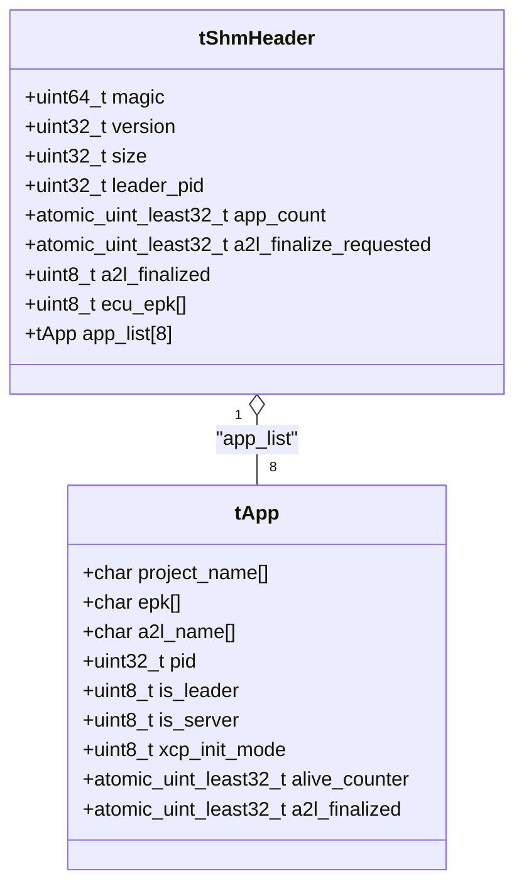
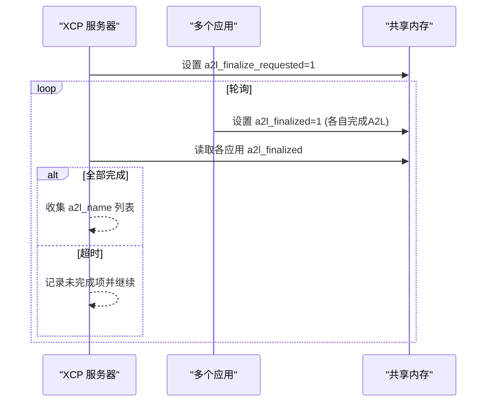
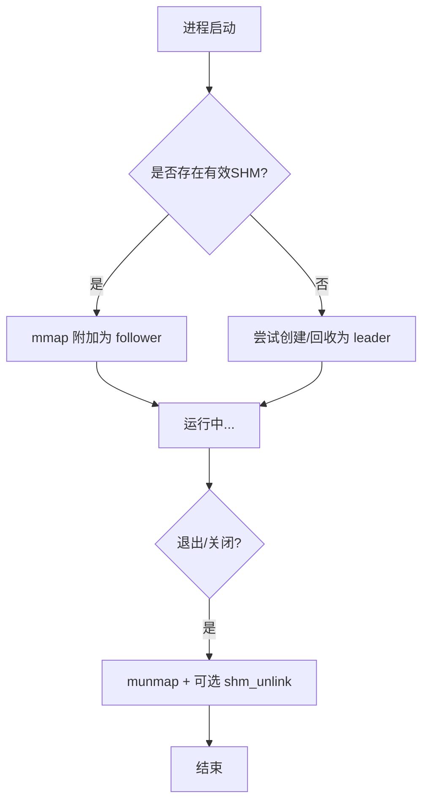
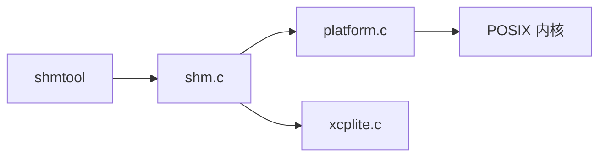

# 共享内存传输

<cite>
**本文引用的文件**
- [shm.c](file://src/shm.c)
- [shm.h](file://src/shm.h)
- [platform.c](file://src/platform.c)
- [platform.h](file://src/platform.h)
- [xcplite.c](file://src/xcplite.c)
- [SHM.md](file://docs/SHM.md)
- [main.cpp](file://tools/shmtool/src/main.cpp)
- [README.md](file://tools/shmtool/README.md)
</cite>

## 目录
1. [简介](#简介)
2. [项目结构](#项目结构)
3. [核心组件](#核心组件)
4. [架构总览](#架构总览)
5. [详细组件分析](#详细组件分析)
6. [依赖关系分析](#依赖关系分析)
7. [性能考虑](#性能考虑)
8. [故障排查指南](#故障排查指南)
9. [结论](#结论)
10. [附录](#附录)

## 简介
本文件系统性阐述 XCPlite 的共享内存（SHM）传输层实现与跨平台支持，重点覆盖：
- POSIX 共享内存的实现细节：shm_open、mmap、flock 的使用及领导者选举流程
- 数据一致性保障：原子操作、内存屏障、缓存一致性与并发访问控制
- 生命周期管理：创建、附加、分离与清理
- A2L 生成协调与多应用注册表
- 监控工具 shmtool 的使用方法
- 性能优化：零拷贝、批量操作与内存池思路

说明：当前仓库在 SHM 模式下仅实现 POSIX 共享内存路径；Windows 下的共享内存传输模式未启用。

## 项目结构
围绕共享内存传输的关键代码组织如下：
- src/shm.c / src/shm.h：共享内存状态、应用注册表、A2L 协调、存活检测等高层逻辑
- src/platform.c / src/platform.h：平台抽象层，包含 POSIX 共享内存的创建/映射/关闭、锁文件 flock 以及睡眠/时钟等
- src/xcplite.c：XCP 协议层主入口，集成 SHM 模式开关与全局状态指针
- docs/SHM.md：共享内存模式的总体说明与使用要点
- tools/shmtool：诊断工具，用于查看/触发/清理共享内存区域

图表来源
- [shm.c:162-208](file://src/shm.c#L162-L208)
- [platform.c:201-319](file://src/platform.c#L201-L319)
- [xcplite.c:189-194](file://src/xcplite.c#L189-L194)

章节来源
- [SHM.md:1-72](file://docs/SHM.md#L1-L72)

## 核心组件
- 共享内存头部与应用列表
  - tShmHeader：包含 magic/version/size/leader_pid/app_count/a2l_finalize_requested/a2l_finalized/ecu_epk 等控制字段，以及固定大小的应用列表 app_list[SHM_MAX_APP_COUNT]
  - tApp：每个应用槽位保存 project_name、epk、a2l_name、pid、is_leader、is_server、xcp_init_mode、alive_counter、a2l_finalized 等
- 领导者选举与附加
  - platformShmOpen：通过 flock 序列化关键窗口，O_CREAT|O_EXCL 确保只有一个进程成为 leader；随后 ftruncate 并 mmap
  - XcpShmAttachOrCreate：非 leader 会等待 leader 完成初始化并进入激活态；若发现无效/损坏则尝试回收并重新作为 leader
- 应用注册与存活检测
  - XcpShmRegisterApp：按 project_name+epk 复用或新增槽位，维护 app_count
  - XcpShmCheckAliveCounters：周期性检查 alive_counter，结合 kill(pid,0) 判断僵尸进程并复位槽位
- A2L 生成协调
  - XcpShmRequestA2lFinalize/XcpShmCollectA2lFiles：设置全局标志并轮询各应用的 a2l_finalized 标志，收集最终 A2L 文件名
- 调试与工具接口
  - XcpShmDebugPrint：打印头、应用列表、事件与校准段信息
  - shmtool：独立工具直接读写 /xcpdata 进行状态检查、触发 finalize、清理残留

章节来源
- [shm.h:38-81](file://src/shm.h#L38-L81)
- [shm.c:69-80](file://src/shm.c#L69-L80)
- [shm.c:162-208](file://src/shm.c#L162-L208)
- [shm.c:283-369](file://src/shm.c#L283-L369)
- [shm.c:433-517](file://src/shm.c#L433-L517)
- [shm.c:526-633](file://src/shm.c#L526-L633)
- [platform.c:201-319](file://src/platform.c#L201-L319)

## 架构总览
共享内存传输层以“单头 + 多应用槽”的结构组织，所有参与进程通过同一块共享内存交换元数据与控制标志。领导者负责创建和初始化共享内存，其他进程作为跟随者附加到该内存。

图表来源
- [platform.c:201-319](file://src/platform.c#L201-L319)
- [shm.c:162-208](file://src/shm.c#L162-L208)

章节来源
- [platform.c:201-319](file://src/platform.c#L201-L319)
- [shm.c:162-208](file://src/shm.c#L162-L208)

## 详细组件分析

### POSIX 共享内存与领导者选举
- 关键 API
  - shm_open：创建/打开命名共享内存对象
  - ftruncate：分配大小（由 leader 执行）
  - mmap：将共享内存映射到进程地址空间（MAP_SHARED）
  - flock：对锁文件加独占锁，序列化 leader 选举窗口
- 选举流程
  - 所有竞争进程先获取锁文件独占锁
  - 第一个成功 O_CREAT|O_EXCL 的进程成为 leader，负责 ftruncate 并 mmap
  - 后续进程以 O_RDWR 打开并 mmap，作为 follower
  - 若检测到尺寸不匹配或为 0（崩溃恢复场景），按策略处理（拒绝或回收）

图表来源
- [platform.c:201-319](file://src/platform.c#L201-L319)

章节来源
- [platform.c:201-319](file://src/platform.c#L201-L319)

### 共享内存数据结构与并发模型
- 数据结构
  - tShmHeader：控制区（首 64 字节对齐一个缓存行）+ 应用列表
  - tApp：每应用槽位，含 pid、is_leader、is_server、alive_counter、a2l_finalized 等
- 并发与一致性
  - 使用 C11 原子类型（atomic_uint_least32_t 等）管理 app_count、alive_counter、a2l_finalized 等
  - 通过内存序（store/load/fetch_add）保证跨进程可见性
  - 读取端遵循“先读长度/计数，再读条目”的模式，避免脏读
  - 写端在 leader 选举期间持锁，保证初始化的原子性

图表来源
- [shm.h:38-81](file://src/shm.h#L38-L81)

章节来源
- [shm.h:38-81](file://src/shm.h#L38-L81)
- [shm.c:69-80](file://src/shm.c#L69-L80)

### 应用注册、存活检测与 A2L 协调
- 应用注册
  - 按 project_name+epk 查找是否可复用槽位；否则原子递增 app_count 并初始化新槽位
  - 更新 ECU EPK 哈希（基于所有应用 EPK 的 FNV-1a 64 位哈希）
- 存活检测
  - 各应用周期递增 alive_counter
  - 服务器侧定期调用 XcpShmCheckAliveCounters：若某槽位 alive_counter==0 且进程不存在（kill(pid,0)==-1 && errno==ESRCH），则重置槽位
- A2L 协调
  - 服务器设置 a2l_finalize_requested=1，通知所有应用停止修改并生成最终 A2L
  - 收集阶段轮询各应用的 a2l_finalized 标志，超时后汇总结果

图表来源
- [shm.c:283-369](file://src/shm.c#L283-L369)
- [shm.c:433-517](file://src/shm.c#L433-L517)

章节来源
- [shm.c:283-369](file://src/shm.c#L283-L369)
- [shm.c:433-517](file://src/shm.c#L433-L517)
- [shm.c:526-633](file://src/shm.c#L526-L633)

### 生命周期管理：创建、附加、分离与清理
- 创建与附加
  - XcpShmAttachOrCreate：优先附加已有共享内存；若无效则尝试回收并重建
  - platformShmOpen：封装 shm_open/ftruncate/mmap 与锁文件 flock
- 分离与清理
  - platformShmClose：munmap，可选 shm_unlink
  - XcpShmUnlink：解除名称绑定，阻止新进程加入，但保留现有映射直到进程退出
  - 当无活跃应用时，自动 unlink 以便下一轮 leader 重建

图表来源
- [platform.c:344-360](file://src/platform.c#L344-L360)
- [shm.c:210-215](file://src/shm.c#L210-L215)
- [shm.c:610-633](file://src/shm.c#L610-L633)

章节来源
- [platform.c:344-360](file://src/platform.c#L344-L360)
- [shm.c:210-215](file://src/shm.c#L210-L215)
- [shm.c:610-633](file://src/shm.c#L610-L633)

### 数据一致性保障
- 原子操作
  - 使用 atomic_store/fetch_add/load 管理 app_count、alive_counter、a2l_finalized 等
  - 在 Windows 下提供 Interlocked intrinsics 模拟原子操作（仅在启用 OPTION_ATOMIC_EMULATION 时使用）
- 内存屏障与可见性
  - 通过原子操作的内存序保证跨进程可见性
  - Leader 在持有锁时清零内存，确保 follower 看到的是干净初始态
- 并发访问控制
  - 领导者选举窗口通过 flock 串行化
  - 应用槽位的增删改通过原子计数与边界检查保护
  - 存活检测通过 kill(pid,0) 辅助判断进程是否存活

章节来源
- [platform.h:520-672](file://src/platform.h#L520-L672)
- [platform.c:201-319](file://src/platform.c#L201-L319)
- [shm.c:433-517](file://src/shm.c#L433-L517)

### 性能优化
- 零拷贝数据传输
  - 通过 MAP_SHARED 直接映射共享内存，避免额外拷贝
  - 应用间通过共享队列/缓冲区直接读写，减少系统调用开销
- 批量操作
  - A2L 生成采用批量收集与轮询，降低频繁同步开销
- 内存池与布局优化
  - tShmHeader 控制区对齐至 64 字节缓存行，减少伪共享
  - tApp 槽位固定大小（512 字节），便于扩展与对齐

章节来源
- [shm.h:65-81](file://src/shm.h#L65-L81)
- [shm.c:283-369](file://src/shm.c#L283-L369)

### 监控工具 shmtool 使用方法
- 功能
  - status：查看 /xcpdata 内容（magic、version、app 列表、A2L 状态等）
  - finalize：设置 a2l_finalize_requested，轮询直至所有应用确认或超时
  - clean：移除 /xcpdata、/xcpqueue 及其锁文件
- 典型用法
  - 查看状态：./build/shmtool status [-v]
  - 触发 A2L 生成：./build/shmtool finalize [--timeout ms]
  - 清理残留：./build/shmtool clean

章节来源
- [main.cpp:71-167](file://tools/shmtool/src/main.cpp#L71-L167)
- [main.cpp:173-266](file://tools/shmtool/src/main.cpp#L173-L266)
- [main.cpp:272-302](file://tools/shmtool/src/main.cpp#L272-L302)
- [README.md:8-111](file://tools/shmtool/README.md#L8-L111)

## 依赖关系分析
- 模块耦合
  - shm.c 依赖 platform.c 提供的 platformShmOpen/Close/Unlink
  - shm.c 依赖 xcplite.c 的全局 gXcpData 指针与 XCP 配置
  - shmtool 直接读取 /xcpdata，依赖 shm.h 中的结构体定义保持一致
- 外部依赖
  - POSIX：shm_open、mmap、flock、fstat、shm_unlink
  - 原子操作：C11 stdatomic 或 Windows Interlocked 模拟
- 潜在循环依赖
  - 无明显循环依赖；shm.c 与 platform.c 单向依赖

图表来源
- [shm.c:162-208](file://src/shm.c#L162-L208)
- [platform.c:201-319](file://src/platform.c#L201-L319)
- [main.cpp:71-167](file://tools/shmtool/src/main.cpp#L71-L167)

章节来源
- [shm.c:162-208](file://src/shm.c#L162-L208)
- [platform.c:201-319](file://src/platform.c#L201-L319)
- [main.cpp:71-167](file://tools/shmtool/src/main.cpp#L71-L167)

## 性能考虑
- 共享内存映射与零拷贝：通过 MAP_SHARED 直接访问共享数据，避免额外拷贝
- 原子操作与缓存行对齐：控制区对齐至 64 字节，减少跨核伪共享
- 轮询与超时：A2L 收集采用短间隔轮询与超时机制，平衡实时性与 CPU 占用
- 错误快速失败：尺寸不匹配或旧版本直接提示清理，避免隐式降级

## 故障排查指南
- 常见问题
  - 共享内存尺寸不匹配：提示不同二进制版本，需运行清理脚本
  - 锁文件残留：使用 shmtool clean 移除 /tmp/xcpdata.lock 等
  - 应用未响应 A2L 生成：检查 a2l_finalized 标志与进程存活状态
- 诊断步骤
  - 使用 shmtool status 查看共享内存头与应用列表
  - 使用 shmtool finalize --timeout 触发并观察各应用确认情况
  - 若异常，使用 shmtool clean 清理后重启应用

章节来源
- [platform.c:273-286](file://src/platform.c#L273-L286)
- [main.cpp:272-302](file://tools/shmtool/src/main.cpp#L272-L302)

## 结论
XCPlite 的共享内存传输层通过 POSIX 共享内存与原子操作实现了高效、低延迟的多进程通信。领导者选举、应用注册、存活检测与 A2L 协调共同构成了稳定的多应用协作框架。配合 shmtool 诊断工具，开发者可以便捷地监控与排障。尽管当前未实现 Windows 共享内存路径，但平台抽象层为未来扩展预留了空间。

## 附录
- 配置选项
  - OPTION_SHM_MODE：启用共享内存模式
  - XCP_MODE_SHM / XCP_MODE_SHM_AUTO / XCP_MODE_SHM_SERVER：控制 SHM 模式行为
- 参考文档
  - docs/SHM.md：共享内存模式概述与使用说明
  - tools/shmtool/README.md：工具使用手册

章节来源
- [SHM.md:21-42](file://docs/SHM.md#L21-L42)
- [README.md:8-111](file://tools/shmtool/README.md#L8-L111)