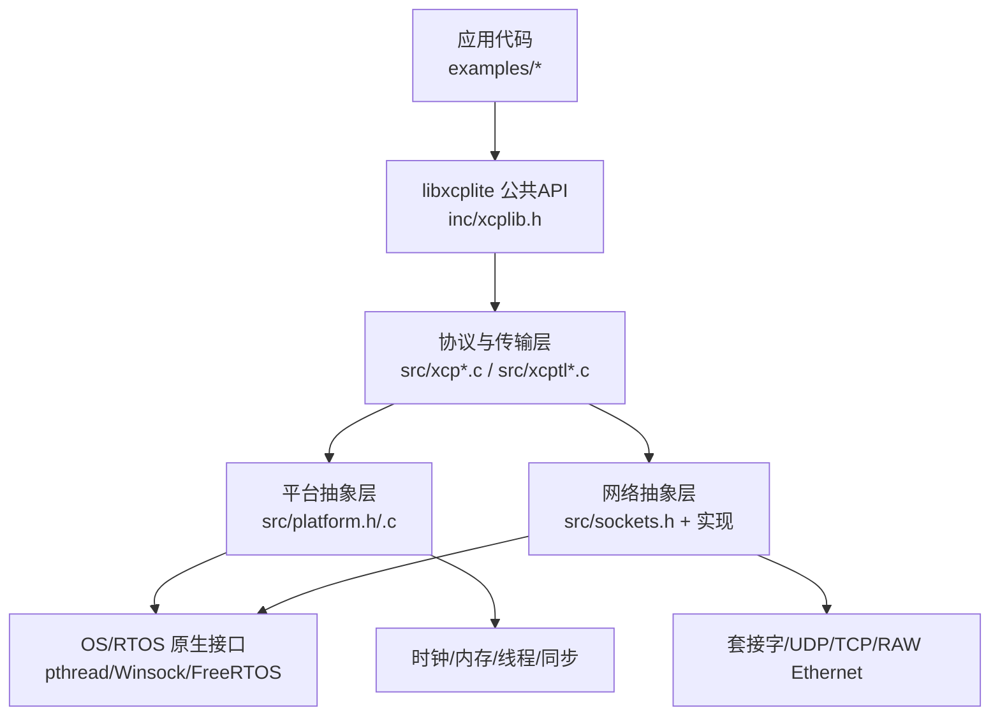
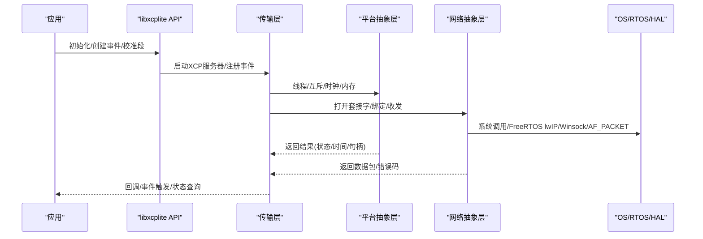
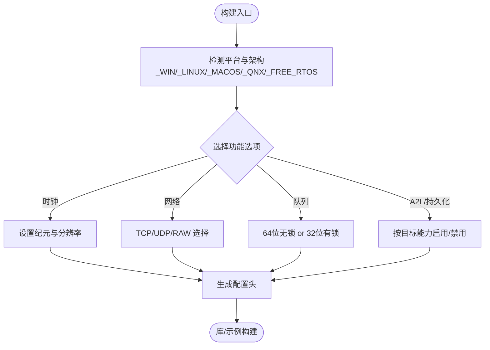
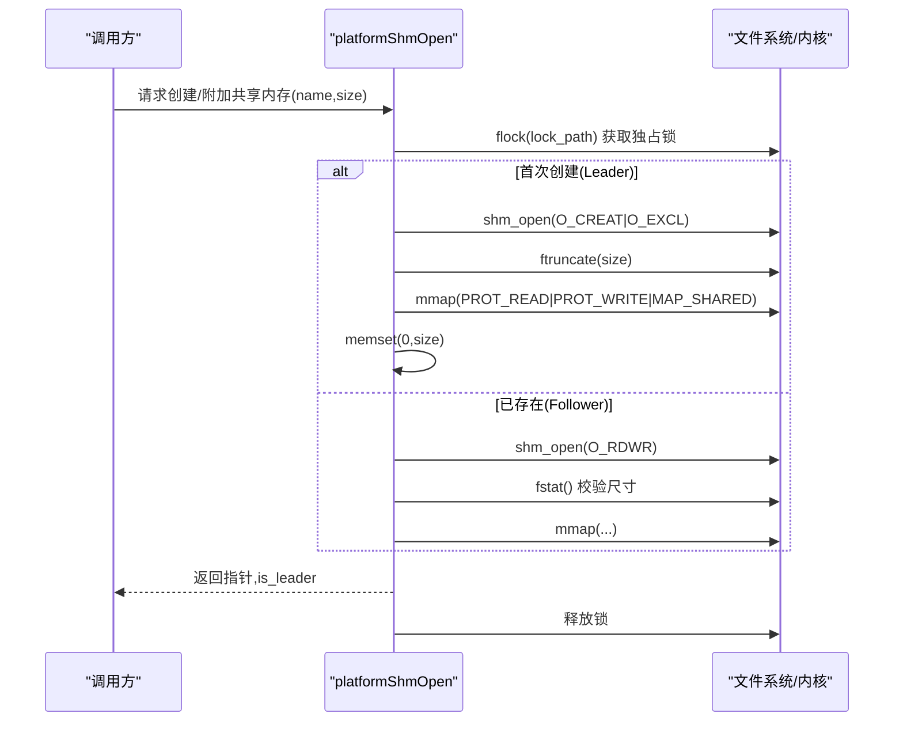
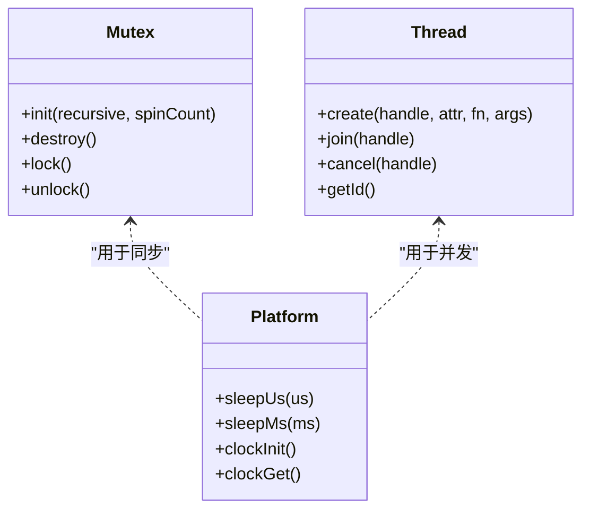
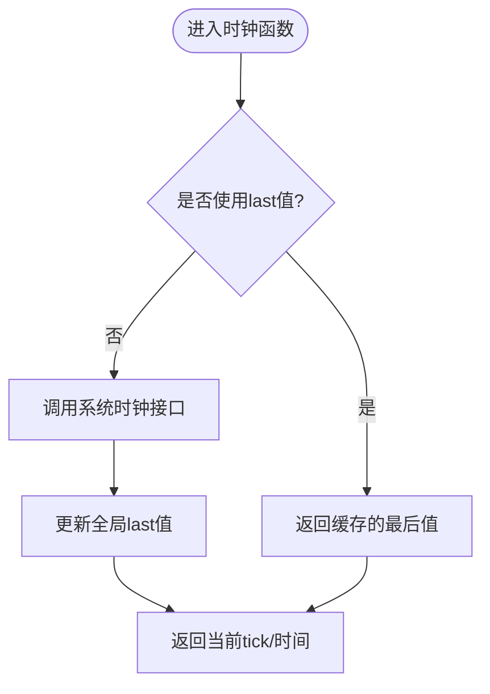
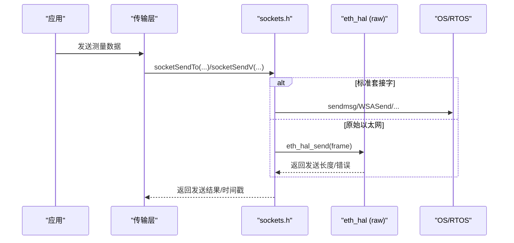
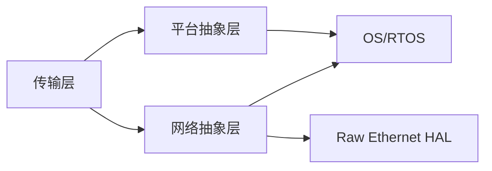

# 平台移植指南

<cite>
**本文引用的文件**
- [platform.h](file://src/platform.h)
- [platform.c](file://src/platform.c)
- [xcplib_cfg.h](file://src/xcplib_cfg.h)
- [xcplib_rtos_cfg.h](file://src/xcplib_rtos_cfg.h)
- [sockets.h](file://src/sockets.h)
- [socket_raw_hal.h](file://src/socket_raw_hal.h)
- [xcplib.h](file://inc/xcplib.h)
- [xcplib.md](file://docs/xcplib.md)
</cite>

## 目录
1. [简介](#简介)
2. [项目结构](#项目结构)
3. [核心组件](#核心组件)
4. [架构总览](#架构总览)
5. [详细组件分析](#详细组件分析)
6. [依赖关系分析](#依赖关系分析)
7. [性能考量](#性能考量)
8. [故障排除指南](#故障排除指南)
9. [结论](#结论)
10. [附录](#附录)

## 简介
本指南面向需要在目标平台上移植和部署 XCPlite 的开发者，围绕“平台抽象层（Platform Abstraction Layer, PAL）”的设计与实现，系统阐述：
- 平台检测宏与编译时配置（架构、特性开关）
- 内存管理适配（堆分配、共享内存、对齐与保护）
- 线程与同步原语（线程、互斥锁、信号量、条件变量）
- 时钟与定时器（高精度时间源、单调/实时时钟）
- 网络与 I/O 适配（套接字、原始以太网 HAL、文件系统与设备驱动集成）
- 移植检查清单、测试方法与调试技巧
- 在新平台成功部署的完整技术路径与排障方案

## 项目结构
XCPlite 将平台相关能力集中在 src/platform.* 与 src/sockets.* 中，并通过 xcplib_cfg.h 与可选的 xcplib_rtos_cfg.h 进行编译期裁剪。公共 API 在 inc/xcplib.h，文档在 docs/xcplib.md。

图表来源
- [platform.h:23-86](file://src/platform.h#L23-L86)
- [sockets.h:1-70](file://src/sockets.h#L1-L70)

章节来源
- [xcplib.md:13-26](file://docs/xcplib.md#L13-L26)
- [xcplib_cfg.h:13-23](file://src/xcplib_cfg.h#L13-L23)

## 核心组件
- 平台检测与编译选项
  - 通过 platform.h 中的 _WIN/_LINUX/_MACOS/_QNX/_FREE_RTOS 宏区分平台；自动识别 32/64 位；提供原子操作模拟（Windows）。
  - 通过 xcplib_cfg.h 统一启用/禁用功能（如 TCP/UDP、DAQ、A2L、队列类型、日志级别等），并支持应用级覆盖头文件。
- 线程与同步
  - 统一的 create_thread/join_thread/cancel_thread/get_thread_id 宏；MUTEX 封装 pthread/CRITICAL_SECTION/FreeRTOS 信号量；支持递归互斥。
- 时钟
  - FreeRTOS：基于 xTaskGetTickCount() 转换到配置的 CLOCK_TICKS_PER_S。
  - POSIX：CLOCK_MONOTONIC_RAW/CLOCK_REALTIME，支持 ns/us 分辨率；提供 last 值缓存减少系统调用。
  - Windows：QueryPerformanceCounter 映射到所需分辨率与纪元。
- 内存与共享内存
  - platformMemAlloc/Free 使用 VirtualAlloc/mmap。
  - POSIX 共享内存：platformShmOpen/Attach/Close/Unlink，含 leader/follower 选举与零初始化。
- 网络与 I/O
  - sockets.h 提供跨平台 socket 抽象，支持 TCP/UDP、多播、超时、硬件时间戳（Linux）、本地地址查询。
  - 无协议栈场景：OPTION_ENABLE_UDP_RAW + socket_raw_hal.h 定义 HAL 接口，自行实现以太网帧收发。

章节来源
- [platform.h:23-86](file://src/platform.h#L23-L86)
- [platform.h:255-510](file://src/platform.h#L255-L510)
- [platform.c:78-155](file://src/platform.c#L78-L155)
- [platform.c:161-363](file://src/platform.c#L161-L363)
- [platform.c:366-432](file://src/platform.c#L366-L432)
- [platform.c:435-800](file://src/platform.c#L435-L800)
- [sockets.h:1-70](file://src/sockets.h#L1-L70)
- [socket_raw_hal.h:1-108](file://src/socket_raw_hal.h#L1-L108)
- [xcplib_cfg.h:55-162](file://src/xcplib_cfg.h#L55-L162)

## 架构总览
XCPlite 采用分层设计：应用层通过稳定 API 调用，协议/传输层负责 XCP 协议处理与数据面，平台抽象层屏蔽 OS/RTOS 差异，底层对接系统服务或裸机 HAL。

图表来源
- [xcplib.h:39-58](file://inc/xcplib.h#L39-L58)
- [sockets.h:207-372](file://src/sockets.h#L207-L372)
- [platform.h:350-510](file://src/platform.h#L350-L510)

## 详细组件分析

### 平台检测宏与编译时配置
- 平台识别
  - 自动推导 _WIN/_LINUX/_MACOS/_QNX/_FREE_RTOS 与 32/64 位标志；未支持平台直接编译失败。
- 关键编译选项
  - 时钟：OPTION_CLOCK_EPOCH_ARB 或 OPTION_CLOCK_EPOCH_PTP；OPTION_CLOCK_TICKS_1NS 或 OPTION_CLOCK_TICKS_1US。
  - 原子：OPTION_ATOMIC_EMULATION（Windows 默认开启）。
  - 网络：OPTION_ENABLE_TCP/OPTION_ENABLE_UDP/OPTION_ENABLE_UDP_RAW（互斥）。
  - 队列：64位无锁队列或32位有锁队列（受平台与原子能力影响）。
  - A2L/持久化：按目标能力关闭（嵌入式通常关闭）。
- RTOS 覆盖
  - xcplib_rtos_cfg.h 针对 FreeRTOS 调整 MTU、队列、事件数、时钟分辨率、关闭 TCP/A2L/持久化等。

图表来源
- [platform.h:23-86](file://src/platform.h#L23-L86)
- [xcplib_cfg.h:55-162](file://src/xcplib_cfg.h#L55-L162)
- [xcplib_rtos_cfg.h:57-142](file://src/xcplib_rtos_cfg.h#L57-L142)

章节来源
- [platform.h:23-86](file://src/platform.h#L23-L86)
- [xcplib_cfg.h:55-162](file://src/xcplib_cfg.h#L55-L162)
- [xcplib_rtos_cfg.h:57-142](file://src/xcplib_rtos_cfg.h#L57-L142)

### 内存管理适配
- 堆分配器
  - platformMemAlloc/Free：Windows 使用 VirtualAlloc/VirtualFree；POSIX 使用 mmap/munmap。
- 共享内存（POSIX）
  - platformShmOpen：flock 串行化 leader 选举，shm_open/ftruncate/mmap，leader 零初始化区域；follower 校验尺寸并附加。
  - platformShmOpenAttach：快速附加已有 SHM，返回实际大小。
  - platformShmClose/Unlink：解映射与清理命名对象。
- 对齐与保护
  - 通过 MAP_SHARED/MAP_PRIVATE 与 PROT_READ|PROT_WRITE 控制可见性与权限；必要时结合页面对齐策略由上层保证。

图表来源
- [platform.c:201-319](file://src/platform.c#L201-L319)

章节来源
- [platform.c:161-187](file://src/platform.c#L161-L187)
- [platform.c:201-363](file://src/platform.c#L201-L363)

### 线程与同步原语
- 线程
  - create_thread/join_thread/cancel_thread/get_thread_id：统一 POSIX/Windows/FreeRTOS 语义；FreeRTOS 使用 vTaskDelete 作为退出方式。
- 互斥锁
  - MUTEX：pthread_mutex_t/CRITICAL_SECTION/FreeRTOS 信号量；支持递归模式（POSIX/FreeRTOS）。
  - mutexInit/mutexDestroy：根据平台创建/销毁，FreeRTOS 支持静态分配。
- 条件变量/信号量
  - 通过 FreeRTOS 信号量/队列实现等待/通知；POSIX 使用 pthread_condvar；Windows 使用事件/条件变量。
- 线程局部存储
  - THREAD_LOCAL 宏兼容 C/C++ 各编译器。

图表来源
- [platform.h:300-467](file://src/platform.h#L300-L467)
- [platform.c:366-432](file://src/platform.c#L366-L432)

章节来源
- [platform.h:300-467](file://src/platform.h#L300-L467)
- [platform.c:366-432](file://src/platform.c#L366-L432)

### 时钟与定时器
- 时钟源与分辨率
  - FreeRTOS：xTaskGetTickCount() 转换为 CLOCK_TICKS_PER_S（默认 1us）。
  - POSIX：CLOCK_MONOTONIC_RAW/CLOCK_REALTIME，ns/us 分辨率；last 值缓存降低 syscall 开销。
  - Windows：QueryPerformanceCounter 映射到目标分辨率与纪元。
- 单调/实时时钟
  - clockGetMonotonicNs/UsLast 与 clockGetRealtimeNs/UsLast 提供高性能读取。
- 睡眠
  - sleepUs/sleepMs：FreeRTOS 使用 vTaskDelay；POSIX 使用 nanosleep；Windows 混合 Sleep/忙等待。

图表来源
- [platform.c:435-800](file://src/platform.c#L435-L800)

章节来源
- [platform.c:78-155](file://src/platform.c#L78-L155)
- [platform.c:435-800](file://src/platform.c#L435-L800)

### 网络与 I/O 适配
- 套接字抽象
  - sockets.h 提供 socketStartup/Cleanup/Open/Bind/Shutdown/Close/Recv/Send/Join/SetTimeout 等；支持 TCP/UDP、多播、超时、硬件时间戳（Linux）。
  - 错误码统一为 SOCKET_ERROR_*，并提供 socketIsClosed/socketWouldBlock/socketTimeout 判断。
- 原始以太网 HAL
  - 当启用 OPTION_ENABLE_UDP_RAW 时，socket_raw.c 在裸机上实现 UDP/IPv4/ARP/ICMP，HAL 仅需实现 eth_hal_open/send/recv/wakeup 等。
  - 帧契约：不含 FCS 的完整以太网帧；长度限制由链路能力决定，无分片。
- 文件系统与设备驱动
  - 平台层提供 fexists；SHM 通过 POSIX 共享内存；嵌入式目标通常关闭文件系统与 A2L 生成。

图表来源
- [sockets.h:207-372](file://src/sockets.h#L207-L372)
- [socket_raw_hal.h:65-108](file://src/socket_raw_hal.h#L65-L108)

章节来源
- [sockets.h:1-70](file://src/sockets.h#L1-L70)
- [sockets.h:207-372](file://src/sockets.h#L207-L372)
- [socket_raw_hal.h:1-108](file://src/socket_raw_hal.h#L1-L108)

## 依赖关系分析
- 模块耦合
  - 传输层依赖平台抽象层（线程/时钟/内存）和网络抽象层（套接字/HAL）。
  - 平台抽象层仅依赖 OS/RTOS 原生接口，保持低耦合。
- 外部依赖
  - POSIX：pthread、mman、net/if.h、sys/timeb.h（Windows）。
  - Windows：Winsock2、intrin.h（原子模拟）。
  - FreeRTOS：task.h、semphr.h、FreeRTOS.h；可选 lwIP。
- 潜在循环依赖
  - 通过头文件隔离与条件编译避免循环；sockets.h 依赖 platform.h 的平台宏，但不反向包含。

图表来源
- [platform.h:23-86](file://src/platform.h#L23-L86)
- [sockets.h:1-70](file://src/sockets.h#L1-L70)

章节来源
- [platform.h:23-86](file://src/platform.h#L23-L86)
- [sockets.h:1-70](file://src/sockets.h#L1-L70)

## 性能考量
- 时钟访问
  - 优先使用 clockGetLast 系列以减少系统调用；合理设置 CLOCK_TICKS_PER_S 以平衡精度与开销。
- 队列与内存
  - 64位无锁队列在支持原子操作的平台上更高效；32位平台强制使用有锁队列。
  - 共享内存 leader/follower 分离，避免竞争；零初始化确保一致性。
- 网络 I/O
  - 使用 scatter-gather I/O（sendmsg）减少拷贝；启用硬件时间戳（Linux）提升精度。
  - 合理设置 MTU 与队列大小，避免丢包与拥塞。

[本节为通用指导，不直接分析具体文件]

## 故障排除指南
- 平台未识别
  - 现象：编译报错“Platform not supported”。
  - 排查：确认定义了正确的平台宏或使用自动检测；检查工具链与目标架构。
- 时钟未配置
  - 现象：编译报错要求定义 CLOCK_TICKS_PER_S 或纪元选项。
  - 排查：在 xcplib_cfg.h 或覆盖头文件中设置 OPTION_CLOCK_EPOCH_* 与分辨率。
- 共享内存冲突
  - 现象：SHM 尺寸不匹配或残留对象导致失败。
  - 排查：使用 tools/shm_cleanup.sh 清理；检查 leader/follower 初始化顺序。
- 网络错误
  - 现象：socket 操作返回错误码。
  - 排查：使用 socketGetErrorString 打印错误；检查端口占用、MTU、权限（Linux 硬件时间戳需 root）。
- 线程/同步问题
  - 现象：死锁或任务无法退出。
  - 排查：确认 FreeRTOS 使用 vTaskDelete；POSIX 使用 pthread_detach/cancel；避免嵌套锁顺序不一致。

章节来源
- [platform.c:201-319](file://src/platform.c#L201-L319)
- [sockets.h:217-219](file://src/sockets.h#L217-L219)
- [xcplib_rtos_cfg.h:80-89](file://src/xcplib_rtos_cfg.h#L80-L89)

## 结论
XCPlite 通过清晰的分层与可插拔的平台抽象层，提供了跨平台、可裁剪的 XCP 解决方案。借助 platform.h/.c 与 sockets.h，开发者可在 Linux/Windows/macOS/QNX/FreeRTOS 上快速移植，并通过 xcplib_cfg.h 与覆盖头精细控制功能与资源占用。遵循本指南的配置、实现与测试步骤，可显著降低移植风险并提升稳定性与性能。

[本节为总结性内容，不直接分析具体文件]

## 附录

### 移植检查清单
- 平台与架构
  - 确认平台宏自动识别或通过编译选项指定；验证 32/64 位标志。
- 编译选项
  - 设置时钟纪元与分辨率；选择网络栈（TCP/UDP/RAW）；按需启用/禁用 A2L/持久化。
- 线程与同步
  - 配置 FreeRTOS 任务栈与优先级；验证互斥锁递归与静态分配。
- 时钟
  - 验证 monotonic/realtime 时钟可用；必要时注册高精度时钟回调。
- 内存与共享内存
  - 验证 platformMemAlloc/Free 行为；测试 SHM leader/follower 流程。
- 网络与 I/O
  - 验证 socket 基本收发；如需硬件时间戳，配置 Linux 权限与驱动。
  - 若使用 RAW Ethernet，实现 eth_hal_open/send/recv/wakeup。
- 测试与调试
  - 运行示例程序；使用日志级别与错误字符串定位问题；必要时启用统计与直方图。

章节来源
- [xcplib_cfg.h:55-162](file://src/xcplib_cfg.h#L55-L162)
- [xcplib_rtos_cfg.h:44-89](file://src/xcplib_rtos_cfg.h#L44-L89)
- [sockets.h:207-372](file://src/sockets.h#L207-L372)
- [socket_raw_hal.h:65-108](file://src/socket_raw_hal.h#L65-L108)

### 最佳实践
- 使用覆盖头集中管理目标特定配置，避免修改默认配置。
- 在高频路径优先使用 last 值时钟与无锁队列。
- 对共享内存使用 leader/follower 模式，确保一致初始化。
- 在网络路径启用 scatter-gather I/O 与硬件时间戳（如可用）。
- 通过日志与错误字符串快速定位问题，生产环境固定日志级别。

[本节为通用指导，不直接分析具体文件]