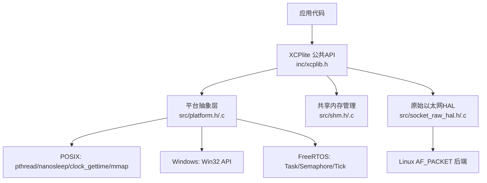
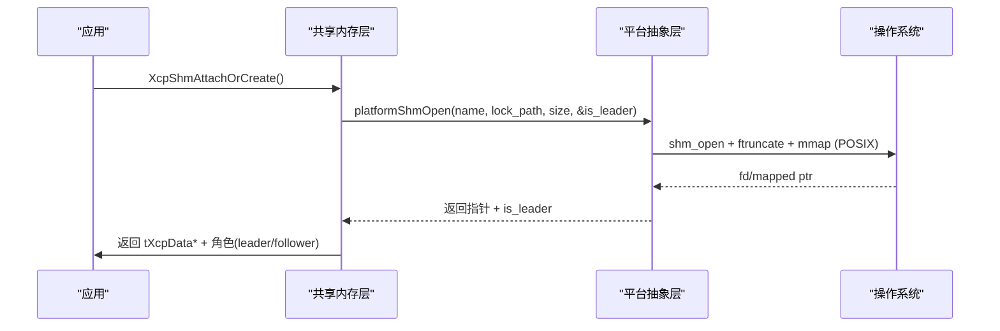
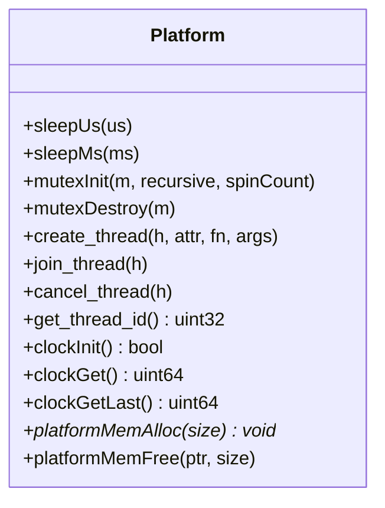
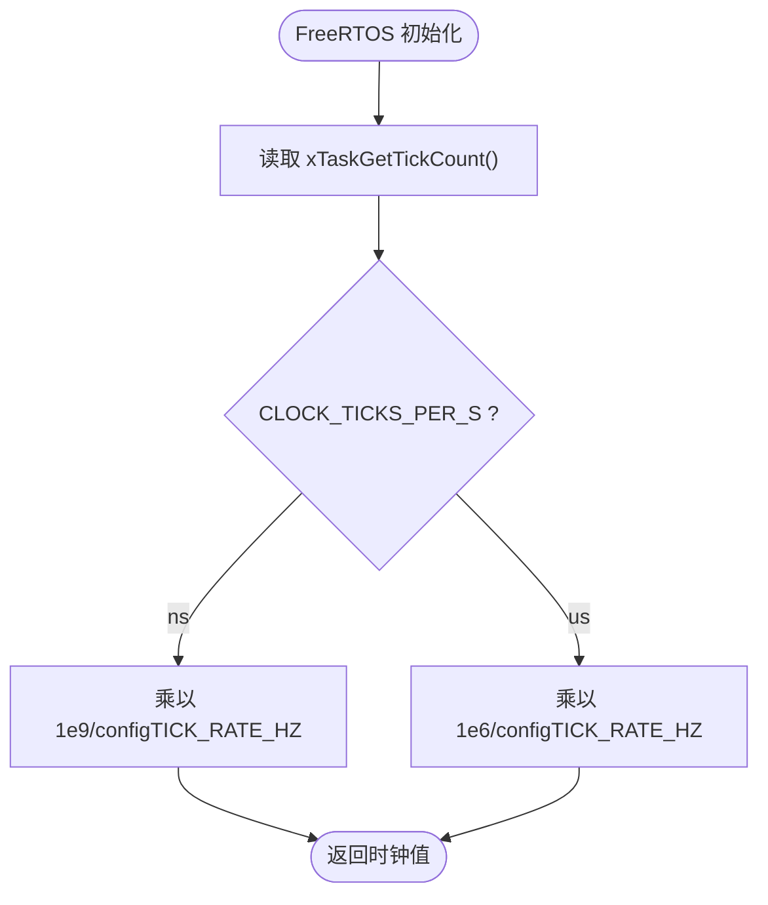
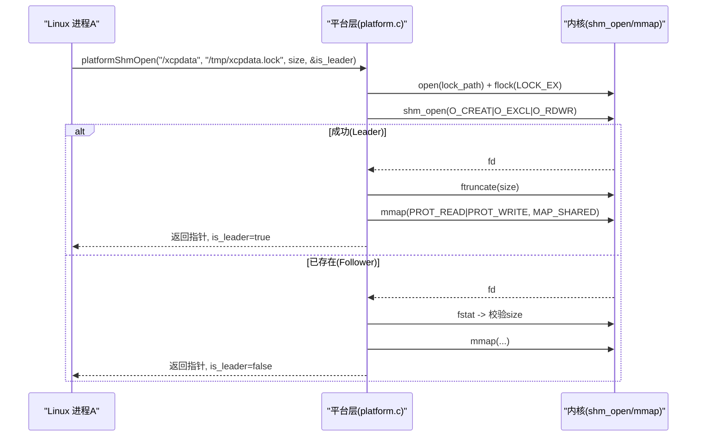
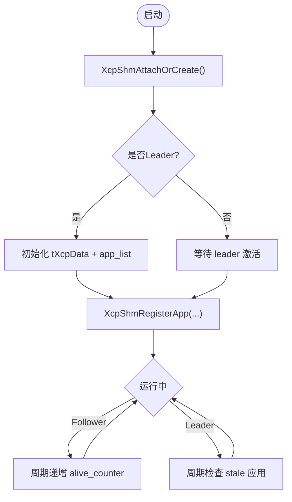
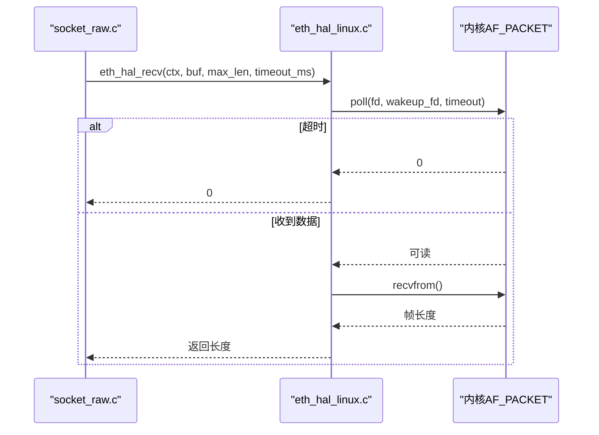
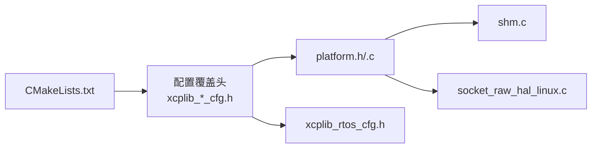

# 平台适配

<cite>
**本文引用的文件**
- [platform.h](file://src/platform.h)
- [platform.c](file://src/platform.c)
- [shm.h](file://src/shm.h)
- [shm.c](file://src/shm.c)
- [socket_raw_hal.h](file://src/socket_raw_hal.h)
- [socket_raw_hal_linux.c](file://src/socket_raw_hal_linux.c)
- [xcplib_rtos_cfg.h](file://src/xcplib_rtos_cfg.h)
- [CMakeLists.txt](file://CMakeLists.txt)
- [SHM.md](file://docs/SHM.md)
</cite>

## 目录
1. [简介](#简介)
2. [项目结构](#项目结构)
3. [核心组件](#核心组件)
4. [架构总览](#架构总览)
5. [详细组件分析](#详细组件分析)
6. [依赖关系分析](#依赖关系分析)
7. [性能考虑](#性能考虑)
8. [故障排查指南](#故障排查指南)
9. [结论](#结论)
10. [附录：新平台移植与交叉编译指南](#附录：新平台移植与交叉编译指南)

## 简介
本文件系统性阐述 XCPlite 的平台适配机制与跨平台支持能力，覆盖抽象层设计、FreeRTOS 完整实现、POSIX（Linux/macOS/QNX）适配、共享内存传输、时钟源选择与精度优化，以及新平台移植、交叉编译配置和性能调优方法。目标是帮助开发者在不同平台上部署并定制 XCPlite。

## 项目结构
XCPlite 通过统一的平台抽象层屏蔽底层差异，关键目录与职责如下：
- src/platform.{h,c}：线程、互斥锁、时钟、睡眠、内存映射等系统 API 的跨平台封装
- src/shm.{h,c}：多进程共享内存协议状态与生命周期管理（POSIX shm_open/mmap）
- src/socket_raw_hal.{h,c}：原始以太网 HAL 接口及 Linux AF_PACKET 后端
- src/xcplib_rtos_cfg.h：FreeRTOS 目标专用配置覆盖（栈大小、优先级、MTU、队列、时钟分辨率等）
- CMakeLists.txt：构建配置、平台探测、选项开关、示例与工具构建
- docs/SHM.md：共享内存模式技术说明

图表来源
- [platform.h:1-677](file://src/platform.h#L1-L677)
- [platform.c:1-800](file://src/platform.c#L1-L800)
- [shm.h:1-131](file://src/shm.h#L1-L131)
- [shm.c:1-663](file://src/shm.c#L1-L663)
- [socket_raw_hal.h:1-108](file://src/socket_raw_hal.h#L1-L108)
- [socket_raw_hal_linux.c:1-266](file://src/socket_raw_hal_linux.c#L1-L266)

章节来源
- [CMakeLists.txt:1-656](file://CMakeLists.txt#L1-L656)

## 核心组件
- 平台抽象层（HAL）：统一线程、互斥、时钟、睡眠、内存分配/映射、原子操作等接口，按 _WIN/_LINUX/_MACOS/_QNX/_FREE_RTOS 分支实现
- FreeRTOS 适配：任务创建/销毁、信号量/递归互斥、Tick 时钟、栈与优先级配置
- POSIX 适配：pthread、nanosleep、clock_gettime、mmap/shm_open/ftruncate/shm_unlink
- 共享内存传输：多进程共享 tXcpData 与事件/校准段列表，leader/follower 选举与 A2L 合并
- 原始以太网 HAL：Linux AF_PACKET 实现，提供以太网帧收发、MAC 获取、唤醒机制

章节来源
- [platform.h:100-200](file://src/platform.h#L100-L200)
- [platform.c:370-432](file://src/platform.c#L370-L432)
- [platform.c:455-800](file://src/platform.c#L455-L800)
- [shm.h:34-125](file://src/shm.h#L34-L125)
- [shm.c:69-215](file://src/shm.c#L69-L215)
- [socket_raw_hal.h:47-108](file://src/socket_raw_hal.h#L47-L108)
- [socket_raw_hal_linux.c:55-157](file://src/socket_raw_hal_linux.c#L55-L157)

## 架构总览
XCPlite 将协议栈与平台细节解耦：上层通过 xcplib.h 暴露稳定 API；内部根据配置与平台宏选择具体实现。共享内存模式下，首个进程成为 leader 负责创建/初始化共享区域，其他进程作为 follower 附加并使用同一份 XCP 状态。

图表来源
- [shm.c:162-208](file://src/shm.c#L162-L208)
- [platform.c:201-319](file://src/platform.c#L201-L319)

章节来源
- [SHM.md:1-72](file://docs/SHM.md#L1-L72)

## 详细组件分析

### 平台抽象层（HAL）设计原理
- 平台识别：通过 _WIN/_LINUX/_MACOS/_QNX/_FREE_RTOS 宏选择不同实现路径
- 线程与同步：
  - Windows：CRITICAL_SECTION
  - POSIX：pthread_mutex_t（支持递归）
  - FreeRTOS：xSemaphoreCreateMutex / xSemaphoreCreateRecursiveMutex，支持静态分配
- 时钟：
  - FreeRTOS：基于 xTaskGetTickCount()，单位由 configTICK_RATE_HZ 与 CLOCK_TICKS_PER_S 换算
  - POSIX：CLOCK_MONOTONIC_RAW/CLOCK_REALTIME，支持 ns/us 分辨率
  - Windows：QueryPerformanceCounter，结合系统时间建立偏移
- 睡眠：
  - FreeRTOS：vTaskDelay（tick 粒度）
  - POSIX：nanosleep
  - Windows：Sleep + 忙等待短延时
- 原子操作：
  - POSIX/C++：stdatomic.h/<atomic>
  - Windows：Interlocked intrinsics（可选模拟）

图表来源
- [platform.h:255-510](file://src/platform.h#L255-L510)
- [platform.c:78-155](file://src/platform.c#L78-L155)
- [platform.c:370-432](file://src/platform.c#L370-L432)
- [platform.c:455-800](file://src/platform.c#L455-L800)

章节来源
- [platform.h:25-72](file://src/platform.h#L25-L72)
- [platform.h:300-467](file://src/platform.h#L300-L467)
- [platform.c:370-432](file://src/platform.c#L370-L432)
- [platform.c:455-800](file://src/platform.c#L455-L800)

### FreeRTOS 支持的完整实现
- 任务管理：create_thread/join_thread/cancel_thread 使用 xTaskCreate/xTaskCreateStatic/vTaskDelete
- 互斥锁：支持普通与递归互斥，静态分配时提供 StaticSemaphore_t buffer
- 时钟：默认 1us 分辨率（configTICK_RATE_HZ），可自定义 CLOCK_TICKS_PER_S
- 栈与优先级：可通过 OPTION_FREERTOS_STACK_BYTES/OPTION_FREERTOS_PRIORITY 调整
- 队列：32位无锁队列（OPTION_QUEUE_32）避免 64位原子在 32位 MCU 上的开销

图表来源
- [platform.c:455-500](file://src/platform.c#L455-L500)
- [xcplib_rtos_cfg.h:44-78](file://src/xcplib_rtos_cfg.h#L44-L78)

章节来源
- [platform.h:381-418](file://src/platform.h#L381-L418)
- [platform.c:370-404](file://src/platform.c#L370-L404)
- [xcplib_rtos_cfg.h:44-142](file://src/xcplib_rtos_cfg.h#L44-L142)

### POSIX 系统适配（Linux/macOS/QNX）
- 线程与互斥：pthread_create/pthread_join/pthread_mutex_*
- 时钟：
  - 任意纪元（OPTION_CLOCK_EPOCH_ARB）：CLOCK_MONOTONIC_RAW（QNX 用 CLOCK_MONOTONIC）
  - PTP 纪元（OPTION_CLOCK_EPOCH_PTP）：CLOCK_REALTIME
- 共享内存：
  - 使用 shm_open/ftruncate/mmap 创建/映射共享区域
  - 使用 flock 序列化 leader 选举窗口，避免竞态
  - 支持“跟随者快速附加”（platformShmOpenAttach）
- 文件系统工具：fexists 等

图表来源
- [platform.c:201-319](file://src/platform.c#L201-L319)
- [shm.c:162-208](file://src/shm.c#L162-L208)

章节来源
- [platform.c:505-654](file://src/platform.c#L505-L654)
- [platform.c:201-363](file://src/platform.c#L201-L363)

### 共享内存传输的平台实现
- 数据结构：tShmHeader（控制区+应用列表）、tApp（每应用槽位）
- 生命周期：
  - Leader：创建 shm、ftruncate、零初始化、注册应用、生成/合并 A2L
  - Follower：附加 shm、轮询激活状态、周期性递增 alive_counter
- 协调机制：
  - a2l_finalize_requested：服务器通知所有应用最终化 A2L
  - alive_counter：检测死进程并回收槽位
- 工具：shmtool、xcpdaemon 用于调试与管理

图表来源
- [shm.h:34-125](file://src/shm.h#L34-L125)
- [shm.c:69-215](file://src/shm.c#L69-L215)
- [shm.c:430-517](file://src/shm.c#L430-L517)

章节来源
- [shm.c:523-608](file://src/shm.c#L523-L608)
- [shm.c:635-654](file://src/shm.c#L635-L654)

### 原始以太网 HAL（Linux AF_PACKET）
- 接口：eth_hal_open/send/recv/get_mac/wakeup/close
- 特性：
  - 使用 AF_PACKET SOCK_RAW 接收全部 EtherType（含 ARP）
  - 通过 eventfd 实现可中断阻塞接收
  - 过滤自身发送帧（PACKET_IGNORE_OUTGOING 或 sll_pkttype 判断）
  - 错误区分：ETH_HAL_ERROR_SIZE（超 MTU）与 ETH_HAL_ERROR

图表来源
- [socket_raw_hal_linux.c:204-255](file://src/socket_raw_hal_linux.c#L204-L255)

章节来源
- [socket_raw_hal.h:47-108](file://src/socket_raw_hal.h#L47-L108)
- [socket_raw_hal_linux.c:55-157](file://src/socket_raw_hal_linux.c#L55-L157)

## 依赖关系分析
- 构建期：
  - CMakeLists.txt 根据 XCPLITE_CONFIGURATION 选择配置覆盖头（default/no_a2l/ptp/shm/rtos/raw）
  - 平台相关定义（如 _GNU_SOURCE）通过 target_compile_definitions 传播给消费者
- 运行期：
  - platform.h/.c 依赖平台宏与配置宏（OPTION_xxx）
  - shm.c 依赖 platformShmOpen 系列函数
  - socket_raw.c 依赖 socket_raw_hal 接口，Linux 下链接 AF_PACKET

图表来源
- [CMakeLists.txt:17-66](file://CMakeLists.txt#L17-L66)
- [CMakeLists.txt:286-295](file://CMakeLists.txt#L286-L295)

章节来源
- [CMakeLists.txt:17-66](file://CMakeLists.txt#L17-L66)
- [CMakeLists.txt:286-295](file://CMakeLists.txt#L286-L295)

## 性能考虑
- 时钟访问优化：
  - clockGetLast()/Monotonic*/Realtime*Last 缓存最近一次结果，减少 syscall
  - FreeRTOS 使用 tickToClockUnit_ 内联转换，避免重复除法
- 队列与内存：
  - FreeRTOS 目标强制 32 位队列（OPTION_QUEUE_32）降低原子开销
  - 校准段与 DAQ 内存大小可调（OPTION_CAL_MEM_SIZE/OPTION_DAQ_MEM_SIZE）
- 网络栈：
  - 标准 MTU 1500（FreeRTOS 默认），避免巨型帧
  - Linux raw HAL 使用 eventfd 缩短关闭延迟

[本节为通用性能建议，不直接分析具体文件]

## 故障排查指南
- 共享内存失败：
  - 检查 lock_path 权限与 shm_open/ftruncate/mmap 返回值
  - 若发现残留对象，使用 tools/shm_cleanup.sh 清理
- 时钟异常：
  - 确认 OPTION_CLOCK_EPOCH_* 与 CLOCK_TICKS_PER_S 设置一致
  - 在 Linux 上检查 clock_getres 输出
- 原始以太网：
  - 确保 CAP_NET_RAW 或 root 权限
  - 检查接口名与 MTU，过大帧会返回 ETH_HAL_ERROR_SIZE

章节来源
- [platform.c:201-319](file://src/platform.c#L201-L319)
- [platform.c:505-654](file://src/platform.c#L505-L654)
- [socket_raw_hal_linux.c:72-84](file://src/socket_raw_hal_linux.c#L72-L84)

## 结论
XCPlite 通过清晰的抽象层与模块化实现，提供了对 FreeRTOS 与 POSIX 平台的全面支持，并在共享内存、时钟、网络 HAL 等方面具备高可用性与高性能。借助 CMake 配置系统与示例工程，开发者可快速在新平台移植与定制。

[本节为总结性内容，不直接分析具体文件]

## 附录：新平台移植与交叉编译指南
- 新增平台步骤
  - 在 platform.h 中添加平台宏识别（如 _NEWOS）
  - 实现 sleep/sleepMs、mutexInit/Destroy、create_thread/join/cancel、clockInit/Get/Last、platformMemAlloc/Free、platformShmOpen/Close（若需共享内存）
  - 若需原始以太网，实现 socket_raw_hal 接口
- 交叉编译配置
  - 使用 CMake 指定 XCPLITE_CONFIGURATION（如 rtos/raw/shm）
  - 设置工具链文件与目标三元组（例如 arm-none-eabi-gcc）
  - 通过 XCPLITE_CFG_OVERRIDE 引入应用级配置覆盖头
- 性能调优
  - 调整 OPTION_FREERTOS_STACK_BYTES/OPTION_FREERTOS_PRIORITY
  - 调整 OPTION_MTU、OPTION_DAQ_MEM_SIZE、OPTION_CAL_MEM_SIZE
  - 选择合适的时钟源与分辨率（CLOCK_TICKS_PER_S）

章节来源
- [CMakeLists.txt:17-66](file://CMakeLists.txt#L17-L66)
- [xcplib_rtos_cfg.h:44-142](file://src/xcplib_rtos_cfg.h#L44-L142)
- [platform.h:25-72](file://src/platform.h#L25-L72)