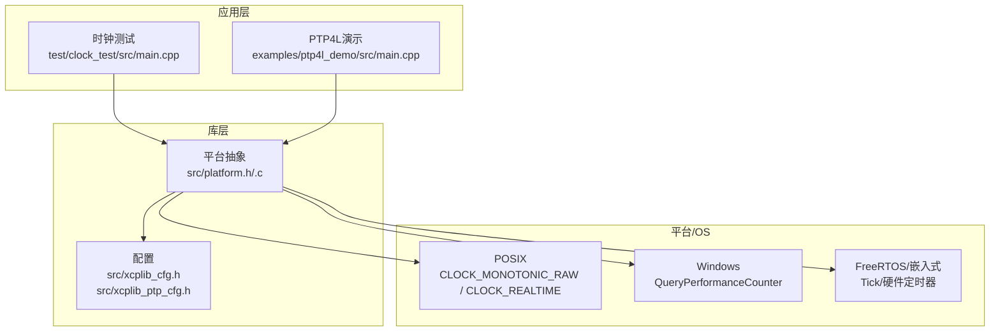
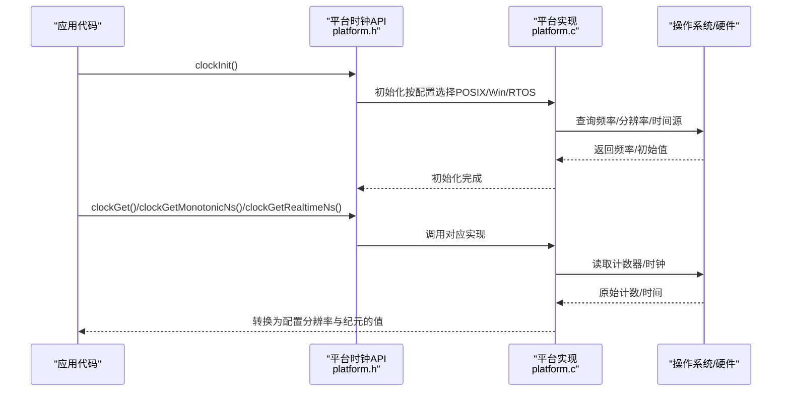
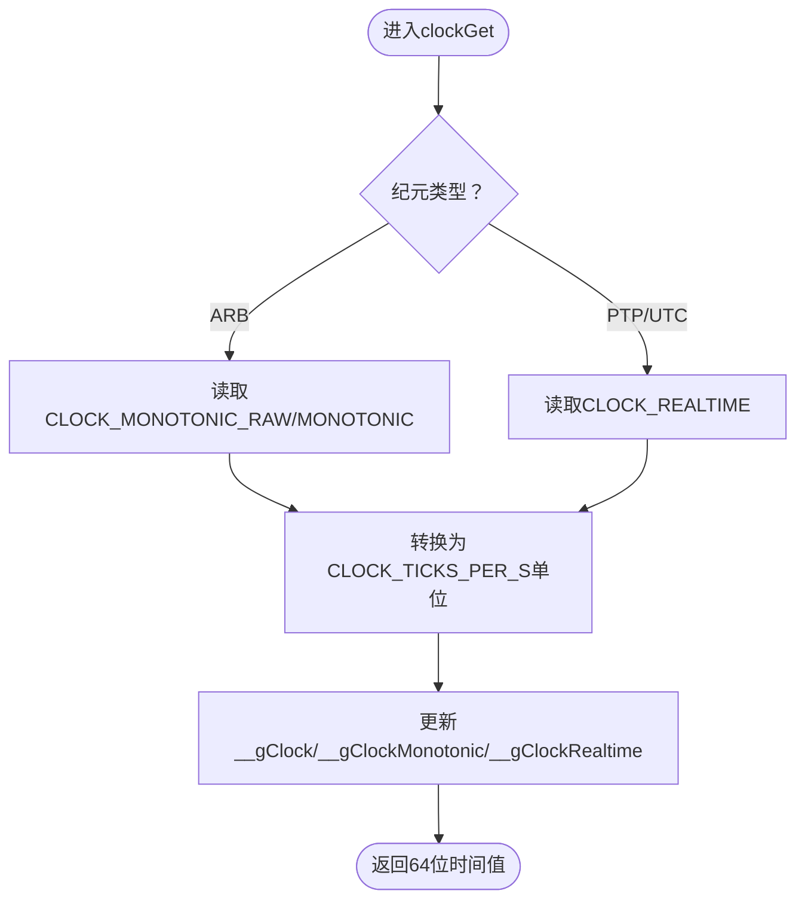
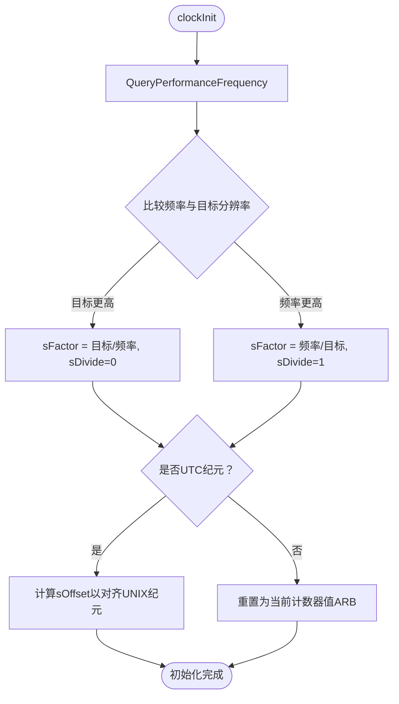
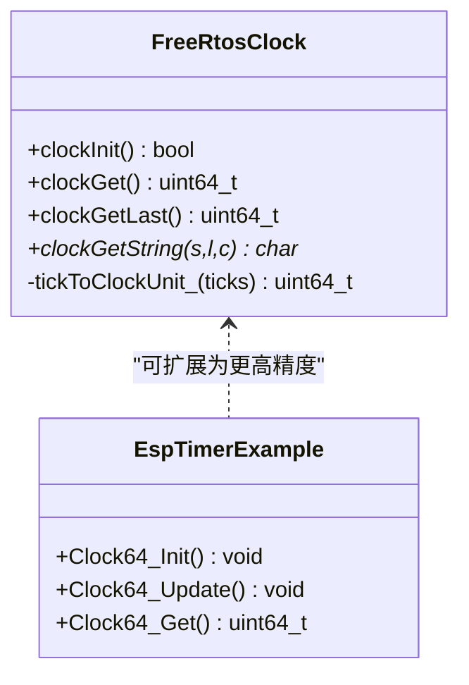
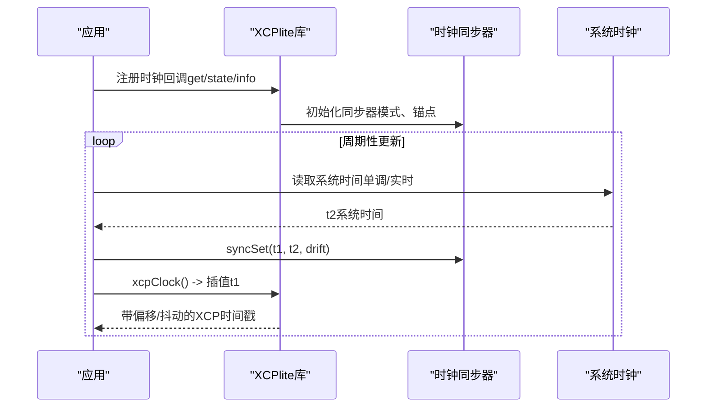
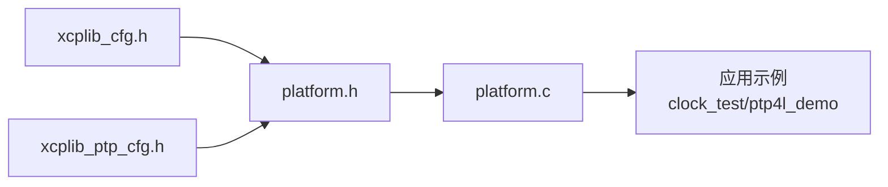

# 时钟和时间管理

<cite>
**本文引用的文件**
- [platform.c](file://src/platform.c)
- [platform.h](file://src/platform.h)
- [xcplib_cfg.h](file://src/xcplib_cfg.h)
- [xcplib_ptp_cfg.h](file://src/xcplib_ptp_cfg.h)
- [main.cpp（时钟测试）](file://test/clock_test/src/main.cpp)
- [main.cpp（PTP4L演示）](file://examples/ptp4l_demo/src/main.cpp)
- [clock64.c（ESP32示例）](file://examples/freertos_demo/freertos_esp32_demo/src/clock64.c)
</cite>

## 目录
1. [简介](#简介)
2. [项目结构](#项目结构)
3. [核心组件](#核心组件)
4. [架构总览](#架构总览)
5. [详细组件分析](#详细组件分析)
6. [依赖关系分析](#依赖关系分析)
7. [性能考量](#性能考量)
8. [故障排查指南](#故障排查指南)
9. [结论](#结论)
10. [附录](#附录)

## 简介
本章节系统性阐述XCPlite的高精度时钟与时间管理机制，覆盖不同平台的时钟源选择策略、纳秒/微秒级精度实现、单调时钟与实时时钟的区别与应用场景、时钟同步机制（含PTP集成）、以及精度测试与诊断方法。同时提供为特殊硬件平台扩展自定义时钟源的实践指南，帮助开发者在跨平台环境中获得稳定、可验证的精确时间测量能力。

## 项目结构
XCPlite将平台相关的时钟抽象集中在平台层，通过编译期宏和配置项在不同操作系统与嵌入式平台上切换具体实现：
- 平台抽象层：定义统一的时钟接口、分辨率与时区/纪元选项，封装POSIX、Windows与FreeRTOS的具体实现。
- 配置层：通过全局配置头文件启用或禁用高精度时钟、PTP支持等特性。
- 应用示例：提供时钟测试与PTP4L集成的示例，展示如何注册回调、使用单调/实时时钟进行时间戳生成与同步。

**图示来源**
- [platform.c:434-800](file://src/platform.c#L434-L800)
- [platform.h:470-510](file://src/platform.h#L470-L510)
- [xcplib_cfg.h:56-65](file://src/xcplib_cfg.h#L56-L65)
- [xcplib_ptp_cfg.h:1-31](file://src/xcplib_ptp_cfg.h#L1-L31)

**章节来源**
- [platform.c:434-800](file://src/platform.c#L434-L800)
- [platform.h:470-510](file://src/platform.h#L470-L510)
- [xcplib_cfg.h:56-65](file://src/xcplib_cfg.h#L56-L65)
- [xcplib_ptp_cfg.h:1-31](file://src/xcplib_ptp_cfg.h#L1-L31)

## 核心组件
- 平台时钟抽象接口：统一提供初始化、获取当前时间、获取最近一次时间值、单调/实时时钟查询、字符串格式化等功能。
- 多平台时钟实现：
  - POSIX：基于CLOCK_MONOTONIC_RAW或CLOCK_MONOTONIC（取决于配置），以及CLOCK_REALTIME用于实时时钟。
  - Windows：基于QueryPerformanceCounter，并在初始化时计算转换因子与偏移以对齐到配置的分辨率与纪元。
  - FreeRTOS/嵌入式：基于任务tick或外部高精度定时器（如ESP-IDF esp_timer）。
- 配置与特性开关：
  - 分辨率：支持1ns或1us，通过宏定义控制。
  - 纪元：支持任意纪元（ARB）或PTP/UTC纪元（REALTIME）。
  - PTP支持：可选启用硬件时间戳与PTP相关功能。

**章节来源**
- [platform.h:470-510](file://src/platform.h#L470-L510)
- [xcplib_cfg.h:56-65](file://src/xcplib_cfg.h#L56-L65)
- [xcplib_ptp_cfg.h:1-31](file://src/xcplib_ptp_cfg.h#L1-L31)

## 架构总览
下图展示了XCPlite时钟子系统在不同平台上的调用路径与数据流：应用通过统一接口请求时间，平台层根据编译期配置选择具体实现；POSIX使用系统单调/实时时钟，Windows使用高性能计数器并校准到目标分辨率与纪元，FreeRTOS使用内核tick或外部定时器。

**图示来源**
- [platform.c:434-800](file://src/platform.c#L434-L800)
- [platform.h:470-510](file://src/platform.h#L470-L510)

## 详细组件分析

### POSIX时钟实现（Linux/macOS/QNX）
- 时钟源选择：
  - 任意纪元（OPTION_CLOCK_EPOCH_ARB）：优先使用CLOCK_MONOTONIC_RAW（QNX下退化为CLOCK_MONOTONIC），保证单调且不受NTP/PTP调整影响。
  - PTP/UTC纪元（OPTION_CLOCK_EPOCH_PTP）：使用CLOCK_REALTIME，可能受NTP/PTP调校。
- 分辨率与精度：
  - 通过CLOCK_TICKS_PER_S配置为1ns或1us；POSIX实现将tv_sec/tv_nsec组合为64位时间值并按配置换算。
  - 提供Last系列函数缓存最近一次系统调用结果，减少频繁syscall开销。
- 单调与实时分离：
  - 单调时钟用于超时控制、套接字时间戳等对单调性有要求的场景。
  - 实时时钟用于需要绝对时间（如PTP同步后）的场景。

**图示来源**
- [platform.c:505-654](file://src/platform.c#L505-L654)

**章节来源**
- [platform.c:505-654](file://src/platform.c#L505-L654)
- [platform.h:470-510](file://src/platform.h#L470-L510)

### Windows时钟实现
- 时钟源：QueryPerformanceCounter（高精度性能计数器）。
- 初始化校准：
  - 查询性能计数器频率，计算与目标分辨率（CLOCK_TICKS_PER_S）之间的乘除因子与偏移。
  - 若使用UTC纪元，则结合系统时间设置偏移，使计数器时间与UNIX纪元对齐。
- 运行时获取：
  - 读取计数器值，按sDivide/sFactor与sOffset转换为配置分辨率与纪元的时间值。
  - 缓存最近一次值供clockGetLast快速返回。

**图示来源**
- [platform.c:659-783](file://src/platform.c#L659-L783)

**章节来源**
- [platform.c:659-783](file://src/platform.c#L659-L783)

### FreeRTOS/嵌入式时钟实现
- 默认实现：基于xTaskGetTickCount，粒度由configTICK_RATE_HZ决定，并通过比例换算到CLOCK_TICKS_PER_S。
- 高精度扩展：
  - 推荐通过ApplXcpRegisterGetClockCallback注册更高分辨率的时钟回调。
  - ESP32示例使用ESP-IDF的esp_timer_get_time（1us分辨率，64位）。
- 适用场景：资源受限环境，需权衡tick粒度与CPU占用；可通过外部定时器提升精度。

**图示来源**
- [platform.c:456-500](file://src/platform.c#L456-L500)
- [clock64.c:1-22](file://examples/freertos_demo/freertos_esp32_demo/src/clock64.c#L1-L22)

**章节来源**
- [platform.c:456-500](file://src/platform.c#L456-L500)
- [clock64.c:1-22](file://examples/freertos_demo/freertos_esp32_demo/src/clock64.c#L1-L22)

### 时钟同步与PTP集成
- 应用层回调：
  - 时钟测试示例通过ApplXcpRegisterGetClockCallback等接口注册自定义时钟回调，支持漂移、抖动、偏移参数化，并提供PPS事件模拟。
  - PTP4L演示示例直接返回系统实时时钟（可能由PTP4L/PHC2SYS调校），并上报客户端与主时钟UUID、纪元与层级信息。
- 配置开关：
  - xcplib_ptp_cfg.h启用OPTION_SOCKET_HW_TIMESTAMPS（Linux硬件时间戳），配合ptptool等工具进行网络层时间同步与测量。
- 一致性保证：
  - 通过实时时钟（CLOCK_REALTIME）与PTP/NTP调校，确保跨进程/跨设备时间一致性；单调时钟用于内部时序逻辑，避免回拨。

**图示来源**
- [main.cpp（时钟测试）:156-251](file://test/clock_test/src/main.cpp#L156-L251)
- [main.cpp（PTP4L演示）:96-149](file://examples/ptp4l_demo/src/main.cpp#L96-L149)
- [xcplib_ptp_cfg.h:1-31](file://src/xcplib_ptp_cfg.h#L1-L31)

**章节来源**
- [main.cpp（时钟测试）:156-251](file://test/clock_test/src/main.cpp#L156-L251)
- [main.cpp（PTP4L演示）:96-149](file://examples/ptp4l_demo/src/main.cpp#L96-L149)
- [xcplib_ptp_cfg.h:1-31](file://src/xcplib_ptp_cfg.h#L1-L31)

### 纳秒/微秒精度实现与校准
- 分辨率配置：
  - 通过OPTION_CLOCK_TICKS_1NS或OPTION_CLOCK_TICKS_1US选择1ns或1us分辨率。
  - 平台实现将系统时间转换为该分辨率下的64位计数值。
- 校准过程：
  - POSIX：初始化时读取系统时钟分辨率与初始值，记录最近一次值以减少syscall。
  - Windows：初始化时计算频率转换因子与偏移，确保时间值与目标分辨率/纪元一致。
  - FreeRTOS：通过tick比例换算，或通过回调注册更高精度时钟源。
- Last系列优化：
  - 提供clockGetLast/clockGetMonotonicNsLast/clockGetRealtimeNsLast等快速路径，避免每次调用都触发系统调用。

**章节来源**
- [platform.h:470-510](file://src/platform.h#L470-L510)
- [platform.c:573-654](file://src/platform.c#L573-L654)
- [platform.c:693-783](file://src/platform.c#L693-L783)

### 单调时钟与实时时钟的使用场景
- 单调时钟（CLOCK_MONOTONIC_RAW/MONOTONIC）：
  - 适用于超时控制、性能测量、内部时序逻辑，保证时间只增不减，不受系统时间调整影响。
- 实时时钟（CLOCK_REALTIME）：
  - 适用于需要绝对时间的场景，如PTP同步后的时间戳、日志时间、跨设备协同。
- 在XCPlite中：
  - DAQ事件时间戳可使用应用注册的回调（可为单调或实时）。
  - 套接字时间戳与超时控制通常使用单调时钟以保证稳定性。

**章节来源**
- [platform.c:505-654](file://src/platform.c#L505-L654)
- [platform.h:495-506](file://src/platform.h#L495-L506)

## 依赖关系分析
- 配置驱动：
  - xcplib_cfg.h定义时钟分辨率与纪元选项，影响platform.c中的分支与行为。
  - xcplib_ptp_cfg.h可选启用硬件时间戳，便于PTP工具链集成。
- 平台分支：
  - platform.h通过平台宏（_WIN/_LINUX/_MACOS/_QNX/_FREE_RTOS）选择具体实现。
  - platform.c针对不同平台实现clockInit/clockGet/clockGetString等接口。
- 应用集成：
  - 示例通过注册回调将应用时钟接入XCPlite，支持PTP/任意时钟源。

**图示来源**
- [xcplib_cfg.h:56-65](file://src/xcplib_cfg.h#L56-L65)
- [xcplib_ptp_cfg.h:1-31](file://src/xcplib_ptp_cfg.h#L1-L31)
- [platform.h:470-510](file://src/platform.h#L470-L510)
- [platform.c:434-800](file://src/platform.c#L434-L800)

**章节来源**
- [xcplib_cfg.h:56-65](file://src/xcplib_cfg.h#L56-L65)
- [xcplib_ptp_cfg.h:1-31](file://src/xcplib_ptp_cfg.h#L1-L31)
- [platform.h:470-510](file://src/platform.h#L470-L510)
- [platform.c:434-800](file://src/platform.c#L434-L800)

## 性能考量
- 系统调用优化：
  - Last系列函数缓存最近一次系统时间，降低高频调用时的syscall开销。
- 分辨率与精度的权衡：
  - 1ns分辨率在部分平台可能带来更高开销；可根据需求选择1us。
- Windows校准：
  - 初始化时计算转换因子与偏移，运行时仅做简单算术运算，保持低延迟。
- FreeRTOS：
  - 默认tick粒度较低，建议在高精度场景注册回调或使用外部定时器。

[本节为通用指导，不直接分析具体文件]

## 故障排查指南
- 初始化失败：
  - Windows：检查QueryPerformanceFrequency可用性；确认频率与分辨率匹配。
  - POSIX：确认CLOCK_*常量可用；检查分辨率与纪元配置。
- 时间回拨或不单调：
  - 使用单调时钟（CLOCK_MONOTONIC_RAW/MONOTONIC）替代实时时钟。
  - 检查是否有外部调校（NTP/PTP）影响实时时钟。
- 精度不足：
  - 评估平台分辨率；必要时切换到更高精度时钟源或外部定时器。
- PTP同步问题：
  - 确认linuxptp服务运行正常；检查硬件时间戳支持；使用ptptool验证网络层时间同步。

**章节来源**
- [platform.c:693-783](file://src/platform.c#L693-L783)
- [platform.c:573-654](file://src/platform.c#L573-L654)
- [xcplib_ptp_cfg.h:1-31](file://src/xcplib_ptp_cfg.h#L1-L31)

## 结论
XCPlite通过平台抽象层与配置驱动，提供了跨平台的高精度时钟与时间管理能力。POSIX、Windows与FreeRTOS分别采用最适合的时钟源，支持1ns/1us分辨率与任意/PTP纪元。应用可通过回调机制灵活集成自定义时钟源，并结合PTP实现跨设备时间一致性。Last系列优化与合理的分辨率选择有助于在性能与精度之间取得平衡。

[本节为总结性内容，不直接分析具体文件]

## 附录

### 时钟精度测试与验证方法
- 使用时钟测试示例：
  - 注册自定义时钟回调，注入漂移、抖动与偏移，观察XCP事件时间戳与系统时间差。
  - 通过PPS事件验证时间间隔与抖动分布。
- 使用PTP4L演示：
  - 在Linux上运行PTP4L与PHC2SYS，将系统实时时钟与PTP主时钟对齐。
  - 通过A2L与CANape等工具采集时间戳，验证跨进程/跨设备一致性。

**章节来源**
- [main.cpp（时钟测试）:156-251](file://test/clock_test/src/main.cpp#L156-L251)
- [main.cpp（PTP4L演示）:96-149](file://examples/ptp4l_demo/src/main.cpp#L96-L149)

### 自定义时钟源扩展指南
- 在FreeRTOS/嵌入式平台：
  - 实现高精度定时器接口（如ESP32的esp_timer_get_time），并通过ApplXcpRegisterGetClockCallback注册到XCPlite。
- 在POSIX/Windows：
  - 若系统时钟无法满足需求，可在应用层实现自定义时钟回调，返回单调或实时时间，并上报时钟信息与状态。
- 注意事项：
  - 确保时间单调递增，避免回拨。
  - 合理处理抖动与偏移，必要时在应用层进行滤波或平滑。
  - 在高频调用场景下，尽量使用Last系列或缓存策略降低开销。

**章节来源**
- [platform.c:456-500](file://src/platform.c#L456-L500)
- [clock64.c:1-22](file://examples/freertos_demo/freertos_esp32_demo/src/clock64.c#L1-L22)
- [main.cpp（时钟测试）:174-251](file://test/clock_test/src/main.cpp#L174-L251)