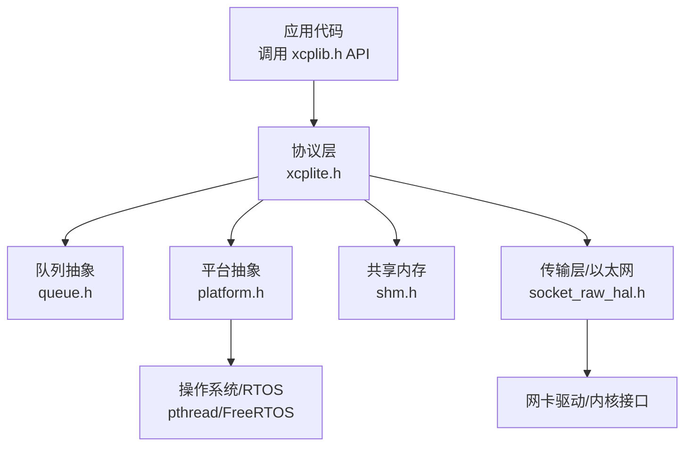
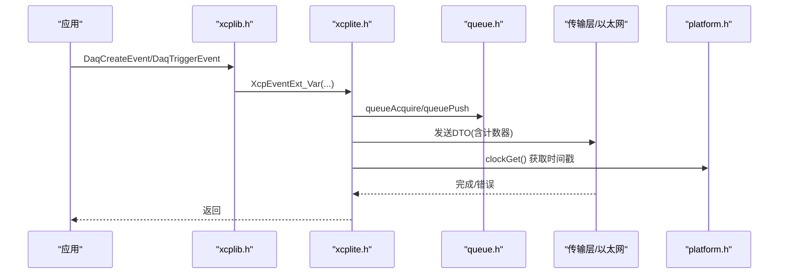
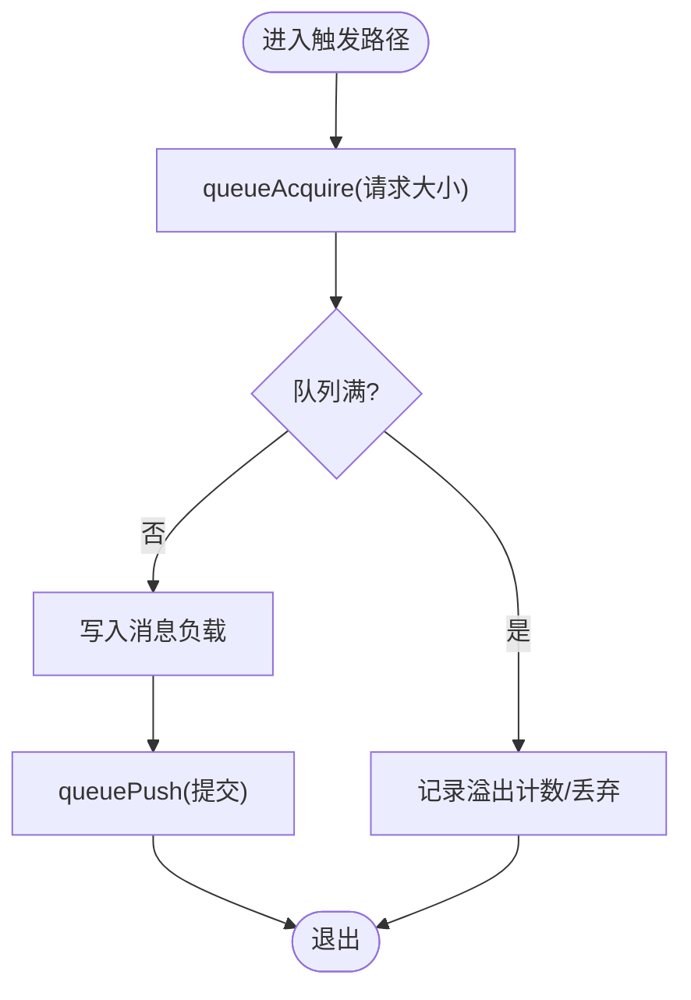
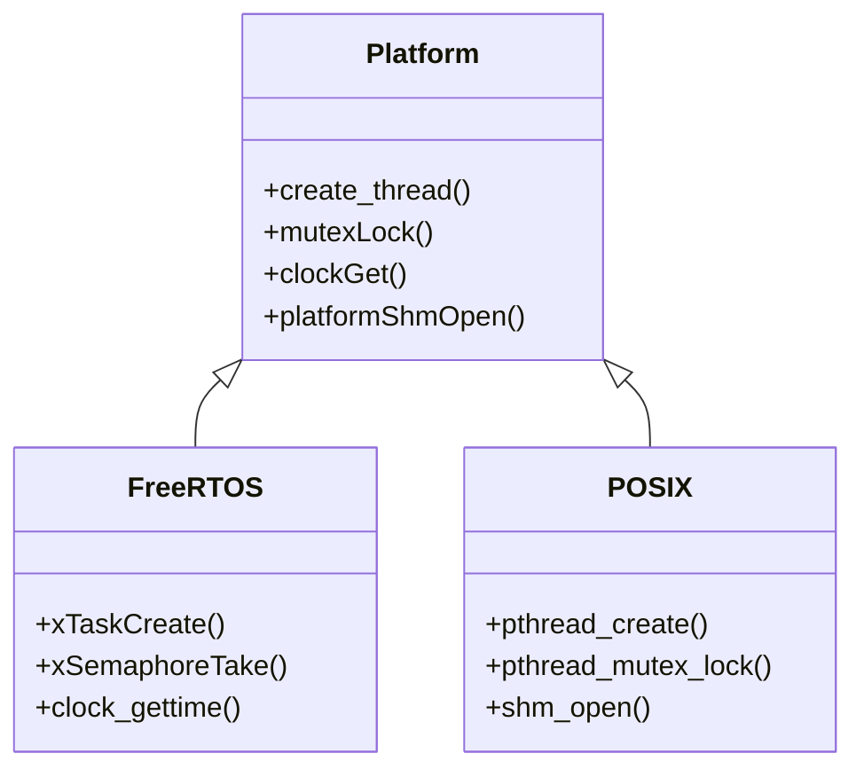
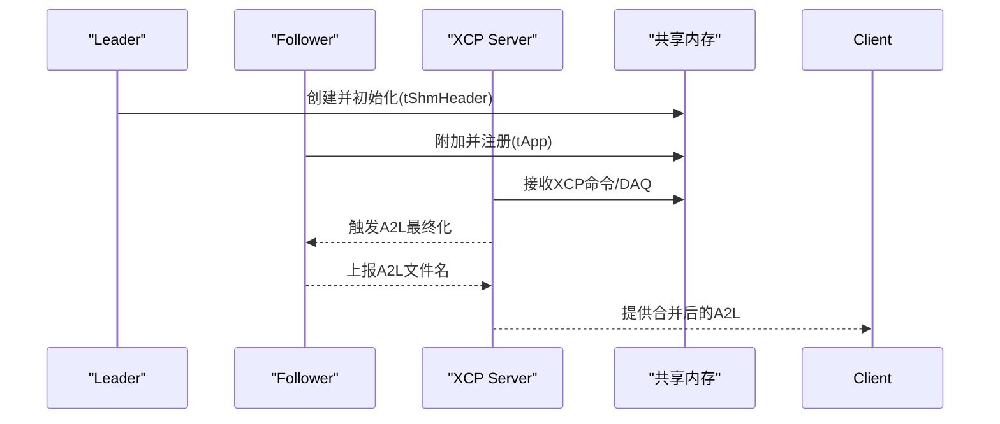
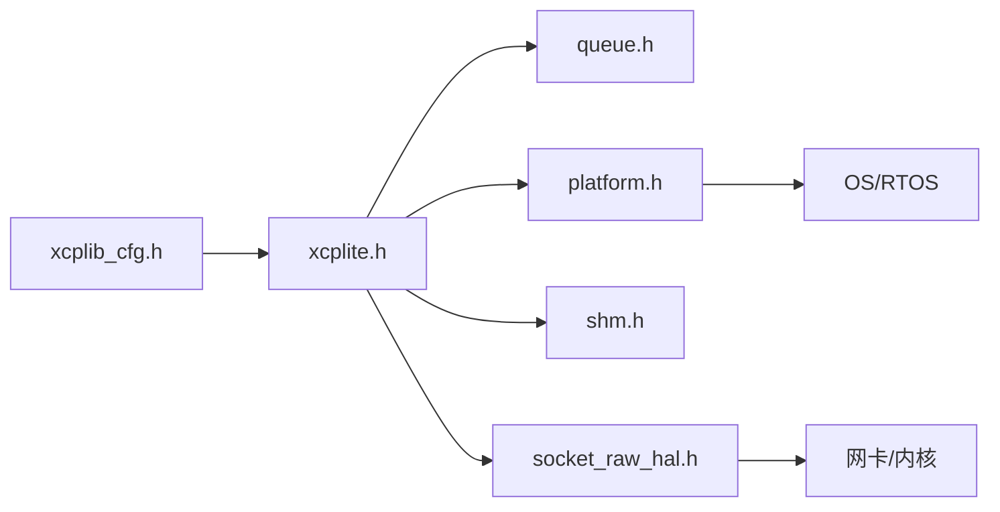

# 高级特性

<cite>
**本文引用的文件**
- [xcplib.h](file://inc/xcplib.h)
- [xcplite.h](file://src/xcplite.h)
- [platform.h](file://src/platform.h)
- [shm.h](file://src/shm.h)
- [TECHNICAL.md](file://docs/TECHNICAL.md)
- [SHM.md](file://docs/SHM.md)
- [queue.h](file://src/queue.h)
- [socket_raw_hal.h](file://src/socket_raw_hal.h)
- [xcplib_cfg.h](file://src/xcplib_cfg.h)
</cite>

## 目录
1. [简介](#简介)
2. [项目结构](#项目结构)
3. [核心组件](#核心组件)
4. [架构总览](#架构总览)
5. [详细组件分析](#详细组件分析)
6. [依赖关系分析](#依赖关系分析)
7. [性能考量](#性能考量)
8. [故障排查指南](#故障排查指南)
9. [结论](#结论)
10. [附录](#附录)

## 简介
本章节面向专家用户，系统阐述XCPlite的高级特性与扩展能力：多线程支持（无锁设计、线程本地存储、并发安全）、实时性优化（确定性执行时间、内存分配策略、性能调优）、平台适配（FreeRTOS与POSIX）、共享内存传输（多应用模式）、PTP时间同步、自定义传输层开发与硬件抽象层集成。文档以源码为依据，提供架构图、序列图与流程图，帮助读者深入理解实现细节并进行深度定制。

## 项目结构
XCPlite将协议栈、传输层、平台抽象、共享内存、队列等模块解耦，通过配置宏在编译期裁剪功能，运行时通过回调与接口进行扩展。关键目录与职责：
- inc/xcplib.h：公共C API，事件、校准段、DAQ触发、地址空间等
- src/xcplite.h：协议层内部状态、事件列表、DAQ表、本地数据
- src/platform.h：平台抽象（原子、线程、互斥、时钟、共享内存）
- src/shm.h：共享内存头结构与多应用注册表
- src/queue.h：通用队列API（多种实现选择）
- src/socket_raw_hal.h：原始以太网HAL接口（UDP/IPv4/ARP/ICMP之上）
- docs/TECHNICAL.md、docs/SHM.md：技术参考与共享内存模式说明
- src/xcplib_cfg.h：全局构建选项与默认配置

图表来源
- [xcplib.h:39-59](file://inc/xcplib.h#L39-L59)
- [xcplite.h:42-108](file://src/xcplite.h#L42-L108)
- [platform.h:98-200](file://src/platform.h#L98-L200)
- [shm.h:65-81](file://src/shm.h#L65-L81)
- [queue.h:8-23](file://src/queue.h#L8-L23)
- [socket_raw_hal.h:8-40](file://src/socket_raw_hal.h#L8-L40)

章节来源
- [xcplib.h:39-59](file://inc/xcplib.h#L39-L59)
- [xcplite.h:42-108](file://src/xcplite.h#L42-L108)
- [platform.h:98-200](file://src/platform.h#L98-L200)
- [shm.h:65-81](file://src/shm.h#L65-L81)
- [queue.h:8-23](file://src/queue.h#L8-L23)
- [socket_raw_hal.h:8-40](file://src/socket_raw_hal.h#L8-L40)

## 核心组件
- 事件与DAQ：动态事件创建、链接时预注册、线程本地缓存、无锁触发路径
- 校准段：工作页/参考页双缓冲、无锁访问、持久化与EPK校验
- 队列：多实现（64位无锁变长/定长，32位互斥/临界区累积），支持向量IO
- 平台抽象：原子、线程、互斥、时钟、共享内存、键盘输入等
- 共享内存：多应用模式，leader/follower角色，A2L合并与EPK聚合
- 传输层：以太网服务器、原始以太网HAL（Linux AF_PACKET等）

章节来源
- [xcplib.h:239-483](file://inc/xcplib.h#L239-L483)
- [xcplite.h:122-376](file://src/xcplite.h#L122-L376)
- [queue.h:8-23](file://src/queue.h#L8-L23)
- [platform.h:255-510](file://src/platform.h#L255-L510)
- [shm.h:34-124](file://src/shm.h#L34-L124)
- [socket_raw_hal.h:8-40](file://src/socket_raw_hal.h#L8-L40)

## 架构总览
XCPlite采用分层架构：应用层通过xcplib.h暴露的API使用事件、校准段、DAQ；协议层维护共享状态（tXcpData）和本地状态（tXcpLocalData），通过队列与传输层交互；平台抽象屏蔽OS差异；共享内存模式允许多进程协作。

图表来源
- [xcplib.h:455-483](file://inc/xcplib.h#L455-L483)
- [xcplite.h:183-199](file://src/xcplite.h#L183-L199)
- [queue.h:122-140](file://src/queue.h#L122-L140)
- [platform.h:470-510](file://src/platform.h#L470-L510)

## 详细组件分析

### 多线程支持与无锁设计
- 无锁队列：64位平台默认启用无锁队列（变长/定长），生产者通过queueAcquire/queuePush提交，消费者通过queuePeek/queuePop读取，避免互斥开销。32位或Windows回退到互斥/临界区实现。
- 原子操作：使用C11 stdatomic或平台内建原子，保证跨线程/跨进程可见性与顺序。
- 线程本地存储：事件ID查找、一次性初始化等使用THREAD_LOCAL减少竞争。
- 并发安全保证：事件列表与校准段创建使用互斥保护；DAQ触发路径对生产者无锁；共享内存模式下，所有共享状态字段可被多进程并发访问且无需额外锁。

图表来源
- [queue.h:122-140](file://src/queue.h#L122-L140)
- [xcplite.h:382-423](file://src/xcplite.h#L382-L423)
- [platform.h:177-197](file://src/platform.h#L177-L197)

章节来源
- [queue.h:8-23](file://src/queue.h#L8-L23)
- [xcplite.h:382-423](file://src/xcplite.h#L382-L423)
- [platform.h:177-197](file://src/platform.h#L177-L197)
- [xcplib.h:287-301](file://inc/xcplib.h#L287-L301)

### 实时性优化
- 确定性执行时间：DAQ触发路径无锁，避免阻塞；事件查找结果缓存在静态或线程本地变量中；捕获局部变量通过结构化拷贝避免寄存器丢失。
- 内存分配策略：仅传输队列使用堆分配，其余状态静态分配；队列大小按预期流量配置，确保覆盖至少10ms峰值。
- 性能调优：选择合适队列实现（64位无锁优先）；调整XCPTL_MAX_DTO_SIZE与队列对齐；利用向量IO减少拷贝；必要时启用固定条目队列提升吞吐。

章节来源
- [TECHNICAL.md:28-52](file://docs/TECHNICAL.md#L28-L52)
- [xcplib_cfg.h:143-162](file://src/xcplib_cfg.h#L143-L162)
- [queue.h:29-55](file://src/queue.h#L29-L55)

### 平台适配机制（FreeRTOS与POSIX）
- 平台检测与宏：_FREE_RTOS、_LINUX、_MACOS、_QNX、_WIN，分别启用对应实现。
- 线程与互斥：FreeRTOS使用xTaskCreate/xSemaphoreTake；POSIX使用pthread_create/pthread_mutex_lock。
- 时钟：支持1ns/1us分辨率，提供单调/实时时钟查询；FreeRTOS目标注意64位原子限制。
- 共享内存：POSIX shm_open/mmap；FreeRTOS不支持直接共享内存模式。

图表来源
- [platform.h:106-163](file://src/platform.h#L106-L163)
- [platform.h:301-433](file://src/platform.h#L301-L433)
- [platform.h:470-510](file://src/platform.h#L470-L510)

章节来源
- [platform.h:106-163](file://src/platform.h#L106-L163)
- [platform.h:301-433](file://src/platform.h#L301-L433)
- [platform.h:470-510](file://src/platform.h#L470-L510)

### 共享内存传输与应用场景
- 多应用模式：多个进程通过共享内存共享XCP状态与传输队列，一个进程作为服务器处理客户端连接与DAQ。
- 角色管理：leader创建共享内存并负责初始化；follower附加到已有区域；可通过模式标志自动选择服务器或强制指定。
- A2L与EPK：各应用生成独立A2L，服务器合并并提供单一下载；EPK由各应用EPK聚合生成，用于版本兼容性检查。
- 生命周期：应用可随时重启并重新附加；服务器崩溃后下一个符合模式的进程接管。

图表来源
- [shm.h:65-81](file://src/shm.h#L65-L81)
- [SHM.md:14-57](file://docs/SHM.md#L14-L57)
- [xcplite.h:46-53](file://src/xcplite.h#L46-L53)

章节来源
- [shm.h:65-81](file://src/shm.h#L65-L81)
- [SHM.md:14-57](file://docs/SHM.md#L14-L57)
- [xcplite.h:46-53](file://src/xcplite.h#L46-L53)

### PTP时间同步支持
- 时钟信息：协议层版本>=0x0103时支持集群ID与主时钟信息；可注册时钟回调获取时间与状态。
- 时间源：支持任意纪元或PTP纪元；提供单调/实时时钟查询函数。
- 集成点：ApplXcpRegisterGetClockCallback/ApplXcpRegisterGetClockStateCallback用于注入平台时钟实现；PTP grandmaster信息通过回调获取。

章节来源
- [xcplite.h:99-105](file://src/xcplite.h#L99-L105)
- [xcplite.h:558-577](file://src/xcplite.h#L558-L577)
- [platform.h:470-510](file://src/platform.h#L470-L510)

### 自定义传输层开发
- 以太网服务器：XcpEthServerInit启动ETH服务器，支持TCP/UDP；测量队列大小可配置。
- 原始以太网HAL：socket_raw.c在UDP/IPv4/ARP/ICMP之上，要求后端实现eth_hal_*接口（send/recv/get_mac/open/close/wakeup）。
- 扩展点：通过OPTION_UDP_RAW_HAL_EXTERNAL可由应用提供自定义后端，库不选择任何内置实现。

章节来源
- [xcplib.h:39-59](file://inc/xcplib.h#L39-L59)
- [socket_raw_hal.h:8-40](file://src/socket_raw_hal.h#L8-L40)
- [socket_raw_hal.h:47-63](file://src/socket_raw_hal.h#L47-L63)

### 硬件抽象层集成
- HAL契约：eth_hal_send/eth_hal_recv必须传递完整以太网帧（不含FCS），长度不超过MTU+10；线程模型要求send持有传输互斥，recv由接收线程独占，wakeup可从任意线程调用。
- 后端示例：Linux AF_PACKET；未来支持XLAPI/CMP等。
- 配置：通过config字符串传递后端特定参数（如接口名）。

章节来源
- [socket_raw_hal.h:17-40](file://src/socket_raw_hal.h#L17-L40)
- [socket_raw_hal.h:74-105](file://src/socket_raw_hal.h#L74-L105)

## 依赖关系分析
- 配置依赖：xcplib_cfg.h决定队列实现、DAQ事件管理、校准段管理等；不同平台宏影响编译分支。
- 模块耦合：xcplite.h依赖queue.h、platform.h、shm.h；xcplib.h对外暴露API，内部依赖xcplite.h。
- 外部依赖：POSIX sockets、pthread、clock_gettime；FreeRTOS任务/信号量；可选AF_PACKET。

图表来源
- [xcplib_cfg.h:73-162](file://src/xcplib_cfg.h#L73-L162)
- [xcplite.h:42-108](file://src/xcplite.h#L42-L108)
- [platform.h:98-200](file://src/platform.h#L98-L200)
- [shm.h:65-81](file://src/shm.h#L65-L81)
- [socket_raw_hal.h:8-40](file://src/socket_raw_hal.h#L8-L40)

章节来源
- [xcplib_cfg.h:73-162](file://src/xcplib_cfg.h#L73-L162)
- [xcplite.h:42-108](file://src/xcplite.h#L42-L108)
- [platform.h:98-200](file://src/platform.h#L98-L200)
- [shm.h:65-81](file://src/shm.h#L65-L81)
- [socket_raw_hal.h:8-40](file://src/socket_raw_hal.h#L8-L40)

## 性能考量
- 队列选择：64位无锁队列优先；32位/Windows使用互斥/临界区累积；根据负载调整队列大小与条目对齐。
- 触发路径：无锁生产者路径，避免阻塞；事件ID缓存减少查找开销；捕获结构体避免寄存器丢失。
- 内存使用：仅队列使用堆；其他状态静态；合理设置XA_MEM_SIZE与队列容量。
- 时钟精度：1ns/1us分辨率；单调时钟用于超时与统计；实时时钟用于PTP纪元。

章节来源
- [TECHNICAL.md:28-52](file://docs/TECHNICAL.md#L28-L52)
- [queue.h:29-55](file://src/queue.h#L29-L55)
- [xcplib_cfg.h:143-162](file://src/xcplib_cfg.h#L143-L162)
- [platform.h:470-510](file://src/platform.h#L470-L510)

## 故障排查指南
- 队列溢出：检查queueLevel与packets_lost；增大队列尺寸或降低DAQ频率。
- 事件未找到：确认DaqCreateEvent已执行且名称唯一；使用线程本地缓存避免重复查找。
- 校准段冲突：确保CalSegDecl/CalSegCreate在全局作用域；避免名称重复。
- 共享内存异常：检查leader/follower角色；确认A2L最终化流程；验证EPK一致性。
- 传输层错误：确认MTU与链路能力；检查eth_hal_send返回值；调整OPTION_MTU。

章节来源
- [queue.h:178-182](file://src/queue.h#L178-L182)
- [xcplib.h:239-483](file://inc/xcplib.h#L239-L483)
- [shm.h:95-124](file://src/shm.h#L95-L124)
- [socket_raw_hal.h:65-105](file://src/socket_raw_hal.h#L65-L105)

## 结论
XCPlite通过无锁队列、原子操作、线程本地存储与平台抽象，提供了高实时性、可扩展的多线程XCP实现。共享内存模式支持多应用协作，PTP时间同步与原始以太网HAL为高精度与定制化需求提供支撑。专家用户可通过配置宏与回调接口进行深度定制，满足复杂嵌入式与实时系统的严苛要求。

## 附录
- 构建选项：参考xcplib_cfg.h中的默认配置与覆盖机制。
- 工具链：xcpclient、shmtool、xcpdaemon等工具辅助调试与测试。
- 文档：docs/TECHNICAL.md与docs/SHM.md提供深入技术细节。